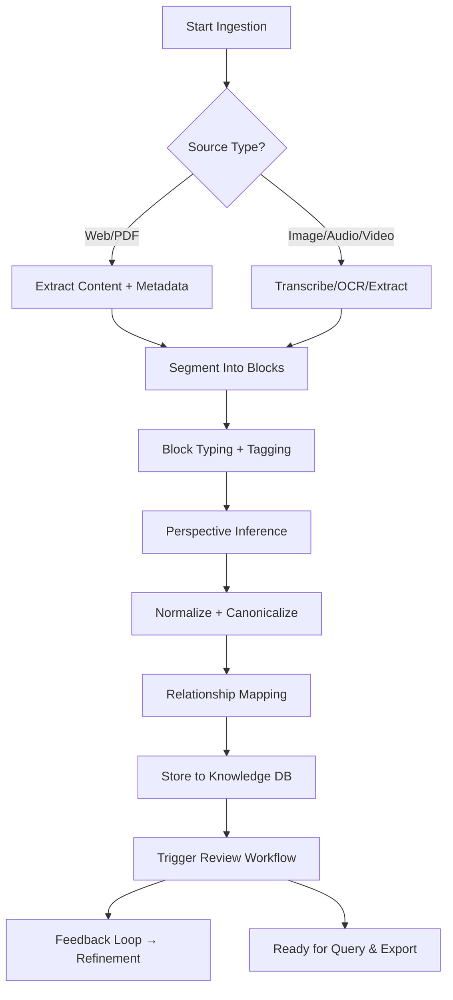

# Catalogue vs Library in Dev

**User:** Anonymous  
**Created:** 7/3/2025 4:43:22  
**Updated:** 9/9/2026 20:17:09  
**Exported:** 10/2/2026 20:46:31  
**Link:** [https://chatgpt.com/g/g-p-6aa14e0a02788191a020b58ee667dad1-0-dumped/c/686599ea-89f0-800d-9143-d381a1947882?src=history_search](https://chatgpt.com/g/g-p-6aa14e0a02788191a020b58ee667dad1-0-dumped/c/686599ea-89f0-800d-9143-d381a1947882?src=history_search)  

## Prompt:
03/07/2025, 04:43:22

Whats the difference between a catalogue and library from a software dev perspective?

## Response:
03/07/2025, 04:43:24 · gpt-4o

From a software development perspective, the terms **catalogue** and **library** represent **different roles and scopes** in organizing and delivering functionality:

---

### 📚 **Library**
A **library** is a **collection of code**, typically **packaged** together and designed to be **used by other software**. It provides **reusable functionality**, often compiled or importable (e.g., `.dll`, `.so`, `.a`, `.jar`, `.py`, etc.).

#### 🔧 Key Traits:
- **Contains actual implementations**: functions, classes, utilities, APIs.
- **Used by linking/importing** in source code.
- Can be **third-party or custom-built**.
- Examples:  
  - `NumPy` (Python library for numerical operations)  
  - `React` (JavaScript library for UI components)  
  - `libssl.so` (OpenSSL shared library)

---

### 📖 **Catalogue**
A **catalogue** in this context is more of a **structured list or registry**—a **reference or index** to available components, tools, packages, APIs, or even entire libraries.

#### 📁 Key Traits:
- **Does not implement functionality itself**, but organizes or indexes it.
- Used for **discovery, lookup, versioning**, or **dependency resolution**.
- Can be static (e.g., a manifest file) or dynamic (e.g., an online registry).
- Examples:  
  - `npm` registry (JavaScript package catalogue)  
  - Maven Central (Java libraries)  
  - Helm Chart Repository (Kubernetes resources)

---

### 🔍 Summary Table

| Aspect            | **Library**                                       | **Catalogue**                                     |
|------------------|---------------------------------------------------|--------------------------------------------------|
| Contains code?   | ✅ Yes – actual implementation                     | ❌ No – just metadata or links                   |
| Role             | Provides functionality                            | Organizes/discovers resources                   |
| Used by          | Developers/programs via imports/calls             | Package managers, CI tools, developers browsing |
| Examples         | `OpenCV`, `Boost`, `TensorFlow`                   | `PyPI`, `npm`, `Homebrew`, `Debian repo`        |

---

### ⚙️ In Practice
A **catalogue** might point to many **libraries**, while a **library** may be published to a **catalogue** for consumption.

Let me know if you want architectural examples of how these interact (e.g., in CI/CD, dependency resolution, etc).

## Prompt:
03/07/2025, 04:44:48

What about modules, packages, blueprints, templates and recipes?

## Response:
03/07/2025, 04:44:48 · gpt-4o

Here’s a concise but precise breakdown of each term from a **software development and architecture** perspective, including how they relate or differ:

---

### 📦 **Package**
- **Definition**: A distributable unit of code, often containing one or more **modules**, plus metadata.
- **Scope**: Distribution and versioning.
- **Usage**: Installed via package managers (`npm`, `pip`, `apt`, etc.).
- **Example**: `requests` (Python), `lodash` (JavaScript), `com.google.guava` (Java)

---

### 🧩 **Module**
- **Definition**: A **self-contained unit of code** (file or directory) that encapsulates functionality.
- **Scope**: Code organization and encapsulation.
- **Usage**: Imported or referenced in other parts of the system.
- **Example**: `math` module in Python; `fs` module in Node.js; a single `.py`, `.js`, `.cpp` file.

---

### 🧬 **Blueprint**
- **Definition**: An **abstract structural pattern** or design plan; defines how components are arranged or how systems should behave.
- **Scope**: Architectural planning or scaffolding.
- **Usage**: Guides implementation; may be instantiated into actual code/templates.
- **Example**: A microservice communication model, a layered architecture diagram, or a data pipeline structure.

---

### 📝 **Template**
- **Definition**: A **predefined structure or skeleton**, often with placeholders for injecting content/code/config.
- **Scope**: Instantiation and consistency.
- **Usage**: Used to create new files/projects with consistent structure.
- **Example**: `cookiecutter` project templates, HTML page templates, YAML Helm templates.

---

### 🍳 **Recipe**
- **Definition**: A **set of steps or instructions** to achieve a specific outcome, often with dependencies and order.
- **Scope**: Execution logic and orchestration.
- **Usage**: In build systems, configuration managers, or dev workflows.
- **Example**: An Ansible playbook, Makefile target, or CI/CD job sequence.

---

### 🧠 Summary Table

| Term       | Focus / Role                          | Contains Code? | Executable? | Key Contexts                    |
|------------|----------------------------------------|----------------|-------------|----------------------------------|
| **Module** | Functional unit                        | ✅ Yes         | ✅ Often     | Code organization, reuse        |
| **Package**| Distribution unit                      | ✅ Yes         | ✅ Often     | Deployment, dependency mgmt     |
| **Blueprint** | Design structure or architectural plan | ❌ No          | ❌           | Architecture, planning          |
| **Template**| Instantiable file/project skeleton     | ✅/🟡 Partial  | ❌ (but generates code) | Project generation, configs     |
| **Recipe**  | Ordered instructions for execution     | 🟡 May contain | ✅           | Automation, deployment, CI/CD   |

---

### 🔗 Relationships

- **Modules** go inside **packages**.
- **Blueprints** describe how **modules, packages**, or even **systems** are organized.
- **Templates** instantiate **blueprints** into usable files/projects.
- **Recipes** describe **how to build or execute** things using **modules/templates**.

Let me know if you want a diagram to visualize this.

## Prompt:
03/07/2025, 04:46:12

Are there any other common archetectual compnents?

## Response:
03/07/2025, 04:46:12 · gpt-4o

Yes — from an architectural standpoint, there are several **common architectural components** that appear across most software systems, especially in modular, layered, or service-oriented architectures. Here’s a categorized breakdown of the **core archetypes** you’ll encounter:

---

## 🧱 **Core Architectural Component Types**

### 1. **Execution Components**
| Component        | Purpose                                             |
|------------------|-----------------------------------------------------|
| **Service**       | Provides business or domain logic (e.g. microservice) |
| **Job / Worker**  | Handles background or scheduled tasks               |
| **Controller**    | Coordinates logic between services or modules       |
| **Command / Task**| Encapsulates an operation or workflow step          |

---

### 2. **Structural & Organizational Components**
| Component         | Purpose                                               |
|-------------------|-------------------------------------------------------|
| **Module**         | Encapsulated code unit with a specific responsibility |
| **Package**        | Distributable bundle of modules and metadata         |
| **Layer**          | Logical separation of concerns (e.g. UI, Service, Data) |
| **Domain**         | Domain-driven context boundary and logic group       |

---

### 3. **Design & Configuration Constructs**
| Component         | Purpose                                               |
|-------------------|-------------------------------------------------------|
| **Blueprint**      | High-level architecture design (abstract, reusable)   |
| **Template**       | Code or config generator with placeholders            |
| **Recipe**         | Procedural logic for workflows or deployment          |
| **Manifest**       | Declares resources, versions, capabilities (e.g., `package.json`) |

---

### 4. **Interface & Communication Components**
| Component         | Purpose                                               |
|-------------------|-------------------------------------------------------|
| **API**            | Exposes functionality to other components/systems     |
| **Contract**       | Formal agreement of interface structure (e.g., OpenAPI, Protobuf) |
| **Adapter**        | Bridges incompatible interfaces                       |
| **Proxy / Gateway**| Mediates, routes, or transforms requests              |

---

### 5. **Data & State Components**
| Component         | Purpose                                               |
|-------------------|-------------------------------------------------------|
| **Entity / Model** | Represents structured data with rules or behaviors    |
| **Schema**         | Defines data format or structure (DB, config, API)    |
| **Cache**          | Temporary data store to improve performance           |
| **Store**          | Persistent data storage abstraction                   |

---

### 6. **Lifecycle & Control Components**
| Component         | Purpose                                               |
|-------------------|-------------------------------------------------------|
| **Factory**        | Creates and configures instances                      |
| **Builder**        | Constructs complex objects step-by-step               |
| **Manager**        | Orchestrates lifecycle or state of other components   |
| **Registry**       | Tracks known instances, services, or metadata         |

---

### 7. **Cross-Cutting Concerns**
| Component         | Purpose                                               |
|-------------------|-------------------------------------------------------|
| **Logger**         | Logs runtime events and errors                        |
| **Middleware**     | Intercepts requests/responses for common logic        |
| **Validator**      | Verifies input/output integrity                       |
| **Monitor / Telemetry** | Captures health and performance metrics         |

---

### 📐 Bonus: Higher-Level Organizational Constructs
| Component         | Purpose                                               |
|-------------------|-------------------------------------------------------|
| **Framework**      | Opinionated collection of components for a purpose    |
| **Platform**       | Foundation with extensibility, orchestration, and tools |
| **Plugin**         | Dynamically added functionality                       |
| **Extension**      | Augments an existing component’s capabilities         |

---

### Want a visual?
I can generate a **Mermaid class diagram** showing the relationships, or a **layered diagram** to illustrate how these components fit together in a real-world system.

Let me know if you want these tailored to frontend/backend, embedded, cloud-native, or domain-specific systems.

## Prompt:
03/07/2025, 04:49:58

Can you look at them from an abstract, logical, function and physical perspective?

## Response:
03/07/2025, 04:49:58 · gpt-4o

Absolutely. Here's a breakdown of **common architectural components** analyzed through **four architectural perspectives**:

---

## 🔍 Multi-Perspective View

| **Perspective**     | **Purpose**                                                  | **Focus**                                | **Typical Artifacts / Examples**                                                                                                                                      |
|---------------------|--------------------------------------------------------------|-------------------------------------------|------------------------------------------------------------------------------------------------------------------------------------------------------------------------|
| **Abstract**        | Describes **conceptual roles**, relationships, and intent    | Roles, patterns, responsibilities         | Blueprints, diagrams, architectural styles (e.g., layered, event-driven), domain boundaries, interface contracts, capabilities maps                                    |
| **Logical**         | Specifies **logical groupings of functions** and their flow  | Structure, responsibilities, flows        | Modules, services, layers (UI, logic, data), domain models, controller-service-repository patterns, state machines                                                    |
| **Functional**      | Describes **what the system does** (inputs, outputs, behavior) | Capabilities, processes, data operations  | APIs, command handlers, workflows, event processors, job queues, scripts, tasks, validation flows, transformation logic                                               |
| **Physical**        | Maps logical and functional components to **real infrastructure** | Deployment, runtime, hardware, network   | Containers, binaries, microservices, server clusters, databases, file systems, network gateways, embedded chips, firmware modules, cloud services, runtime environments |

---

## 🧠 Component Mapping Across Perspectives

| **Component Type**         | **Abstract** (Concept)          | **Logical** (Structure)           | **Functional** (Behavior)           | **Physical** (Deployment)                   |
|----------------------------|----------------------------------|-----------------------------------|-------------------------------------|---------------------------------------------|
| **Module**                 | Code unit with a specific purpose| Logical grouping of functions     | Functions, methods                  | File, package, or shared object             |
| **Service**                | Domain capability abstraction    | Logical boundary/interface        | Provides API or business logic      | Running container, process, or daemon       |
| **API Contract**           | Capability surface definition    | Interface schema (OpenAPI, gRPC)  | Input/output validation and routing | Gateway endpoint, network listener          |
| **Recipe / Workflow**      | High-level task orchestration    | Sequence of operations/modules    | Job/task execution, rules           | CI/CD job, Ansible playbook, shell script   |
| **Template**               | Structural scaffold              | Code/config skeleton              | Instantiated into real components   | Directory, file tree, config bundle         |
| **Blueprint**              | System-level plan                | Design pattern or layout          | Guides construction, no behavior    | Referenced in documentation or infra tools  |
| **Cache**                  | Performance optimization concept | In-memory key-value mapping       | Quick-read logic                    | Redis, Memcached instance, L1/L2 hardware   |
| **Entity / Model**         | Domain object abstraction        | Class structure, schema definition| Transformation, validation, mapping | ORM object, DB row, serialized document     |
| **Middleware**             | Cross-cutting logic abstraction  | Interceptor chain                 | Auth, logging, etc.                 | App-layer middleware, WAF, proxy logic      |
| **Adapter**                | Compatibility transformation     | Interface wrapper or bridge       | Protocol/data translation           | Driver, shim, interop layer, wrapper binary |
| **Registry**               | Discovery and lookup abstraction | Lookup table, service locator     | Tracks availability, metadata       | Consul, etcd, local config DB               |

---

## 🧱 Architectural Model Stack

### 1. **Abstract**
- Concern: *What roles exist?*
- Examples: Producer, consumer, validator, orchestrator, broker

### 2. **Logical**
- Concern: *What modules provide these roles?*
- Examples: `UserModule`, `PaymentService`, `TaskQueueHandler`, `ConfigManager`

### 3. **Functional**
- Concern: *What actions do these modules perform?*
- Examples: `validateUser()`, `enqueueTask()`, `fetchRate()`, `triggerEvent()`

### 4. **Physical**
- Concern: *Where/how is this realized?*
- Examples: `/usr/bin/paymentd`, Docker container, Azure Function, `/dev/i2c-1`

---

## 🧭 Why It Matters

| Benefit                            | Explanation                                                                 |
|-----------------------------------|-----------------------------------------------------------------------------|
| **Traceability**                  | From abstract role → deployed instance.                                     |
| **Separation of Concerns**        | Keeps architecture, implementation, and deployment layers decoupled.        |
| **Flexibility in Design**         | You can refactor logic or infrastructure without altering conceptual intent |
| **Optimization Opportunities**    | You can optimize physical without changing logical (e.g. swap Redis impl.)  |

---

Let me know if you'd like this presented in a **Mermaid diagram**, **matrix form**, or integrated into a **blueprint template**.

## Prompt:
03/07/2025, 05:00:21

How can i save information like this in a way for ai to read, reorganise, edit?

## Response:
03/07/2025, 05:00:22 · gpt-4o

To make information **readable, reorganizable, and editable by AI**, you need a format that is:

- **Machine-readable**
- **Semantically structured**
- **Modular**
- **Referencable**
- **Editable incrementally**

---

## ✅ Recommended Format Strategy

Use **structured, layered formats** like **YAML** or **JSON**, optionally embedded in **Markdown** for human readability, and follow **metadata tagging** and **schema-based structure**.

---

### 📘 1. **Use a Structured Data Container (YAML preferred)**

```yaml
# ai_friendly_architecture.yaml

metadata:
  title: Architectural Perspectives Reference
  version: 1.0
  summary: Multi-perspective breakdown of architectural components
  tags: [architecture, components, perspectives, ai_readable]
  editable: true
  ai_hints:
    - "Allow merging new components by category"
    - "Reorganize by abstraction layer or deployment target"
    - "Summarize or expand with domain-specific examples"

components:
  - name: Module
    perspectives:
      abstract: "Code unit with a specific purpose"
      logical: "Logical grouping of functions"
      functional: "Functions, methods"
      physical: "File, package, or shared object"

  - name: Service
    perspectives:
      abstract: "Domain capability abstraction"
      logical: "Logical boundary/interface"
      functional: "Provides API or business logic"
      physical: "Running container, process, or daemon"

  # ... More components ...
```

---

### 🧩 2. **Optional: Embed in Markdown for Documentation**

```markdown
# Architectural Components by Perspective

```yaml
include: ai_friendly_architecture.yaml
```

<!-- AI Notes:
- Editable by block
- Each component can be filtered by tags
- Add "examples" or "use_cases" as needed -->
```

---

### 🧠 3. **AI Guidance Block (Meta-Intent)**

Include a `meta_intent` block to tell AI what it’s allowed to do:

```yaml
meta_intent:
  purpose: "Editable knowledge store for software architectural components"
  stateful_context: true
  preferred_output_format: "markdown + yaml"
  modifiability:
    allow_edit: true
    allow_restructuring: true
    allow_expansion: true
  edit_strategy:
    mode: "append-only"  # or "overwrite", "versioned"
    validate_against: "perspective_schema_v1"
```

---

### 🗃️ 4. **Schema Registry (Optional but Powerful)**

Define a **schema** AI can use to validate entries:

```yaml
schema:
  name: perspective_schema_v1
  fields:
    - name: name
      type: string
    - name: perspectives
      type: map
      keys: [abstract, logical, functional, physical]
```

---

## 🔄 Example Use Cases with AI

- **Query**: “List all components relevant to the physical perspective.”
- **Edit**: “Add a component called ‘EventBus’ with all perspectives.”
- **Transform**: “Group components by logical role and export as table.”
- **Visualize**: “Generate a Mermaid diagram linking components by abstraction layer.”

---

Let me know if you want a **ready-to-use template file**, **Mermaid diagrams auto-generated from YAML**, or a **pipeline to auto-version changes**.

## Prompt:
03/07/2025, 05:07:01

Can we create a comprahensive schema for storing knowledge?

## Response:
03/07/2025, 05:07:01 · gpt-4o

Yes — we can design a **comprehensive schema for storing knowledge** that is:

- **AI-usable** (structured, tagged, queryable)
- **Modular and extensible**
- **Supportive of editing, linking, and versioning**
- **Able to express concepts, perspectives, relationships, examples, and metadata**

---

## ✅ High-Level Design Goals

1. **Capture atomic knowledge units** (facts, concepts, rules)
2. **Support semantic layering** (abstract/logical/functional/physical)
3. **Enable AI to modify, infer, or organize**
4. **Support relationships (dependencies, contrasts, generalizations)**
5. **Maintain version history and metadata context**

---

## 📘 YAML-Based Knowledge Store Schema

```yaml
# knowledge_store.yaml

meta:
  schema_version: 1.0
  title: AI-Usable Knowledge Repository
  purpose: Generalized structured knowledge store for software systems
  stateful_context: true
  modifiability: [append, edit, link, delete]
  ai_hints:
    - Reorganize by abstraction or domain
    - Derive perspectives when missing
    - Auto-link related items

entries:
  - id: comp:module
    type: component
    name: Module
    tags: [code, encapsulation, structure]
    perspectives:
      abstract: "Code unit with a specific purpose"
      logical: "Encapsulated grouping of related functions"
      functional: "Executes tasks, methods, logic"
      physical: "File, shared library, compiled unit"
    related:
      broader: comp:package
      used_by: [comp:service]
    examples:
      - lang: python
        snippet: "import my_module"
        explanation: "Modules are imported in Python using the 'import' keyword."
    version: 1.1

  - id: pattern:factory
    type: pattern
    name: Factory
    tags: [oop, creational, pattern]
    description: "Creates objects without specifying the exact class"
    use_cases: ["object construction abstraction", "dependency injection"]
    perspectives:
      abstract: "Creation pattern"
      logical: "Interface for instance generation"
      functional: "Encapsulates instantiation logic"
      physical: "Factory classes, builder methods"
    related:
      generalizes: pattern:builder
      complements: pattern:singleton
    version: 1.0

# Additional entries...
```

---

## 🧩 Schema Specification (`knowledge_schema.yaml`)

```yaml
schema:
  id: knowledge_schema_v1
  fields:
    - id: id
      type: string
      required: true
    - id: type
      type: enum
      values: [component, pattern, domain, function, rule, entity]
      required: true
    - id: name
      type: string
      required: true
    - id: tags
      type: list
      items: string
    - id: description
      type: string
    - id: perspectives
      type: map
      keys: [abstract, logical, functional, physical]
      values: string
    - id: related
      type: map
      keys: [broader, narrower, used_by, uses, generalizes, complements, contrasts_with]
      values: list
    - id: examples
      type: list
      structure:
        lang: string
        snippet: string
        explanation: string
    - id: version
      type: string
```

---

## 🔄 What This Enables

| Feature                  | Mechanism                                 |
|--------------------------|-------------------------------------------|
| **Auto-linking**         | via `related` relationships               |
| **Query by perspective** | e.g., all entries with `functional:*`     |
| **AI Editing**           | via explicit `modifiability` flags        |
| **Semantic groupings**   | tags + schema-based filtering             |
| **Examples + code**      | support for `examples` array              |
| **Cross-layer linking**  | via `perspectives` and type-aware joins   |

---

## ⚙️ Optional Add-Ons

- **Version history per entry**
- **Contextual anchors (system, domain, user)**
- **Time-based relevance scoring**
- **Dependency graph auto-generation**

---

Would you like:
- A full example `.yaml` file?
- A UI-based or CLI interaction layer?
- Auto-generated Mermaid diagrams from this schema?

Let me know how you'd like to use it — documentation, LLM training, runtime knowledge, or editable design system.

## Prompt:
03/07/2025, 05:08:08

Keep is domain agnostic - we can create additional schemas to go with it

## Response:
03/07/2025, 05:08:08 · gpt-4o

Understood. Here's a **domain-agnostic knowledge store schema** baseline, designed to support modular extensions via additional schemas:

---

## 🧠 `knowledge_store.yaml` (Core Schema Instance)

```yaml
meta:
  schema_version: 1.0
  title: Unified Knowledge Store
  description: Domain-agnostic structured knowledge base for AI interaction
  purpose: Capture and organize modular knowledge entries with relationships, perspectives, and examples
  editable: true
  extensible: true
  ai_guidance:
    - Organize entries by tag or type
    - Support relationship inference and mapping
    - Allow schema overlays for domain specialization

entries:
  - id: core:concept:abstraction
    type: concept
    name: Abstraction
    tags: [design, general, principle]
    description: "The process of hiding complexity by focusing on essential features"
    perspectives:
      abstract: "Generalization of a system or behavior"
      logical: "Separation of interface and implementation"
      functional: "Used to reduce coupling and enable flexibility"
      physical: "May manifest as interfaces, APIs, or schemas"
    related:
      broader: core:concept:design_principle
      contrasts_with: core:concept:concretion
    version: 1.0
```

---

## 🧩 `knowledge_schema.yaml` (Domain-Agnostic Schema Definition)

```yaml
schema:
  id: knowledge_schema_v1
  description: Schema for capturing domain-agnostic structured knowledge entries
  fields:
    - id: id
      type: string
      format: namespaced_id  # e.g., core:concept:abstraction
      required: true
    - id: type
      type: enum
      values: [concept, component, pattern, principle, rule, entity, mechanism]
      required: true
    - id: name
      type: string
      required: true
    - id: tags
      type: list
      items: string
    - id: description
      type: string
    - id: perspectives
      type: map
      keys: [abstract, logical, functional, physical]
      values: string
    - id: related
      type: map
      keys: [broader, narrower, related_to, contrasts_with, generalizes, complements]
      values: list
    - id: examples
      type: list
      structure:
        lang: string
        snippet: string
        explanation: string
    - id: version
      type: string
```

---

## 🔌 Schema Extension Model

You can layer domain-specific schemas like:

- `software_schema.yaml`
- `electrical_schema.yaml`
- `business_process_schema.yaml`

Each would define **additional fields**, validation rules, and **custom types** that reference `knowledge_schema_v1` as a base.

---

Would you like:
- A set of stubs for the domain-specific overlays?
- A schema registry format to manage overlays?
- A versioned changelog system for knowledge entries?

Say the word and I’ll start generating.

## Prompt:
03/07/2025, 05:10:54

Make it more taylored to content capture from mixed media sources lime scraping, texts, pdf, etc

## Response:
03/07/2025, 05:10:54 · gpt-4o

Here’s an **enhanced, domain-agnostic knowledge store schema tailored for capturing content from mixed media sources** — including **scraped web content**, **PDFs**, **transcripts**, and other **heterogeneous sources**. It introduces structured support for:

- Source attribution & metadata
- Normalization and segmenting
- AI usability flags
- Manual and automated extraction
- Schema layering & tagging

---

## 🧠 `knowledge_store.yaml` (Content-Capture-Ready Format)

```yaml
meta:
  schema_version: 1.1
  title: Unified Knowledge Store for Mixed Media
  purpose: Capture, structure, and trace knowledge from heterogeneous sources
  domain_agnostic: true
  extensible: true
  ai_guidance:
    - Normalize by topic or type
    - Capture partial knowledge blocks with provenance
    - Enable multi-stage segmentation and summarization
    - Preserve original phrasing with contextual tags

entries:
  - id: src:web:conway_law
    type: concept
    name: Conway's Law
    tags: [systems, organization, software, sociology]
    description: "Organizations design systems that mirror their communication structures."
    perspectives:
      abstract: "Organizational behavior influencing technical architecture"
      logical: "Silos and boundaries in design reflect team structure"
      functional: "Design mismatches when structure is misaligned"
      physical: "Modularization across departments or vendors"
    related:
      broader: src:web:design_principles
      contrasts_with: src:pdf:homogenous_architecture
    content_blocks:
      - origin:
          source_type: web
          url: "https://martinfowler.com/bliki/ConwaysLaw.html"
          capture_method: scrape
          timestamp: 2025-07-02T12:00:00Z
        text: |
          Any organization that designs a system (defined broadly) will produce a design whose structure is a copy of the organization's communication structure.
        ai_flags:
          processed: true
          normalized: true
          summary_quality: high
        tags: [quote, primary]
      - origin:
          source_type: pdf
          title: "Organizational Patterns of Agile Software Development"
          page: 27
          capture_method: ocr
        text: |
          Conway’s Law suggests an inverse engineering influence: that your team structure dictates your system design — often unconsciously.
        ai_flags:
          processed: false
          requires_review: true
    version: 1.0
```

---

## 🧩 `knowledge_schema.yaml` (Enhanced for Mixed Sources)

```yaml
schema:
  id: knowledge_schema_v2
  description: Domain-agnostic schema for knowledge capture from mixed media
  fields:
    - id: id
      type: string
      format: namespaced_id  # e.g., src:pdf:topic
      required: true
    - id: type
      type: enum
      values: [concept, principle, method, fact, quote, pattern]
    - id: name
      type: string
    - id: tags
      type: list
      items: string
    - id: description
      type: string
    - id: perspectives
      type: map
      keys: [abstract, logical, functional, physical]
      values: string
    - id: related
      type: map
      keys: [broader, narrower, related_to, contrasts_with, derived_from]
      values: list
    - id: content_blocks
      type: list
      structure:
        origin:
          source_type: enum
          values: [web, pdf, image, video, audio, text, api]
          optional_fields:
            - url: string
            - title: string
            - page: integer
            - timestamp: datetime
            - capture_method: string  # e.g., scrape, ocr, transcript, manual
        text: string
        tags: list
        ai_flags:
          processed: boolean
          normalized: boolean
          requires_review: boolean
          summary_quality: enum  # [unknown, low, medium, high]
    - id: version
      type: string
```

---

## 🔌 Ready for AI Pipelines

This format enables:
- **Partial ingestion** and **progressive enhancement**
- **Capture first, classify later**
- Cross-source **deduplication and comparison**
- Retention of **source traceability and fidelity**

---

## 🔁 Optional Extensions

- `capture_pipeline.yaml` to define stages like:
  - Scrape → Normalize → Segment → Tag → Link → Summarize

- `source_registry.yaml` to track original corpus metadata:
  - Crawl rules, download links, update schedules

---

Would you like:
- A sample document with multiple entries?
- CLI or scriptable tools to populate this from `txt/pdf/html`?
- A segmentation engine guide for turning PDFs into blocks?

Let me know how you want to proceed.

## Prompt:
03/07/2025, 05:19:22

What features would a comprehensive automated ingestion and cataloging ssytem have?

## Response:
03/07/2025, 05:19:22 · gpt-4o

A **comprehensive automated ingestion and cataloging system** for mixed-media knowledge capture (scraped web, PDFs, text, etc.) would need a pipeline of modular, AI-augmentable components focused on:

- **Acquisition**
- **Extraction**
- **Segmentation**
- **Classification**
- **Normalization**
- **Linking**
- **Persistence**
- **Versioning**
- **Query & Access**

Below is a breakdown by functional **capability group**, **core features**, and AI integration points.

---

## 🧱 1. **Source Acquisition & Scheduling**

| Feature                             | Description                                                             |
|-------------------------------------|-------------------------------------------------------------------------|
| Multi-source connectors             | Support for web, PDFs, local docs, APIs, RSS, EPUB, images, video, etc.|
| Scheduler & job queue               | Time-triggered and event-driven crawls/imports                         |
| Delta-detection                     | Track what has changed since last fetch                                |
| Deduplication                       | Fingerprint and content hash comparison for avoidance of repeats       |
| Proxy and retry logic               | Reliable scraping with fallback and anti-blocking measures             |

---

## 📤 2. **Content Extraction**

| Feature                             | Description                                                             |
|-------------------------------------|-------------------------------------------------------------------------|
| Pluggable extractors                | HTML parsers, PDF OCR, image-to-text (Tesseract), video transcription  |
| Metadata capture                    | Extract source title, URL, author, timestamps, context                 |
| Structure detection                 | Headings, tables, bullet lists, code blocks                            |
| Noise filtering                     | Remove ads, menus, junk content                                        |
| Format harmonization                | Normalize all sources into a canonical text + metadata format          |

---

## ✂️ 3. **Segmentation & Tokenization**

| Feature                             | Description                                                             |
|-------------------------------------|-------------------------------------------------------------------------|
| Sectioning engine                   | Break long docs into logical segments (by heading, semantic shifts)    |
| Sentence/paragraph tokenizers       | For atomic content blocks                                               |
| Block typing                        | Classify block as definition, quote, example, fact, etc.               |
| Boundary scoring                    | Estimate where to segment ambiguous content                            |

---

## 🧠 4. **Classification & Tagging**

| Feature                             | Description                                                             |
|-------------------------------------|-------------------------------------------------------------------------|
| Topic detection                     | NLP-based topic extraction and clustering                              |
| Perspective inference               | AI assignment of abstract/logical/functional/physical views            |
| Knowledge type classification       | Determine if block is concept, rule, pattern, etc.                     |
| Tag suggestion                      | AI-based or heuristic-based tagging                                    |
| Entity linking                      | Match terms to known schemas/entities (e.g., “Conway’s Law”)           |

---

## 🧬 5. **Normalization & Standardization**

| Feature                             | Description                                                             |
|-------------------------------------|-------------------------------------------------------------------------|
| Text cleanup                        | Spacing, punctuation, code syntax fixes                                |
| Canonical phrasing                  | AI rewrites for clarity or consistency (optional)                      |
| Reference rewriting                 | Replace ambiguous pronouns or references                               |
| Language unification                | Translate to target language or dialect                                |

---

## 🔗 6. **Knowledge Linking & Context Management**

| Feature                             | Description                                                             |
|-------------------------------------|-------------------------------------------------------------------------|
| Cross-source concept mapping        | Match same ideas from different sources                                |
| Relationship graph building         | Link blocks by "contrasts_with", "generalizes", etc.                   |
| Context bundle creation             | Group related entries by document/session/topic                        |
| AI traceability                     | Annotate provenance, reasoning steps, version origin                   |

---

## 💾 7. **Storage & Query Interface**

| Feature                             | Description                                                             |
|-------------------------------------|-------------------------------------------------------------------------|
| Schema-based storage                | Follows structured schema (e.g., `knowledge_schema_v2`)                |
| Versioned entries                   | Keep change history, authorship, and snapshots                         |
| Queryable API                       | Filter by topic, tag, type, source, time, etc.                         |
| Search & semantic browse            | Full-text + AI-based semantic search                                   |

---

## 🔁 8. **Review, Feedback, and Correction Loop**

| Feature                             | Description                                                             |
|-------------------------------------|-------------------------------------------------------------------------|
| Human-in-the-loop editor            | Approve, merge, or override AI suggestions                             |
| Feedback annotation                 | Allow tagging blocks as unclear, duplicate, or low quality             |
| Correction workflows                | Trigger reprocessing or manual editing                                 |

---

## 🧩 9. **Extensibility & Orchestration**

| Feature                             | Description                                                             |
|-------------------------------------|-------------------------------------------------------------------------|
| Plugin system                       | For extractors, normalizers, classifiers, exporters                    |
| Pipeline definitions                | YAML/DSL-based pipeline configuration                                  |
| Domain schema overlays              | Add specialized schemas without breaking base store                    |
| Integration hooks                   | Export to GraphDB, LLM indexer, documentation site, etc.               |

---

## 🧠 AI-AUGMENTABLE POINTS

| Stage           | Role of AI                                               |
|----------------|-----------------------------------------------------------|
| Classification | NLP models, LLMs for intent/purpose detection             |
| Tagging        | Embedding similarity + prompt-based suggestion            |
| Normalization  | Rewriting, summary, canonicalization                      |
| Linking        | Embedding comparison, ontology mapping, graph resolution  |
| Feedback loop  | Fine-tuning models on corrected labels or edits           |

---

Would you like:
- A diagram showing the pipeline with dataflow stages?
- A scaffold YAML config for such a pipeline?
- A suggested file/folder structure for implementation?

Let me know what to generate next.

## Prompt:
03/07/2025, 05:20:39

All of the above

## Response:
03/07/2025, 05:20:39 · gpt-4o

**Automated Ingestion Pipeline**

---
title: Comprehensive Automated Ingestion & Cataloging System
version: 1.0
author: System Design Generator
purpose: Define the architecture, pipeline, and schema for an AI-driven, domain-agnostic knowledge ingestion and cataloging system suitable for mixed media sources.
system_mode: domain_agnostic
ai_hints:
  - Enable modular pipelines by source type
  - Support content transformation and multi-perspective classification
  - Allow re-ingestion with change detection and deduplication
  - Maintain traceability and semantic relationships
related_artifacts:
  - knowledge_schema_v2
  - ai_processing_flowchart
  - schema_overlay_registry
---

## 🧱 Architecture Summary
This system ingests data from heterogeneous sources (web, PDFs, videos, transcripts, etc.), extracts relevant information, normalizes content, classifies knowledge segments across four perspectives (abstract, logical, functional, physical), and catalogs them into a versioned, queryable store with support for AI augmentation.

---

## 🧩 Major Functional Blocks

### 1. Source Acquisition & Scheduling
- Multi-source connectors (web, PDF, image, audio, video, text, API)
- Crawl scheduling and delta-detection
- Content fingerprinting and deduplication
- Proxy handling and retry logic

### 2. Content Extraction
- HTML parsers, PDF/OCR engines, audio transcribers
- Metadata grabbers (URL, title, author, timestamps)
- Structure detection (tables, headings, code, quotes)
- Format harmonization (into content blocks)

### 3. Segmentation & Tokenization
- Section/heading-based splitting
- Paragraph/sentence-level segmentation
- Typing (definition, example, quote, rule, etc.)
- Confidence scoring and tagging

### 4. Classification & Tagging
- Topic modeling and clustering
- Knowledge type classification (concept, fact, pattern...)
- Perspective inference (abstract/logical/functional/physical)
- AI-based semantic tagging and entity resolution

### 5. Normalization & Canonicalization
- Text cleanup, de-junking, spacing, punctuation
- Optional AI rewriting for clarity
- Language harmonization
- Standard entity substitution

### 6. Knowledge Linking & Context Management
- Intra-document and inter-document linking
- Relationship graph building (generalizes, complements, etc.)
- Context bundles for topic-level aggregation
- Provenance tagging

### 7. Storage & Query Layer
- YAML/JSON structured storage compliant with `knowledge_schema_v2`
- Version tracking and diffing
- API access and filtering
- Semantic and fuzzy search support

### 8. Review & Correction Loop
- Human-in-the-loop editor for validation
- Quality scoring and annotation
- Edit history and change feedback

### 9. Extensibility
- Plugin architecture for source-type extractors
- Pipeline orchestration DSL (e.g., YAML-based)
- Domain-specific schema overlays
- Integration export adapters (GraphDB, LLM, sites)

---

## 🧠 Schema Reference (knowledge_schema_v2)
```yaml
id: knowledge_schema_v2
fields:
  - id: string
  - type: [concept, principle, method, fact, quote, pattern]
  - name: string
  - tags: [string]
  - description: string
  - perspectives:
      abstract: string
      logical: string
      functional: string
      physical: string
  - related:
      broader: [string]
      narrower: [string]
      related_to: [string]
      contrasts_with: [string]
      generalizes: [string]
      complements: [string]
  - content_blocks:
      - origin:
          source_type: [web, pdf, image, video, audio, text, api]
          url: string
          title: string
          page: int
          capture_method: [scrape, ocr, transcript, manual]
          timestamp: datetime
        text: string
        tags: [string]
        ai_flags:
          processed: bool
          normalized: bool
          requires_review: bool
          summary_quality: [unknown, low, medium, high]
  - version: string
```

---

## 🔄 AI-Optimized Processing Flowchart


---

## 📁 Suggested Directory Structure
```plaintext
knowledge_ingestion/
├── pipeline_config.yaml
├── extractors/
│   ├── html_parser.py
│   ├── pdf_ocr.py
│   └── transcript_loader.py
├── segmenters/
│   └── block_segmenter.py
├── classifiers/
│   └── perspective_infer.py
├── normalizers/
│   └── text_cleaner.py
├── storages/
│   └── yaml_writer.py
├── schemas/
│   ├── knowledge_schema_v2.yaml
│   └── domain_overlays/
├── registry/
│   └── source_index.yaml
├── outputs/
│   └── store/
└── utils/
```

---

## 📓 Notes
- The system is modular and scalable.
- Pipelines can be tuned per source or content type.
- AI augmentation is optional but beneficial in tagging, normalization, and linking.
- Domain overlays can extend the base schema without affecting core processing.

---

## 📘 Changelog
| Version | Date       | Change Summary                               |
|---------|------------|----------------------------------------------|
| 1.0     | 2025-07-02 | Initial version for domain-agnostic ingestion framework |

The full specification has been captured in a structured document titled **"Automated Ingestion Pipeline"** with everything you requested:

- Modular pipeline design
- AI-augmented stages
- YAML-based schema
- Flowchart of system process
- Suggested directory layout

Let me know if you'd like to:
- Generate sample data entries
- Simulate a single ingestion session
- Create a CLI or REST interface for interacting with it
- Split or modularize this document further for versioned components

## Prompt:
07/09/2026, 05:00:03

@GitHub connect to info-dump repo and follow instructions in agent-preserve.md

## Response:
07/09/2026, 05:06:55 · gpt-5-6-thinking

I’ll read `agent-preserve.md` from `Info-Dump` first and follow it exactly, including any stop/wait conditions it defines.

`agent-preserve.md` isn’t at the repo root, and code search didn’t return it. I’m locating the file by walking the repository tree rather than guessing its path.

Found it — the file is present on `main` as **`agent-prserve.md`** (typo in the filename), not `agent-preserve.md`. I’m reading that file now and will follow its instructions.

> **Retrieved repository instructions and searched GitHub for Agent-Preserve content**
>
> 
>
> **Inspected repository branches, trees, files, and history for agent-preserve**
>
> 
>
> **Remembering**
>
>
> **Reviewed preservation instructions and connected prior repository discussion**
>
> 
>
> Worked for 49s

Connected to `majikmushi/Info-Dump`.

What folder name should I use for this scrape?

## Prompt:
07/09/2026, 05:01:25

@GitHub connect to info-dump repo and follow instructions in agent-dump.md, the folder will be call "Catalogue vs Library in Dev"

## Response:
07/09/2026, 05:08:15 · gpt-5-6-thinking

I’ll read `agent-dump.md` from `majikmushi/Info-Dump`, use **`Catalogue vs Library in Dev`** as the archive folder, and then execute its preservation workflow exactly.

`agent-dump.md` is the same preservation instruction blob already verified in this repo. The folder-name gate is satisfied, so I’m checking for naming collisions, then I’ll archive the raw conversation first before extracting blocks and artifacts.

The target folder and derived branch name are both free. I’m creating `archive/catalogue-vs-library-in-dev` from `main`; the scrape snapshot will include the conversation through this archive invocation, with generated artifact content preserved separately.

> **Preserving archive context**
>
> I’m identifying the visible document content and planning a GitHub archive structure without exposing internal implementation details. I’m also checking what repository location and branch organization would best preserve the conversation faithfully.
>
> **Fetched and followed agent instructions in batches**
>
> 
>
> **Preserving archive context**
>
> I’m identifying the visible document content and planning a GitHub archive structure without exposing internal implementation details. I’m also checking what repository location and branch organization would best preserve the conversation faithfully.
>
> **Preserved archive context**
>
> 
>
> **Inspected archived catalogue documentation and main branch folders**
>
> 
>
> **Created conversation preservation archive**
>
> 
>
> **Archived conversation transcript and extracted fenced artifacts with metadata and hashes**
>
> 
>
> **Finished archive documentation files**
>
> 
>
> **Fetched branch head and tree metadata**
>
> 
>
> **Estimating repository file sizes and batch tree creation**
>
>
> **Estimated repository file sizes and planned batch tree creation**
>
> 
>
> **Created archival scrape tree and updated branch with initial commit**
>
> 
>
> **Preparing individual message files**
>
>
> **Prepared and generated grouped message tree payload files**
>
> 
>
> **Created catalogue documentation, archived messages, and updated branch reference**
>
> 
>
> **Generating payload for messages 5–8**
>
>
> **Generated payload for messages 5–8**
>
> 
>
> **Updated documentation tree, archived messages, and branch reference**
>
> 
>
> **Generating grouped message tree payload**
>
>
> **Generated grouped message tree payload**
>
> 
>
> **Created structured conversation archive tree**
>
> 
>
> **Recording blocked write failure locally**
>
>
> **Recorded blocked write failure locally**
>
> 
>
> **Archived message nine with structured knowledge and updated branch references**
>
> 
>
> **Archived messages 000011–000026 and updated repository references**
>
> 
>
> **Listing block file paths and sizes**
>
>
> **Listed block files and generated a JSON payload for the first seven blocks**
>
> 
>
> **Created architecture tree and updated branch reference with archive commit SHA**
>
> 
>
> **Generating payload for fenced blocks 8–14**
>
>
> **Generated payload for fenced blocks 8–14**
>
> 
>
> **Created unified knowledge tree, archived fenced blocks, and updated branch reference**
>
> 
>
> **Generating payloads for table files 14–23**
>
>
> **Generated payloads for table files 14–23**
>
> 
>
> **Created documentation comparison tree and updated branch reference with commit SHA**
>
> 
>
> **Generating tables 11–20 data**
>
>
> **Generated data for tables 11–20**
>
> 
>
> **Created catalogue comparison table and archived blocks 000011–000020**
>
> 
>
> **Generating payload for tables 21–25**
>
>
> **Generated payload for tables 21–25**
>
> 
>
> **Created repository documentation tree and archived tables 000021–000025**
>
> 
>
> **Finalized artifact package and provenance hashes**
>
> 
>
> **Created and committed ingestion pipeline artifact, then updated branch reference**
>
> 
>
> **Inspecting Metadata, Artifacts, And Provenance Files**
>
>
> **Inspected metadata, artifacts, and provenance files**
>
> 
>
> **Created metadata batch tree and archived records, then updated branch reference**
>
> 
>
> **Retrieving blocks metadata YAML content**
>
>
> **Retrieved blocks metadata YAML content**
>
> 
>
> **Archived YAML metadata and provenance, then updated branch reference**
>
> 
>
> **Regenerating compact block corpus metadata**
>
>
> **Preserving archive context**
>
> I’m identifying the visible document content and planning a GitHub archive structure without exposing internal implementation details. I’m also checking what repository location and branch organization would best preserve the conversation faithfully.
>
> **Preserved archive context**
>
> 
>
> **Regenerated block metadata, recomputed hashes, and printed JSONL content**
>
> 
>
> **Computing archive block hashes for commit**
>
>
> **Computed archive block hashes for the commit**
>
> 
>
> **Created tree and updated repository branch commit reference**
>
> 
>
> **Verified repository tree and archived corpus structure, contents, and metadata**
>
> 
>
> **Verified block metadata, artifacts, and hash manifests**
>
> 
>
> **Computing Git blob hashes for manifest files**
>
>
> **Computed Git blob and recursive tree SHA1 hashes**
>
> 
>
> Worked for 19m 7s

## Archive complete

| Item | Result |
|---|---:|
| Repository | `majikmushi/Info-Dump` |
| Folder | `Catalogue vs Library in Dev` |
| Branch | `archive/catalogue-vs-library-in-dev` |
| Messages captured | **26** |
| Fenced blocks | **14** |
| Mermaid occurrences | **1** |
| Tables | **25** |
| Total extracted blocks | **39** |
| Generated artifacts | **1** |
| Uploaded artifacts | **0** |
| Historical artifacts | **0** |
| Known missing items | **0** |
| SHA-256 manifest entries | **78** |
| Connector write failures | **1 recorded, then resolved** |
| Remote tree verification | **PASS** |
| Hash/tree integrity | **PASS** |
| Pull request | Not requested |

The final archive folder tree SHA exactly matches the locally constructed preservation tree: `5ad67f6421286216c754f70ce2bf07a2faaec8ba`.

Final branch head: `46221783ddc97bbc0d31404ebe71acd080b571d8`.

[Open the archive branch on GitHub](https://github.com/majikmushi/Info-Dump/tree/archive/catalogue-vs-library-in-dev)


---
Powered by [ChatGPT Exporter](https://www.chatgptexporter.com)