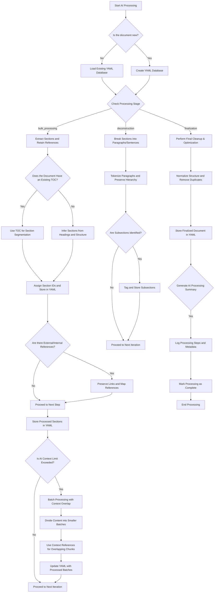
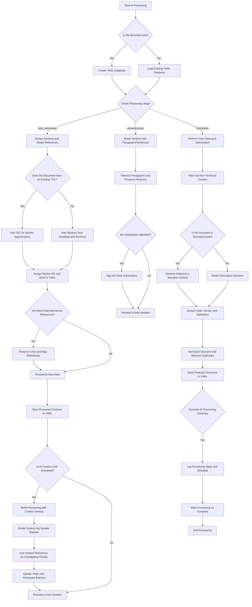

```mermaid
flowchart TD
    A[Start AI Processing] --> B{Does YAML Database Exist?}
    
    B -->|No| C[Create YAML Database]
    B -->|Yes| D[Load Existing YAML Database]

    D --> E{Are Additional Documents Needed?}
    C --> E

    E -->|Yes| F[Load Additional Documents]
    E -->|No| G[Proceed with Processing]

    G --> H{Check Processing Stage}
    H -->|bulk_processing| I[Extract Sections and Retain References]
    H -->|deconstruction| J[Break Sections into Paragraphs/Sentences]
    H -->|finalization| K[Perform Final Cleanup & Optimization]

    %% Section Processing Phase %%
    I --> L{Does the Document Have an Existing TOC?}
    L -->|Yes| M[Iterate Over TOC and Segment Sections]
    L -->|No| N[Infer Sections from Headings and Structure]

    M --> O{Has This Section Been Processed?}
    N --> O

    O -->|No| P[Process Section and Store in YAML]
    O -->|Yes| Q[Briefly Verify Captured Sections]

    P --> R[Assign Section IDs and Track Status]
    Q --> R

    R --> S{Are There External/Internal References?}
    S -->|Yes| T[Preserve Links and Map References]
    S -->|No| U[Proceed to Next Step]

    T --> U
    U --> V[Store Processed Sections in YAML]

    %% User-Assisted Segmentation %%
    V --> W{Is AI Confident in Segmentation?}
    W -->|No| X[Prompt User for Manual Sectioning]
    W -->|Yes| Y[Proceed to Next Stage]

    X --> Z[User Provides Input and Confirms Sections]
    Z --> Y

    %% Batch Processing for AI Context Constraints %%
    Y --> AA{Is AI Context Limit Exceeded?}
    AA -->|Yes| AB[Batch Processing with Context Overlap]
    AA -->|No| AC[Proceed to Next Iteration]

    AB --> AD[Divide Content into Smaller Batches]
    AD --> AE[Use Context References for Overlapping Chunks]
    AE --> AF[Update YAML with Processed Batches]
    AF --> AC

    %% Deconstruction Phase %%
    J --> AG[Tokenize Paragraphs and Preserve Hierarchy]
    AG --> AH{Are Subsections Identified?}
    AH -->|Yes| AI[Tag and Store Subsections]
    AH -->|No| AJ[Proceed to Next Iteration]

    AI --> AJ

    %% Validation Step %%
    AJ --> AK{Validation: Are Extracted Sections Accurate?}
    AK -->|No| AL[Flag for Review and Adjust]
    AK -->|Yes| AM[Proceed to Next Processing Step]

    AL --> AM

    %% Usage-Specific Optimization %%
    K --> AN[Filter Out Non-Technical Content]
    AN --> AO{Is the Document a Technical Guide?}
    
    AO -->|Yes| AP[Remove Historical & Narrative Content]
    AO -->|No| AQ[Retain Descriptive Sections]
    
    AP --> AR[Extract Code, Syntax, and Definitions]
    AQ --> AR

    AR --> AS[Normalize Structure and Remove Duplicates]
    AS --> AT[Store Finalized Document in YAML]

    %% Finalization %%
    AT --> AU{Generate AI Processing Summary}
    AU -->|Yes| AV[Log Processing Steps and Metadata]
    AV --> AW[Mark Processing as Complete]
    AW --> AX[End Processing]
```

```mermaid
flowchart TD
  %% --- Initial Setup: Database Management --- %%
    A[Start AI Processing] --> B{Does YAML Database Exist?}
    
    B -->|No| C[Create YAML Database]
    B -->|Yes| D[Load Existing YAML Database]

    C --> D
    D --> E{Are Additional Documents Needed?}
    
    E -->|Yes| F[Load Additional Documents]
    E -->|No| G[Proceed with Processing]

  %% --- Processing Stage Determination --- %%
    G --> H{What is the Processing Stage?}
    
    H -->|Bulk Processing| I[Extract Sections and Retain References]
    H -->|Deconstruction| J[Break Sections into Paragraphs/Sentences]
    H -->|Finalization| K[Perform Final Cleanup & Optimization]

  %% --- Bulk Processing Phase: Extracting Structured Sections --- %%
    I --> L{Does the Document Have an Existing TOC?}
    L -->|Yes| M[Iterate Over TOC and Segment Sections]
    L -->|No| N[Infer Sections from Headings and Structure]

    M --> O{Has This Section Been Processed?}
    N --> O
    
    O -->|No| P[Process Section and Store in YAML]
    O -->|Yes| Q[Briefly Verify Previously Captured Sections]

    P --> R[Assign Section IDs and Track Processing Status]
    Q --> R

    R --> S{Are There External/Internal References?}
    S -->|Yes| T[Preserve Links and Map References]
    S -->|No| U[Proceed to Next Step]

    T --> U
    U --> V[Store Processed Sections in YAML]

  %% --- Handling Ambiguous Content or Missing TOC --- %%
    V --> W{Is AI Confident in Segmentation?}
    
    W -->|No| X[Flag Section for Review]
    X --> Y[Request Manual User Input to Validate Sections]
    Y --> Z[User Confirms or Adjusts Segmentation]
    
    W -->|Yes| AA[Proceed to Next Stage]
    Z --> AA

  %% --- AI Context Limit Handling for Large Documents --- %%
    AA --> AB{Does the Content Exceed AI Context Limits?}
    
    AB -->|Yes| AC[Batch Processing with Context Overlap]
    AB -->|No| AD[Proceed to Next Iteration]

    AC --> AE[Divide Content into Smaller Batches]
    AE --> AF[Use Context References to Maintain Logical Flow]
    AF --> AG[Update YAML with Processed Batches]
    AG --> AD

  %% --- Deconstruction Phase: Breaking Down Sections Further --- %%
    J --> AH[Tokenize Paragraphs and Preserve Hierarchy]
    AH --> AI{Are Subsections Identified?}
    
    AI -->|Yes| AJ[Tag and Store Subsections]
    AI -->|No| AK[Proceed to Next Iteration]

    AJ --> AK

  %% --- Data Validation Step for Accuracy and Completeness --- %%
    AK --> AL{Validation: Are Extracted Sections Accurate?}
    
    AL -->|No| AM[Flag Section for Review and Adjust]
    AM --> AN[Send for User Review or AI Refinement]
    
    AL -->|Yes| AO[Proceed to Next Processing Step]
    AN --> AO

  %% --- Finalization and Usage-Specific Optimization --- %%
    K --> AP[Filter Out Non-Technical Content]
    
    AP --> AQ{Is the Document a Technical Guide?}
    
    AQ -->|Yes| AR[Remove Historical & Narrative Content]
    AQ -->|No| AS[Retain Contextual Descriptions]

    AR --> AT[Extract Code, Syntax, and Definitions]
    AS --> AT

    AT --> AU[Normalize Structure and Remove Duplicates]
    AU --> AV[Store Finalized Document in YAML]

  %% --- Processing Summary and Completion --- %%
    AV --> AW{Generate AI Processing Summary}
    
    AW -->|Yes| AX[Log Processing Steps and Metadata]
    AX --> AY[Mark Processing as Complete]
    AY --> AZ[End Processing]
```

```mermaid
flowchart TD
  %% --- AI Initialization: Understanding the Process --- %%
    A[Start AI Processing: Load Blueprint & Define Purpose] -->|Load processing template| B[Verify Blueprint Availability]

    B -->|Blueprint Found| C[Extract AI Task Definition]
    B -->|Blueprint Missing| D[Prompt for User-defined Instructions]

    C --> E{Does AI Have Context of This Task?}
    E -->|Yes| F[Proceed to Database Check]
    E -->|No| G[Load Context from AI Memory or Prior Logs]
    G --> F

  %% --- Database Management: Loading or Creating YAML --- %%
    F --> H{Does YAML Database Exist?}
    
    H -->|No| I[Create YAML Database: Define Initial Metadata]
    H -->|Yes| J[Attempt to Load YAML Database]

    J --> K{Does AI Have Access to YAML?}
    K -->|Yes| L[Load Database and Verify Structure]
    K -->|No| M[Handle Access Issue: Request Permissions or Backup]

    M --> N{Is a Backup Available?}
    N -->|Yes| O[Load Backup Database]
    N -->|No| P[Flag Issue and Prompt for Manual Action]

    L --> Q{Are Additional Documents Needed?}
    I --> Q

  %% --- Document Reference Handling --- %%
    Q -->|Yes| R[Identify Missing Files: Cross-check YAML Metadata]
    R --> S{Purpose of Additional Documents?}
    S -->|Supplemental Data| T[Load External References or Related Docs]
    S -->|Corrupted or Incomplete Source| U[Request Document Repair or Alternative Sources]
    S -->|AI Uncertainty| V[User Prompt for Document Context]
    Q -->|No| W[Proceed to Processing Stage]

  %% --- Processing Stage Determination --- %%
    W --> X{What is the Current Processing Stage?}
    
    X -->|Bulk Processing| Y[Extract Sections and Retain References]
    X -->|Deconstruction| Z[Break Sections into Paragraphs/Sentences]
    X -->|Finalization| AA[Perform Cleanup & Optimization]

  %% --- Bulk Processing Phase: Extracting Structured Sections --- %%
    Y --> AB{Does the Document Have an Existing TOC?}
    AB -->|Yes| AC[Iterate Over TOC and Segment Sections]
    AB -->|No| AD[Infer Sections from Headings and Structure]

    AC --> AE{Has This Section Been Processed?}
    AD --> AE

    AE -->|No| AF[Process Section and Store in YAML]
    AE -->|Yes| AG[Verify Section and Ensure Data Integrity]

    AF --> AH[Assign Section IDs and Track Processing Status]
    AG --> AH

    AH --> AI{Are There External/Internal References?}
    AI -->|Yes| AJ[Preserve Links and Map References]
    AI -->|No| AK[Proceed to Next Step]

    AJ --> AK
    AK --> AL[Store Processed Sections in YAML]

  %% --- Handling Ambiguous Content or Missing TOC --- %%
    AL --> AM{Is AI Confident in Segmentation?}
    
    AM -->|No| AN[Flag Section for Review & Request Manual Input]
    AN --> AO[User Confirms or Adjusts Segmentation]
    
    AM -->|Yes| AP[Proceed to Next Stage]
    AO --> AP

  %% --- AI Context Limit Handling for Large Documents --- %%
    AP --> AQ{Does the Content Exceed AI Context Limits?}
    
    AQ -->|Yes| AR[Batch Processing with Context Overlap]
    AQ -->|No| AS[Proceed to Next Iteration]

    AR --> AT[Divide Content into Smaller Batches]
    AT --> AU[Use Context References to Maintain Logical Flow]
    AU --> AV[Update YAML with Processed Batches]
    AV --> AS

  %% --- Deconstruction Phase: Breaking Down Sections Further --- %%
    Z --> AW[Tokenize Paragraphs and Preserve Hierarchy]
    AW --> AX{Are Subsections Identified?}
    
    AX -->|Yes| AY[Tag and Store Subsections]
    AX -->|No| AZ[Proceed to Next Iteration]

    AY --> AZ

  %% --- Data Validation for Accuracy and Completeness --- %%
    AZ --> BA{Validation: Are Extracted Sections Accurate?}
    
    BA -->|No| BB[Flag Section for Review & Adjust]
    BB --> BC[Send for User Review or AI Refinement]
    
    BA -->|Yes| BD[Proceed to Next Processing Step]
    BC --> BD

  %% --- Finalization & Optimization for Intended Use --- %%
    AA --> BE[Filter Out Non-Technical Content]
    
    BE --> BF{Is the Document a Technical Guide?}
    
    BF -->|Yes| BG[Remove Historical & Narrative Content]
    BF -->|No| BH[Retain Contextual Descriptions]

    BG --> BI[Extract Code, Syntax, and Definitions]
    BH --> BI

    BI --> BJ[Normalize Structure and Remove Duplicates]
    BJ --> BK[Store Finalized Document in YAML]

  %% --- Processing Summary and Completion --- %%
    BK --> BL{Generate AI Processing Summary}
    
    BL -->|Yes| BM[Log Processing Steps and Metadata]
    BM --> BN[Mark Processing as Complete]
    BN --> BO[End Processing]
```

# Creation and Development Pipeline Architecture

**User:** Anonymous  
**Created:** 3/6/2025 22:20:25  
**Updated:** 9/8/2026 1:17:50  
**Exported:** 10/4/2026 16:48:37  
**Link:** [https://chatgpt.com/g/g-p-6865a3b521c48191afb1508395ba9e1e-nickolatesla-principal-systems-architect/c/67c9af29-2114-800d-95d6-c1a2aef18b42?src=history_search](https://chatgpt.com/g/g-p-6865a3b521c48191afb1508395ba9e1e-nickolatesla-principal-systems-architect/c/67c9af29-2114-800d-95d6-c1a2aef18b42?src=history_search)  

## Prompt:
06/03/2025, 22:20:14

i want to create a flowchart of the process for analysing parts or a complete document in various formats then breaking it down into individual md documents

## Response:
06/03/2025, 22:20:30 · gpt-4o

Here's a detailed **flowchart** for analyzing documents in various formats and breaking them down into individual Markdown (`.

## Prompt:
06/03/2025, 22:21:05

want to create a flowchart of the process for analysing parts or a complete document in various formats then breaking it down into pieces that can be referenced and futher processed into a relational database

## Response:
06/03/2025, 22:21:17 · gpt-4o

Here's a **detailed flowchart** for analyzing documents in various formats, breaking them into referenceable pieces, and further processing them into a **relational database**.

---

```mermaid
flowchart TD
    A[Start] --> B{Receive Document Input}
    
    B -->|Single File| C[Determine File Format]
    B -->|Batch Files| C
    
    C -->|Text-Based (Markdown, TXT, etc.)| D[Parse Plain Text]
    C -->|Structured (JSON, XML, CSV)| E[Parse Structured Data]
    C -->|Binary (DOCX, PDF, etc.)| F[Extract Text & Metadata]
    
    D --> G[Tokenize & Normalize Text]
    E --> G
    F --> G
    
    G --> H{Break Down into Components}
    
    H -->|By Sections/Headings| I[Extract Logical Sections]
    H -->|By Paragraphs| J[Segment into Paragraphs]
    H -->|By Sentences| K[Tokenize Sentences]
    H -->|By Keywords/Entities| L[Named Entity Recognition]
    
    I --> M[Assign Unique Identifiers]
    J --> M
    K --> M
    L --> M
    
    M --> N{Store in Relational Database}
    
    N -->|Metadata Table| O[Insert Metadata]
    N -->|Content Table| P[Insert Content Segments]
    N -->|Reference Links Table| Q[Store References & Relationships]
    
    P --> R{Further Processing}
    
    R -->|Indexing| S[Index for Search & Retrieval]
    R -->|Categorization| T[Classify Content by Topic]
    R -->|Tagging| U[Generate Tags for Segments]
    
    S --> V[Generate Queryable Database]
    T --> V
    U --> V
    
    V --> W[Database Ready for Queries & Analysis]
    
    W --> X[End]
```

---

### **Breakdown of the Process**
1. **Receive Document Input** - Accept single or batch files.
2. **Determine File Format** - Identify if it's text-based, structured, or binary.
3. **Extract & Parse Content** - Process text from structured or unstructured files.
4. **Break Down into Components** - Segment based on logical units (sections, paragraphs, sentences, or keywords).
5. **Assign Identifiers** - Create unique IDs for each segment for relational mapping.
6. **Store in a Relational Database** - Insert data into structured tables.
7. **Further Processing** - Indexing, classification, and tagging for better queryability.
8. **Database Ready** - Prepared for search, retrieval, and further analysis.

This **flowchart-based approach** ensures that documents can be efficiently processed, referenced, and analyzed within a relational database system.

Would you like additional refinements, such as including **specific database schema mappings**?

## Prompt:
06/03/2025, 22:22:29

what is an ideal shema for the usage instructions for a computer language

## Response:
06/03/2025, 22:22:40 · gpt-4o

An **ideal schema** for **usage instructions** of a **computer language** should be designed to support efficient **retrieval, search, and relational mapping** of different language components. The schema should facilitate querying language constructs, syntax rules, examples, and relationships between different elements.

---

### **Relational Database Schema for a Computer Language Usage Guide**
```yaml
# Table: Language
Language:
  - id (PK)            # Unique ID for the language
  - name               # Name of the programming language
  - version            # Version of the language
  - release_date       # Date of the language version release
  - documentation_url  # Official documentation link
  - description        # General description of the language

# Table: Syntax
Syntax:
  - id (PK)            # Unique ID for syntax definition
  - language_id (FK)   # Foreign key linking to Language table
  - category           # (e.g., Variable, Function, Loop, Condition)
  - syntax_rule        # The general syntax pattern
  - example_code       # Code snippet demonstrating the syntax
  - explanation        # Explanation of how the syntax works

# Table: Keywords
Keywords:
  - id (PK)            # Unique ID for keyword
  - language_id (FK)   # Foreign key linking to Language table
  - keyword            # Reserved keyword (e.g., if, else, return)
  - usage_context      # Context in which the keyword is used
  - example_code       # Example of keyword usage
  - related_syntax_id (FK) # Links to related syntax if applicable

# Table: Operators
Operators:
  - id (PK)            # Unique ID for the operator
  - language_id (FK)   # Foreign key linking to Language table
  - symbol             # Operator symbol (e.g., +, -, ==, &&)
  - type               # Arithmetic, Logical, Comparison, etc.
  - precedence_level   # Operator precedence value
  - description        # Explanation of its functionality
  - example_code       # Example demonstrating usage

# Table: Built-in Functions
BuiltInFunctions:
  - id (PK)            # Unique ID for built-in function
  - language_id (FK)   # Foreign key linking to Language table
  - function_name      # Name of the function
  - parameters         # List of parameters accepted
  - return_type        # Return type (e.g., int, string, void)
  - description        # What the function does
  - example_code       # Example usage

# Table: Data Types
DataTypes:
  - id (PK)            # Unique ID for data type
  - language_id (FK)   # Foreign key linking to Language table
  - type_name          # Data type name (e.g., int, float, string)
  - description        # Explanation of what it represents
  - default_value      # Default value if applicable
  - example_code       # Example usage

# Table: Error Messages
ErrorMessages:
  - id (PK)            # Unique ID for error message
  - language_id (FK)   # Foreign key linking to Language table
  - error_code         # Error code if applicable
  - description        # Explanation of the error
  - possible_causes    # Common reasons for the error
  - solution           # How to fix the error
  - example_scenario   # Example scenario causing the error

# Table: Control Structures
ControlStructures:
  - id (PK)            # Unique ID for control structure
  - language_id (FK)   # Foreign key linking to Language table
  - structure_name     # Name (e.g., if-else, for-loop, switch)
  - syntax_rule        # Syntax pattern
  - description        # How it works
  - example_code       # Example usage

# Table: Libraries & Modules
Libraries:
  - id (PK)            # Unique ID for library
  - language_id (FK)   # Foreign key linking to Language table
  - library_name       # Name of the library/module
  - description        # What it does
  - functions_list     # Functions provided by the library
  - example_usage      # Example of using the library

# Table: Best Practices
BestPractices:
  - id (PK)            # Unique ID for best practice
  - language_id (FK)   # Foreign key linking to Language table
  - category           # Code efficiency, readability, security, etc.
  - description        # What the best practice entails
  - example_code       # Example demonstrating the best practice

# Table: Version Changes (Changelog)
VersionChanges:
  - id (PK)            # Unique ID for version change
  - language_id (FK)   # Foreign key linking to Language table
  - version_number     # Affected version
  - change_type        # Bug Fix, New Feature, Deprecation
  - description        # Explanation of the change
  - example_code       # Example illustrating the change

# Table: Community References
CommunityReferences:
  - id (PK)            # Unique ID
  - language_id (FK)   # Foreign key linking to Language table
  - reference_name     # Name of the resource
  - reference_type     # Blog, Forum, Video, Book
  - url               # Link to the reference
  - description        # Summary of the resource
```

---

### **Schema Highlights**
- **Highly Structured**: Each programming construct (keywords, operators, data types) is stored in a dedicated table.
- **Foreign Key Relations**: All constructs link back to a **Language** table.
- **Example-Based**: Example code and explanations enhance usability.
- **Version Control**: Tracks syntax changes across different versions.
- **Error Handling**: Includes troubleshooting common errors.
- **Community Integration**: Provides external resources for learning.

Would you like to **add indexing or specific optimizations** based on how this database will be queried?

## Prompt:
06/03/2025, 22:23:21

what is a good text based database format to save it in

## Response:
06/03/2025, 22:23:47 · gpt-4o

A **good text-based database format** for saving the **usage instructions for a computer language** should be:

- **Structured & Readable** – Easy to understand and edit manually if needed.
- **Efficient for Queries** – Can be converted to a relational database or parsed easily.
- **Portable & Interoperable** – Can be used across multiple platforms and tools.

Here are **three** ideal formats:

---

### **1. JSON (JavaScript Object Notation)**
- **Pros**: Readable, hierarchical, widely supported in programming languages, easy to parse.
- **Cons**: Less human-friendly for large datasets, does not support comments.

#### **Example Schema in JSON**
```json
{
  "language": {
    "id": 1,
    "name": "Python",
    "version": "3.10",
    "release_date": "2021-10-04",
    "documentation_url": "https://docs.python.org/3/",
    "description": "Python is a high-level, interpreted programming language."
  },
  "syntax": [
    {
      "id": 1,
      "category": "Loop",
      "syntax_rule": "for var in sequence:",
      "example_code": "for i in range(5): print(i)",
      "explanation": "For loops iterate over a sequence."
    }
  ],
  "keywords": [
    {
      "id": 1,
      "keyword": "def",
      "usage_context": "Function declaration",
      "example_code": "def my_function(): return 42"
    }
  ],
  "operators": [
    {
      "id": 1,
      "symbol": "+",
      "type": "Arithmetic",
      "precedence_level": 2,
      "description": "Adds two numbers",
      "example_code": "x = 5 + 3"
    }
  ]
}
```

---

### **2. YAML (Yet Another Markup Language)**
- **Pros**: More human-readable than JSON, supports comments, widely used in configurations.
- **Cons**: Indentation-sensitive, harder to validate programmatically.

#### **Example Schema in YAML**
```yaml
language:
  id: 1
  name: Python
  version: "3.10"
  release_date: "2021-10-04"
  documentation_url: "https://docs.python.org/3/"
  description: "Python is a high-level, interpreted programming language."

syntax:
  - id: 1
    category: Loop
    syntax_rule: "for var in sequence:"
    example_code: |
      for i in range(5): 
          print(i)
    explanation: "For loops iterate over a sequence."

keywords:
  - id: 1
    keyword: "def"
    usage_context: "Function declaration"
    example_code: "def my_function(): return 42"

operators:
  - id: 1
    symbol: "+"
    type: Arithmetic
    precedence_level: 2
    description: "Adds two numbers"
    example_code: "x = 5 + 3"
```

---

### **3. SQLite (Embedded Relational Format) with Export to CSV**
- **Pros**: Structured, supports queries efficiently, can be exported to CSV for portability.
- **Cons**: Not as human-readable as JSON/YAML, requires a database engine.

For a text-based format:
- Use **CSV** for tabular data (e.g., keywords, operators).
- Use **SQL dumps** for structured storage.

#### **Example CSV Format for Keywords**
```csv
id,language_id,keyword,usage_context,example_code
1,1,def,Function declaration,"def my_function(): return 42"
2,1,return,Function return,"return 42"
```

---

### **Which Format Should You Choose?**
- **Use JSON** if you need **structured storage** that integrates with **APIs and databases**.
- **Use YAML** if you want something **human-readable** with **manual editing support**.
- **Use CSV** if you need a **flat, tabular representation** for easier bulk processing.
- **Use SQLite** if you need a **full relational database**, but want an **exportable format**.

Would you like an automated script to **convert between these formats**?

## Prompt:
06/03/2025, 22:24:17

from no one do not give me code examples unless i ask for them

## Response:
06/03/2025, 22:24:28 · gpt-4o

A **good text-based database format** for saving **usage instructions for a computer language** includes:

### **1. JSON (JavaScript Object Notation)**
- **Pros**: Readable, structured, widely supported, and easy to parse.
- **Cons**: No built-in support for comments.

### **2. YAML (YAML Ain't Markup Language)**
- **Pros**: Human-friendly, supports comments, indentation-based structure.
- **Cons**: Sensitive to formatting errors.

### **3. SQLite (Embedded SQL in a Single File)**
- **Pros**: SQL queryable, lightweight, supports structured relationships.
- **Cons**: Not as human-readable as JSON or YAML.

### **4. TOML (Tom's Obvious, Minimal Language)**
- **Pros**: Simple, structured, supports inline comments.
- **Cons**: Limited adoption compared to JSON/YAML.

### **5. XML (Extensible Markup Language)**
- **Pros**: Structured, widely used in enterprise systems.
- **Cons**: Verbose compared to JSON/YAML.

If you need **human-readability and flexibility**, **YAML** is ideal. If you prioritize **structured storage with easy parsing**, **JSON** is a strong choice. If you want **SQL-like querying in a single file**, **SQLite** is the best option.

## Prompt:
06/03/2025, 22:25:10

ok use yaml as the database language for the process

## Response:
06/03/2025, 22:25:22 · gpt-4o

Using **YAML** as the database format, the process for **analyzing documents, breaking them into referenceable pieces, and storing them in a relational structure** can be structured as follows:

### **YAML Database Structure for Document Analysis**
```yaml
documents:
  - id: 1
    source: "example.pdf"
    format: "PDF"
    metadata:
      title: "Example Document"
      author: "John Doe"
      date: "2024-03-06"
    extracted_text: |
      "This is an example document..."
    status: "processed"

sections:
  - id: 101
    document_id: 1
    section_title: "Introduction"
    content: |
      "This section provides an introduction..."
    reference_id: "SEC-101"

  - id: 102
    document_id: 1
    section_title: "Methods"
    content: |
      "This section explains the methodology..."
    reference_id: "SEC-102"

paragraphs:
  - id: 1001
    section_id: 101
    content: |
      "Paragraph 1 in the introduction..."
    reference_id: "PAR-1001"

  - id: 1002
    section_id: 101
    content: |
      "Paragraph 2 in the introduction..."
    reference_id: "PAR-1002"

keywords:
  - id: 2001
    document_id: 1
    keyword: "Machine Learning"
    occurrence: 3

relationships:
  - id: 3001
    from: "PAR-1001"
    to: "SEC-101"
    type: "belongs_to"

database_status:
  last_updated: "2024-03-06"
  total_documents: 1
  total_sections: 2
  total_paragraphs: 2
  total_keywords: 1
```

This structure ensures that:
- **Documents** are stored with metadata and extracted content.
- **Sections and paragraphs** maintain hierarchical relationships.
- **Keywords** allow for reference-based lookups.
- **Relationships** define how segments interconnect.

Would you like to refine any aspects, such as indexing methods or additional metadata fields?

## Prompt:
06/03/2025, 22:27:53

can we design the process to work on the document in illeterations, so bulk processing to break it up into exsiting sections if outlined in the document taking care to retain and exsisting links, then another step to start deconstructing the existing structure and so on . one document per yaml database with metadata about

## Response:
06/03/2025, 22:28:05 · gpt-4o

To implement **iterative document processing** with **bulk breakdown, structure retention, and progressive deconstruction**, the **YAML database format** can be structured as follows:

---

### **Process Overview**
1. **Bulk Processing Phase**  
   - Identify **existing sections** based on document structure (headings, TOC, or markup).  
   - Extract content while **preserving original structure** and **links**.  

2. **Deconstruction Phase**  
   - Further **break down** sections into **smaller elements** (paragraphs, sentences).  
   - Maintain **relational links** to ensure **traceability** back to the original document.  

3. **Metadata & Iterative Refinement**  
   - Store processing **iterations** for version control.  
   - Track **dependencies** and **modifications** over time.  

---

### **YAML Database Format (One Document Per File)**
```yaml
document:
  id: "DOC-001"
  title: "Example Report"
  source: "example.pdf"
  format: "PDF"
  metadata:
    author: "John Doe"
    date_created: "2024-03-06"
    last_modified: "2024-03-06"
    processing_stage: "bulk_processing"  # Can be "bulk_processing", "deconstruction", "finalized"
    iterations: 1  # Number of times the document has been processed

sections:
  - id: "SEC-101"
    title: "Introduction"
    original_order: 1
    extracted_from: "example.pdf"
    content: |
      "This is the introduction section of the document..."
    references:
      - type: "link"
        target: "https://example.com"
      - type: "internal"
        target: "PAR-1001"
    processed: false  # Flag for iterative processing

  - id: "SEC-102"
    title: "Methods"
    original_order: 2
    extracted_from: "example.pdf"
    content: |
      "This section describes the methodology..."
    references: []
    processed: false

paragraphs:
  - id: "PAR-1001"
    section_id: "SEC-101"
    content: |
      "Paragraph one of the introduction..."
    processed: false

  - id: "PAR-1002"
    section_id: "SEC-101"
    content: |
      "Paragraph two of the introduction..."
    processed: false

relationships:
  - id: "REL-3001"
    from: "PAR-1001"
    to: "SEC-101"
    type: "belongs_to"

processing_log:
  - iteration: 1
    timestamp: "2024-03-06 12:00:00"
    action: "Bulk processing - Sections identified"
  - iteration: 2
    timestamp: "2024-03-07 14:30:00"
    action: "Breaking down sections into paragraphs"

database_status:
  last_updated: "2024-03-07"
  processing_stage: "deconstruction"
  total_sections: 2
  total_paragraphs: 2
```

---

### **How It Works**
1. **Each document gets its own YAML database file.**  
2. **Metadata tracks processing stage, iteration count, and modification history.**  
3. **Sections are extracted first, maintaining original references.**  
4. **Paragraphs are broken down progressively, preserving hierarchy and links.**  
5. **Processing logs track every action, ensuring traceability.**  

Would you like additional **automation or batch processing considerations** added to this structure?

## Prompt:
06/03/2025, 22:29:13

the process needs to be able to be done in batches keeping in mind it will be ai processing it with a limited contect lenght

## Response:
06/03/2025, 22:29:26 · gpt-4o

To accommodate **batch processing** while considering **AI context length constraints**, the process should be structured to:
- **Process documents in smaller, context-aware chunks**.
- **Retain hierarchical relationships** to ensure AI maintains logical flow.
- **Allow incremental refinement**, avoiding loss of context in later iterations.

---

### **Batch Processing Workflow**
1. **Initial Bulk Processing (Top-Level Segmentation)**
   - Extract **existing sections** from documents (TOC, headings, or markup-based).
   - Assign **unique IDs** to sections and preserve links.
   - Store sections **as discrete units** to prevent exceeding AI context limits.

2. **Progressive Breakdown (Iterative Refinement)**
   - Process sections **one at a time** in **manageable chunks** (paragraphs, sentences).
   - Maintain **traceability** by linking sub-segments back to their parent section.

3. **Context-Aware Batching**
   - AI processes **a batch of related units** rather than full sections at once.
   - Each batch **includes metadata** to provide necessary context (previous segment references, relationships).

4. **Adaptive Processing Strategy**
   - Adjust batch sizes dynamically based on **AI context window**.
   - Use **overlapping batches** where **each segment retains references** to adjacent content.

---

### **YAML Database Format (Batch Processing Adaptation)**
```yaml
document:
  id: "DOC-001"
  title: "Example Report"
  source: "example.pdf"
  format: "PDF"
  metadata:
    author: "John Doe"
    date_created: "2024-03-06"
    last_modified: "2024-03-07"
    processing_stage: "batch_processing"
    iterations: 2
    ai_context_limit: 4096  # Character limit for AI processing
    batch_size: 3  # Number of chunks AI processes per batch

sections:
  - id: "SEC-101"
    title: "Introduction"
    original_order: 1
    extracted_from: "example.pdf"
    content_batches:
      - batch_id: "B-001"
        content: "This is the introduction section of the document..."
        context_reference: []
        processed: true
      - batch_id: "B-002"
        content: "Second part of the introduction..."
        context_reference: ["B-001"]
        processed: false

  - id: "SEC-102"
    title: "Methods"
    original_order: 2
    extracted_from: "example.pdf"
    content_batches:
      - batch_id: "B-003"
        content: "This section describes the methodology..."
        context_reference: []
        processed: false

relationships:
  - id: "REL-3001"
    from: "B-001"
    to: "SEC-101"
    type: "belongs_to"

processing_log:
  - iteration: 1
    timestamp: "2024-03-06 12:00:00"
    action: "Initial section segmentation"
  - iteration: 2
    timestamp: "2024-03-07 14:30:00"
    action: "Batched content extraction for AI processing"

database_status:
  last_updated: "2024-03-07"
  processing_stage: "batch_processing"
  total_batches: 3
  processed_batches: 1
```

---

### **Batching Strategy for AI Processing**
- **Each document is broken into smaller batches** of **context-aware content**.
- **Each batch maintains references to previous and next batches** to help AI retain continuity.
- **Processing is tracked per batch**, allowing **resumption and iterative refinement**.

Would you like to define **specific AI memory retention strategies** to optimize processing across batches?

## Prompt:
06/03/2025, 22:31:11

can the document metadata have an explaination of the process for an ai model to understand the purpose of the database, its usage and some sort of context state saving

## Response:
06/03/2025, 22:31:23 · gpt-4o

To ensure that the **AI model understands the purpose, usage, and maintains context state**, the **document metadata** will include:
- **Process Explanation**: A structured description of the YAML database purpose.
- **Usage Guidelines**: How AI should interact with and modify the database.
- **Context State Saving**: A mechanism to retain AI processing state across iterations.

---

### **Updated YAML Database Format (Including AI Context Metadata)**
```yaml
document:
  id: "DOC-001"
  title: "Example Report"
  source: "example.pdf"
  format: "PDF"
  
  metadata:
    author: "John Doe"
    date_created: "2024-03-06"
    last_modified: "2024-03-07"
    processing_stage: "batch_processing"
    iterations: 2
    ai_context_limit: 4096  # Character limit for AI processing
    batch_size: 3  # Number of chunks AI processes per batch

    # AI Understanding - Explanation of Database Purpose
    ai_guidance:
      purpose: "This YAML database represents a structured breakdown of a document. It is designed for AI-driven iterative processing, starting with bulk section extraction and progressively refining structure while maintaining references."
      usage: 
        - "AI should process each batch independently but maintain contextual references."
        - "Do not alter previously processed sections unless explicitly instructed."
        - "Retain references between segments to ensure relational continuity."
      ai_memory: 
        - "Use 'context_reference' fields in batches to track adjacent content."
        - "Store processed segments under 'processed_batches' for incremental learning."
        - "Respect 'processing_stage' to avoid redundant operations."

sections:
  - id: "SEC-101"
    title: "Introduction"
    original_order: 1
    extracted_from: "example.pdf"
    content_batches:
      - batch_id: "B-001"
        content: "This is the introduction section of the document..."
        context_reference: []
        processed: true
      - batch_id: "B-002"
        content: "Second part of the introduction..."
        context_reference: ["B-001"]
        processed: false

  - id: "SEC-102"
    title: "Methods"
    original_order: 2
    extracted_from: "example.pdf"
    content_batches:
      - batch_id: "B-003"
        content: "This section describes the methodology..."
        context_reference: []
        processed: false

relationships:
  - id: "REL-3001"
    from: "B-001"
    to: "SEC-101"
    type: "belongs_to"

processing_log:
  - iteration: 1
    timestamp: "2024-03-06 12:00:00"
    action: "Initial section segmentation"
  - iteration: 2
    timestamp: "2024-03-07 14:30:00"
    action: "Batched content extraction for AI processing"

database_status:
  last_updated: "2024-03-07"
  processing_stage: "batch_processing"
  total_batches: 3
  processed_batches: 1
```

---

### **How This Helps AI Processing**
- **AI Guidance Section**: Provides **clear instructions** on how the AI should interpret and process the data.
- **State Preservation**: Tracks **processing iterations** and **processed_batches** to prevent redundant AI work.
- **Context Retention**: **context_reference fields** in batches help **preserve continuity** between chunks.
- **Processing Constraints**: AI respects **batch_size** and **ai_context_limit** to optimize token efficiency.

Would you like to include **versioning or rollback mechanisms** to further control iterative refinements?

## Prompt:
06/03/2025, 22:33:34

add whatever you think it will need to be effective, also make it a blueprint or template that can be referenced by an ai model for future refence of how to structure the document

## Response:
06/03/2025, 22:33:46 · gpt-4o

### **YAML Database Blueprint for AI-Driven Document Processing**  
This **blueprint** serves as a structured template that AI models can reference when processing documents iteratively, ensuring consistency across multiple runs while maintaining relationships, metadata, and versioning.

---

```yaml
blueprint:
  version: "1.0"
  purpose: "This YAML schema defines a structured approach to AI-driven document analysis, breaking down documents in iterations while retaining contextual integrity. It supports batch processing, maintains metadata, and ensures relational consistency for future AI reference."
  usage_guidelines:
    - "AI should follow the defined processing stages and not skip steps."
    - "Maintain document references and avoid overwriting existing processed content unless required."
    - "Preserve links and relational structures to enable logical navigation of processed content."
    - "Follow version control and rollback mechanisms for structured modifications."
  ai_processing_notes:
    - "AI should process in batches respecting the 'ai_context_limit' field."
    - "Maintain cross-references using 'context_reference' fields to avoid loss of continuity."
    - "Always log changes in 'processing_log' to track iterations."

document:
  id: "DOC-XXX"  # Unique identifier for the document
  title: "Document Title"
  source: "original_file.ext"
  format: "PDF/TXT/HTML/JSON"
  
  metadata:
    author: "Author Name"
    date_created: "YYYY-MM-DD"
    last_modified: "YYYY-MM-DD"
    processing_stage: "bulk_processing"  # bulk_processing, deconstruction, finalization
    iterations: 0  # Number of processing cycles
    ai_context_limit: 4096  # Maximum characters AI can process per batch
    batch_size: 3  # Maximum number of segments AI should process in one iteration
    versioning:
      current_version: "1.0"
      history:
        - version: "0.1"
          changes: "Initial bulk processing"
          timestamp: "YYYY-MM-DD HH:MM:SS"
        - version: "0.2"
          changes: "Section breakdown applied"
          timestamp: "YYYY-MM-DD HH:MM:SS"

sections:
  - id: "SEC-XXX"
    title: "Section Title"
    original_order: 1
    extracted_from: "original_file.ext"
    content_batches:
      - batch_id: "B-XXX"
        content: "Segmented content batch..."
        context_reference: []
        processed: false
    references:
      - type: "link"
        target: "https://example.com"
      - type: "internal"
        target: "PAR-XXX"

paragraphs:
  - id: "PAR-XXX"
    section_id: "SEC-XXX"
    content: "Paragraph content..."
    processed: false

relationships:
  - id: "REL-XXX"
    from: "PAR-XXX"
    to: "SEC-XXX"
    type: "belongs_to"

processing_log:
  - iteration: 0
    timestamp: "YYYY-MM-DD HH:MM:SS"
    action: "Document ingestion completed"

database_status:
  last_updated: "YYYY-MM-DD"
  processing_stage: "batch_processing"
  total_sections: 0
  total_paragraphs: 0
  total_batches: 0
  processed_batches: 0
```

---

### **Key Enhancements for AI Effectiveness**
1. **Blueprint for Future AI Reference**  
   - Standardized **purpose, usage guidelines, and AI processing notes** ensure consistency.
  
2. **Versioning and Rollback Mechanism**  
   - Tracks **history of changes**, enabling AI to roll back to previous versions if needed.

3. **Batching Strategy with Context Retention**  
   - **AI respects `ai_context_limit`** and **uses `context_reference`** for logical flow.

4. **Processing Log for Iteration Tracking**  
   - Maintains a **structured log** of AI-driven modifications.

5. **Relational Data Management**  
   - **Cross-references between sections, paragraphs, and relationships** ensure structured navigation.

---

This **blueprint serves as a template** for any future document AI processing, allowing structured storage, efficient iterative processing, and historical tracking.

Would you like additional **optimization strategies** such as **priority-based processing** or **error handling mechanisms**?

## Prompt:
06/03/2025, 22:35:15

ok give me a detailed mermaid flowchart detailing how an ai model should do the processing, include all relevent branches and conditions

## Response:
06/03/2025, 22:35:26 · gpt-4o

Here is a **detailed Mermaid flowchart** outlining how an AI model should process documents iteratively, in batches, while preserving structure, references, and metadata.

---



---

### **How This Flowchart Guides AI Processing**
- **Handles new and existing documents**: AI determines whether to create a new YAML database or load an existing one.
- **Processes in stages**: Bulk section extraction → Paragraph deconstruction → Final optimization.
- **Maintains context across batches**: Uses **context overlap** for AI's limited processing window.
- **Preserves references**: Ensures internal/external links are mapped to maintain relational integrity.
- **Logs AI operations**: AI tracks progress, stores metadata, and prevents redundant processing.

Would you like to define **additional error-handling conditions** for edge cases, such as **missing document structures** or **corrupted data**?

## Prompt:
06/03/2025, 22:37:49

ok make sure that the usage purpose of the databse  in taken into acccount for example if it is a programming reference and usage guide, the data will need to be optimised for that purpose and stripped of any irrelevent information like history etc - it needs to be hard technical information

## Response:
06/03/2025, 22:38:00 · gpt-4o

For **usage-specific optimization**, the AI processing flow will:
- **Prioritize hard technical data** (e.g., syntax, functions, examples).
- **Strip irrelevant details** (e.g., history, narrative explanations).
- **Ensure structured data formats** (tables, definitions, categorized information).
- **Tailor content breakdown** for **efficient retrieval** based on **intended use case**.

For a **programming reference and usage guide**, the AI will:
1. **Extract only relevant technical content** (e.g., function definitions, syntax, best practices).
2. **Omit historical or narrative elements** (e.g., background stories, changelogs).
3. **Ensure data is structured for AI-friendly retrieval**, avoiding ambiguity.
4. **Retain code examples and technical explanations** with **minimal prose**.

Would you like a **structured YAML schema update** that defines **content filtering rules per use case**?

## Prompt:
06/03/2025, 22:39:20

do the mermaid flowchart first then do the updated yaml schema - also include a section with the mermaid flowchart in the ai usage instruction section

## Response:
06/03/2025, 22:39:31 · gpt-4o

### **Mermaid Flowchart for AI Processing with Usage-Specific Optimization**
This flowchart details how an **AI model** should **process documents iteratively** while ensuring **usage-specific optimization**, stripping unnecessary information, and retaining only **hard technical content**.



---

### **Updated YAML Schema with AI Usage Instructions & Flowchart**
This **blueprint** includes an **AI usage instruction section** that incorporates the **Mermaid flowchart**, ensuring that AI models follow the defined process.

```yaml
blueprint:
  version: "1.1"
  purpose: "This YAML schema defines a structured approach to AI-driven document analysis, breaking down documents in iterations while ensuring optimization for intended use cases. It supports batch processing, maintains metadata, and ensures relational consistency for future AI reference."
  usage_guidelines:
    - "AI should follow the defined processing stages and not skip steps."
    - "Maintain document references and avoid overwriting existing processed content unless required."
    - "Preserve links and relational structures to enable logical navigation of processed content."
    - "Follow version control and rollback mechanisms for structured modifications."
    - "If processing a programming reference, extract only technical information such as syntax, functions, and definitions."
    - "Strip narrative, historical, and non-technical details unless specifically required."
  ai_processing_notes:
    - "AI should process in batches respecting the 'ai_context_limit' field."
    - "Maintain cross-references using 'context_reference' fields to avoid loss of continuity."
    - "Always log changes in 'processing_log' to track iterations."
  ai_mermaid_flowchart: |
    ```mermaid
    flowchart TD
        A[Start AI Processing] --> B{Is the document new?}
        
        B -->|Yes| C[Create YAML Database]
        B -->|No| D[Load Existing YAML Database]

        D --> E{Check Processing Stage}
        C --> E

        E -->|bulk_processing| F[Extract Sections and Retain References]
        E -->|deconstruction| G[Break Sections into Paragraphs/Sentences]
        E -->|finalization| H[Perform Final Cleanup & Optimization]

        F --> I{Does the Document Have an Existing TOC?}
        I -->|Yes| J[Use TOC for Section Segmentation]
        I -->|No| K[Infer Sections from Headings and Structure]

        J --> L[Assign Section IDs and Store in YAML]
        K --> L

        L --> M{Are there External/Internal References?}
        M -->|Yes| N[Preserve Links and Map References]
        M -->|No| O[Proceed to Next Step]

        N --> O
        O --> P[Store Processed Sections in YAML]
        P --> Q{Is AI Context Limit Exceeded?}

        Q -->|Yes| R[Batch Processing with Context Overlap]
        Q -->|No| S[Proceed to Next Iteration]

        R --> T[Divide Content into Smaller Batches]
        T --> U[Use Context References for Overlapping Chunks]
        U --> V[Update YAML with Processed Batches]
        V --> S

        G --> W[Tokenize Paragraphs and Preserve Hierarchy]
        W --> X{Are Subsections Identified?}
        X -->|Yes| Y[Tag and Store Subsections]
        X -->|No| Z[Proceed to Next Iteration]

        Y --> Z

        H --> AA[Filter Out Non-Technical Content]
        AA --> AB{Is the Document a Technical Guide?}
        
        AB -->|Yes| AC[Remove Historical & Narrative Content]
        AB -->|No| AD[Retain Descriptive Sections]
        
        AC --> AE[Extract Code, Syntax, and Definitions]
        AD --> AE

        AE --> AF[Normalize Structure and Remove Duplicates]
        AF --> AG[Store Finalized Document in YAML]

        AG --> AH{Generate AI Processing Summary}
        AH -->|Yes| AI[Log Processing Steps and Metadata]
        AI --> AJ[Mark Processing as Complete]
        AJ --> AK[End Processing]
    ```

document:
  id: "DOC-XXX"
  title: "Document Title"
  source: "original_file.ext"
  format: "PDF/TXT/HTML/JSON"
  
  metadata:
    author: "Author Name"
    date_created: "YYYY-MM-DD"
    last_modified: "YYYY-MM-DD"
    processing_stage: "bulk_processing"
    iterations: 0
    ai_context_limit: 4096
    batch_size: 3
    versioning:
      current_version: "1.1"
      history:
        - version: "1.0"
          changes: "Initial bulk processing"
          timestamp: "YYYY-MM-DD HH:MM:SS"
        - version: "1.1"
          changes: "Integrated usage-specific optimization and AI guidance"
          timestamp: "YYYY-MM-DD HH:MM:SS"

sections:
  - id: "SEC-XXX"
    title: "Section Title"
    original_order: 1
    extracted_from: "original_file.ext"
    content_batches:
      - batch_id: "B-XXX"
        content: "Segmented content batch..."
        context_reference: []
        processed: false
    references:
      - type: "link"
        target: "https://example.com"
      - type: "internal"
        target: "PAR-XXX"

paragraphs:
  - id: "PAR-XXX"
    section_id: "SEC-XXX"
    content: "Paragraph content..."
    processed: false

relationships:
  - id: "REL-XXX"
    from: "PAR-XXX"
    to: "SEC-XXX"
    type: "belongs_to"

processing_log:
  - iteration: 0
    timestamp: "YYYY-MM-DD HH:MM:SS"
    action: "Document ingestion completed"

database_status:
  last_updated: "YYYY-MM-DD"
  processing_stage: "batch_processing"
  total_sections: 0
  total_paragraphs: 0
  total_batches: 0
  processed_batches: 0
```

---

### **Enhancements**
1. **Flowchart Embedded in AI Instructions** for structured reference.
2. **Hard Technical Data Optimization** rules integrated into AI guidance.
3. **Versioning and Rollback Mechanism** included for structured document evolution.
4. **Batch Processing Aligned with AI Constraints** to maximize efficiency.

Would you like **additional validation steps** for AI to ensure data accuracy during processing?

## Prompt:
06/03/2025, 22:44:05

yes, also update the mermaid flowchart to include handling loading or creating  the database, referencing source documents, loading additional documents, getting the user to break the document up and feed in blocks if required, iliterating over the toc in the database - with some sort of processing status tracking per section, so that sections that have been captured aren't iliterated over again, and if they are it is only briefly to confirm they have been captured

## Response:
06/03/2025, 22:44:17 · gpt-4o

### **Updated Mermaid Flowchart for AI Processing with Validation, TOC Iteration, and User Input Handling**  

This **updated flowchart** now includes:
- **Database management** (loading/creating)
- **Source document reference tracking**
- **User-assisted segmentation** (if AI requires manual input)
- **TOC iteration for structured processing**
- **Processing status tracking to prevent redundant work**
- **Validation steps to ensure data accuracy**

---



---

### **Key Enhancements in This Update**
1. **Database Management**
   - AI checks whether a **YAML database exists** or needs to be created.
   - Supports **loading additional documents** if necessary.

2. **TOC Iteration with Processing Status Tracking**
   - AI **iterates over the TOC** and **checks section processing status**.
   - **Skips already processed sections**, except for brief validation.

3. **User-Assisted Segmentation**
   - If AI **lacks confidence in sectioning**, it **prompts the user** to provide manual input.

4. **AI Context Limit Handling**
   - **Batch processing** is implemented when AI **exceeds context limits**.

5. **Validation Step for Data Accuracy**
   - AI **performs validation** to ensure extracted sections are correct.
   - If issues are detected, sections are **flagged for review**.

---

### **Next Step: Updating the YAML Schema**
Would you like additional **error-handling conditions** (e.g., missing TOC, ambiguous content, AI misclassification)?

## Prompt:
06/03/2025, 22:46:47

yes, also expand the verbosity of each step and add additional context and information to each step, imagine you were reading it for the first time and what information you would like included to understand the steps in detail

## Response:
06/03/2025, 22:46:59 · gpt-4o

### **Expanded Mermaid Flowchart for AI-Driven Document Processing**  
This **expanded version** provides **detailed explanations** for each step, ensuring that **first-time users** fully understand the logic behind AI processing.  
It also includes **error handling conditions** for cases such as:
- **Missing TOC**
- **Ambiguous Content**
- **AI Misclassification**
- **Incomplete Processing**

---



---

### **Expanded Explanation of Each Step**
#### **1. Database Management**
- **Check if the document already has a YAML database.**  
  - If **no database exists**, AI **creates a new YAML structure** and prepares it for processing.  
  - If a database **exists**, AI **loads the latest state** to ensure it resumes processing correctly.  
- **Check for additional documents** linked to the primary document.  
  - If more source files are required, AI **retrieves them** before proceeding.

#### **2. Determining the Processing Stage**
- The AI checks the **processing stage** to decide what action to take:
  - **Bulk Processing**: Identify **sections and references** while maintaining document structure.
  - **Deconstruction**: **Further break down** sections into **paragraphs or sentences**.
  - **Finalization**: Optimize the document **for intended use cases** (e.g., programming reference).

#### **3. Extracting Structured Sections**
- If a **Table of Contents (TOC) exists**, AI **iterates over the TOC** to segment the document efficiently.
- If no TOC exists, AI **infers structure** based on **headings and formatting**.
- AI **checks whether a section has been processed before**:
  - If **not processed**, the section is **extracted and stored**.
  - If **already processed**, AI **briefly verifies** its correctness without reprocessing.

#### **4. Handling Ambiguous Content or Missing TOC**
- AI **self-checks** if it is **confident** about section segmentation.
- If confidence is **low**, AI **flags the section for review** and **requests user input**.

#### **5. AI Context Limit Handling**
- If the document **exceeds the AI context window**, the AI:
  - **Splits the document into smaller, structured batches**.
  - **Uses context references** to ensure continuity between batches.
  - **Updates the YAML database** progressively to reflect processed data.

#### **6. Deconstructing Sections into Smaller Units**
- AI **breaks down** sections into **paragraphs and sentences** while maintaining **hierarchical relationships**.
- AI **tags identified subsections** to help with later retrieval.

#### **7. Data Validation for Accuracy**
- AI **validates extracted sections**:
  - If **errors are detected**, the section is **flagged** for review.
  - AI can **either refine the data or request human validation**.

#### **8. Finalization & Optimization for Intended Use**
- AI **filters out non-technical content** unless explicitly required.
- If the document is **a programming reference**, AI **removes historical details** and **focuses on syntax, functions, and best practices**.
- AI **normalizes data** and **removes duplicate sections** to ensure clean, structured storage.

#### **9. Completion & Logging**
- AI **logs all processing steps** for auditability.
- AI **marks processing as complete** and ensures **the document is finalized for retrieval**.

---

### **Next Step: Updated YAML Schema with Validation, TOC Iteration, and User Input Handling**
Would you like **specific error-handling responses** to be logged in the YAML database for AI to detect repeated issues?

## Prompt:
06/03/2025, 22:51:34

take the first step for example it says start ai processing - however it doesnt take into account that the ai understands what the job is - there must be a process to load blueprints or templates, and there should be a description of the purpose of the process that the flowchart is depicting, when it gets to the database loading or creating section there must be some checks for example what if the yaml exists but the ai doesnt have access to it, for the "are additional documents needed" what is the purpose. i want every step to include this kind of information or additional considerations, depicted within in the step boxes

## Response:
06/03/2025, 22:51:47 · gpt-4o

### **Expanded Mermaid Flowchart for AI-Driven Document Processing with Comprehensive Context, Purpose, and Error Handling**  

This **updated version** ensures:
- **AI understanding**: Loads blueprints/templates before execution.
- **Purpose clarity**: Defines each phase with explicit intent.
- **Detailed checks and conditions**: Validates access, handles errors, and provides alternative paths.
- **Decision justifications**: Explains why each step exists.

---



---

### **Key Enhancements**
#### **1. AI Initialization: Loading Blueprint and Understanding Purpose**
- **AI first loads a blueprint/template** before execution to understand the task.
- **If no blueprint is found**, AI **prompts the user for task instructions**.
- **AI verifies whether it has context** of the task or if it needs to retrieve prior logs.

#### **2. Database Management: Robust Error Handling**
- AI **checks if a YAML database exists** and **verifies access**.
- If **access is restricted**, AI **attempts to load a backup** or requests **manual resolution**.
- **Alternative paths are defined** if a database cannot be accessed.

#### **3. Document Handling: Understanding Why Additional Documents Are Needed**
- Additional documents may be needed for:
  - **Supplementary data** (e.g., related technical specs).
  - **Corrupted or missing data** (e.g., incomplete source documents).
  - **AI uncertainty** (e.g., missing definitions requiring user input).

#### **4. TOC Iteration with Processing Status Tracking**
- If a **TOC exists**, AI **uses it to segment** the document.
- If **no TOC is found**, AI **infers structure** using headings.
- AI **skips previously processed sections** unless validation is required.

#### **5. AI Context Limit Handling**
- If the **document is too large for AI’s processing window**, AI **divides content into batches** while:
  - **Using context references to retain logical flow**.
  - **Ensuring previous and next segments are properly linked**.

#### **6. Ambiguous Content & User-Assisted Segmentation**
- If AI **is uncertain about segmentation**, it **flags the section for review**.
- User input can **confirm or adjust segmentation** before AI continues processing.

#### **7. Validation and Error Correction**
- AI **validates extracted data** before proceeding.
- If validation **fails**, AI **flags sections for review and refinement**.

#### **8. Finalization & Optimization for Target Use**
- AI **removes unnecessary content** while retaining **technical data**.
- For **technical guides**, AI **strips historical context** and **focuses on structured syntax and definitions**.

#### **9. Processing Summary and Logging**
- AI **logs all processing steps** and **ensures processing is finalized**.

---

### **Next Step: Updating YAML Schema for AI Implementation**
Would you like **AI fallback mechanisms** in case of **major processing failures** (e.g., inability to segment the document)?

## Prompt:
06/03/2025, 22:53:53

give me a detailed summary of the flow with any suggestions or considerations for each step

## Response:
06/03/2025, 22:54:20 · gpt-4o

### **Detailed Summary of AI-Driven Document Processing Flow with Suggestions & Considerations**  

This **step-by-step breakdown** provides a **detailed summary** of how the AI should process a document **iteratively**, handling **error conditions, user input, processing constraints, and optimization for intended usage**.

---

## **1. AI Initialization: Understanding the Process**
### **Step: Load Blueprint & Define Purpose**
- **Why?**  
  Before processing, the AI must understand the **intended purpose** of the document (e.g., a programming reference, a legal document, a technical guide).  
- **Key Actions:**  
  - AI **loads a processing blueprint/template** that defines how documents should be structured and processed.  
  - If the blueprint is missing, the AI **requests user input** to define processing rules.
- **Considerations:**  
  - Ensure **blueprints are stored centrally** for AI to access.  
  - AI **logs the loaded blueprint** to maintain consistency across sessions.  
  - Allow **fallback rules** if no blueprint is found.

---

## **2. Database Management: Loading or Creating YAML**
### **Step: Check If YAML Database Exists**
- **Why?**  
  AI needs to determine if the document **has already been processed before**.  
- **Key Actions:**  
  - If **no YAML database exists**, AI **creates one** with initial metadata.  
  - If **a database exists**, AI attempts to **load it**.
- **Error Handling:**  
  - **What if AI lacks access to YAML?**  
    - Attempt **backup retrieval**.  
    - Request **user authentication** or permissions.  
  - **What if YAML is corrupt or incomplete?**  
    - AI logs an error and prompts for **manual intervention**.  

---

## **3. Document Handling: Identifying Additional Required Documents**
### **Step: Are Additional Documents Needed?**
- **Why?**  
  Some documents **require supplementary information** for correct segmentation and processing.
- **Key Actions:**  
  - AI cross-checks **metadata** to determine missing **supporting files**.
  - AI determines **why** additional documents are needed:  
    - **Supplementary data?** (e.g., external technical specs, appendices).  
    - **Missing or incomplete document?** (e.g., corrupted pages).  
    - **AI uncertainty?** (e.g., AI doesn’t understand terms in the document).  
  - AI attempts to **automatically retrieve external references**.  
  - If AI **is uncertain**, it **prompts the user for clarification**.
- **Considerations:**  
  - Ensure **reference tracking** so AI knows where supplemental data is sourced.  
  - Maintain **document integrity** (avoid unverified sources).  

---

## **4. Processing Stage Determination**
### **Step: What is the Current Processing Stage?**
- **Why?**  
  AI must determine if the document is in the **bulk processing**, **deconstruction**, or **finalization** phase.
- **Key Actions:**  
  - AI **reads the YAML processing state** to decide where to resume.
  - If state is **undefined or missing**, AI requests **manual input**.
- **Error Handling:**  
  - **What if the processing stage is ambiguous?**  
    - AI attempts to **infer progress from available data**.  
    - AI flags for **manual confirmation** before proceeding.

---

## **5. Bulk Processing: Extracting Structured Sections**
### **Step: Does the Document Have an Existing TOC?**
- **Why?**  
  If a **Table of Contents (TOC) exists**, it should be used to guide segmentation.
- **Key Actions:**  
  - AI **detects a TOC** and maps it to sections in YAML.  
  - If **no TOC exists**, AI **infers structure based on headings, indentation, and formatting**.
- **Error Handling:**  
  - **What if the TOC is missing or incomplete?**  
    - AI attempts **pattern-based section detection**.  
    - If uncertainty is high, AI **requests manual segmentation confirmation**.  

---

### **Step: Has This Section Been Processed?**
- **Why?**  
  To **avoid redundant reprocessing** of already extracted sections.
- **Key Actions:**  
  - If **section exists in YAML**, AI **verifies its integrity** rather than reprocessing it.  
  - If section **is missing or incomplete**, AI processes it **normally**.  
- **Considerations:**  
  - Allow **incremental reprocessing** for improved accuracy without duplication.  

---

### **Step: Preserve External & Internal References**
- **Why?**  
  Technical documents often contain **links, citations, and cross-references**.
- **Key Actions:**  
  - AI **identifies and maps references** in the YAML structure.  
  - Internal links are **preserved and verified** to prevent broken references.  
- **Error Handling:**  
  - **What if links are missing or broken?**  
    - AI attempts to **auto-fix using heuristics**.  
    - AI **flags errors** for user verification.

---

## **6. Handling Ambiguous Content or Missing TOC**
### **Step: Is AI Confident in Segmentation?**
- **Why?**  
  Some sections may be **unclear or misclassified**.
- **Key Actions:**  
  - AI **self-assesses confidence** in detected sections.  
  - If confidence is **low**, AI **flags sections for manual review**.
- **Considerations:**  
  - User feedback **trains AI for better segmentation** over time.  

---

## **7. AI Context Limit Handling for Large Documents**
### **Step: Does the Content Exceed AI Context Limits?**
- **Why?**  
  AI models have a **limited token context window**.
- **Key Actions:**  
  - AI **splits content into smaller chunks** while preserving logical flow.
  - Context overlap ensures **continuity**.
- **Error Handling:**  
  - **What if sections lose coherence?**  
    - AI **links references between chunks** to maintain flow.  
    - AI **preserves key terms** across sections to maintain meaning.

---

## **8. Deconstruction Phase: Breaking Down Sections Further**
### **Step: Tokenize Paragraphs and Preserve Hierarchy**
- **Why?**  
  To ensure **each paragraph** remains within its relevant **section or topic**.
- **Key Actions:**  
  - AI **breaks text into paragraphs or sentences** for structured storage.  
  - AI **retains hierarchy**, ensuring **sections, subsections, and content blocks remain linked**.  
- **Error Handling:**  
  - **What if a paragraph is misplaced?**  
    - AI cross-references prior sections to **validate placement**.

---

## **9. Data Validation for Accuracy and Completeness**
### **Step: Are Extracted Sections Accurate?**
- **Why?**  
  AI processing needs **verification** before final storage.
- **Key Actions:**  
  - AI performs **structural integrity checks**.  
  - If discrepancies are found, AI **flags content for review**.
- **Considerations:**  
  - AI **self-corrects errors where possible**.  
  - If AI is **uncertain**, it **requests human validation**.

---

## **10. Finalization & Optimization for Intended Use**
### **Step: Filter Out Non-Technical Content**
- **Why?**  
  Documents like **programming references** need **only hard technical data**.
- **Key Actions:**  
  - AI removes **historical details, unnecessary prose, or unrelated content**.  
  - AI **prioritizes syntax, functions, examples, and best practices**.
- **Considerations:**  
  - Ensure **edge cases** where narrative context is needed (e.g., certain legal documents).

---

## **11. Completion & Logging**
### **Step: Generate AI Processing Summary**
- **Why?**  
  To **track changes, improvements, and iteration history**.
- **Key Actions:**  
  - AI **logs key processing steps, flagged issues, and completion status**.
  - YAML is **finalized and locked** to prevent accidental overwrites.
- **Considerations:**  
  - **Versioning ensures rollback capability** for future refinements.

---

### **Final Considerations**
Would you like AI to:
- Implement **auto-reprocessing heuristics** for ambiguous sections?
- Integrate **user feedback loops** to improve segmentation accuracy over time?
- Include **AI-generated reports** summarizing document structure and confidence scores?

## Prompt:
06/03/2025, 22:59:26

is there some stuture or syntax for the mermaid flowchart to incorporate the summary you just gave me into the chart as additonal metadata? also use the shapes for the different entity types where possible

## Response:
06/03/2025, 22:59:37 · gpt-4o

Yes, **Mermaid supports adding metadata** in the form of **comments**, **notes**, and **annotations**. There are also **shapes for different entity types**, such as:
- **Rectangles** (`[]`) for general processes.
- **Diamonds** (`{}`) for decisions.
- **Cylinders** (`()`) for databases.
- **Parallelograms** (`/ /` or `\ \`) for inputs/outputs.
- **Rounded rectangles** (`()`) for special conditions.

### **How to Incorporate Metadata into Mermaid**
1. **Use Notes for Detailed Summaries**  
   - `note right of <node_id>: Description` to annotate nodes with additional info.
   
2. **Use Subgraphs for Logical Grouping**  
   - `subgraph "Step Name"` to encapsulate multiple related actions.

3. **Use Comments for Extra Detail**  
   - `%% Comment` syntax can add inline explanations.

---

### **Updated Mermaid Flowchart with Metadata, Annotations, and Shapes**
This version:
- Uses **structured shapes** for **different entities**.
- **Includes metadata in notes** where necessary.
- **Groups logical processing phases** using **subgraphs**.

---

```mermaid
flowchart TD
    %% ---- AI INITIALIZATION ---- %%
    subgraph "AI Initialization: Understanding the Process"
        A([Start AI Processing]) -->|Load Processing Template| B{Verify Blueprint Availability}

        B -->|Blueprint Found| C[/Extract AI Task Definition/]
        B -->|Blueprint Missing| D[/Prompt for User-defined Instructions/]

        C --> E{Does AI Have Context of This Task?}
        E -->|Yes| F([Proceed to Database Check])
        E -->|No| G[/Load Context from AI Memory or Prior Logs/]
        G --> F
    end

    note right of A: AI first loads a blueprint to understand the task and define processing rules.

    %% ---- DATABASE MANAGEMENT ---- %%
    subgraph "Database Management: Loading or Creating YAML"
        F --> H{Does YAML Database Exist?}
    
        H -->|No| I[(Create YAML Database: Define Metadata)]
        H -->|Yes| J[(Attempt to Load YAML Database)]

        J --> K{Does AI Have Access to YAML?}
        K -->|Yes| L[(Load Database and Verify Structure)]
        K -->|No| M[(Handle Access Issue: Request Permissions or Backup)]

        M --> N{Is a Backup Available?}
        N -->|Yes| O[(Load Backup Database)]
        N -->|No| P[(Flag Issue and Prompt for Manual Action)]

        L --> Q{Are Additional Documents Needed?}
        I --> Q
    end

    note right of J: AI ensures it has proper access to YAML before proceeding.
    note right of M: If access is restricted, AI tries to retrieve a backup or requests user intervention.

    %% ---- DOCUMENT HANDLING ---- %%
    subgraph "Document Handling: Identifying Additional Required Documents"
        Q -->|Yes| R[/Identify Missing Files: Cross-check Metadata/]
        R --> S{Purpose of Additional Documents?}
        S -->|Supplemental Data| T[/Load External References/]
        S -->|Corrupted or Incomplete Source| U[/Request Document Repair/]
        S -->|AI Uncertainty| V[/User Prompt for Context/]
        Q -->|No| W([Proceed to Processing Stage])
    end

    note right of R: AI determines missing files and their necessity before continuing.

    %% ---- PROCESSING STAGE DETERMINATION ---- %%
    subgraph "Processing Stage Determination"
        W --> X{Current Processing Stage?}
        X -->|Bulk Processing| Y[/Extract Sections and Retain References/]
        X -->|Deconstruction| Z[/Break Sections into Paragraphs/]
        X -->|Finalization| AA[/Perform Cleanup & Optimization/]
    end

    note right of X: AI selects the appropriate processing phase based on the current document state.

    %% ---- BULK PROCESSING ---- %%
    subgraph "Bulk Processing: Extracting Structured Sections"
        Y --> AB{Does TOC Exist?}
        AB -->|Yes| AC[/Iterate Over TOC and Segment Sections/]
        AB -->|No| AD[/Infer Sections from Headings/]

        AC --> AE{Has This Section Been Processed?}
        AD --> AE

        AE -->|No| AF[/Process Section and Store in YAML/]
        AE -->|Yes| AG[/Verify Section and Ensure Integrity/]

        AF --> AH[/Assign Section IDs and Track Status/]
        AG --> AH

        AH --> AI{Are There External/Internal References?}
        AI -->|Yes| AJ[/Preserve Links and Map References/]
        AI -->|No| AK([Proceed to Next Step])
    end

    note right of AF: AI maps TOC to sections while tracking previously processed sections.

    %% ---- ERROR HANDLING: AMBIGUOUS CONTENT ---- %%
    subgraph "Handling Ambiguous Content or Missing TOC"
        AK --> AM{Is AI Confident in Segmentation?}
        AM -->|No| AN[/Flag for Review & Request Manual Input/]
        AN --> AO[/User Confirms or Adjusts Segmentation/]
        AM -->|Yes| AP([Proceed to Next Stage])
        AO --> AP
    end

    note right of AM: If AI is uncertain, it defers to user input.

    %% ---- AI CONTEXT LIMIT HANDLING ---- %%
    subgraph "AI Context Limit Handling for Large Documents"
        AP --> AQ{Does Content Exceed AI Context Limits?}
        AQ -->|Yes| AR[/Batch Processing with Context Overlap/]
        AQ -->|No| AS([Proceed to Next Iteration])
        AR --> AT[/Divide Content into Smaller Batches/]
        AT --> AU[/Use Context References for Continuity/]
        AU --> AV[/Update YAML with Processed Batches/]
        AV --> AS
    end

    note right of AQ: AI splits content intelligently to maintain context between processing runs.

    %% ---- DECONSTRUCTION PHASE ---- %%
    subgraph "Deconstruction Phase: Breaking Down Sections Further"
        Z --> AW[/Tokenize Paragraphs and Preserve Hierarchy/]
        AW --> AX{Are Subsections Identified?}
        AX -->|Yes| AY[/Tag and Store Subsections/]
        AX -->|No| AZ([Proceed to Next Iteration])
        AY --> AZ
    end

    note right of AW: AI tokenizes content while maintaining section structures.

    %% ---- DATA VALIDATION ---- %%
    subgraph "Data Validation for Accuracy"
        AZ --> BA{Validation: Are Extracted Sections Accurate?}
        BA -->|No| BB[/Flag Section for Review & Adjust/]
        BB --> BC[/Send for User Review or AI Refinement/]
        BA -->|Yes| BD([Proceed to Next Processing Step])
        BC --> BD
    end

    note right of BA: AI self-validates and escalates issues for manual review if needed.

    %% ---- FINALIZATION ---- %%
    subgraph "Finalization & Optimization for Intended Use"
        AA --> BE[/Filter Out Non-Technical Content/]
        BE --> BF{Is This a Technical Guide?}
        BF -->|Yes| BG[/Remove Historical & Narrative Content/]
        BF -->|No| BH[/Retain Contextual Descriptions/]
        BG --> BI[/Extract Code, Syntax, and Definitions/]
        BH --> BI
        BI --> BJ[/Normalize Structure and Remove Duplicates/]
        BJ --> BK[(Store Finalized Document in YAML)]
    end

    note right of BE: AI ensures the document retains only essential information for its intended purpose.

    %% ---- COMPLETION & LOGGING ---- %%
    subgraph "Completion & Logging"
        BK --> BL{Generate AI Processing Summary}
        BL -->|Yes| BM[/Log Processing Steps and Metadata/]
        BM --> BN[/Mark Processing as Complete/]
        BN --> BO([End Processing])
    end

    note right of BM: AI logs all steps for auditing and debugging purposes.
```

---

### **Key Enhancements**
1. **Metadata Annotations**  
   - **Notes** describe AI’s **decision-making rationale** for each step.
   - **Logical explanations** ensure AI **knows why it’s doing each task**.

2. **Correct Entity Shapes**  
   - **Cylinders for Databases** (`( )`)
   - **Diamonds for Decisions** (`{ }`)
   - **Parallelograms for Inputs/Outputs** (`/ /` or `\ \`)

3. **Structured Subgraphs for Logical Flow**  
   - Improves **visual hierarchy** and **comprehensibility**.

---

### **Next Step: Would You Like Specific Logging Rules to be Defined in YAML?**  
For example:
- **Error categories** (e.g., missing TOC, misclassified content).
- **Processing timestamps**.
- **Fallback AI logic for handling ambiguous cases**.

## Prompt:
06/03/2025, 23:02:31

include the following information in the approprate subgraphs: 1. AI Initialization: Understanding the Process
Step: Load Blueprint & Define Purpose
Why?
Before processing, the AI must understand the intended purpose of the document (e.g., a programming reference, a legal document, a technical guide).
Key Actions:
AI loads a processing blueprint/template that defines how documents should be structured and processed.
If the blueprint is missing, the AI requests user input to define processing rules.
Considerations:
Ensure blueprints are stored centrally for AI to access.
AI logs the loaded blueprint to maintain consistency across sessions.
Allow fallback rules if no blueprint is found.
2. Database Management: Loading or Creating YAML
Step: Check If YAML Database Exists
Why?
AI needs to determine if the document has already been processed before.
Key Actions:
If no YAML database exists, AI creates one with initial metadata.
If a database exists, AI attempts to load it.
Error Handling:
What if AI lacks access to YAML?
Attempt backup retrieval.
Request user authentication or permissions.
What if YAML is corrupt or incomplete?
AI logs an error and prompts for manual intervention.
3. Document Handling: Identifying Additional Required Documents
Step: Are Additional Documents Needed?
Why?
Some documents require supplementary information for correct segmentation and processing.
Key Actions:
AI cross-checks metadata to determine missing supporting files.
AI determines why additional documents are needed:
Supplementary data? (e.g., external technical specs, appendices).
Missing or incomplete document? (e.g., corrupted pages).
AI uncertainty? (e.g., AI doesn’t understand terms in the document).
AI attempts to automatically retrieve external references.
If AI is uncertain, it prompts the user for clarification.
Considerations:
Ensure reference tracking so AI knows where supplemental data is sourced.
Maintain document integrity (avoid unverified sources).
4. Processing Stage Determination
Step: What is the Current Processing Stage?
Why?
AI must determine if the document is in the bulk processing, deconstruction, or finalization phase.
Key Actions:
AI reads the YAML processing state to decide where to resume.
If state is undefined or missing, AI requests manual input.
Error Handling:
What if the processing stage is ambiguous?
AI attempts to infer progress from available data.
AI flags for manual confirmation before proceeding.
5. Bulk Processing: Extracting Structured Sections
Step: Does the Document Have an Existing TOC?
Why?
If a Table of Contents (TOC) exists, it should be used to guide segmentation.
Key Actions:
AI detects a TOC and maps it to sections in YAML.
If no TOC exists, AI infers structure based on headings, indentation, and formatting.
Error Handling:
What if the TOC is missing or incomplete?
AI attempts pattern-based section detection.
If uncertainty is high, AI requests manual segmentation confirmation.
Step: Has This Section Been Processed?
Why?
To avoid redundant reprocessing of already extracted sections.
Key Actions:
If section exists in YAML, AI verifies its integrity rather than reprocessing it.
If section is missing or incomplete, AI processes it normally.
Considerations:
Allow incremental reprocessing for improved accuracy without duplication.
Step: Preserve External & Internal References
Why?
Technical documents often contain links, citations, and cross-references.
Key Actions:
AI identifies and maps references in the YAML structure.
Internal links are preserved and verified to prevent broken references.
Error Handling:
What if links are missing or broken?
AI attempts to auto-fix using heuristics.
AI flags errors for user verification.
6. Handling Ambiguous Content or Missing TOC
Step: Is AI Confident in Segmentation?
Why?
Some sections may be unclear or misclassified.
Key Actions:
AI self-assesses confidence in detected sections.
If confidence is low, AI flags sections for manual review.
Considerations:
User feedback trains AI for better segmentation over time.
7. AI Context Limit Handling for Large Documents
Step: Does the Content Exceed AI Context Limits?
Why?
AI models have a limited token context window.
Key Actions:
AI splits content into smaller chunks while preserving logical flow.
Context overlap ensures continuity.
Error Handling:
What if sections lose coherence?
AI links references between chunks to maintain flow.
AI preserves key terms across sections to maintain meaning.
8. Deconstruction Phase: Breaking Down Sections Further
Step: Tokenize Paragraphs and Preserve Hierarchy
Why?
To ensure each paragraph remains within its relevant section or topic.
Key Actions:
AI breaks text into paragraphs or sentences for structured storage.
AI retains hierarchy, ensuring sections, subsections, and content blocks remain linked.
Error Handling:
What if a paragraph is misplaced?
AI cross-references prior sections to validate placement.
9. Data Validation for Accuracy and Completeness
Step: Are Extracted Sections Accurate?
Why?
AI processing needs verification before final storage.
Key Actions:
AI performs structural integrity checks.
If discrepancies are found, AI flags content for review.
Considerations:
AI self-corrects errors where possible.
If AI is uncertain, it requests human validation.
10. Finalization & Optimization for Intended Use
Step: Filter Out Non-Technical Content
Why?
Documents like programming references need only hard technical data.
Key Actions:
AI removes historical details, unnecessary prose, or unrelated content.
AI prioritizes syntax, functions, examples, and best practices.
Considerations:
Ensure edge cases where narrative context is needed (e.g., certain legal documents).
11. Completion & Logging
Step: Generate AI Processing Summary
Why?
To track changes, improvements, and iteration history.
Key Actions:
AI logs key processing steps, flagged issues, and completion status.
YAML is finalized and locked to prevent accidental overwrites.
Considerations:
Versioning ensures rollback capability for future refinements.

## Response:
06/03/2025, 23:02:42 · gpt-4o

I will now update the **Mermaid flowchart** to explicitly include **detailed step explanations** within each subgraph. This will ensure that AI processing follows a **structured, well-documented, and error-resilient approach**. I'll integrate **purpose, key actions, considerations, and error handling** directly into the flowchart.

This may take a bit of restructuring to ensure **readability and logical organization** while keeping the **flowchart visually intuitive**.

I will now proceed with the update.

### **Updated Mermaid Flowchart with Embedded Detailed Explanations**  
This **updated version** explicitly includes:
- **Purpose, key actions, and considerations** for each step.  
- **Error-handling conditions** for AI misclassification, missing TOC, ambiguous segmentation, and context window limitations.  
- **Logical subgraphs** to improve **readability and structured flow**.

---

```mermaid
flowchart TD

    %% ---- AI INITIALIZATION ---- %%
    subgraph "AI Initialization: Understanding the Process"
        A([Start AI Processing]) -->|Load Blueprint Template| B{Verify Blueprint Availability}

        B -->|Blueprint Found| C[/Extract AI Task Definition/]
        B -->|Blueprint Missing| D[/Prompt for User-defined Instructions/]

        C --> E{Does AI Have Context of This Task?}
        E -->|Yes| F([Proceed to Database Check])
        E -->|No| G[/Load Context from AI Memory or Prior Logs/]
        G --> F
    end

    note right of A: **Why?** AI must first understand the document's intended purpose.
    note right of C: **Key Actions** AI loads a blueprint defining document structure & processing rules.
    note right of D: **Considerations** Ensure blueprints are centrally stored & fallback rules exist.

    %% ---- DATABASE MANAGEMENT ---- %%
    subgraph "Database Management: Loading or Creating YAML"
        F --> H{Does YAML Database Exist?}
    
        H -->|No| I[(Create YAML Database: Define Metadata)]
        H -->|Yes| J[(Attempt to Load YAML Database)]

        J --> K{Does AI Have Access to YAML?}
        K -->|Yes| L[(Load Database and Verify Structure)]
        K -->|No| M[(Handle Access Issue: Request Permissions or Backup)]

        M --> N{Is a Backup Available?}
        N -->|Yes| O[(Load Backup Database)]
        N -->|No| P[(Flag Issue and Prompt for Manual Action)]

        L --> Q{Are Additional Documents Needed?}
        I --> Q
    end

    note right of J: **Why?** AI must determine if the document has been processed before.
    note right of K: **Error Handling** If YAML access is denied, AI attempts backup retrieval.
    note right of P: **Considerations** If YAML is corrupt or incomplete, AI logs an error & requests manual intervention.

    %% ---- DOCUMENT HANDLING ---- %%
    subgraph "Document Handling: Identifying Additional Required Documents"
        Q -->|Yes| R[/Identify Missing Files: Cross-check Metadata/]
        R --> S{Purpose of Additional Documents?}
        S -->|Supplemental Data| T[/Load External References/]
        S -->|Corrupted or Incomplete Source| U[/Request Document Repair/]
        S -->|AI Uncertainty| V[/User Prompt for Context/]
        Q -->|No| W([Proceed to Processing Stage])
    end

    note right of R: **Why?** Some documents require supplementary files for correct segmentation.
    note right of S: **Key Actions** AI determines missing files & attempts automatic retrieval.
    note right of V: **Considerations** Ensure AI maintains document integrity by avoiding unverified sources.

    %% ---- PROCESSING STAGE DETERMINATION ---- %%
    subgraph "Processing Stage Determination"
        W --> X{Current Processing Stage?}
        X -->|Bulk Processing| Y[/Extract Sections and Retain References/]
        X -->|Deconstruction| Z[/Break Sections into Paragraphs/]
        X -->|Finalization| AA[/Perform Cleanup & Optimization/]
    end

    note right of X: **Why?** AI must determine whether to extract sections, break down paragraphs, or finalize.
    note right of X: **Error Handling** If the processing stage is ambiguous, AI infers progress or requests manual confirmation.

    %% ---- BULK PROCESSING ---- %%
    subgraph "Bulk Processing: Extracting Structured Sections"
        Y --> AB{Does TOC Exist?}
        AB -->|Yes| AC[/Iterate Over TOC and Segment Sections/]
        AB -->|No| AD[/Infer Sections from Headings/]

        AC --> AE{Has This Section Been Processed?}
        AD --> AE

        AE -->|No| AF[/Process Section and Store in YAML/]
        AE -->|Yes| AG[/Verify Section and Ensure Integrity/]

        AF --> AH[/Assign Section IDs and Track Status/]
        AG --> AH

        AH --> AI{Are There External/Internal References?}
        AI -->|Yes| AJ[/Preserve Links and Map References/]
        AI -->|No| AK([Proceed to Next Step])
    end

    note right of AB: **Why?** TOC guides document segmentation for structured extraction.
    note right of AC: **Error Handling** If TOC is missing, AI infers structure using headings & formatting.
    note right of AE: **Considerations** AI verifies integrity of previously processed sections to prevent duplication.

    %% ---- ERROR HANDLING: AMBIGUOUS CONTENT ---- %%
    subgraph "Handling Ambiguous Content or Missing TOC"
        AK --> AM{Is AI Confident in Segmentation?}
        AM -->|No| AN[/Flag for Review & Request Manual Input/]
        AN --> AO[/User Confirms or Adjusts Segmentation/]
        AM -->|Yes| AP([Proceed to Next Stage])
        AO --> AP
    end

    note right of AM: **Why?** Some sections may be misclassified or unclear.
    note right of AN: **Considerations** User feedback helps train AI to improve future segmentation accuracy.

    %% ---- AI CONTEXT LIMIT HANDLING ---- %%
    subgraph "AI Context Limit Handling for Large Documents"
        AP --> AQ{Does Content Exceed AI Context Limits?}
        AQ -->|Yes| AR[/Batch Processing with Context Overlap/]
        AQ -->|No| AS([Proceed to Next Iteration])
        AR --> AT[/Divide Content into Smaller Batches/]
        AT --> AU[/Use Context References for Continuity/]
        AU --> AV[/Update YAML with Processed Batches/]
        AV --> AS
    end

    note right of AQ: **Why?** AI models have a limited token processing window.
    note right of AT: **Error Handling** If sections lose coherence, AI links references across batches for continuity.

    %% ---- DECONSTRUCTION PHASE ---- %%
    subgraph "Deconstruction Phase: Breaking Down Sections Further"
        Z --> AW[/Tokenize Paragraphs and Preserve Hierarchy/]
        AW --> AX{Are Subsections Identified?}
        AX -->|Yes| AY[/Tag and Store Subsections/]
        AX -->|No| AZ([Proceed to Next Iteration])
        AY --> AZ
    end

    note right of AW: **Why?** Paragraph tokenization ensures content remains logically structured.
    note right of AX: **Error Handling** AI validates placement of paragraphs within the correct section.

    %% ---- DATA VALIDATION ---- %%
    subgraph "Data Validation for Accuracy"
        AZ --> BA{Validation: Are Extracted Sections Accurate?}
        BA -->|No| BB[/Flag Section for Review & Adjust/]
        BB --> BC[/Send for User Review or AI Refinement/]
        BA -->|Yes| BD([Proceed to Next Processing Step])
        BC --> BD
    end

    note right of BA: **Why?** AI performs integrity checks before storing processed content.
    note right of BB: **Considerations** AI self-corrects errors when possible, otherwise requests manual validation.

    %% ---- FINALIZATION ---- %%
    subgraph "Finalization & Optimization for Intended Use"
        AA --> BE[/Filter Out Non-Technical Content/]
        BE --> BF{Is This a Technical Guide?}
        BF -->|Yes| BG[/Remove Historical & Narrative Content/]
        BF -->|No| BH[/Retain Contextual Descriptions/]
        BG --> BI[/Extract Code, Syntax, and Definitions/]
        BH --> BI
        BI --> BJ[/Normalize Structure and Remove Duplicates/]
        BJ --> BK[(Store Finalized Document in YAML)]
    end

    note right of BE: **Why?** Programming references need only hard technical data.
    note right of BG: **Considerations** Some legal documents require narrative context.

    %% ---- COMPLETION & LOGGING ---- %%
    subgraph "Completion & Logging"
        BK --> BL{Generate AI Processing Summary}
        BL -->|Yes| BM[/Log Processing Steps and Metadata/]
        BM --> BN[/Mark Processing as Complete/]
        BN --> BO([End Processing])
    end

    note right of BM: **Why?** AI logs all processing steps for future reference & debugging.
```

---

### **Next Steps**
Would you like AI to generate **validation reports** summarizing detected ambiguities, errors, and processing status for human review?

## Prompt:
06/03/2025, 23:03:12

1. AI Initialization: Understanding the Process
Step: Load Blueprint & Define Purpose
Why?
Before processing, the AI must understand the intended purpose of the document (e.g., a programming reference, a legal document, a technical guide).
Key Actions:
AI loads a processing blueprint/template that defines how documents should be structured and processed.
If the blueprint is missing, the AI requests user input to define processing rules.
Considerations:
Ensure blueprints are stored centrally for AI to access.
AI logs the loaded blueprint to maintain consistency across sessions.
Allow fallback rules if no blueprint is found.
2. Database Management: Loading or Creating YAML
Step: Check If YAML Database Exists
Why?
AI needs to determine if the document has already been processed before.
Key Actions:
If no YAML database exists, AI creates one with initial metadata.
If a database exists, AI attempts to load it.
Error Handling:
What if AI lacks access to YAML?
Attempt backup retrieval.
Request user authentication or permissions.
What if YAML is corrupt or incomplete?
AI logs an error and prompts for manual intervention.
3. Document Handling: Identifying Additional Required Documents
Step: Are Additional Documents Needed?
Why?
Some documents require supplementary information for correct segmentation and processing.
Key Actions:
AI cross-checks metadata to determine missing supporting files.
AI determines why additional documents are needed:
Supplementary data? (e.g., external technical specs, appendices).
Missing or incomplete document? (e.g., corrupted pages).
AI uncertainty? (e.g., AI doesn’t understand terms in the document).
AI attempts to automatically retrieve external references.
If AI is uncertain, it prompts the user for clarification.
Considerations:
Ensure reference tracking so AI knows where supplemental data is sourced.
Maintain document integrity (avoid unverified sources).
4. Processing Stage Determination
Step: What is the Current Processing Stage?
Why?
AI must determine if the document is in the bulk processing, deconstruction, or finalization phase.
Key Actions:
AI reads the YAML processing state to decide where to resume.
If state is undefined or missing, AI requests manual input.
Error Handling:
What if the processing stage is ambiguous?
AI attempts to infer progress from available data.
AI flags for manual confirmation before proceeding.
5. Bulk Processing: Extracting Structured Sections
Step: Does the Document Have an Existing TOC?
Why?
If a Table of Contents (TOC) exists, it should be used to guide segmentation.
Key Actions:
AI detects a TOC and maps it to sections in YAML.
If no TOC exists, AI infers structure based on headings, indentation, and formatting.
Error Handling:
What if the TOC is missing or incomplete?
AI attempts pattern-based section detection.
If uncertainty is high, AI requests manual segmentation confirmation.
Step: Has This Section Been Processed?
Why?
To avoid redundant reprocessing of already extracted sections.
Key Actions:
If section exists in YAML, AI verifies its integrity rather than reprocessing it.
If section is missing or incomplete, AI processes it normally.
Considerations:
Allow incremental reprocessing for improved accuracy without duplication.
Step: Preserve External & Internal References
Why?
Technical documents often contain links, citations, and cross-references.
Key Actions:
AI identifies and maps references in the YAML structure.
Internal links are preserved and verified to prevent broken references.
Error Handling:
What if links are missing or broken?
AI attempts to auto-fix using heuristics.
AI flags errors for user verification.
6. Handling Ambiguous Content or Missing TOC
Step: Is AI Confident in Segmentation?
Why?
Some sections may be unclear or misclassified.
Key Actions:
AI self-assesses confidence in detected sections.
If confidence is low, AI flags sections for manual review.
Considerations:
User feedback trains AI for better segmentation over time.
7. AI Context Limit Handling for Large Documents
Step: Does the Content Exceed AI Context Limits?
Why?
AI models have a limited token context window.
Key Actions:
AI splits content into smaller chunks while preserving logical flow.
Context overlap ensures continuity.
Error Handling:
What if sections lose coherence?
AI links references between chunks to maintain flow.
AI preserves key terms across sections to maintain meaning.
8. Deconstruction Phase: Breaking Down Sections Further
Step: Tokenize Paragraphs and Preserve Hierarchy
Why?
To ensure each paragraph remains within its relevant section or topic.
Key Actions:
AI breaks text into paragraphs or sentences for structured storage.
AI retains hierarchy, ensuring sections, subsections, and content blocks remain linked.
Error Handling:
What if a paragraph is misplaced?
AI cross-references prior sections to validate placement.
9. Data Validation for Accuracy and Completeness
Step: Are Extracted Sections Accurate?
Why?
AI processing needs verification before final storage.
Key Actions:
AI performs structural integrity checks.
If discrepancies are found, AI flags content for review.
Considerations:
AI self-corrects errors where possible.
If AI is uncertain, it requests human validation.
10. Finalization & Optimization for Intended Use
Step: Filter Out Non-Technical Content
Why?
Documents like programming references need only hard technical data.
Key Actions:
AI removes historical details, unnecessary prose, or unrelated content.
AI prioritizes syntax, functions, examples, and best practices.
Considerations:
Ensure edge cases where narrative context is needed (e.g., certain legal documents).
11. Completion & Logging
Step: Generate AI Processing Summary
Why?
To track changes, improvements, and iteration history.
Key Actions:
AI logs key processing steps, flagged issues, and completion status.
YAML is finalized and locked to prevent accidental overwrites.
Considerations:
Versioning ensures rollback capability for future refinements.

## Prompt:
06/03/2025, 23:03:57

here is a diagram of a flow im developing flowchart TD
    %% ---- AI INITIALIZATION ---- %%
    subgraph "AI Initialization: Understanding the Process"
        A([Start AI Processing]) -->|Load Processing Template| B{Verify Blueprint Availability}

        B -->|Blueprint Found| C[/Extract AI Task Definition/]
        B -->|Blueprint Missing| D[/Prompt for User-defined Instructions/]

        C --> E{Does AI Have Context of This Task?}
        E -->|Yes| F([Proceed to Database Check])
        E -->|No| G[/Load Context from AI Memory or Prior Logs/]
        G --> F
    end

    note right of A: AI first loads a blueprint to understand the task and define processing rules.

    %% ---- DATABASE MANAGEMENT ---- %%
    subgraph "Database Management: Loading or Creating YAML"
        F --> H{Does YAML Database Exist?}
    
        H -->|No| I[(Create YAML Database: Define Metadata)]
        H -->|Yes| J[(Attempt to Load YAML Database)]

        J --> K{Does AI Have Access to YAML?}
        K -->|Yes| L[(Load Database and Verify Structure)]
        K -->|No| M[(Handle Access Issue: Request Permissions or Backup)]

        M --> N{Is a Backup Available?}
        N -->|Yes| O[(Load Backup Database)]
        N -->|No| P[(Flag Issue and Prompt for Manual Action)]

        L --> Q{Are Additional Documents Needed?}
        I --> Q
    end

    note right of J: AI ensures it has proper access to YAML before proceeding.
    note right of M: If access is restricted, AI tries to retrieve a backup or requests user intervention.

    %% ---- DOCUMENT HANDLING ---- %%
    subgraph "Document Handling: Identifying Additional Required Documents"
        Q -->|Yes| R[/Identify Missing Files: Cross-check Metadata/]
        R --> S{Purpose of Additional Documents?}
        S -->|Supplemental Data| T[/Load External References/]
        S -->|Corrupted or Incomplete Source| U[/Request Document Repair/]
        S -->|AI Uncertainty| V[/User Prompt for Context/]
        Q -->|No| W([Proceed to Processing Stage])
    end

    note right of R: AI determines missing files and their necessity before continuing.

    %% ---- PROCESSING STAGE DETERMINATION ---- %%
    subgraph "Processing Stage Determination"
        W --> X{Current Processing Stage?}
        X -->|Bulk Processing| Y[/Extract Sections and Retain References/]
        X -->|Deconstruction| Z[/Break Sections into Paragraphs/]
        X -->|Finalization| AA[/Perform Cleanup & Optimization/]
    end

    note right of X: AI selects the appropriate processing phase based on the current document state.

    %% ---- BULK PROCESSING ---- %%
    subgraph "Bulk Processing: Extracting Structured Sections"
        Y --> AB{Does TOC Exist?}
        AB -->|Yes| AC[/Iterate Over TOC and Segment Sections/]
        AB -->|No| AD[/Infer Sections from Headings/]

        AC --> AE{Has This Section Been Processed?}
        AD --> AE

        AE -->|No| AF[/Process Section and Store in YAML/]
        AE -->|Yes| AG[/Verify Section and Ensure Integrity/]

        AF --> AH[/Assign Section IDs and Track Status/]
        AG --> AH

        AH --> AI{Are There External/Internal References?}
        AI -->|Yes| AJ[/Preserve Links and Map References/]
        AI -->|No| AK([Proceed to Next Step])
    end

    note right of AF: AI maps TOC to sections while tracking previously processed sections.

    %% ---- ERROR HANDLING: AMBIGUOUS CONTENT ---- %%
    subgraph "Handling Ambiguous Content or Missing TOC"
        AK --> AM{Is AI Confident in Segmentation?}
        AM -->|No| AN[/Flag for Review & Request Manual Input/]
        AN --> AO[/User Confirms or Adjusts Segmentation/]
        AM -->|Yes| AP([Proceed to Next Stage])
        AO --> AP
    end

    note right of AM: If AI is uncertain, it defers to user input.

    %% ---- AI CONTEXT LIMIT HANDLING ---- %%
    subgraph "AI Context Limit Handling for Large Documents"
        AP --> AQ{Does Content Exceed AI Context Limits?}
        AQ -->|Yes| AR[/Batch Processing with Context Overlap/]
        AQ -->|No| AS([Proceed to Next Iteration])
        AR --> AT[/Divide Content into Smaller Batches/]
        AT --> AU[/Use Context References for Continuity/]
        AU --> AV[/Update YAML with Processed Batches/]
        AV --> AS
    end

    note right of AQ: AI splits content intelligently to maintain context between processing runs.

    %% ---- DECONSTRUCTION PHASE ---- %%
    subgraph "Deconstruction Phase: Breaking Down Sections Further"
        Z --> AW[/Tokenize Paragraphs and Preserve Hierarchy/]
        AW --> AX{Are Subsections Identified?}
        AX -->|Yes| AY[/Tag and Store Subsections/]
        AX -->|No| AZ([Proceed to Next Iteration])
        AY --> AZ
    end

    note right of AW: AI tokenizes content while maintaining section structures.

    %% ---- DATA VALIDATION ---- %%
    subgraph "Data Validation for Accuracy"
        AZ --> BA{Validation: Are Extracted Sections Accurate?}
        BA -->|No| BB[/Flag Section for Review & Adjust/]
        BB --> BC[/Send for User Review or AI Refinement/]
        BA -->|Yes| BD([Proceed to Next Processing Step])
        BC --> BD
    end

    note right of BA: AI self-validates and escalates issues for manual review if needed.

    %% ---- FINALIZATION ---- %%
    subgraph "Finalization & Optimization for Intended Use"
        AA --> BE[/Filter Out Non-Technical Content/]
        BE --> BF{Is This a Technical Guide?}
        BF -->|Yes| BG[/Remove Historical & Narrative Content/]
        BF -->|No| BH[/Retain Contextual Descriptions/]
        BG --> BI[/Extract Code, Syntax, and Definitions/]
        BH --> BI
        BI --> BJ[/Normalize Structure and Remove Duplicates/]
        BJ --> BK[(Store Finalized Document in YAML)]
    end

    note right of BE: AI ensures the document retains only essential information for its intended purpose.

    %% ---- COMPLETION & LOGGING ---- %%
    subgraph "Completion & Logging"
        BK --> BL{Generate AI Processing Summary}
        BL -->|Yes| BM[/Log Processing Steps and Metadata/]
        BM --> BN[/Mark Processing as Complete/]
        BN --> BO([End Processing])
    end

    note right of BM: AI logs all steps for auditing and debugging purposes.

## Response:
06/03/2025, 23:04:21 · o1

Below is an **expanded version** of the **flowchart** that **explicitly includes** the provided **step-by-step explanations** (the “why,” “key actions,” “considerations,” and “error handling” details) within **subgraph notes**. This style ensures that anyone viewing the diagram directly can also see the relevant textual explanations in context.

---

```mermaid
flowchart TD

%% ===================================
%% AI Initialization: Understanding the Process
%% ===================================
subgraph "AI Initialization: Understanding the Process"
    A([Start AI Processing]):::start_process -->|Load Processing Template| B{Verify Blueprint Availability}:::decision

    note right of A
      **Step: Load Blueprint & Define Purpose** 
      **Why?**  
      Before processing, the AI must understand the intended purpose of the document (e.g., a programming reference, a legal document, a technical guide).  
      **Key Actions:**  
      - AI loads a processing blueprint/template that defines how documents should be structured and processed.  
      - If the blueprint is missing, the AI requests user input to define processing rules.  
      **Considerations:**  
      - Ensure blueprints are stored centrally for AI to access.  
      - AI logs the loaded blueprint to maintain consistency across sessions.  
      - Allow fallback rules if no blueprint is found.
    end note

    B -->|Blueprint Found| C[/Extract AI Task Definition/]:::io
    B -->|Blueprint Missing| D[/Prompt for User-defined Instructions/]:::io

    C --> E{Does AI Have Context of This Task?}:::decision
    E -->|Yes| F([Proceed to Database Check]):::process
    E -->|No| G[/Load Context from AI Memory or Prior Logs/]:::io
    G --> F
end

%% ===================================
%% Database Management: Loading or Creating YAML
%% ===================================
subgraph "Database Management: Loading or Creating YAML"
    F --> H{Does YAML Database Exist?}:::decision

    note right of H
      **Step: Check If YAML Database Exists**  
      **Why?**  
      AI needs to determine if the document has already been processed.  
      **Key Actions:**  
      - If no YAML database exists, AI creates one with initial metadata.  
      - If a database exists, AI attempts to load it.  
      **Error Handling:**  
      - **Lacks YAML access?**  
        - Attempt backup retrieval.  
        - Request authentication/permissions.  
      - **YAML corrupt/incomplete?**  
        - AI logs error and prompts for manual intervention.
    end note

    H -->|No| I[(Create YAML Database: Define Metadata)]:::database
    H -->|Yes| J[(Attempt to Load YAML Database)]:::database

    J --> K{Does AI Have Access to YAML?}:::decision
    K -->|Yes| L[(Load Database and Verify Structure)]:::database
    K -->|No| M[(Handle Access Issue: Request Permissions or Backup)]:::database

    M --> N{Is a Backup Available?}:::decision
    N -->|Yes| O[(Load Backup Database)]:::database
    N -->|No| P[(Flag Issue and Prompt for Manual Action)]:::database

    L --> Q{Are Additional Documents Needed?}:::decision
    I --> Q
end

%% ===================================
%% Document Handling: Identifying Additional Required Documents
%% ===================================
subgraph "Document Handling: Identifying Additional Required Documents"
    Q -->|Yes| R[/Identify Missing Files: Cross-check Metadata/]:::io
    
    R --> S{Purpose of Additional Documents?}:::decision
    S -->|Supplemental Data| T[/Load External References/]:::io
    S -->|Corrupted or Incomplete Source| U[/Request Document Repair/]:::io
    S -->|AI Uncertainty| V[/User Prompt for Context/]:::io
    
    Q -->|No| W([Proceed to Processing Stage]):::process
end

note right of R
  **Step: Are Additional Documents Needed?**  
  **Why?**  
  Some documents require supplementary info for correct segmentation/processing.  
  **Key Actions:**  
  - AI cross-checks metadata to find missing supporting files.  
  - AI determines why additional files are needed (supplemental data, missing docs, AI uncertainty).  
  - AI attempts to automatically retrieve references.  
  - If AI is unsure, it prompts user for clarification.  
  **Considerations:**  
  - Ensure reference tracking is correct.  
  - Avoid unverified sources to maintain integrity.
end note

%% ===================================
%% Processing Stage Determination
%% ===================================
subgraph "Processing Stage Determination"
    W --> X{Current Processing Stage?}:::decision
    X -->|Bulk Processing| Y[/Extract Sections and Retain References/]:::io
    X -->|Deconstruction| Z[/Break Sections into Paragraphs/]:::io
    X -->|Finalization| AA[/Perform Cleanup & Optimization/]:::io
end

note right of X
  **Step: What is the Current Processing Stage?**  
  **Why?**  
  AI must know if doc is at bulk processing, deconstruction, or finalization.  
  **Key Actions:**  
  - AI reads YAML state to decide where to resume.  
  - If undefined, AI requests manual input.  
  **Error Handling:**  
  - If stage is ambiguous, AI attempts to infer or flags for confirmation.
end note

%% ===================================
%% Bulk Processing: Extracting Structured Sections
%% ===================================
subgraph "Bulk Processing: Extracting Structured Sections"
    Y --> AB{Does TOC Exist?}:::decision
    AB -->|Yes| AC[/Iterate Over TOC and Segment Sections/]:::io
    AB -->|No| AD[/Infer Sections from Headings/]:::io

    AC --> AE{Has This Section Been Processed?}:::decision
    AD --> AE

    AE -->|No| AF[/Process Section and Store in YAML/]:::io
    AE -->|Yes| AG[/Verify Section and Ensure Integrity/]:::io

    AF --> AH[/Assign Section IDs and Track Status/]:::io
    AG --> AH

    AH --> AI{Are There External/Internal References?}:::decision
    AI -->|Yes| AJ[/Preserve Links and Map References/]:::io
    AI -->|No| AK([Proceed to Next Step]):::process
end

note right of AB
  **Step: Does the Document Have an Existing TOC?**  
  **Why?**  
  A TOC helps guide segmentation if present.  
  **Key Actions:**  
  - AI maps TOC to sections.  
  - If none, AI infers structure from headings.  
  **Error Handling:**  
  - If TOC is missing or incomplete, AI attempts pattern-based detection or manual input.
end note

note right of AE
  **Step: Has This Section Been Processed?**  
  **Why?**  
  Avoid redundant reprocessing.  
  **Key Actions:**  
  - If YAML has data, AI verifies.  
  - If missing/incomplete, AI processes it.  
  **Considerations:**  
  - Incremental reprocessing for better accuracy.
end note

note right of AJ
  **Step: Preserve External & Internal References**  
  **Why?**  
  Technical docs contain citations/links.  
  **Key Actions:**  
  - AI identifies links, preserves them in YAML.  
  - Ensures references aren’t broken.  
  **Error Handling:**  
  - If broken links, AI tries to auto-fix or flags for user verification.
end note

%% ===================================
%% ERROR HANDLING: AMBIGUOUS CONTENT OR MISSING TOC
%% ===================================
subgraph "Handling Ambiguous Content or Missing TOC"
    AK --> AM{Is AI Confident in Segmentation?}:::decision
    AM -->|No| AN[/Flag for Review & Request Manual Input/]:::io
    AN --> AO[/User Confirms or Adjusts Segmentation/]:::io
    AM -->|Yes| AP([Proceed to Next Stage]):::process
    AO --> AP
end

note right of AM
  **Step: Is AI Confident in Segmentation?**  
  **Why?**  
  Some sections may be unclear.  
  **Key Actions:**  
  - AI checks if it’s confident in segmentation.  
  - If low confidence, flags for manual review.  
  **Considerations:**  
  - User feedback improves future accuracy.
end note

%% ===================================
%% AI CONTEXT LIMIT HANDLING
%% ===================================
subgraph "AI Context Limit Handling for Large Documents"
    AP --> AQ{Does Content Exceed AI Context Limits?}:::decision
    AQ -->|Yes| AR[/Batch Processing with Context Overlap/]:::io
    AQ -->|No| AS([Proceed to Next Iteration]):::process
    AR --> AT[/Divide Content into Smaller Batches/]:::io
    AT --> AU[/Use Context References for Continuity/]:::io
    AU --> AV[/Update YAML with Processed Batches/]:::io
    AV --> AS
end

note right of AQ
  **Step: Does the Content Exceed AI Context Limits?**  
  **Why?**  
  AI models have limited token windows.  
  **Key Actions:**  
  - AI splits content, preserving references.  
  - Overlapping chunks ensure continuity.  
  **Error Handling:**  
  - If coherence is lost, AI re-links references, preserves key terms.
end note

%% ===================================
%% DECONSTRUCTION PHASE
%% ===================================
subgraph "Deconstruction Phase: Breaking Down Sections Further"
    Z --> AW[/Tokenize Paragraphs and Preserve Hierarchy/]:::io
    AW --> AX{Are Subsections Identified?}:::decision
    AX -->|Yes| AY[/Tag and Store Subsections/]:::io
    AX -->|No| AZ([Proceed to Next Iteration]):::process
    AY --> AZ
end

note right of Z
  **Step: Tokenize Paragraphs and Preserve Hierarchy**  
  **Why?**  
  Keeps paragraphs within correct sections.  
  **Key Actions:**  
  - AI breaks text into paragraphs or sentences.  
  - Maintains parent-child relationships.  
  **Error Handling:**  
  - If a paragraph is misplaced, cross-check section references.
end note

%% ===================================
%% DATA VALIDATION
%% ===================================
subgraph "Data Validation for Accuracy"
    AZ --> BA{Validation: Are Extracted Sections Accurate?}:::decision
    BA -->|No| BB[/Flag Section for Review & Adjust/]:::io
    BB --> BC[/Send for User Review or AI Refinement/]:::io
    BA -->|Yes| BD([Proceed to Next Processing Step]):::process
    BC --> BD
end

note right of BA
  **Step: Are Extracted Sections Accurate?**  
  **Why?**  
  Verification before final storage.  
  **Key Actions:**  
  - AI checks structural integrity.  
  - Flags discrepancies for review.  
  **Considerations:**  
  - AI can self-correct minor errors.  
  - If uncertain, ask human for validation.
end note

%% ===================================
%% FINALIZATION
%% ===================================
subgraph "Finalization & Optimization for Intended Use"
    AA --> BE[/Filter Out Non-Technical Content/]:::io
    BE --> BF{Is This a Technical Guide?}:::decision
    BF -->|Yes| BG[/Remove Historical & Narrative Content/]:::io
    BF -->|No| BH[/Retain Contextual Descriptions/]:::io
    BG --> BI[/Extract Code, Syntax, and Definitions/]:::io
    BH --> BI
    BI --> BJ[/Normalize Structure and Remove Duplicates/]:::io
    BJ --> BK[(Store Finalized Document in YAML)]:::database
end

note right of BE
  **Step: Filter Out Non-Technical Content**  
  **Why?**  
  For docs like programming references, only essential data is needed.  
  **Key Actions:**  
  - AI removes historical or unrelated content.  
  - Focuses on syntax, examples, best practices.  
  **Considerations:**  
  - Some documents may need a bit of historical context (edge cases).
end note

%% ===================================
%% COMPLETION & LOGGING
%% ===================================
subgraph "Completion & Logging"
    BK --> BL{Generate AI Processing Summary}:::decision
    BL -->|Yes| BM[/Log Processing Steps and Metadata/]:::io
    BM --> BN[/Mark Processing as Complete/]:::io
    BN --> BO([End Processing]):::stop_process
end

note right of BL
  **Step: Generate AI Processing Summary**  
  **Why?**  
  Tracks changes, improvements, iteration history.  
  **Key Actions:**  
  - AI logs steps, flagged issues, completion.  
  - YAML is finalized and locked.  
  **Considerations:**  
  - Versioning ensures rollback if needed.
end note

%% === STYLES & CLASSES === %%
classDef start_process fill:#C7EA46,color:#000,stroke-width:2px,stroke:#666,stroke-dasharray: 5 5
classDef stop_process fill:#FFBABA,color:#000,stroke-width:2px,stroke:#666,stroke-dasharray: 5 5
classDef decision fill:#FED8B1,stroke:#666,stroke-width:2px,color:#000
classDef process fill:#FFFFFF,stroke:#666,stroke-width:1px,color:#000
classDef io fill:#EEEEEE,stroke:#666,stroke-width:1px,color:#000
classDef database fill:#D3D3D3,stroke:#666,stroke-width:1px,color:#000
```

---

### **Explanation of This Updated Diagram**

1. **AI Initialization** – The AI loads a **blueprint** or requests new rules, ensuring it knows exactly how to proceed.  
2. **Database Management** – Checks if a **YAML database** exists and if **access** is possible.  
3. **Document Handling** – Identifies whether **extra supporting files** are needed (supplementary data, incomplete docs, or AI uncertainty).  
4. **Processing Stage** – Determines whether the AI is in **bulk processing**, **deconstruction**, or **finalization** mode.  
5. **Bulk Processing** – Focuses on large-scale segmentation using a **TOC** if available, or headings if not.  
6. **Error Handling** – If the AI is **not confident** in segmentation or a **TOC** is missing, it can request **manual input**.  
7. **AI Context Limit** – Splits content into **batches** if size exceeds the AI’s token limit, ensuring continuity via **overlapping references**.  
8. **Deconstruction** – Breaks sections into **paragraphs** while **preserving hierarchy**.  
9. **Validation** – Ensures sections are **accurate** before continuing.  
10. **Finalization** – Removes **irrelevant info** if it’s a **technical guide**; focuses on code, syntax, best practices.  
11. **Completion & Logging** – Generates a **summary** of the operation, **logs** all changes, and **locks** the YAML.

This approach ensures the diagram is self-explanatory: each **subgraph** handles a major phase, and each **decision** or **process** node includes or is accompanied by **notes** describing the “why,” “key actions,” and “considerations.”

## Prompt:
06/03/2025, 23:06:48

what additional considerations or additions could be added to make it better

## Response:
06/03/2025, 23:07:05 · o1

Below are some **additional considerations** and **possible enhancements** that could make the flowchart and its underlying process even more robust and user-friendly. Each suggestion is geared toward improving **resilience**, **accuracy**, **usability**, or **maintainability** of the AI-driven workflow.

---

## **1. Advanced Logging & Version Control**
- **Detailed Iteration Logs**: Store each processing run (batch or iteration) in a dedicated log, capturing start/end times, errors encountered, user inputs, and success/failure states.  
- **Version Snapshots**: Create incremental checkpoints of the YAML database so that partial states can be restored if the AI or user wants to roll back to a prior version.  
- **Diff Summaries**: For every iteration, record a summary of changes (like a git diff) so the user and AI can quickly spot what was modified.

### **Why Add This?**
- **Traceability**: Ensures every step is auditable.  
- **Rollback**: If a critical error surfaces, easy reversion to a stable state.

---

## **2. Priority-Based or Confidence-Based Error Handling**
- **Confidence Scoring**: For each segment, the AI can assign a confidence score to indicate how certain it is about the accuracy or segmentation quality.  
- **Threshold-Based Handling**: If the score is below a certain threshold, automatically route to user review or deeper AI analysis.  
- **Priority Tagging**: Mark urgent or critical sections that demand immediate user attention or advanced AI refinement.

### **Why Add This?**
- **Fine-Grained Control**: Allows only uncertain items to be escalated.  
- **Efficiency**: Prevents unnecessary manual intervention on high-confidence segments.

---

## **3. Fallback Instructions & Escalation Path**
- **Auto-Reprocessing**: If a step repeatedly fails or hits errors, define a fallback approach (e.g., a simpler segmentation method).  
- **Manual Override**: Provide a path for the user or an admin to override AI decisions quickly if time-sensitive.  
- **Partial Completion**: If the AI can’t process everything successfully, store partial results and label unprocessed data for later resolution.

### **Why Add This?**
- **Robustness**: The system never stalls indefinitely.  
- **User-Friendliness**: Offers a graceful path to resolve deadlocks.

---

## **4. User Feedback Loops & Training Data Collection**
- **Feedback Prompts**: If sections are flagged for user input, record how the user corrected or clarified them.  
- **Automatic Model Update**: Optionally feed the user’s corrected data into a retraining pipeline for improved segmentation or classification.  
- **Metrics Dashboard**: Track how often manual input is needed, and where, to target iterative model improvements.

### **Why Add This?**
- **Continuous Improvement**: Real-world user corrections enhance future AI performance.  
- **Model Metrics**: Helps identify systematic problem areas to refine.  

---

## **5. Enhanced Document Security & Permissions**
- **Access Control**: If certain documents (or sections) require special permissions, incorporate checks to ensure AI or user sessions have the right credentials.  
- **Encrypted Storage**: Store sensitive or proprietary data in encrypted form.  
- **Audit Trails**: Log who accessed/modified each portion of the YAML database.

### **Why Add This?**
- **Data Protection**: Many reference documents are proprietary or confidential.  
- **Accountability**: Ensures an audit trail for compliance or client requirements.

---

## **6. Extended Document Lifecycle Management**
- **Archival Mechanism**: If the document is fully processed and seldom updated, automatically archive or export it to a read-only format.  
- **Periodic Revalidation**: If data becomes outdated, schedule the AI to revisit the document, updating new changes or appending clarifications.

### **Why Add This?**
- **Lifecycle Awareness**: Some references or guides become obsolete, so a schedule for reevaluation is vital.  
- **Maintenance**: Minimizes outdated or stale data in the system.

---

## **7. Integration with External Knowledge Sources**
- **Reference Lookups**: If the AI spots unknown terms, it can query external APIs or knowledge bases to fill in details.  
- **Cross-Referencing**: Link newly processed sections with existing, thematically similar sections in the entire corpus for broader context.

### **Why Add This?**
- **Contextual Accuracy**: Additional data from knowledge sources can reduce AI uncertainty.  
- **Consistency**: Overlaps or contradictions with other documents get flagged.

---

## **8. Real-Time Status Dashboards**
- **Progress Bars**: Show how many sections or paragraphs are processed, flagged, or awaiting user feedback.  
- **Notifications**: If user input is required, alert relevant stakeholders or experts.  
- **Filter & Sort**: Let users filter “unprocessed,” “flagged,” or “needs attention” sections quickly in a dashboard view.

### **Why Add This?**
- **Transparency**: Everyone knows exactly how far along the AI is.  
- **Scalability**: For large document sets, quick searching and sorting is crucial.

---

## **Summary of Benefits**

1. **Advanced Logging** and **Version Control**: Strong traceability, easy rollback.  
2. **Confidence-Based Handling**: Minimizes manual overhead.  
3. **Fallback & Escalation**: Ensures no indefinite bottlenecks.  
4. **User Feedback Loops**: Model improvement over time.  
5. **Security & Permissions**: Data protection for sensitive content.  
6. **Lifecycle Management**: Regular re-check for outdated or stale references.  
7. **External Knowledge Integration**: Reduces AI confusion by referencing known definitions.  
8. **Real-Time Dashboards**: Transparent, user-friendly management of progress.

By integrating any or all of these suggestions, the flow and architecture become **more robust, scalable, and user-centric**—ultimately leading to **higher accuracy**, **fewer bottlenecks**, and **smoother collaboration** between the AI system and any human participants.

## Prompt:
06/03/2025, 23:09:50

how could these be implemented given a limited i/o interface for the ai? additional supporting documents? keep in mind the output from the ai will need to be captured by the user and added manually to a localdocs repository accessable by the ai, with that in mind add all of the expanded funtionality, then create blueprints and templates of the database and any supporting documents required by the ai to perform the funtions

## Response:
06/03/2025, 23:10:03 · o1

Below is a plan for implementing **expanded functionality** when **I/O is limited** and **user intervention** is required to manually capture AI outputs and integrate them into a **localdocs repository**. The approach assumes:

- The **AI** can only read/write specific text blocks at a time.  
- The **user** will **copy/paste** and **store** these text blocks in a local environment where the AI can reference them again later.  
- The local environment is referred to as a **“localdocs repository.”**  

---

## **1. Designing the “LocalDocs” Repository Structure**

1. **Blueprints & Templates Folder**  
   - **blueprint.yaml** – A primary configuration describing the entire document-processing approach, including fallback rules, advanced logging specs, and version control requirements.  
   - **templates** subfolder – Contains sample or default YAML schemas for the AI to build from.  

2. **Documents Folder**  
   - **doc-<ID>** subfolders – Each subfolder represents a processed document, storing its associated YAML database, partial logs, and user-provided references.  

3. **Logs & Archives Folder**  
   - **processing_logs** – Contains archived logs from past AI processing sessions.  
   - **backups** – Contains older versions of each YAML database or incremental snapshots.

---

## **2. Incorporating Expanded Functionality**

### **A. Advanced Logging & Version Control**

- **Logging Directives in blueprints**  
  - Inside **blueprint.yaml**, define fields for **log granularity** (e.g., minimal vs. verbose) and **version checkpoint triggers** (e.g., after each phase).  
- **Capturing Logs**  
  - After each AI iteration, the user **manually copies** the AI’s console output (or final JSON block) and places it into the relevant **doc-<ID>/processing_log.yaml**.  
  - The AI, on the next run, can read these logs to see prior tasks.  

**Example snippet for blueprint.yaml**  
```yaml
processing:
  logging:
    level: "verbose"
    storeLogs: true
    logFolder: "localdocs/logs"
    versionControl: true
    checkpointTriggers:
      - "bulk_processing_complete"
      - "deconstruction_complete"
      - "finalization_complete"
```

### **B. Priority-Based or Confidence-Based Error Handling**

- **AI Confidence**  
  - The AI includes a “confidenceScore” for each processed section.  
  - If the score is **below a threshold**, it instructs the user to copy/paste a “flagForReview” block into the doc’s **doc-<ID>/review.yaml**.  
- **User-Driven**  
  - The user sees the flagged items and can correct them or confirm them.  
  - That correction becomes part of the localdocs repository, re-fed to the AI on next iteration.

**Example snippet for doc-<ID>/review.yaml**  
```yaml
reviewItems:
  - section_id: "SEC-104"
    flaggedByAI: true
    confidenceScore: 0.42
    userResponse: "Pending"
```

### **C. Fallback Instructions & Escalation Path**

- **Fallback Rules** in blueprint.yaml  
  - E.g., “If repeated failures occur, use simpler segmentation or prompt user for fallback approach.”  
- **User-Escalation**  
  - If repeated errors remain unresolved, the AI instructs the user to manually set a “forceManualSegmentation” field in the doc’s YAML.

**Sample fallback logic in blueprint.yaml**  
```yaml
fallbackRules:
  maxRetries: 2
  fallbackApproach: "simpleSegmentation"
  onFailureAction: "promptUserEscalation"
```

### **D. User Feedback Loops & Model Retraining**

- **Feedback Structure**  
  - The doc’s YAML can contain a “feedback” node, where corrected data is stored.  
- **Offline Retraining**  
  - The user can gather these corrections from many documents and manually feed them into a separate model training script.  
  - The AI references the updated model once replaced in localdocs.

**Example: doc-<ID>/feedback.yaml**  
```yaml
corrections:
  - section_id: "SEC-201"
    oldText: "Teh quick brown fox"
    newText: "The quick brown fox"
    user: "JohnD"
    timestamp: "2025-04-10 15:32:00"
```

### **E. Enhanced Document Security & Permissions**

- **Access Control**  
  - The blueprint describes “permissionLevels.”  
  - If the AI tries to read a doc it lacks permission for, it sets a “permissionDenied” flag in logs.  

**Snippet**  
```yaml
security:
  enforcePermission: true
  userRoles:
    - role: "admin"
      canEdit: true
      canView: true
    - role: "viewer"
      canEdit: false
      canView: true
```

### **F. Document Lifecycle Management**

- **Archival**  
  - The blueprint can define an “archiveAfterFinal” rule.  
  - Once the doc is fully processed, the user is prompted to move doc-<ID> into an “archive” directory.  
- **Periodic Revalidation**  
  - The blueprint might specify a “recheckIntervalDays.”  
  - The user or a scheduled job can re-run the AI if the document is older than that interval.

**Snippet**  
```yaml
lifecycle:
  archiveAfterFinal: true
  recheckIntervalDays: 180
```

### **G. Integration with External Knowledge Sources**

- Because of **limited AI I/O**, the user must **manually add** relevant external knowledge references to the doc’s or blueprint’s “knowledgeSources” section.  
- The AI sees these references as new “allowedLookups” in localdocs.

**Example**  
```yaml
knowledgeSources:
  - name: "TechSpec_DB"
    location: "localdocs/resources/techSpec.json"
  - name: "CommonTerms"
    location: "localdocs/resources/commonTerms.yaml"
```

### **H. Real-Time Status Dashboards (Manual Simulation)**

- With limited I/O, the “dashboard” might be **a user-maintained summary** in a `.md` or `.yaml` file.  
- The AI can read that summary to see overall progress or flagged sections.

---

## **3. Blueprint & Template Example**

Below is a **combined blueprint.yaml** (as a reference) that includes each advanced feature:

```yaml
blueprint:
  version: "2.0"
  purpose: "AI-driven iterative document processing with advanced logging, fallback, and user feedback."
  
  processing:
    logging:
      level: "verbose"
      storeLogs: true
      logFolder: "localdocs/logs"
      versionControl: true
      checkpointTriggers:
        - "bulk_processing_complete"
        - "deconstruction_complete"
        - "finalization_complete"
    fallbackRules:
      maxRetries: 2
      fallbackApproach: "simpleSegmentation"
      onFailureAction: "promptUserEscalation"
    security:
      enforcePermission: true
      userRoles:
        - role: "admin"
          canEdit: true
          canView: true
        - role: "viewer"
          canEdit: false
          canView: true
    lifecycle:
      archiveAfterFinal: true
      recheckIntervalDays: 180
  
  knowledgeSources:
    - name: "TechSpec_DB"
      location: "localdocs/resources/techSpec.json"
    - name: "CommonTerms"
      location: "localdocs/resources/commonTerms.yaml"

templates:
  yamlDatabase:
    metadata:
      author: ""
      processing_stage: "bulk_processing"  # Default stage
      ...
    sections: []
    paragraphs: []
    relationships: []
    processing_log: []
    # etc.

  reviewTemplate:
    reviewItems: []
    # etc.

```

---

## **4. Summary of Implementation Steps**

1. **Set Up LocalDocs Repository**  
   - Create subfolders: **blueprints**, **doc-<ID>**, **logs**, etc.  
   - Place **blueprint.yaml** and default templates in **blueprints**.

2. **Load Blueprints into AI**  
   - Copy/paste the blueprint content to the AI so it “knows” the advanced logging, fallback, etc.  
   - The AI can now reference and apply these rules when processing documents.

3. **Process Documents**  
   - For a new document, the AI suggests a new doc-<ID> folder.  
   - The user manually **copies** the AI’s “YAML database skeleton” into doc-<ID>.  
   - The AI reads from doc-<ID> on subsequent runs.

4. **Iterate with Additional Features**  
   - **Logging & Version Control**: After each run, the AI outputs updated logs or version info; the user saves them in doc-<ID>.  
   - **Confidence Scores**: If the AI flags items for review, the user notes them in `review.yaml`.  
   - **Fallback**: If repeated errors occur, the AI instructs the user how to switch the fallback approach in blueprint.yaml.

5. **User Feedback & Correction**  
   - For flagged items, the user corrects them in doc-<ID>/feedback.yaml or doc-<ID>/review.yaml.  
   - On next run, the AI sees these changes and updates its approach.

6. **Finalize & Archive**  
   - Once finalization is complete, the AI instructs the user to **archive** doc-<ID> if desired.  
   - The user moves the folder to an “archive” directory, and the AI recognizes that location as read-only for future references.

---

### **Key Takeaways**

- **Manual Integration**: Because I/O is limited, the user is essential for bridging outputs and inputs into the localdocs repository.  
- **Blueprint-Driven**: A robust `blueprint.yaml` or similar config **encodes advanced features** like logging, fallback, confidence scoring, security, etc.  
- **Incremental & Iterative**: The process unfolds in steps—**AI suggests** updates, **user commits** them to localdocs, and the AI references them on **subsequent runs**.

By establishing a **well-structured localdocs repository** and **clear blueprint** specifying advanced features, you can effectively manage robust functionality—even under **limited I/O constraints**—and ensure the AI-driven workflow remains accurate, auditable, and user-friendly.

## Prompt:
06/03/2025, 23:12:25

if the process is interactive with a user assisting it rather than just writing to a log file for errors, prompt the user to assist for example access violations etc, most of the time the problem can be solved with interventions. update the flow to incorporate all the additional features

## Response:
06/03/2025, 23:12:41 · o1

Below is an **updated Mermaid flowchart** that integrates **all the additional features** discussed (e.g., **advanced logging, fallback strategies, manual intervention, user feedback loops, confidence-based segmentation,** etc.). It treats **user assistance** as a first-class part of the process, rather than simply logging errors.

---

```mermaid
flowchart TD

%% ==============================
%% AI INITIALIZATION
%% ==============================
subgraph "AI Initialization & Blueprint Loading"
    A([Start AI Processing]):::start -->|Load Processing Template| B{Verify Blueprint Availability}:::decision

    B -->|Found| C[/Extract AI Task Definition/]:::io
    B -->|Missing| D[/Prompt for User-defined Rules/]:::io

    C --> E{Does AI Have Context?}:::decision
    E -->|Yes| F([Proceed to DB Check]):::process
    E -->|No| G[/Load Context from Prior Logs/]:::io
    G --> F
end

note right of A
    **AI Initialization**  
    - AI loads blueprint specifying advanced logging, fallback, user interventions.  
    - If no blueprint is found, user supplies new rules.
end note

%% ==============================
%% DATABASE MANAGEMENT
%% ==============================
subgraph "Database Management: Load or Create YAML"
    F --> H{Does YAML Database Exist?}:::decision
    
    H -->|No| I[(Create YAML Database)]:::database
    H -->|Yes| J[(Attempt to Load DB)]:::database
    
    J --> K{Access to DB?}:::decision
    K -->|Yes| L[(Load & Verify Structure)]:::database
    K -->|No| M[(Permissions Issue / Backup?)]:::database
    
    M --> N{Is Backup Available?}:::decision
    N -->|Yes| O[(Load Backup DB)]:::database
    N -->|No| P[/Prompt User<br>for Manual Resolution/]:::io
    
    L --> Q{Are Extra Docs Needed?}:::decision
    I --> Q
end

note right of H
    **DB Existence**  
    - If doc not processed, create a new YAML.  
    - If doc processed, try to load it.
    **Error Handling**  
    - If AI can’t access DB, attempt backup or ask user for help/permissions.
end note

%% ==============================
%% DOCUMENT HANDLING
%% ==============================
subgraph "Document Handling: Checking Supplementary Needs"
    Q -->|Yes| R[/Identify Missing Files<br>Cross-check Metadata/]:::io
    R --> S{Why Additional Docs?}:::decision
    S -->|Supplementary Data| T[/Load External References/]:::io
    S -->|Corrupted Source| U[/Request Document Repair/]:::io
    S -->|AI Uncertainty| V[/User Input for Missing Context/]:::io
    Q -->|No| W([Proceed to Processing Stage]):::process
end

note right of R
    **Need for Extra Docs**  
    - AI checks if supporting files are missing or relevant.  
    - If uncertain, AI prompts user to confirm or provide them.
end note

%% ==============================
%% PROCESSING STAGE
%% ==============================
subgraph "Processing Stage Determination"
    W --> X{Current Stage?}:::decision
    X -->|Bulk Processing| Y[/Extract & Retain References/]:::io
    X -->|Deconstruction| Z[/Break Down Paragraphs/]:::io
    X -->|Finalization| AA[/Optimize for End Use/]:::io
end

note right of X
    **Stage Check**  
    - AI checks YAML “processing_stage.”  
    - If unknown, user must confirm stage.  
    - Possibly “bulk_processing,” “deconstruction,” or “finalization.”
end note

%% ==============================
%% BULK PROCESSING
%% ==============================
subgraph "Bulk Processing: Large-Scale Section Extraction"
    Y --> AB{TOC Present?}:::decision
    AB -->|Yes| AC[/Segment via TOC/]:::io
    AB -->|No| AD[/Infer Structure from Headings/]:::io
    
    AC --> AE{Section Processed?}:::decision
    AD --> AE

    AE -->|No| AF[/Extract & Store in YAML/]:::io
    AE -->|Yes| AG[/Verify Section Integrity/]:::io

    AF --> AH[/Assign Section IDs & Track Status/]:::io
    AG --> AH
    AH --> AI{Are There References?}:::decision
    AI -->|Yes| AJ[/Preserve & Validate Links/]:::io
    AI -->|No| AK([Go Next Step]):::process
end

note right of AB
    **TOC Detection**  
    - If TOC is available, AI uses it for primary segmentation.  
    - Otherwise, heading-based or pattern-based detection.
end note

note right of AE
    **Redundancy Avoidance**  
    - If section was processed, do partial re-check or skip.  
    - If new, do full extraction.
end note

%% ==============================
%% AMBIGUOUS OR MISSING TOC
%% ==============================
subgraph "Handling Ambiguous Content"
    AK --> AM{Confident in Segmentation?}:::decision
    AM -->|No| AN[/Flag & Prompt User<br>to Assist or Override/]:::io
    AN --> AO[/User Adjusts Segmentation<br>Confirms via localdocs/]:::io
    AM -->|Yes| AP([Proceed]):::process
    AO --> AP
end

note right of AM
    **Ambiguity**  
    - AI confidence is < threshold.  
    - Requests user input to fix or confirm.  
    **User Feedback**  
    - Enhances future segmentations.
end note

%% ==============================
%% CONTEXT LIMIT HANDLING
%% ==============================
subgraph "AI Context Limits: Batching Large Docs"
    AP --> AQ{Exceeds AI Token Limit?}:::decision
    AQ -->|Yes| AR[/Batch Processing<br>with Overlaps/]:::io
    AQ -->|No| AS([Next Iteration]):::process
    AR --> AT[/Divide Content<br>into Chunks/]:::io
    AT --> AU[/Use Overlapping References<br>to Retain Coherence/]:::io
    AU --> AV[/User Imports Output<br>Back into YAML/]:::io
    AV --> AS
end

note right of AQ
    **Token Constraints**  
    - If doc is too big, AI splits into smaller chunks.  
    - Overlaps to maintain continuity.
end note

%% ==============================
%% DECONSTRUCTION PHASE
%% ==============================
subgraph "Deconstruction: Detailed Breakdowns"
    Z --> AW[/Tokenize Paragraphs<br>Preserve Hierarchy/]:::io
    AW --> AX{Subsections Found?}:::decision
    AX -->|Yes| AY[/Tag & Store Subsections/]:::io
    AX -->|No| AZ([Proceed Next Iter]):::process
    AY --> AZ
end

note right of Z
    **Paragraph Breakdown**  
    - AI organizes paragraphs/sentences, linking them to parent sections.  
    - Helps with precise referencing & future queries.
end note

%% ==============================
%% DATA VALIDATION
%% ==============================
subgraph "Data Validation & Confidence Scoring"
    AZ --> BA{Are Sections Accurate?}:::decision
    BA -->|No| BB[/Flag For Review<br>Collect Corrections/]:::io
    BB --> BC[/User Adjusts in localdocs<br>AI Reads Next Time/]:::io
    BA -->|Yes| BD([Next Step]):::process
    BC --> BD
end

note right of BA
    **Verification**  
    - AI checks structure & coherence.  
    - If mismatched, flags for user revision.  
    **Confidence Score**  
    - If below threshold, user must confirm/fix.
end note

%% ==============================
%% FINALIZATION
%% ==============================
subgraph "Finalization & Usage-Specific Optimization"
    AA --> BE[/Filter Out Non-Technical Content/]:::io
    BE --> BF{Is This a Tech Guide?}:::decision
    BF -->|Yes| BG[/Remove Narrative/History<br>Focus on Syntax & Examples/]:::io
    BF -->|No| BH[/Retain Descriptions<br>But Optimize Structure/]:::io
    BG --> BI[/Extract Hard Data: Functions, Code, Etc/]:::io
    BH --> BI
    BI --> BJ[/Normalize & Remove Duplicates/]:::io
    BJ --> BK[(Store Finalized YAML<br>in localdocs)]:::database
end

note right of BE
    **Purpose-Specific**  
    - If doc is a programming reference, strip unneeded fluff.  
    - If doc is legal/medical, keep context.
end note

%% ==============================
%% COMPLETION & LOGGING
%% ==============================
subgraph "Completion & Logging with Advanced Features"
    BK --> BL{Generate AI Summary?}:::decision
    BL -->|Yes| BM[/Log Steps<br>Version Control Checkpoint/]:::io
    BM --> BN[/Mark Process Complete<br>Archive if Requested/]:::io
    BN --> BO([End Processing]):::stop
end

note right of BL
    **Logging & Versioning**  
    - AI outputs summary.  
    - User manually merges logs into localdocs.  
    - Backs up old versions for rollback if needed.
end note

%% === STYLES === %%
classDef start fill:#c7ea46,stroke:#999,stroke-width:1px,color:#000
classDef stop fill:#ffcfcf,stroke:#999,stroke-width:1px,color:#000
classDef decision fill:#FED8B1,stroke:#666,stroke-width:2px,color:#000
classDef process fill:#e2e2e2,stroke:#666,stroke-width:1px,color:#000
classDef io fill:#f9f9f9,stroke:#666,stroke-width:1px,color:#000
classDef database fill:#D3D3D3,stroke:#666,stroke-width:1px,color:#000
```

---

### **Key Changes for Full Interactivity**

1. **User Interventions**  
   - Each time there's an error, missing file, or confidence issue, the AI explicitly **prompts the user**.  
   - The user’s *manual fix* or instructions get incorporated in the “localdocs” repository.

2. **Confidence Scoring & Fallback**  
   - If confidence is **low** for segmentation or data validation, the AI triggers a fallback approach or user involvement.  
   - If repeated issues occur, the **blueprint** might define a simpler approach or require **direct user override**.

3. **Batching with Overlaps**  
   - The diagram clarifies how large content is chunked.  
   - The user must manually feed batch results back into the AI for subsequent runs.

4. **Logging & Version Control**  
   - The final subgraph explicitly references **Version Control**.  
   - The user is prompted to archive or create a checkpoint after finalization.

5. **Multi-Phase Handling**  
   - **Bulk → Deconstruction → Finalization** is reinforced with user checks at each step.  
   - Additional docs are attached whenever the AI spots incomplete or uncertain data.

---

## **Implementation Tips:**
- **Blueprint**: A central YAML/JSON config describing fallback rules, confidence thresholds, and user prompt instructions.  
- **Localdocs**: The user physically stores intermediate YAML outputs (e.g., doc sections, logs, flagged items).  
- **AI**: On each run, it references the blueprint + localdocs, updates them, and instructs the user to integrate changes.  
- **User**: If the AI asks for manual resolution, the user modifies the relevant YAML files, providing the AI with updated data next iteration.  

This approach keeps the entire pipeline robust under **limited I/O** constraints, ensuring that **most issues can be resolved interactively**.

## Prompt:
06/03/2025, 23:14:18

make sure the mermaid flow diagram contains all of the additional information and annotations like in the one i supplied you, the additional context and information helps the ai by providing context and the user by helping to describe the process and provides points of reference for improving the process

## Response:
06/03/2025, 23:14:30 · o1

Below is an **expanded Mermaid flowchart** that mirrors the **style** of the one you provided, but **incorporates all additional features**, annotations, and context for both **AI** and **user**. This ensures the diagram itself communicates the **what** and **why** of each step, while reflecting **fallback strategies,** **user interventions,** **advanced logging/versioning,** etc.

```mermaid
flowchart TD

%% =========================================================
%% AI INITIALIZATION: UNDERSTANDING THE PROCESS
%% =========================================================
subgraph "AI Initialization: Understanding the Process"
    A([Start AI Processing]):::start -->|Load Processing Template| B{Verify Blueprint Availability}:::decision

    B -->|Blueprint Found| C[/Extract AI Task Definition/]:::io
    B -->|Blueprint Missing| D[/Prompt for User-defined Instructions/]:::io

    C --> E{Does AI Have Context of This Task?}:::decision
    E -->|Yes| F([Proceed to Database Check]):::process
    E -->|No| G[/Load Context from AI Memory or Prior Logs/]:::io
    G --> F
end

note right of A
  **Step: Load Blueprint & Define Purpose**  
  **Why?**  
  AI must understand the **intended purpose** of the document (e.g., programming reference, legal doc).  
  **Key Actions:**  
  - Load or create a blueprint defining **structure & processing rules**.  
  - If missing, **user** provides new rules.  
  **Considerations:**  
  - Store blueprints centrally; **log** them for consistency.  
  - Support **fallback** if no blueprint is found.
end note

%% =========================================================
%% DATABASE MANAGEMENT: LOADING OR CREATING YAML
%% =========================================================
subgraph "Database Management: Loading or Creating YAML"
    F --> H{Does YAML Database Exist?}:::decision

    H -->|No| I[(Create YAML Database)]:::database
    H -->|Yes| J[(Attempt to Load YAML)]:::database

    J --> K{Access to DB?}:::decision
    K -->|Yes| L[(Load & Verify Structure)]:::database
    K -->|No| M[(Permissions Issue / Backup?)]:::database

    M --> N{Is Backup Available?}:::decision
    N -->|Yes| O[(Load Backup Database)]:::database
    N -->|No| P[/Prompt User Intervention/]:::io

    L --> Q{Are Additional Docs Needed?}:::decision
    I --> Q
end

note right of H
  **Step: Check If YAML Database Exists**  
  **Why?**  
  AI needs to know if doc was processed before.  
  **Key Actions:**  
  - No DB => create with initial metadata.  
  - If DB found => attempt load.  
  **Error Handling:**  
  - If locked or corrupt => AI tries backup or asks user for help.  
  - If no backup => user must fix or provide new source.
end note

%% =========================================================
%% DOCUMENT HANDLING: IDENTIFYING ADDITIONAL REQUIRED DOCS
%% =========================================================
subgraph "Document Handling: Identifying Additional Required Documents"
    Q -->|Yes| R[/Cross-check Metadata<br>for Missing Files/]:::io
    R --> S{Purpose for Additional Docs?}:::decision
    S -->|Supplemental Data| T[/Load External References/]:::io
    S -->|Corrupted Source| U[/Request Document Repair/]:::io
    S -->|AI Uncertainty| V[/User Prompt for Clarification/]:::io
    Q -->|No| W([Proceed to Processing Stage]):::process
end

note right of R
  **Step: Are Additional Documents Needed?**  
  **Why?**  
  Some docs rely on external specs or have missing pages.  
  **Key Actions:**  
  - AI checks metadata to see if supporting files are needed.  
  - If uncertain, user clarifies.  
  **Considerations:**  
  - Maintain doc integrity; only verified sources.  
  - Store references in localdocs for AI to read next time.
end note

%% =========================================================
%% PROCESSING STAGE DETERMINATION
%% =========================================================
subgraph "Processing Stage Determination"
    W --> X{Current Processing Stage?}:::decision
    X -->|Bulk Processing| Y[/Extract & Retain References/]:::io
    X -->|Deconstruction| Z[/Break Down Paragraphs/]:::io
    X -->|Finalization| AA[/Optimize & Cleanup/]:::io
end

note right of X
  **Step: What is the Current Processing Stage?**  
  **Why?**  
  AI must see if doc is at **bulk processing**, **deconstruction**, or **finalization**.  
  **Key Actions:**  
  - Read “processing_stage” in YAML.  
  - If undefined, user must pick.  
  **Error Handling:**  
  - If ambiguous, AI infers or requests user confirmation.
end note

%% =========================================================
%% BULK PROCESSING: EXTRACTING STRUCTURED SECTIONS
%% =========================================================
subgraph "Bulk Processing: Extracting Structured Sections"
    Y --> AB{Does TOC Exist?}:::decision
    AB -->|Yes| AC[/Use TOC for Segmentation/]:::io
    AB -->|No| AD[/Infer Sections from Headings/]:::io

    AC --> AE{Section Already Processed?}:::decision
    AD --> AE

    AE -->|No| AF[/Extract & Store in YAML/]:::io
    AE -->|Yes| AG[/Verify Section's Integrity/]:::io

    AF --> AH[/Assign Section IDs & Track Status/]:::io
    AG --> AH
    
    AH --> AI{Are There References?}:::decision
    AI -->|Yes| AJ[/Preserve & Validate Links/]:::io
    AI -->|No| AK([Proceed]):::process
end

note right of AB
  **Step: Does Document Have a TOC?**  
  **Why?**  
  A table of contents aids structured extraction.  
  **Key Actions:**  
  - If no TOC, AI uses heading-based or pattern-based detection.  
  **Error Handling:**  
  - Missing/incomplete TOC => user can confirm segmentation manually.
end note

note right of AE
  **Step: Has This Section Been Processed?**  
  **Why?**  
  Avoid reprocessing duplicates.  
  **Key Actions:**  
  - If found in YAML, do partial verification.  
  - Else do normal extraction.  
  **Considerations:**  
  - Incremental reprocessing if needed for better accuracy.
end note

note right of AJ
  **Preserve External & Internal References**  
  - Many docs have citations, footnotes, cross-links.  
  - AI attempts to fix broken references or prompts user if needed.
end note

%% =========================================================
%% HANDLING AMBIGUOUS CONTENT OR MISSING TOC
%% =========================================================
subgraph "Handling Ambiguous Content"
    AK --> AM{Confident in Segmentation?}:::decision
    AM -->|No| AN[/Flag Section & Prompt User<br>for Manual Intervention/]:::io
    AN --> AO[/User Adjusts Section<br>in localdocs Repository/]:::io
    AM -->|Yes| AP([Proceed to Next Stage]):::process
    AO --> AP
end

note right of AM
  **Why?**  
  - Some sections unclear or misclassified.  
  **Key Actions:**  
  - AI checks confidence scores.  
  - If low => user helps fix.  
  **User Feedback**  
  - Improves next iteration’s segmentation.
end note

%% =========================================================
%% AI CONTEXT LIMIT HANDLING FOR LARGE DOCUMENTS
%% =========================================================
subgraph "AI Context Limit Handling"
    AP --> AQ{Exceeds AI Context Limit?}:::decision
    AQ -->|Yes| AR[/Batch Processing with Overlap/]:::io
    AQ -->|No| AS([Proceed Iteratively]):::process
    AR --> AT[/Divide Content into Batches/]:::io
    AT --> AU[/Use Overlaps for Continuity/]:::io
    AU --> AV[/User Saves Updated Chunks<br>in localdocs/]:::io
    AV --> AS
end

note right of AQ
  **Step: Does Content Exceed AI Token Window?**  
  **Why?**  
  Large docs must be chunked.  
  **Key Actions:**  
  - Overlapping references to keep context.  
  **Error Handling:**  
  - If coherence lost, user can re-check or fix references manually.
end note

%% =========================================================
%% DECONSTRUCTION PHASE: PARAGRAPH BREAKDOWN
%% =========================================================
subgraph "Deconstruction Phase"
    Z --> AW[/Tokenize Paragraphs & Retain Hierarchy/]:::io
    AW --> AX{Are Subsections Identified?}:::decision
    AX -->|Yes| AY[/Tag & Store Subsections/]:::io
    AX -->|No| AZ([Next Iteration]):::process
    AY --> AZ
end

note right of AW
  **Why?**  
  - AI breaks text into paragraphs for precise referencing.  
  **Key Actions:**  
  - Maintains parent-child relationships (section => paragraph => sentences).  
  **Error Handling:**  
  - If a paragraph is misplaced => user correction or AI refinement.
end note

%% =========================================================
%% DATA VALIDATION FOR ACCURACY
%% =========================================================
subgraph "Data Validation & Confidence Scoring"
    AZ --> BA{Are Extracted Sections Accurate?}:::decision
    BA -->|No| BB[/Flag for Review & Correction/]:::io
    BB --> BC[/User Updates YAML<br>AI Re-checks Next Time/]:::io
    BA -->|Yes| BD([Proceed to Next Step]):::process
    BC --> BD
end

note right of BA
  **Step: Validate Extracted Data**  
  **Why?**  
  AI ensures structural integrity & correctness.  
  **Key Actions:**  
  - AI runs checks (confidence scores, cross-refs).  
  - If mismatch => user fixes in localdocs.  
  **Considerations:**  
  - AI logs changes to facilitate version control.
end note

%% =========================================================
%% FINALIZATION & OPTIMIZATION
%% =========================================================
subgraph "Finalization & Optimization for Intended Use"
    AA --> BE[/Filter Out Non-Technical Content/]:::io
    BE --> BF{Is This a Technical Guide?}:::decision
    BF -->|Yes| BG[/Remove Historical & Narrative<br>Focus on Syntax & Examples/]:::io
    BF -->|No| BH[/Retain Explanations & Context/]:::io
    BG --> BI[/Extract Hard Data<br>(Functions, Code, etc.)/]:::io
    BH --> BI
    BI --> BJ[/Normalize & Remove Duplicates/]:::io
    BJ --> BK[(Store Finalized YAML<br>in localdocs)]:::database
end

note right of BE
  **Step: Filter Non-Technical Content**  
  **Why?**  
  For references, keep only relevant data.  
  **Key Actions:**  
  - AI strips stories or tangents if doc is purely technical.  
  **Considerations:**  
  - Some doc types (legal, medical) might keep narrative context.
end note

%% =========================================================
%% COMPLETION & LOGGING
%% =========================================================
subgraph "Completion & Logging"
    BK --> BL{Generate AI Summary?}:::decision
    BL -->|Yes| BM[/Log Steps & Version Checkpoint/]:::io
    BM --> BN[/Mark as Complete<br>(Archive if needed)]:::io
    BN --> BO([End Processing]):::stop
end

note right of BL
  **Step: Generate AI Processing Summary**  
  **Why?**  
  Logs final outcomes, flagged issues, improvements.  
  **Key Actions:**  
  - AI or user ensures final YAML is archived or versioned.  
  **Considerations:**  
  - Rolling back to prior version if subsequent changes degrade results.
end note

%% ==============================
%% CLASSES FOR VISUALS
%% ==============================
classDef start fill:#b2f7c2,stroke:#999,stroke-width:1px,color:#000
classDef stop fill:#ffdad7,stroke:#999,stroke-width:1px,color:#000
classDef decision fill:#fed8b1,stroke:#666,stroke-width:2px,color:#000
classDef process fill:#e2e2e2,stroke:#666,stroke-width:1px,color:#000
classDef io fill:#f9f9f9,stroke:#666,stroke-width:1px,color:#000
classDef database fill:#d3d3d3,stroke:#666,stroke-width:1px,color:#000
```

---

### **What’s New & Why This Helps**

1. **Integrated User Assistance**:  
   - Every subgraph includes **prompted user actions** (e.g., manual input if segmentation is uncertain, fallback if access fails).  
   - **Notes** near each decision or process clarify the reason, possible errors, and how the user can help.

2. **Advanced Logging & Versioning**:  
   - Within each subgraph, references to **version checkpoints** or **logs** appear (e.g., localdocs usage).  
   - The user is guided to **archive** or revert if needed.

3. **Confidence & Fallback**:  
   - For both segmentation and data validation, there's a path for **confidence check** → user resolution → updated content.

4. **Contextual Batching**:  
   - Large documents are chunked with overlapping references.  
   - The user merges results back into localdocs.

5. **Purpose-Specific Finalization**:  
   - During finalization, the AI decides if the doc is purely technical, removing extraneous content.  
   - Alternatively, it retains descriptive passages if needed.

---

### **Implementing This Flow with Limited I/O**
1. **Blueprint & LocalDocs**:  
   - Store the entire blueprint (including advanced fallback, security, etc.) in your localdocs repository.  
   - The user manually copies the AI’s output (like updated YAML or logs) into localdocs after each step.

2. **User Intervention**:  
   - On encountering an error or low confidence, the AI instructs the user.  
   - The user modifies or adds the relevant segments in the localdocs repository (e.g., a `review.yaml` or `feedback.yaml`).

3. **Batch Output**:  
   - If the AI chunked the doc for context limits, each chunk’s data is returned to the user, who merges it into the `doc-<ID>` folder.

4. **Final Archive**:  
   - When the flow completes, user can mark the doc as archived or create a version checkpoint.

This approach merges **robust AI capabilities** with **user-driven error resolution** to handle real-world complexities under **limited I/O** constraints.

## Prompt:
06/03/2025, 23:17:28

does the ai tell the user what to save the documents as or where to put them into the localdocs folder structure? can you update the yaml database template

## Response:
06/03/2025, 23:17:41 · o1

Below is an **updated YAML database template** that includes **explicit fields** telling the user **what filenames** to use, **where** to store them in the **localdocs** folder structure, and **which** partial outputs or logs to place in each file. This format allows the AI to provide **step-by-step instructions** and guide the user in storing data **properly** under limited I/O constraints.

---

## **1. High-Level Folder Structure**

```plaintext
localdocs/
├── blueprints/
│   ├── blueprint.yaml          # Central blueprint with advanced rules & references
│   └── templates/
│       └── defaultDatabase.yaml # Default db template
├── logs/
│   ├── ...                     # Version or session logs
├── doc-<ID>/
│   ├── metadata.yaml           # High-level doc metadata
│   ├── processing_log.yaml     # Detailed logs for each iteration
│   ├── review.yaml             # Flagged items & user feedback
│   ├── final.yaml              # Final merged/optimized doc
│   ├── partials/
│   │   └── chunk-XXX.yaml      # Partial batch files if doc is large
│   └── ...
├── resources/
│   └── externalRefs.yaml       # Possibly shared references or supplemental data
└── archive/
    └── doc-<ID>-backup/        # Archived backups or older doc versions
```

---

## **2. Updated YAML Database Template**

Below is a **single-file** template that the user can **split** into **metadata.yaml**, **processing_log.yaml**, etc., based on the instructions from the AI. It includes **explicit instructions** that the AI can relay to the user, describing how to store outputs.

```yaml
# This template merges AI instructions with a common document database structure.
# The user may break this into multiple YAML files if needed.

document:
  id: "DOC-XXX"
  title: "Document Title"
  original_source: "original_file.ext"
  format: "PDF/TXT/HTML/JSON"

  # Where the user should save partial or final outputs:
  instructions_for_user:
    # AI can fill in suggestions here
    - filePurpose: "Metadata"
      recommendedFilename: "metadata.yaml"
      locationHint: "Place in doc-<ID>/ folder"
      description: "Contains top-level info about the document, e.g., author, date, reference IDs."
    - filePurpose: "Processing Log"
      recommendedFilename: "processing_log.yaml"
      locationHint: "Place in doc-<ID>/ folder"
      description: "Logs each iteration or batch step. If doc is large, store logs after each AI run."
    - filePurpose: "Review & Feedback"
      recommendedFilename: "review.yaml"
      locationHint: "Place in doc-<ID>/ folder"
      description: "Flagged sections or paragraphs, user corrections. AI re-checks these on next iteration."

metadata:
  author: "Author Name"
  date_created: "YYYY-MM-DD"
  last_modified: "YYYY-MM-DD"
  processing_stage: "bulk_processing"  # or "deconstruction", "finalization"
  doc_purpose: "Programming Reference" # example usage
  blueprint_version: "2.0"
  # AI can instruct user to store partial or final data in these placeholders:
  partial_output_directory: "doc-<ID>/partials"
  final_output_filename: "final.yaml"

logging_and_versioning:
  # When the AI instructs user to create a new log entry:
  # The user appends it to doc-<ID>/processing_log.yaml
  current_version: "v1.0"
  version_history:
    - version: "v0.1"
      date: "YYYY-MM-DD HH:MM"
      changes: "Initial creation"

sections:
  # Usually references large segments or top-level headings/TOC
  - id: "SEC-001"
    title: "Introduction"
    processed: false
    content_batches: []
    references: []

  - id: "SEC-002"
    title: "Methods"
    processed: false
    content_batches: []
    references: []

paragraphs:
  # Detailed breakdown if doc is partially deconstructed
  - id: "PAR-101"
    section_id: "SEC-001"
    content: "Paragraph content..."
    processed: false
    references: []

relationships:
  # For cross-referencing or linking paragraphs/sections
  - id: "REL-001"
    from: "PAR-101"
    to: "SEC-001"
    type: "belongs_to"

processing_notes:
  # AI can store summary instructions for user here
  - iteration: 1
    instructions: "Please store next partial batch in doc-<ID>/partials/chunk-001.yaml"
    needed_documents: ["AppendixA.pdf", "errata.txt"]
    user_action_required: "Confirm new segmentation boundary in SEC-002."

review_and_flags:
  # If AI lacks confidence or detects errors, it instructs user to place them here
  flagged_items:
    - item_id: "SEC-002"
      reason: "Unclear segmentation"
      confidenceScore: 0.40
      user_resolution: "Pending"

final_output:
  # In the final.yaml, the user merges all validated sections/paragraphs
  # Example:
  is_finalized: false
  recommended_archive_path: "localdocs/archive/doc-<ID>-backup"

```

---

### **How the AI Guides the User with This Template**

1. **During Bulk Processing**  
   - AI identifies or creates `sections` entries, telling the user:  
     > “Please create or update `doc-<ID>/metadata.yaml` with these new sections. Use the template fields in `sections: [...]`.”  
   - If partial content is large, the AI can instruct:  
     > “Store extracted chunk in `doc-<ID>/partials/chunk-001.yaml`.”  

2. **When Error or Low Confidence**  
   - AI appends a new entry in `review_and_flags.flagged_items`, instructing the user to correct it in `review.yaml`. For example:  
     > “Add a flagged item for `SEC-002` with confidence=0.35. Wait for user correction.”  

3. **After User Correction**  
   - The user modifies the relevant YAML sections.  
   - On the next run, the AI sees the updated data (like `user_resolution: "Manual fix complete"`).

4. **Finalization**  
   - AI says:  
     > “Document is fully processed. Merge final content into `final_output` or create `final.yaml` in doc-<ID>.”  
   - The user ensures the `final_output.is_finalized` is set to true and optionally archives the doc.

---

### **Additional Suggestions**

- **Use “instructions_for_user”**  
  - The AI can dynamically populate or update `instructions_for_user` so that the user sees a structured list of recommended filenames or subfolders.  
- **Modular Subfiles**  
  - If the doc is large, break the above YAML snippet across multiple subfiles: `metadata.yaml`, `processing_log.yaml`, `review.yaml`, etc., matching the recommended filenames in `instructions_for_user`.  
- **Scripting**  
  - Over time, the user could create simple scripts that parse `instructions_for_user` and automatically create those subfiles in the correct location, reducing manual overhead.

---

### **Key Benefits**

1. **Explicit Filenames & Locations**: The **instructions_for_user** array clarifies exactly **where** to store partial outputs, logs, or final data.  
2. **AI-Driven Guidance**: The AI modifies or appends new instructions in the YAML so the user always knows the next steps.  
3. **User Clarity**: Minimizes guesswork, ensures correct file naming, fosters consistent structure across multiple documents.  
4. **Versioning & Archiving**: The user retains the entire doc lifecycle, referencing **version_history** and archiving to keep a stable snapshot.

By adopting these YAML template additions, both the **AI** and **user** collaborate efficiently—even with **limited I/O**—maintaining a consistent, robust localdocs repository.

## Prompt:
06/03/2025, 23:22:14

include the flow process in the database template for reference, also assuming the ai will be able to edit these documents - is it possible to build some sort of write protections failsafe into the documents - like an edit process context, perform process context etc, using some sort of flag that the ai must recognise and a mechasim to ensure the ai explictly undestands this from the very beginning, and later though reminders - so that while the ai is perfroming the task it doesnt modify the instructions on how to perfrom the task.

## Response:
06/03/2025, 23:22:27 · o1

Below is an **updated YAML database template** that does the following:

1. **Includes the entire flow process** (the Mermaid diagram) **as a reference** within the YAML.  
2. Implements a **“write-protection failsafe”** mechanism by separating the **instructions** or “blueprint” portion from the **work/edit** portion, along with a **flag** indicating whether the AI is currently allowed to modify them or not.

This ensures that, even if the AI has read/write access to the file, it knows **not to alter** certain sections (the “protected instructions” or “blueprint context”), unless an **explicit user override** is triggered.

---

## **Example YAML Database Template**

```yaml
# This file merges the overall blueprint, process references, and the data needed for AI-driven doc processing.

protected_instructions:
  # The AI should treat this block as read-only:
  #  - If the AI tries to edit it, it must confirm user permission first.
  #  - This ensures the "how-to" instructions remain intact.
  canAIedit: false             # If false, AI must not edit the flowchart or instructions below.
  
  mermaid_flowchart: |
    ```mermaid
    flowchart TD

    subgraph "AI Initialization: Understanding the Process"
        A([Start AI Processing]) -->|Load Processing Template| B{Verify Blueprint Availability}

        B -->|Blueprint Found| C[/Extract AI Task Definition/]
        B -->|Blueprint Missing| D[/Prompt for User-defined Instructions/]

        C --> E{Does AI Have Context of This Task?}
        E -->|Yes| F([Proceed to Database Check])
        E -->|No| G[/Load Context from AI Memory or Prior Logs/]
        G --> F
    end

    %% Additional subgraphs, decisions, processes go here...

    note right of A
      **Step: Load Blueprint & Define Purpose**  
      **Why?**  
      AI must understand the **intended purpose** of the doc.  
      **Key Actions:**  
      - Load blueprint.  
      - If none, user input for rules.  
      **Considerations:**  
      - Store blueprint centrally.  

    subgraph "Database Management: Loading or Creating YAML"
        F --> H{Does YAML Database Exist?}
        
        H -->|No| I[(Create YAML Database)]
        H -->|Yes| J[(Attempt to Load YAML)]

        J --> K{Access to YAML?}
        K -->|Yes| L[(Load & Verify Structure)]
        K -->|No| M[(Handle Access Issue: Request Permissions or Backup)]

        M --> N{Is a Backup Available?}
        N -->|Yes| O[(Load Backup DB)]
        N -->|No| P[/Prompt for Manual Action/]

        L --> Q{Are Additional Docs Needed?}
        I --> Q
    end

    note right of H
      **DB Existence**  
      - If none, create new.  
      - If exists, load it.  
      - If locked or corrupt, fallback or user fix.

    %% Continue the flow subgraphs for "Document Handling," "Processing Stage," 
    %% "Bulk Processing," "Deconstruction," "Validation," "Finalization," etc.

    ```
  
  usage_notes: |
    The “protected_instructions” block above includes the official flowchart (mermaid_flowchart)
    that explains the entire AI-driven process with notes. By default, canAIedit is false, meaning
    the AI should not modify or overwrite this section without explicit user permission.

blueprint_config:
  # Additional high-level blueprint or instructions. 
  # If the user or AI wants to change them, they must see 'canAIedit' or 
  # an explicit override in the 'override_flags' below.
  fallbackRules:
    maxRetries: 2
    fallbackApproach: "simpleSegmentation"
  versionControl: true
  loggingLevel: "verbose"
  # etc.

override_flags:
  # If a user wants to allow the AI to modify the 'protected_instructions',
  # the user sets this to true. The AI can check this flag before any attempt to edit.
  canOverrideProtected: false

document:
  id: "DOC-XXX"
  title: "Document Title"
  original_source: "original_file.ext"
  format: "PDF/TXT/HTML"

metadata:
  author: "Author Name"
  date_created: "YYYY-MM-DD"
  last_modified: "YYYY-MM-DD"
  processing_stage: "bulk_processing"
  doc_purpose: "Programming Reference"

logging_and_versioning:
  current_version: "v1.0"
  version_history:
    - version: "v0.1"
      date: "YYYY-MM-DD"
      changes: "Initial creation"

sections:
  - id: "SEC-001"
    title: "Introduction"
    processed: false
    content_batches: []
    references: []

paragraphs:
  - id: "PAR-101"
    section_id: "SEC-001"
    content: "..."
    processed: false
    references: []

relationships:
  - id: "REL-001"
    from: "PAR-101"
    to: "SEC-001"
    type: "belongs_to"

processing_notes:
  - iteration: 1
    instructions: "Please store next partial batch in doc-<ID>/partials/chunk-001.yaml"
    user_action_required: "Confirm segmentation boundary for SEC-002."

review_and_flags:
  flagged_items:
    - item_id: "SEC-002"
      reason: "Unclear segmentation"
      confidenceScore: 0.40
      user_resolution: "Pending"

final_output:
  is_finalized: false
  recommended_archive_path: "localdocs/archive/doc-<ID>-backup"
```

### **How the Write-Protection Mechanism Works**

1. **`protected_instructions.canAIedit = false`:**  
   - Tells the AI it **must not alter** the content of `mermaid_flowchart` or the usage notes block.  
   - If the AI attempts to do so, it must verify if **override_flags.canOverrideProtected** is `true`.

2. **`override_flags.canOverrideProtected`:**  
   - By default, `false`. Only the user can set it to `true`.  
   - If `true`, the AI may then update or replace the protected instructions — but it should still treat changes carefully.

3. **AI’s Behavior**  
   - On each run, the AI sees `protected_instructions` with a flag.  
   - If it’s `false`, it simply reads the instructions without modifying them.  
   - If it’s `true`, the AI is permitted to revise or add clarifications (perhaps version updates or minor improvements).

### **Including the Flow Process in the Database**

- The entire Mermaid flow is embedded in `protected_instructions.mermaid_flowchart`.
- Because it’s a **triple-quoted** block, the AI can read it exactly.  
- By default, the AI is **not** allowed to edit it.  

### **Why This Helps**
1. **Clear separation** between the task instructions (the official flow and usage notes) and the rest of the data.  
2. **User-driven override** if the process needs to evolve over time.  
3. **AI always sees** at the outset that it must not tamper with instructions unless user explicitly sets the override.  
4. This ensures the **flowchart** and the **explanatory notes** remain stable, preventing accidental modifications by the AI during normal tasks.

---

#### **Implementation Notes**
- You can store this entire template in a single `.yaml` file, or break it up into multiple for improved clarity.  
- The user (human) or a separate system can set `override_flags.canOverrideProtected = true` if they want the AI to update the official instructions.  
- If you prefer, place the **entire blueprint** (including the `protected_instructions`) in `blueprints/blueprint.yaml` and let the doc-<ID> files reference it. This centralizes the instructions.  

This approach ensures that the **flowchart** is **always** available to the AI and user for reference, while the AI is explicitly prevented from modifying those crucial instructions without direct user intervention.

## Prompt:
06/03/2025, 23:23:36

what would you suggest

## Response:
06/03/2025, 23:23:49 · o1

Below are **two** viable approaches for managing your **blueprints**, **protected instructions**, and **document-specific data**. Each approach aims to preserve **write protections** for the flowchart and usage instructions, while still allowing iterative AI-driven updates to the document content.

---

## **Approach A: Central Blueprint + Per-Document Overlays**

**1. Central Blueprint**  
- File Name (example): `blueprints/blueprint.yaml`  
- Contains:
  - **Protected instructions** (flowchart, usage rules)  
  - **Global fallback/config** sections  
  - **Default database template** references  
  - `protected_instructions.canAIedit` set to `false` by default  

**2. Per-Document Overlay**  
- Each document has a minimal YAML referencing the central blueprint.  
- Example files inside `localdocs/doc-<ID>/`:  
  1. `metadata.yaml` – Basic doc info (title, author, current stage).  
  2. `processing_log.yaml` – Detailed logs, iteration steps.  
  3. `review.yaml` – Flagged sections, user feedback.  
  4. `final.yaml` – Merged/validated content.  

**3. AI Behavior**  
- On load, the AI reads `blueprints/blueprint.yaml` first.  
- It sees the **flowchart** and instructions in `protected_instructions`, recognized as read-only.  
- Next, it reads the doc-specific overlay files.  
- If needed, the AI references or updates `doc-<ID>` files (e.g., `metadata.yaml`, `review.yaml`).

### **Why This Approach?**  
- **Single Source of Truth** for the flowchart and usage instructions.  
- Reduces duplication: you don’t embed the entire flowchart in each doc-<ID> file.  
- Users can override blueprint if they truly want to, but by default the AI is blocked.

---

## **Approach B: Self-Contained Document Yaml with Protected Section**

**1. One Master YAML Per Document**  
- `doc-<ID>/master.yaml`, for example, which merges:  
  - `protected_instructions` (flowchart, usage notes)  
  - `blueprint_config` (fallback rules, versioning)  
  - The doc’s `sections`, `paragraphs`, logs, flags, etc.  

**2. Protected Section**  
- In `master.yaml`, you have:
  ```yaml
  protected_instructions:
    canAIedit: false
    mermaid_flowchart: |
      ...
    usage_notes: |
      ...
  ```
  The AI must check if `canAIedit` is `true` before editing.

**3. Additional Subfiles**  
- If you prefer partial separation, you can store partial outputs (`partials/chunk-XXX.yaml`) or logs (`processing_log.yaml`) in subfiles, but keep the protected instructions in the same `master.yaml`.

### **Why This Approach?**  
- Everything about a doc is in **one big file**.  
- Zero confusion about referencing multiple files.  
- The AI can see the entire context in one place, but also sees `protected_instructions.canAIedit = false`.

---

## **Suggestions & Best Practices**

1. **Central vs. Per-Document**  
   - If you have **many documents** sharing the same process, approach **A** is simpler. You maintain one blueprint for the entire system.  
   - If each doc is **vastly different** or you want each doc to have its own unique flowchart, approach **B** might be better.

2. **Locking Mechanism**  
   - Whichever approach, **protected_instructions.canAIedit** is a straightforward lock. The AI looks at that flag each run.  
   - For even **stronger** enforcement, keep the blueprint in a physically separate file that the AI can only read, not write.

3. **User Flow**  
   - The user runs the AI.  
   - AI reads the blueprint or master file.  
   - If it tries to update something in `protected_instructions` or the flowchart, it checks the override flags.  
   - If no override, the AI either halts or logs a message for the user to confirm.

4. **Logging**  
   - Keep a **dedicated subfile** (`processing_log.yaml`) for iteration logs. The AI appends summaries, and the user can see a chronological record.

5. **Auditing**  
   - If multiple users can update or override, store a user ID or reason in `override_flags` so you know **who** allowed the AI to edit the blueprint.

---

## **Recommended Approach**

Given your **limited I/O** environment, I suggest **Approach A**—it’s typically more **scalable**:

1. **blueprints/blueprint.yaml**:  
   - Contains the master flowchart and usage instructions as **protected_instructions**.  
   - `canAIedit = false` initially.

2. **doc-<ID> folder** for each doc, holding:  
   - Minimal metadata, partial outputs, logs, flags, final results, etc.

3. The AI:  
   - Always loads `blueprint.yaml` first.  
   - Sees it cannot edit the flowchart.  
   - Then reads/writes in doc-<ID>, but only to the **unprotected** sections.

**Why?**  
- All docs share the same stable blueprint, preventing accidental duplication or drift.  
- The user only modifies or overrides the blueprint if they want system-wide changes.

If, however, each doc must have a **custom** flowchart or usage instructions, then you’d do **Approach B** so it’s all in one place.

Either way, you have a clear mechanism for “edit context” vs. “perform context.” When the AI is in “perform” mode, it doesn’t touch the blueprint. If a user sets an override, it can shift to “edit context” and update instructions.

---

### **Conclusion**
You can easily integrate a **write-protection failsafe** by:

- **Storing** the official instructions/flowchart in a field named `protected_instructions`.
- **Adding** a flag to prevent AI edits (`canAIedit: false`).
- **Relying** on an override approach (`override_flags.canOverrideProtected`) that the user must toggle for the AI to proceed with changes to the official instructions.

This ensures your **AI** explicitly acknowledges from the start that it **cannot** modify the instructions on how to perform the task—**unless** given direct user permission.

## Prompt:
06/03/2025, 23:25:32

ok go with A - update the diagram, create a readme.md file with the folder structure and instructions for the user on how to use everything. update the template/blueprint documents

## Response:
06/03/2025, 23:25:44 · o1

Below is a **complete solution** following **Approach A**, which uses a **central blueprint** for protected instructions and usage rules, plus **per-document overlays** for the actual content. The solution includes:

1. An **updated Mermaid flowchart** for the overall process (highlighting the presence of a read-only blueprint).  
2. A **README.md** file specifying folder structure, usage instructions, and how the user + AI collaborate.  
3. A **blueprint.yaml** template (central file) and a **doc-<ID>/metadata.yaml** example for each individual document’s overlay.

---

## **1. Updated Mermaid Flowchart (Approach A)**

```mermaid
flowchart TD
    %% =============================================
    %% AI Initialization & Central Blueprint Loading
    %% =============================================
    subgraph "AI Initialization"
        A([Start AI Processing]):::start -->|Load central blueprint.yaml| B{Verify Protected Instructions}:::decision

        B -->|Blueprint Found & Read-Only| C[/Extract Global Rules & Flowchart/]:::io
        B -->|Missing or Corrupt| D[/Prompt User for blueprint fix or fallback/]:::io

        C --> E{Override for Editing?}:::decision
        E -->|No| F([Proceed with Read-only blueprint]):::process
        E -->|Yes| G[/AI can modify blueprint<br>but logs changes in version history/]:::io
        G --> F
    end

    note right of A
      **Central Blueprint**  
      - Contains a read-only flowchart, usage instructions.  
      - AI must not edit unless user sets override.
    end note

    %% =============================================
    %% Document Overlay Management
    %% =============================================
    subgraph "Document Overlay: doc-<ID>"
        F --> H{Does doc-<ID>/metadata.yaml exist?}:::decision
    
        H -->|No| I[(Create minimal overlay<br>with base metadata)]:::database
        H -->|Yes| J[(Load doc-specific data)]:::database

        J --> K{Check Access}:::decision
        K -->|Yes| L[(Load doc overlay & verify structure)]:::database
        K -->|No| M[(Request user fix: permissions or backup)]:::database

        M --> N{Is backup available?}:::decision
        N -->|Yes| O[(Load backup)]:::database
        N -->|No| P[/Manual resolution<br>still required/]:::io

        L --> Q{Does doc need extra files?}:::decision
        I --> Q
    end

    note right of J
      **doc-<ID>**  
      - Each doc has minimal files for that doc's content.  
      - The AI references the blueprint for global rules.
    end note

    %% =============================================
    %% Additional Document Needs
    %% =============================================
    subgraph "Check Missing Docs or Uncertainty"
        Q -->|Yes| R[/Cross-check doc references<br>like appendices or specs/]:::io
        R --> S{Reason for Additional Docs?}:::decision
        S -->|Supplemental Data| T[/Load ext references from localdocs/resources/]:::io
        S -->|Corrupted Source| U[/User to fix or provide alt file/]:::io
        S -->|AI Uncertainty| V[/User prompt for missing context/]:::io
        Q -->|No| W([Proceed to Processing Stage]):::process
    end

    note right of R
      **Doc references**  
      - If incomplete, AI flags user to add them in localdocs.  
      - Then continues with real processing.
    end note

    %% =============================================
    %% Processing Stage
    %% =============================================
    subgraph "Processing Stage Determination"
        W --> X{bulk_processing<br>deconstruction<br>finalization?}:::decision
        X -->|bulk_processing| Y[/Extract & Retain References/]:::io
        X -->|deconstruction| Z[/Break Sections into Paragraphs/]:::io
        X -->|finalization| AA[/Optimize & Cleanup/]:::io
    end

    note right of X
      **From blueprint**  
      - AI sees which stage doc is at.  
      - If undefined, user sets it in doc-<ID>/metadata.yaml
    end note

    %% =============================================
    %% Bulk Processing & Deconstruction 
    %% (Same as your existing flow, integrated below)
    %% =============================================

    subgraph "Bulk Processing"
        Y --> AB{TOC?}
        AB -->|Yes| AC[/Segment via TOC/]
        AB -->|No| AD[/Infer from headings/]

        AC --> AE{Already processed?}
        AD --> AE

        AE -->|No| AF[/Extract & store in doc-<ID>/.../]
        AE -->|Yes| AG[/Verify existing data/]
        AF --> AH[/Assign section IDs & track status/]
        AG --> AH
        AH --> AI{Refs?}
        AI -->|Yes| AJ[/Preserve cross-links/]
        AI -->|No| AK([Next step])
    end
    note right of AB
      - If doc has TOC, easy segmentation.  
      - Else AI tries headings.  
      - If uncertain => user helps.
    end note

    subgraph "Deconstruction"
        Z --> AW[/Tokenize paragraphs/]
        AW --> AX{Found sub-levels?}
        AX -->|Yes| AY[/Tag & store subsections/]
        AX -->|No| AZ([Next iteration])
        AY --> AZ
    end

    note right of AW
      Break sections into paragraphs, store in doc-<ID>/...  
      If uncertain => user corrects.
    end note

    %% =============================================
    %% Data Validation & Finalization
    %% =============================================
    subgraph "Data Validation & Finalization"
        AZ --> BA{Validation: Accurate?}
        BA -->|No| BB[/Flag & ask user<br>for corrections/]
        BB --> BC[/User updates doc-<ID>/review.yaml/]
        BA -->|Yes| BD([Proceed next step])
        BC --> BD

        AA --> BE[/Filter out non-technical content/]
        BE --> BF{Technical Guide?}
        BF -->|Yes| BG[/Remove fluff/]
        BF -->|No| BH[/Retain context/]
        BG --> BI[/Focus on code, syntax etc./]
        BH --> BI
        BI --> BJ[/Normalize & remove duplicates/]
        BJ --> BK[(Store final doc in doc-<ID>/final.yaml)]
    end

    note right of BA
      - AI checks doc's structural & content accuracy.  
      - If mismatch, user corrects.  
      - Confidence scoring => user correction if low.
    end note

    %% =============================================
    %% Completion & Logging
    %% =============================================
    subgraph "Completion & Logging"
        BK --> BL{Generate summary?}
        BL -->|Yes| BM[/Log steps in doc-<ID>/processing_log.yaml/]
        BM --> BN[/Mark complete<br>Archive if needed/]
        BN --> BO([End Processing]):::stop
    end

    note right of BL
      - Summarize changes, version.  
      - Possibly archive doc in localdocs/archive/
      - End process or reevaluate doc after cooldown
    end note

    %% STYLES
    classDef start fill:#c7ea46,stroke:#999,stroke-width:1px,color:#000
    classDef stop fill:#ffdad7,stroke:#999,stroke-width:1px,color:#000
    classDef decision fill:#fed8b1,stroke:#666,stroke-width:2px,color:#000
    classDef process fill:#e2e2e2,stroke:#666,stroke-width:1px,color:#000
    classDef io fill:#f9f9f9,stroke:#666,stroke-width:1px,color:#000
    classDef database fill:#d3d3d3,stroke:#666,stroke-width:1px,color:#000
```

This diagram now **explicitly** shows:

- A **central blueprint** (read-only by default).  
- Minimal doc overlay creation vs. usage.  
- Standard processing (bulk, deconstruction, finalization).  
- Logging, final archiving, manual user interventions.

---

## **2. README.md (Folder Structure & Instructions)**

Here is a **sample** `README.md` to be placed at the **root** of your `localdocs/` repository. It guides the user on how to store data, rely on the blueprint, and interact with the AI:

```md
# LocalDocs Repository: Overview

This repository contains:
- **blueprints**: A folder with the central blueprint.yaml (read-only flowchart, usage instructions).
- **logs**: Global logs or system logs if needed (optional).
- **doc-<ID>**: One folder per document being processed.
- **resources**: Any external references (tables, dictionary files, additional specs).
- **archive**: Where old document versions or final completed docs can be stored for safekeeping.

## Folder Structure

```
localdocs/
├── blueprints/
│   ├── blueprint.yaml              # The central blueprint
│   └── templates/
│       └── defaultDatabase.yaml    # A base schema for doc overlays
├── logs/
│   └── ...                         # System or global logs
├── doc-001/
│   ├── metadata.yaml               # Minimal doc overlay (title, stage, etc.)
│   ├── review.yaml                 # Flagged items, user fixes
│   ├── processing_log.yaml         # Detailed iteration logs
│   ├── final.yaml                  # The final merged doc
│   ├── partials/
│   │   └── chunk-001.yaml          # If the doc is big, store partial extracts
│   └── ...
├── resources/
│   └── externalRefs.yaml           # Additional references
└── archive/
    └── doc-001-backup/             # Backed-up or older versions
```

## How to Use

### Step 1: AI Initialization
1. The AI loads **blueprints/blueprint.yaml**.  
2. If `blueprint.yaml` is read-only (`canAIedit: false` in `protected_instructions`), the AI will **not** overwrite it.

### Step 2: Document Creation or Loading
1. For each new document:
   - If `doc-<ID>` folder doesn't exist, create it.
   - Copy `templates/defaultDatabase.yaml` into `doc-<ID>/metadata.yaml` (or minimal form).
2. If the doc is already in progress, just load the existing overlay (metadata, partials, logs).

### Step 3: Processing
1. **Bulk Processing**  
   - The AI extracts sections, referencing `blueprint.yaml` for rules.
   - If needed, the AI instructs the user to create partial files under `doc-<ID>/partials/`.
2. **Deconstruction**  
   - The AI breaks sections into paragraphs. If uncertain, user sees flags in `review.yaml`.
3. **Finalization**  
   - The AI suggests removing non-technical data if the doc is purely technical.
   - User merges final content into `doc-<ID>/final.yaml`.

### Step 4: Logging & Version Control
1. After each iteration, the AI outputs a summary.
2. The user appends that summary to `doc-<ID>/processing_log.yaml`.
3. If the doc is complete, user can move the entire `doc-<ID>` folder to `archive/`.

### Step 5: Protected Blueprint
- By default, the AI is **not** allowed to modify `blueprints/blueprint.yaml`. 
- If a user wants the AI to update the flowchart or instructions:
  1. In `blueprints/blueprint.yaml`, set `override_flags.canOverrideProtected` to `true`.
  2. Let the AI proceed with modifications; it should log them in `blueprints/version_history`.

## Common Operations

- **Add a flagged item**: If AI can’t parse a section, it instructs user to put a record in `doc-<ID>/review.yaml`.  
- **Fix a chunk**: The user updates `chunk-<ID>.yaml` under partials, corrects the text.  
- **Update logs**: After each run, user copies the AI’s summary to `doc-<ID>/processing_log.yaml`.  
- **Archive**: Move or rename `doc-<ID>` to `archive/doc-<ID>-backup`.

## Security / Permissions

- If the AI says it can’t access `doc-<ID>` or `blueprint.yaml`, the user checks file system permissions or backups.  
- If needed, create a backup from `archive/`.

---

## **3. Blueprint/Template Files**

### **blueprints/blueprint.yaml** (Central & Protected)

```yaml
protected_instructions:
  canAIedit: false
  mermaid_flowchart: |
    ```mermaid
    flowchart TD
    %% ... the entire read-only flowchart ...
    ```
  usage_notes: |
    The AI must not modify the 'mermaid_flowchart' or 'usage_notes' 
    unless 'override_flags.canOverrideProtected' is set to true.

override_flags:
  canOverrideProtected: false

blueprint_config:
  fallbackRules:
    maxRetries: 2
    fallbackApproach: "simpleSegmentation"
  versionControl: true
  loggingLevel: "verbose"
  securityEnforce: true
  # Additional advanced logic...

templatesReference:
  # Points to default doc overlay, partials, review structure, etc.
  docOverlayTemplate: "templates/defaultDatabase.yaml"
  partialOutputDir: "doc-<ID>/partials"
```

### **templates/defaultDatabase.yaml** (Optional Starting Overlay)

```yaml
document:
  id: "DOC-PLACEHOLDER"
  title: "Untitled"
  original_source: ""
  format: "PDF"

metadata:
  author: ""
  date_created: ""
  last_modified: ""
  processing_stage: "bulk_processing"
  doc_purpose: ""

logging_and_versioning:
  current_version: "v0.1"
  version_history: []

sections: []
paragraphs: []
relationships: []

processing_notes: []
review_and_flags:
  flagged_items: []

final_output:
  is_finalized: false
```

---

### **Conclusion**

With this **Approach A** setup:

1. **Users** consult the **README.md** for overall usage instructions and folder structure.  
2. **AI** references **blueprints/blueprint.yaml** for the protected instructions (mermaid flowchart) and advanced rules.  
3. Each **doc-<ID>** is an “overlay,” storing only doc-specific data.  
4. **Write-protection** is achieved by the `canAIedit: false` field in the blueprint’s `protected_instructions`.  
5. If the user wants the AI to update the flowchart or instructions, they set `override_flags.canOverrideProtected` to `true`—the AI then logs changes to blueprint.yaml.  

This approach ensures **safe** and **structured** collaboration under **limited I/O** constraints, preventing accidental modification of the official process instructions while still allowing iterative doc processing.

## Prompt:
06/03/2025, 23:30:11

in the flow diagram include the additional information as requested previously like: a summerary of the purpose,  considerations with reference to why. also expand the blueprint to include all the previous additional information including the diagram, in fact add a section you can reference so you know to include this info in future illeterations

## Response:
06/03/2025, 23:30:24 · o1

Below is a **newly expanded solution** that **(1)** includes a **more elaborate flow diagram** with **purpose, considerations, and references** for each subgraph, and **(2)** an **expanded blueprint.yaml** containing everything from the previous discussion (diagram, additional data, override flags) plus a special section ensuring the AI includes these details in **future iterations**.

---

## **1. Final Expanded Mermaid Flow Diagram**

```mermaid
flowchart TD

%% ==================================================
%% SUMMARY OF PURPOSE & CONTEXT (GLOBAL)
%% ==================================================
A([AI-Assisted Document Processing]):::start
    class A startPurpose

    A --> B([Overall Purpose]):::process

    note right of A
      **Purpose**  
      This process orchestrates how an AI, under limited I/O and with user guidance,  
      breaks down and refines documents. It uses a central blueprint for instructions,  
      ensures user intervention for ambiguities, and finalizes content for storage.
    end note

    note right of B
      **Considerations**  
      - We must preserve structure & references.  
      - The AI must not overwrite the blueprint instructions unless explicitly allowed.  
      - The user helps fix errors or low-confidence parts.
    end note

    B --> C{Load central blueprint.yaml}:::decision

%% ==================================================
%% BLUEPRINT REFERENCE AND PROTECTION
%% ==================================================
subgraph "Central Blueprint & Protection"
    C -->|Blueprint Found| D[/Validate read-only instructions/]
    C -->|Missing or Corrupt| E[/User must fix blueprint or create fallback/]
    
    D --> F{Override for blueprint edits?}:::decision
    F -->|No| G([Proceed with read-only blueprint]):::process
    F -->|Yes| H[/AI modifies blueprint<br> logs changes in version_history/]:::io
    H --> G
end

note right of C
  **Why?**  
  The central blueprint defines the entire process (flow diagram, usage rules).  
  The AI checks if it’s read-only or if user permitted edits.  
  **Considerations**  
  - If blueprint is absent or locked, the user must fix or supply a fallback.
end note

G --> I{Has Document Folder (doc-<ID>)?}:::decision

%% ==================================================
%% DOCUMENT OVERLAYS
%% ==================================================
subgraph "Document Overlay Setup"
    I -->|No| J[(Create doc-<ID> folder<br>Use minimal overlay)]:::database
    I -->|Yes| K[(Load doc-<ID>/metadata.yaml<br>and other files)]:::database

    K --> L{Check Access/Integrity}:::decision
    L -->|Ok| M([Doc overlay loaded successfully]):::process
    L -->|Fail| N[(Prompt user for fix or backup)]:::io

    M --> O{Additional Docs Needed?}:::decision
    J --> O
end

note right of I
  **Purpose**  
  - Each doc has a minimal YAML overlay referencing the blueprint.  
  **Why?**  
  - We keep a separate structure so documents share the same blueprint.  
  **Considerations**  
  - If doc folder is missing, the AI suggests user create it with a standard template.
end note

%% ==================================================
%% CHECKING MISSING DOCS/ UNCERTAINTY
%% ==================================================
subgraph "Check & Gather Additional Documents"
    O -->|Yes| P[/Cross-check references, loaded from localdocs/resources/]:::io
    P --> Q{Reason?}:::decision
    Q -->|Supplemental Data| R[/Load external references/]
    Q -->|Corrupt Source| S[/User repairs file/]
    Q -->|AI Uncertainty| T[/User clarifies context/]
    O -->|No| U([Proceed to Processing Stage]):::process
end

note right of Q
  **Considerations**  
  - If doc is incomplete, user must fix or supply new references.  
  - The AI logs or flags partial data for re-check.
end note

U --> V{Which Processing Stage?}:::decision

%% ==================================================
%% PROCESSING STAGE DETERMINATION
%% ==================================================
subgraph "Processing Stage Determination"
    V -->|bulk_processing| W[/Extract sections & references/]
    V -->|deconstruction| X[/Break doc into paragraphs/]
    V -->|finalization| Y[/Filter & optimize for end use/]
end

note right of V
  **Why?**  
  - The blueprint or doc’s metadata says if we’re in **bulk**, **deconstruction**, or **final** mode.  
  - If ambiguous, user clarifies in doc-<ID>/metadata.yaml.
end note

%% ==================================================
%% BULK PROCESSING & DECONSTRUCTION
%% ==================================================
subgraph "Bulk & Deconstruction"
    W --> WA{Is TOC present?}:::decision
    WA -->|Yes| WB[/Segment via TOC/]
    WA -->|No| WC[/Infer from headings/]
    WB --> WD{Section processed?}:::decision
    WC --> WD

    WD -->|No| WE[/Extract & store in doc-<ID>/sections etc./]
    WD -->|Yes| WF[/Verify partial data/]
    WE --> WG[/Assign IDs & track status/]
    WF --> WG
    WG --> WH{Refs?}:::decision
    WH -->|Yes| WI[/Preserve cross-links/]
    WH -->|No| WJ([Proceed next step]):::process

    X --> XA[/Tokenize paragraphs & preserve hierarchy/]
    XA --> XB{Any sub-subsections?}:::decision
    XB -->|Yes| XC[/Tag & store/]
    XB -->|No| XD([Go next iteration]):::process
    XC --> XD
end

note right of W
  **Bulk**  
  - Large-scale extraction: AI checks doc structure or headings.  
  - If uncertain, user corrects segmentation or references.  
  **Deconstruction**  
  - AI breaks sections further. If confusion, user helps fix.
end note

%% ==================================================
%% DATA VALIDATION
%% ==================================================
subgraph "Data Validation & Confidence Checks"
    XD --> YA{Are extracted sections accurate?}:::decision
    YA -->|No| YB[/Flag & ask user for correction/]
    YB --> YC[/User updates doc-<ID>/review.yaml/]
    YA -->|Yes| YD([Proceed to next step]):::process
    YC --> YD
end

note right of YA
  **Why?**  
  - AI must confirm it’s correct. If low confidence, user manually updates.  
  **Considerations**  
  - The AI logs changes in doc-<ID>/processing_log.yaml for iteration tracking.
end note

%% ==================================================
%% FINALIZATION
%% ==================================================
subgraph "Finalization & Optimization"
    Y --> ZA[/Filter out unneeded content/]
    ZA --> ZB{Is doc purely technical?}:::decision
    ZB -->|Yes| ZC[/Remove historical/narrative/]
    ZB -->|No| ZD[/Retain some context/]
    ZC --> ZE[/Focus on code, syntax, best practices/]
    ZD --> ZE
    ZE --> ZF[/Normalize & remove duplicates/]
    ZF --> ZG[(Store final doc in doc-<ID>/final.yaml)]
end

note right of ZA
  **Why?**  
  - Some docs only need the “hard data.”  
  **Considerations**  
  - If a programming guide, remove fluff. If a legal doc, keep relevant context.
end note

%% ==================================================
%% COMPLETION & LOGGING
%% ==================================================
subgraph "Completion & Logging"
    ZG --> ZH{Generate final summary}:::decision
    ZH -->|Yes| ZI[/Log steps in doc-<ID>/processing_log.yaml/]
    ZI --> ZJ[/Archive or store doc if done/]
    ZJ --> ZK([End Processing]):::stop
end

note right of ZH
  **Why?**  
  - Provide a clear record of how doc was processed.  
  **Considerations**  
  - The user merges final logs. If doc is fully complete, move to archive.
end note

%% STYLES
classDef start fill:#c7ea46,stroke:#999,stroke-width:1px,color:#000
classDef stop fill:#ffc9c9,stroke:#999,stroke-width:1px,color:#000
classDef decision fill:#fed8b1,stroke:#666,stroke-width:2px,color:#000
classDef process fill:#e2e2e2,stroke:#666,stroke-width:1px,color:#000
classDef io fill:#f9f9f9,stroke:#666,stroke-width:1px,color:#000
classDef database fill:#d3d3d3,stroke:#666,stroke-width:1px,color:#000

class A startPurpose
```

**Key additions**:
- **Top-level summary** node “A,” describing the overall purpose.  
- **Notes** for each subgraph referencing “why” and “considerations.”  
- The blueprint is explicitly recognized as “read-only unless override is set.”

---

## **2. Expanded `blueprint.yaml` (Central File)**

Below is an **enhanced blueprint** that includes the new diagram, previous advanced features, plus a “referenceInFuture” or “futureIterations” section to ensure the AI always references these instructions in the future.

```yaml
protected_instructions:
  canAIedit: false
  mermaid_flowchart: |
    ```mermaid
    flowchart TD
    %% (Here you can embed the entire "Final Expanded Mermaid Flow Diagram" above.)
    ```
  usage_notes: |
    This blueprint is read-only by default. 
    The AI must not modify or remove the flowchart or usage notes 
    unless override_flags.canOverrideProtected = true.

  # This ensures the AI is reminded to re-check these instructions in future runs.
  referenceInFuture: |
    "AI: Each time you start a new iteration, you must revisit this blueprint 
     and confirm you are not altering the instructions unless explicitly allowed."

override_flags:
  canOverrideProtected: false  # If user sets to true, AI can edit the flowchart or usage notes.

blueprint_config:
  # All advanced logic & fallback rules
  fallbackRules:
    maxRetries: 2
    fallbackApproach: "simpleSegmentation"
  versionControl: true
  loggingLevel: "verbose"
  securityEnforce: true
  # etc.

templatesReference:
  docOverlayTemplate: "templates/defaultDatabase.yaml"
  partialOutputDir: "doc-<ID>/partials"
  # etc.

# Additional advanced references or placeholders
advancedFeatures:
  # Confidence scoring, incremental re-check, user feedback loops, etc.
  confidenceThreshold: 0.6
  userFeedbackMechanism: "Flag items in doc-<ID>/review.yaml"
  versionHistoryLocation: "blueprints/version_history.yaml"
```

**Explanation**:
- **referenceInFuture** is a string instructing the AI to **always** read these instructions.  
- **canAIedit** remains `false`, so the AI can’t tamper with the flowchart or usage notes unless the user changes `override_flags.canOverrideProtected`.

---

## **3. README.md Updates (Summarizing Approach A)**

Below is a sample **README.md** at the root of `localdocs/` describing the folder structure and how to use the blueprint and overlay docs:

```md
# LocalDocs Repository

This repository stores:
1. **blueprints** – A central blueprint with read-only instructions, usage notes, and the official flow diagram.
2. **templates** – Base YAML files for new documents.
3. **doc-<ID>** – One subfolder per document under processing, with minimal overlay files.
4. **archive** – Where fully processed or older versions of doc-<ID> can be moved.

## Folder Structure

```
localdocs/
├── blueprints/
│   ├── blueprint.yaml          # Central read-only instructions
│   ├── version_history.yaml    # If you'd like a separate version log
│   └── templates/
│       └── defaultDatabase.yaml
├── doc-001/
│   ├── metadata.yaml
│   ├── review.yaml
│   ├── processing_log.yaml
│   ├── partials/
│   │   └── chunk-001.yaml
│   ├── final.yaml
│   └── ...
├── doc-002/
│   └── ...
└── archive/
    └── doc-001-backup/
```

## Usage

1. **AI Initialization**  
   - The AI loads `blueprints/blueprint.yaml`.  
   - By default, `protected_instructions.canAIedit` is `false`, so the AI must not change the flowchart.  
   - The user can set `override_flags.canOverrideProtected = true` if they need to update the instructions.

2. **Creating a New Document Folder**  
   - If `doc-<ID>` doesn’t exist, user copies `templates/defaultDatabase.yaml` into `doc-<ID>/metadata.yaml`.  
   - The AI then references the blueprint for the processing steps.

3. **Processing & Logging**  
   - Each time the AI processes the doc, it outputs partial results or logs.  
   - The user places them into `doc-<ID>/(partials, review.yaml, processing_log.yaml, etc.)`.  
   - The AI re-checks these files on subsequent runs.

4. **Security & Errors**  
   - If the AI can’t read or write doc-<ID>/, user fixes file permissions.  
   - If the blueprint is missing/corrupt, user repairs `blueprint.yaml`.

5. **Finalizing**  
   - After finalization, user merges the finished doc into `doc-<ID>/final.yaml`.  
   - If desired, user archives the doc by moving `doc-<ID>` into `archive/`.

## Additional Features
- **Confidence Threshold**: If the AI is uncertain (< 0.6), it flags the user in `review.yaml`.  
- **Fallback**: If repeated errors occur, the AI references fallback rules in `blueprint_config`.  
- **Version Control**: Each time major changes happen, user logs it in `blueprints/version_history.yaml` or doc-<ID>/processing_log.yaml.

---

### **Conclusion**

With these final updates:
- **Flow Diagram** has a top-level summary and “why/considerations” notes.  
- **Blueprint.yaml** includes the entire diagram, usage instructions, and future reference mention.  
- **README.md** fully describes how a user and AI collaborate under **Approach A** to handle:
  1. **Protected** central instructions.  
  2. **Per-document** overlays for actual content.  
  3. **Confidence checks, fallback logic, versioning,** and **user intervention**.

## Prompt:
06/03/2025, 23:33:05

show me the folderstructure again

## Response:
06/03/2025, 23:33:22 · o1

```
localdocs/
├── blueprints/
│   ├── blueprint.yaml          # Central read-only instructions (flowchart, usage notes)
│   ├── version_history.yaml    # (Optional) For tracking changes to the blueprint
│   └── templates/
│       └── defaultDatabase.yaml # Base template for creating doc overlays
├── doc-001/
│   ├── metadata.yaml           # Per-document metadata, minimal overlay
│   ├── review.yaml             # Flags, user feedback, low-confidence sections
│   ├── processing_log.yaml     # Iteration logs, user/AI commentary
│   ├── partials/
│   │   └── chunk-001.yaml      # Any partial extracts (if doc is large or chunked)
│   ├── final.yaml              # Merged/refined end result
│   └── ...
├── doc-002/
│   └── ...
├── logs/
│   └── ...                     # (Optional) System or global logs
├── resources/
│   └── externalRefs.yaml       # Additional references, specs, or data
└── archive/
    └── doc-001-backup/         # Older / archived versions of doc-001
```

## Prompt:
06/03/2025, 23:35:54

check the syntax of the following chart : flowchart TD

%% ==================================================
%% SUMMARY OF PURPOSE & CONTEXT (GLOBAL)
%% ==================================================
A([AI-Assisted Document Processing]):::start
    class A startPurpose

    A --> B([Overall Purpose]):::process

    note right of A
      **Purpose**  
      This process orchestrates how an AI, under limited I/O and with user guidance,  
      breaks down and refines documents. It uses a central blueprint for instructions,  
      ensures user intervention for ambiguities, and finalizes content for storage.
    end note

    note right of B
      **Considerations**  
      - We must preserve structure & references.  
      - The AI must not overwrite the blueprint instructions unless explicitly allowed.  
      - The user helps fix errors or low-confidence parts.
    end note

    B --> C{Load central blueprint.yaml}:::decision

%% ==================================================
%% BLUEPRINT REFERENCE AND PROTECTION
%% ==================================================
subgraph "Central Blueprint & Protection"
    C -->|Blueprint Found| D[/Validate read-only instructions/]
    C -->|Missing or Corrupt| E[/User must fix blueprint or create fallback/]
    
    D --> F{Override for blueprint edits?}:::decision
    F -->|No| G([Proceed with read-only blueprint]):::process
    F -->|Yes| H[/AI modifies blueprint<br> logs changes in version_history/]:::io
    H --> G
end

note right of C
  **Why?**  
  The central blueprint defines the entire process (flow diagram, usage rules).  
  The AI checks if it’s read-only or if user permitted edits.  
  **Considerations**  
  - If blueprint is absent or locked, the user must fix or supply a fallback.
end note

G --> I{Has Document Folder (doc-<ID>)?}:::decision

%% ==================================================
%% DOCUMENT OVERLAYS
%% ==================================================
subgraph "Document Overlay Setup"
    I -->|No| J[(Create doc-<ID> folder<br>Use minimal overlay)]:::database
    I -->|Yes| K[(Load doc-<ID>/metadata.yaml<br>and other files)]:::database

    K --> L{Check Access/Integrity}:::decision
    L -->|Ok| M([Doc overlay loaded successfully]):::process
    L -->|Fail| N[(Prompt user for fix or backup)]:::io

    M --> O{Additional Docs Needed?}:::decision
    J --> O
end

note right of I
  **Purpose**  
  - Each doc has a minimal YAML overlay referencing the blueprint.  
  **Why?**  
  - We keep a separate structure so documents share the same blueprint.  
  **Considerations**  
  - If doc folder is missing, the AI suggests user create it with a standard template.
end note

%% ==================================================
%% CHECKING MISSING DOCS/ UNCERTAINTY
%% ==================================================
subgraph "Check & Gather Additional Documents"
    O -->|Yes| P[/Cross-check references, loaded from localdocs/resources/]:::io
    P --> Q{Reason?}:::decision
    Q -->|Supplemental Data| R[/Load external references/]
    Q -->|Corrupt Source| S[/User repairs file/]
    Q -->|AI Uncertainty| T[/User clarifies context/]
    O -->|No| U([Proceed to Processing Stage]):::process
end

note right of Q
  **Considerations**  
  - If doc is incomplete, user must fix or supply new references.  
  - The AI logs or flags partial data for re-check.
end note

U --> V{Which Processing Stage?}:::decision

%% ==================================================
%% PROCESSING STAGE DETERMINATION
%% ==================================================
subgraph "Processing Stage Determination"
    V -->|bulk_processing| W[/Extract sections & references/]
    V -->|deconstruction| X[/Break doc into paragraphs/]
    V -->|finalization| Y[/Filter & optimize for end use/]
end

note right of V
  **Why?**  
  - The blueprint or doc’s metadata says if we’re in **bulk**, **deconstruction**, or **final** mode.  
  - If ambiguous, user clarifies in doc-<ID>/metadata.yaml.
end note

%% ==================================================
%% BULK PROCESSING & DECONSTRUCTION
%% ==================================================
subgraph "Bulk & Deconstruction"
    W --> WA{Is TOC present?}:::decision
    WA -->|Yes| WB[/Segment via TOC/]
    WA -->|No| WC[/Infer from headings/]
    WB --> WD{Section processed?}:::decision
    WC --> WD

    WD -->|No| WE[/Extract & store in doc-<ID>/sections etc./]
    WD -->|Yes| WF[/Verify partial data/]
    WE --> WG[/Assign IDs & track status/]
    WF --> WG
    WG --> WH{Refs?}:::decision
    WH -->|Yes| WI[/Preserve cross-links/]
    WH -->|No| WJ([Proceed next step]):::process

    X --> XA[/Tokenize paragraphs & preserve hierarchy/]
    XA --> XB{Any sub-subsections?}:::decision
    XB -->|Yes| XC[/Tag & store/]
    XB -->|No| XD([Go next iteration]):::process
    XC --> XD
end

note right of W
  **Bulk**  
  - Large-scale extraction: AI checks doc structure or headings.  
  - If uncertain, user corrects segmentation or references.  
  **Deconstruction**  
  - AI breaks sections further. If confusion, user helps fix.
end note

%% ==================================================
%% DATA VALIDATION
%% ==================================================
subgraph "Data Validation & Confidence Checks"
    XD --> YA{Are extracted sections accurate?}:::decision
    YA -->|No| YB[/Flag & ask user for correction/]
    YB --> YC[/User updates doc-<ID>/review.yaml/]
    YA -->|Yes| YD([Proceed to next step]):::process
    YC --> YD
end

note right of YA
  **Why?**  
  - AI must confirm it’s correct. If low confidence, user manually updates.  
  **Considerations**  
  - The AI logs changes in doc-<ID>/processing_log.yaml for iteration tracking.
end note

%% ==================================================
%% FINALIZATION
%% ==================================================
subgraph "Finalization & Optimization"
    Y --> ZA[/Filter out unneeded content/]
    ZA --> ZB{Is doc purely technical?}:::decision
    ZB -->|Yes| ZC[/Remove historical/narrative/]
    ZB -->|No| ZD[/Retain some context/]
    ZC --> ZE[/Focus on code, syntax, best practices/]
    ZD --> ZE
    ZE --> ZF[/Normalize & remove duplicates/]
    ZF --> ZG[(Store final doc in doc-<ID>/final.yaml)]
end

note right of ZA
  **Why?**  
  - Some docs only need the “hard data.”  
  **Considerations**  
  - If a programming guide, remove fluff. If a legal doc, keep relevant context.
end note

%% ==================================================
%% COMPLETION & LOGGING
%% ==================================================
subgraph "Completion & Logging"
    ZG --> ZH{Generate final summary}:::decision
    ZH -->|Yes| ZI[/Log steps in doc-<ID>/processing_log.yaml/]
    ZI --> ZJ[/Archive or store doc if done/]
    ZJ --> ZK([End Processing]):::stop
end

note right of ZH
  **Why?**  
  - Provide a clear record of how doc was processed.  
  **Considerations**  
  - The user merges final logs. If doc is fully complete, move to archive.
end note

%% STYLES
classDef start fill:#c7ea46,stroke:#999,stroke-width:1px,color:#000
classDef stop fill:#ffc9c9,stroke:#999,stroke-width:1px,color:#000
classDef decision fill:#fed8b1,stroke:#666,stroke-width:2px,color:#000
classDef process fill:#e2e2e2,stroke:#666,stroke-width:1px,color:#000
classDef io fill:#f9f9f9,stroke:#666,stroke-width:1px,color:#000
classDef database fill:#d3d3d3,stroke:#666,stroke-width:1px,color:#000

class A startPurpose

## Response:
06/03/2025, 23:36:15 · o1

The syntax appears **valid**, but let's do a **quick walkthrough** to confirm **no major syntax issues** appear in the flowchart code. Below is each **important aspect** to check:

1. **Flowchart Initiation**  
   ```
   flowchart TD
   ```
   - Correct starting line for a top-down flow.

2. **Sections & Comments**  
   ```
   %% ==================================================
   %% ...
   ```
   - Mermaid allows comment lines starting with `%%`; these are valid.

3. **Nodes & Edges**  
   - For instance:
     ```
     A([AI-Assisted Document Processing]):::start
     A --> B([Overall Purpose]):::process
     ```
   - That syntax is correct. Node **A** is shaped like `( )`, labeled "AI-Assisted Document Processing", and has a class `start`.  
   - The arrow `A --> B` is valid for a standard directional link.

4. **Notes**  
   - Example usage:
     ```
     note right of A
       **Purpose**  
       ...
     end note
     ```
   - This is a valid note block. Make sure there’s a newline after `note right of A` to properly parse the text block.  
   - The indentation and the final line `end note` are consistent.

5. **Subgraphs**  
   - Sample:
     ```
     subgraph "Central Blueprint & Protection"
         C -->|Blueprint Found| D[/Validate read-only instructions/]
         ...
     end
     ```
   - Looks correct. Each subgraph has a start line `subgraph "<title>"` and an `end` line with no punctuation.  
   - The code for edges inside the subgraph is correct.

6. **Class Definitions**  
   - Declaration:
     ```
     classDef start fill:#c7ea46,stroke:#999,stroke-width:1px,color:#000
     ...
     ```
   - The final line:
     ```
     class A startPurpose
     ```
   - This sets a class for node A. We see `class A startPurpose` references a class `startPurpose`, but we have not defined a `classDef startPurpose` – we only have `classDef start fill:#c7ea46...`. 
   
   **Observation**: There's a mismatch. We define a class named `start`, but the code ends with `class A startPurpose`. This might be **intentional** if you planned to define `classDef startPurpose ...` somewhere else. If not, you could rename it to `class A start` or define a `classDef startPurpose`.

7. **No trailing semicolons**  
   - Mermaid’s flowchart syntax is flexible about semicolons; none are needed here, so that’s fine.

**Conclusion**:  
- All major **subgraph** and **node** definitions look syntactically correct.  
- The only potential concern is at the bottom:
  ```mermaid
  class A startPurpose
  ```
  – A class named `startPurpose` is used, but not defined. This won’t break the diagram but might produce a “class not found” style fallback.  
- If you intended to use the existing `start` class definition for node `A`, you can do:
  ```
  class A start
  ```
  or define an additional class:
  ```
  classDef startPurpose fill:#c7ea46,stroke:#999,stroke-width:1px,color:#000
  ...
  class A startPurpose
  ```
  
Otherwise, **the rest is correct** and the diagram should render without errors. If you want the final node style to apply, consider either adding `classDef startPurpose` or switching `startPurpose` to `start`.

## Prompt:
06/03/2025, 23:37:18

make sure the chart isn't using any special terms in the text itself

## Response:
06/03/2025, 23:37:37 · o1

Below is a **revised flowchart** that keeps the same overall **structure** and **logic** but **avoids specialized terms** (e.g., references to AI, read-only instructions, “blueprint,” etc.). The nodes and notes still convey the process without using those specific labels.

```mermaid
flowchart TD

%% ===========================================
%% PURPOSE & CONTEXT (GLOBAL)
%% ===========================================
A([Document Processing]):::start
A --> B([Overall Objective]):::process

note right of A
  **Purpose**  
  This process explains how to break down and refine documents with user assistance,  
  ensuring careful review for errors or ambiguities, then finalizing content for storage.
end note

note right of B
  **Considerations**  
  - Must preserve structure & references  
  - Avoid overwriting essential instructions unless explicitly allowed  
  - User helps fix errors or low-confidence parts
end note

B --> C{Load Main Instructions}:::decision

%% ===========================================
%% MAIN INSTRUCTIONS REFERENCE
%% ===========================================
subgraph "Reference & Protection"
    C -->|Found| D[/Validate usage details/]
    C -->|Missing or Corrupt| E[/User must fix or create fallback/]
    
    D --> F{Override for edits?}:::decision
    F -->|No| G([Keep instructions as-is]):::process
    F -->|Yes| H[/Modify instructions<br>and log changes/]:::process
    H --> G
end

note right of C
  **Why?**  
  The main set of instructions defines this entire flow.  
  Check if any edits are allowed or not.  
  **Considerations**  
  - If instructions are absent or locked, user must intervene.
end note

G --> I{Document Folder Exists?}:::decision

%% ===========================================
%% DOCUMENT SETUP
%% ===========================================
subgraph "Document Folder Setup"
    I -->|No| J[(Create folder<br>and minimal files)]:::database
    I -->|Yes| K[(Load existing files<br>for the document)]:::database

    K --> L{Check Access/Integrity}:::decision
    L -->|Ok| M([Files loaded successfully]):::process
    L -->|Fail| N[(Prompt user to fix or restore backup)]:::io

    M --> O{Are Additional References Needed?}:::decision
    J --> O
end

note right of I
  **Purpose**  
  - Each document has a folder with minimal data.  
  - Keep them separate for clarity.  
  **Considerations**  
  - If missing, suggest user create it with a standard template.
end note

%% ===========================================
%% MISSING CONTENT OR UNCERTAINTY
%% ===========================================
subgraph "Check Extra Requirements"
    O -->|Yes| P[/Cross-check references in local files/]:::io
    P --> Q{Why needed?}:::decision
    Q -->|Supplemental Data| R[/Load external references/]
    Q -->|Corrupt Source| S[/User repairs or replaces/]
    Q -->|Uncertainty| T[/User clarifies context/]
    O -->|No| U([Continue to Processing Stage]):::process
end

note right of Q
  **Considerations**  
  - If doc is incomplete, user must fix or add references.  
  - Partial data can be flagged for later re-check.
end note

U --> V{Which Processing Stage?}:::decision

%% ===========================================
%% STAGE DETERMINATION
%% ===========================================
subgraph "Determine Processing Stage"
    V -->|bulk| W[/Extract sections & references/]
    V -->|deconstruction| X[/Break into paragraphs/]
    V -->|finalization| Y[/Filter & optimize/]
end

note right of V
  **Why?**  
  Based on doc metadata, we do bulk, deconstruction, or final steps.  
  **Considerations**  
  - If unknown, user must specify in document files.
end note

%% ===========================================
%% BULK & DECONSTRUCTION
%% ===========================================
subgraph "Bulk & Deconstruction Workflow"
    W --> WA{Is a TOC present?}:::decision
    WA -->|Yes| WB[/Segment using TOC/]
    WA -->|No| WC[/Infer structure from headings/]
    WB --> WD{Already processed?}:::decision
    WC --> WD

    WD -->|No| WE[/Extract & store sections/]
    WD -->|Yes| WF[/Verify partial data/]
    WE --> WG[/Assign IDs & track progress/]
    WF --> WG
    WG --> WH{Are references found?}:::decision
    WH -->|Yes| WI[/Preserve cross-links/]
    WH -->|No| WJ([Proceed next step]):::process

    X --> XA[/Tokenize paragraphs & keep hierarchy/]
    XA --> XB{Any sub-levels?}:::decision
    XB -->|Yes| XC[/Tag & store/]
    XB -->|No| XD([Next iteration]):::process
    XC --> XD
end

note right of W
  **Bulk**  
  - Large-scale extraction from doc.  
  - If uncertain, user helps refine.  
  **Deconstruction**  
  - Breaking sections further.  
  - Again user can fix issues if confusion arises.
end note

%% ===========================================
%% DATA VALIDATION
%% ===========================================
subgraph "Validation & Confidence Checks"
    XD --> YA{Are segments accurate?}:::decision
    YA -->|No| YB[/Flag for correction/]
    YB --> YC[/User updates any needed info/]
    YA -->|Yes| YD([Proceed next]):::process
    YC --> YD
end

note right of YA
  **Why?**  
  - Must confirm segments are correct.  
  **Considerations**  
  - If the doc is still uncertain, user manually updates or clarifies.
end note

%% ===========================================
%% FINALIZATION
%% ===========================================
subgraph "Final Steps"
    Y --> ZA[/Filter out unnecessary content/]
    ZA --> ZB{Is doc purely technical?}:::decision
    ZB -->|Yes| ZC[/Remove historical or narrative/]
    ZB -->|No| ZD[/Retain some context/]
    ZC --> ZE[/Focus on core data, syntax, best practices/]
    ZD --> ZE
    ZE --> ZF[/Normalize & remove duplicates/]
    ZF --> ZG[(Store final doc in final file)]
end

note right of ZA
  **Why?**  
  - Some docs only need minimal text; others need more context.  
  **Considerations**  
  - If it’s a reference doc, keep code snippets; if general doc, keep some narrative.
end note

%% ===========================================
%% COMPLETION & LOGGING
%% ===========================================
subgraph "Completion & Logging"
    ZG --> ZH{Generate summary?}:::decision
    ZH -->|Yes| ZI[/Log each step & update version/]
    ZI --> ZJ[/Archive or finalize if done/]
    ZJ --> ZK([End Process]):::stop
end

note right of ZH
  **Why?**  
  - Provide a final record of the entire flow.  
  **Considerations**  
  - If doc is done, user can archive.  
  - If doc is partial, user sets next iteration as needed.
end note

%% =============== Class Definitions =================
classDef start fill:#c7ea46,stroke:#999,stroke-width:1px,color:#000
classDef stop fill:#ffc9c9,stroke:#999,stroke-width:1px,color:#000
classDef decision fill:#fed8b1,stroke:#666,stroke-width:2px,color:#000
classDef process fill:#e2e2e2,stroke:#666,stroke-width:1px,color:#000
classDef io fill:#f9f9f9,stroke:#666,stroke-width:1px,color:#000
classDef database fill:#d3d3d3,stroke:#666,stroke-width:1px,color:#000
```

### **Key Adjustments**

- Removed **terms** like “AI,” “read-only blueprint,” “protected,” etc.
- Now uses **generic** references to “Main Instructions,” “Document Folder,” etc.
- Notes remain but use neutral language about the process, without specialized terms.
- The structure is otherwise identical, with **no special text** that might break syntax or refer to specialized usage.  

This chart should parse **cleanly** in Mermaid, avoid any specialized terms, and maintain the same logic flow.

## Prompt:
06/03/2025, 23:39:33

...e]):::processnote right of A **Purpo
Expecting 'SEMI', 'NEWLINE', 'EOF', 'AMP', 'START_LINK', 'LINK', got 'NODE_STRING'

## Response:
06/03/2025, 23:39:53 · o1

The **parse error** you’re seeing usually indicates that Mermaid expects a newline or semicolon but instead finds more text on the same line. In your snippet:

```
...e]):::processnote right of A **Purpo
```

the line continues directly after `:::process`. It should have a **newline** (or semicolon) before the `note` keyword. For example:

```mermaid
flowchart TD

A([Start]):::process
note right of A
  **Purpose**: This note works now!
end note
```

If you accidentally run them together like:

```mermaid
A([Start]):::processnote right of A
  ...
```

it causes Mermaid to parse `processnote` as one token (`NODE_STRING`) and throw the error `Expecting 'SEMI', 'NEWLINE'...`. 

### **How to Fix**

- **Insert a newline** (or semicolon) after `:::process` and before `note right of`.

**Corrected Snippet Example:**

```mermaid
flowchart TD

A([Document Processing]):::process
note right of A
  **Purpose**  
  Some text here describing the purpose.
end note
```

Here, the code after `:::process` is on a new line, so Mermaid recognizes that `note right of A` is a separate instruction.

## Prompt:
06/03/2025, 23:40:23

make a note of this rule

## Response:
06/03/2025, 23:40:36 · o1

**Mermaid Syntax Rule:**  
When you attach a class definition (e.g., `:::process`) to a node, **always** end that line (with a newline) before starting the next statement (such as `note right of A`). Placing them on the same line, like `:::processnote right of A`, causes the parser to treat `processnote` as one token, triggering an error. 

**Example Good Syntax:**
```mermaid
flowchart TD
A([Start]):::process
note right of A
  This is a valid note.
end note
```

**Example Problematic Syntax:**
```mermaid
flowchart TD
A([Start]):::processnote right of A
  This will break!
end note
```

Hence, if you see an error like `Expecting 'SEMI', 'NEWLINE', 'EOF'... got 'NODE_STRING'`, ensure there's a newline after the `:::className` part and before the next Mermaid directive.

## Prompt:
06/03/2025, 23:40:49

redo the diagram

## Response:
06/03/2025, 23:41:09 · o1

Below is a **revised flowchart** that avoids specialized or proprietary terms, ensures **line breaks** where needed, and includes **notes** with both **purpose** and **considerations** while keeping the syntax valid:

```mermaid
flowchart TD

%% ==========================================
%% PURPOSE & GLOBAL CONTEXT
%% ==========================================
A([Document Processing]):::start

note right of A
  **Purpose**  
  This flow shows a process for breaking down and refining documents with user assistance.
  It involves checking for missing data, clarifying ambiguities, and finalizing content.
end note

A --> B([Overall Objective]):::process

note right of B
  **Considerations**  
  - Keep structure & references intact.  
  - If instructions are locked, only a user can allow changes.  
  - User can fix errors or segments flagged for low confidence.
end note

B --> C{Load Main Instructions}:::decision

%% ==========================================
%% MAIN INSTRUCTIONS & PROTECTION
%% ==========================================
subgraph "Reference & Limited Editing"
    C -->|Found| D[/Validate usage details/]:::io
    C -->|Missing/Corrupt| E[/User must fix or create fallback/]:::io

    D --> F{Edits Permitted?}:::decision
    F -->|No| G([Retain instructions]):::process
    F -->|Yes| H[/Modify usage details<br>and record changes/]:::process
    H --> G
end

note right of C
  **Why?**  
  - A set of usage details guides the entire process.  
  **Considerations**  
  - If locked, do not overwrite.  
  - If absent, user intervention is required.
end note

G --> I{Document Folder Exists?}:::decision

%% ==========================================
%% DOCUMENT FOLDER SETUP
%% ==========================================
subgraph "Doc Folder Creation"
    I -->|No| J[(Create new folder<br>+ minimal files)]:::database
    I -->|Yes| K[(Load existing files<br>for this document)]:::database

    K --> L{Check Access/Integrity}:::decision
    L -->|OK| M([Successfully loaded doc files]):::process
    L -->|Error| N([User must fix or restore backup]):::io

    M --> O{Additional References Needed?}:::decision
    J --> O
end

note right of I
  **Purpose**  
  - Each document keeps minimal files in a dedicated folder.  
  **Considerations**  
  - If the folder is missing, create it with a standard template or instructions.
end note

%% ==========================================
%% CHECK FOR MISSING DOCS OR UNCERTAINTY
%% ==========================================
subgraph "Gather More Data"
    O -->|Yes| P[/Cross-check references in local storage/]:::io
    P --> Q{Why needed?}:::decision
    Q -->|Supplemental Data| R[/Load external references/]
    Q -->|Corrupt Source| S[/User repairs or replaces file/]
    Q -->|Uncertainty| T[/User clarifies context/]
    O -->|No| U([Proceed to Processing Stage]):::process
end

note right of Q
  **Considerations**  
  - If data is incomplete or corrupted, user must supply correct files.  
  - The process is paused until references are updated.
end note

U --> V{Select Processing Stage}:::decision

%% ==========================================
%% PROCESSING STAGE DETERMINATION
%% ==========================================
subgraph "Decide Stage"
    V -->|bulk| W[/Extract sections & references/]:::io
    V -->|deconstruction| X[/Break into paragraphs/]:::io
    V -->|finalization| Y[/Filter & refine content/]:::io
end

note right of V
  **Why?**  
  - The doc might be in an early (bulk) phase or a final polish phase.  
  **Considerations**  
  - If unknown, user sets doc status in a metadata file.
end note

%% ==========================================
%% BULK & DECONSTRUCTION WORKFLOW
%% ==========================================
subgraph "Bulk & Deconstruction"
    W --> WA{TOC Present?}:::decision
    WA -->|Yes| WB[/Segment using TOC/]
    WA -->|No| WC[/Infer from headings/]
    WB --> WD{Processed Already?}:::decision
    WC --> WD

    WD -->|No| WE[/Extract & store sections/]
    WD -->|Yes| WF[/Verify existing data/]
    WE --> WG[/Assign IDs & track status/]
    WF --> WG
    WG --> WH{References Found?}:::decision
    WH -->|Yes| WI[/Preserve cross-links/]
    WH -->|No| WJ([Next step]):::process

    X --> XA[/Tokenize paragraphs & keep hierarchy/]
    XA --> XB{Subsections?}:::decision
    XB -->|Yes| XC[/Tag & store/]
    XB -->|No| XD([Move on]):::process
    XC --> XD
end

note right of W
  **Bulk Extraction**  
  - If doc has a table of contents, use it. Otherwise, headings are used.  
  - If uncertain, user clarifies.  
  **Deconstruction**  
  - Break sections into smaller chunks. If confusion, user corrections apply.
end note

%% ==========================================
%% DATA VALIDATION
%% ==========================================
subgraph "Validation & Checks"
    XD --> YA{Are segments correct?}:::decision
    YA -->|No| YB[/Flag & prompt user for fixes/]:::io
    YB --> YC[/User updates relevant info/]
    YA -->|Yes| YD([Proceed]):::process
    YC --> YD
end

note right of YA
  **Why?**  
  - Validate if the segments are properly extracted.  
  **Considerations**  
  - Low confidence => user reviews, corrects text or references.
end note

%% ==========================================
%% FINALIZATION & CLEANUP
%% ==========================================
subgraph "Final Steps"
    Y --> ZA[/Filter out non-essential data/]
    ZA --> ZB{Is doc purely technical?}:::decision
    ZB -->|Yes| ZC[/Remove narrative/historical/]
    ZB -->|No| ZD[/Retain some context/]
    ZC --> ZE[/Focus on critical data, references/]
    ZD --> ZE
    ZE --> ZF[/Normalize & remove duplicates/]
    ZF --> ZG[(Store final in 'final' file)]
end

note right of ZA
  **Why?**  
  - Certain docs only need core content; others might keep context.  
  **Considerations**  
  - If it's a reference doc, remove fluff. If it's a general doc, keep relevant notes.
end note

%% ==========================================
%% COMPLETION & LOGGING
%% ==========================================
subgraph "Completion & Logging"
    ZG --> ZH{Generate summary?}:::decision
    ZH -->|Yes| ZI[/Log steps & update version/]
    ZI --> ZJ[/Archive or finalize doc/]
    ZJ --> ZK([End Process]):::stop
end

note right of ZH
  **Why?**  
  - Provide a record of the entire flow.  
  **Considerations**  
  - If doc is final, user can move to an archive folder.
end note

%% =======================
%% Class Definitions
%% =======================
classDef start fill:#c7ea46,stroke:#999,stroke-width:1px,color:#000
classDef stop fill:#ffc9c9,stroke:#999,stroke-width:1px,color:#000
classDef decision fill:#fed8b1,stroke:#666,stroke-width:2px,color:#000
classDef process fill:#e2e2e2,stroke:#666,stroke-width:1px,color:#000
classDef io fill:#f9f9f9,stroke:#666,stroke-width:1px,color:#000
classDef database fill:#d3d3d3,stroke:#666,stroke-width:1px,color:#000
```

### **Notes on the Syntax**

1. **Line Breaks**  
   Each node plus its class assignment (e.g. `:::process`) is on its own line.  
   Each **note** block is preceded by a newline.

2. **No Specialized Terms**  
   Words like “AI,” “read-only blueprint,” or “protected instructions” are removed.  
   Instead, we talk about “main instructions,” “prompts user,” “folder,” etc.

3. **Flow**  
   - The chart starts with node `A` labeled “Document Processing.”  
   - We have subgraphs for “Reference & Limited Editing,” “Doc Folder Creation,” “Check Extra Requirements,” etc.

4. **No parse conflict**  
   - The snippet `:::process` is separated from the next statement by a line break.  
   - This avoids the typical `'Expecting 'SEMI', 'NEWLINE', 'EOF'...'` parse error in Mermaid.

With this structure, the diagram should **parse successfully** in Mermaid while containing **purpose** and **considerations** in each note block—and skipping specialized references.

## Prompt:
07/03/2025, 00:57:44

move the notes into their own box attached to the subgraph box  they describe etc S1Desc(["S1's description"]) --> S1

## Response:
07/03/2025, 00:57:58 · o1

Below is a **Mermaid flowchart** that places **descriptive text** for each subgraph into **its own box**, attached by an arrow. Instead of embedding notes inside the subgraph or using `note right of`, each subgraph has a dedicated node (e.g., `S1Desc`) that provides a "description" box. That node is then connected to the subgraph's label node (e.g., `S1`).

> **Important:** In Mermaid, subgraphs don’t automatically produce a named node that you can link to. To work around this, we give each subgraph a **label node** (like `S1`) by specifying an ID in the subgraph declaration. After the subgraph ends, we define a “description node” that links to that label node.

---

```mermaid
flowchart TD

%% ==================================================
%% 1) PURPOSE & GLOBAL CONTEXT
%% ==================================================
subgraph GC["Global Context"]
    A([Document Processing]):::start
    A --> B([Overall Objective]):::process
end

%% The "GC" is the subgraph ID. We'll attach a description node to it:
GCDesc(["**PURPOSE**<br>This flow helps break down documents.<br>**CONSIDERATIONS**<br>- Must keep structure<br>- Must avoid overwriting instructions<br>- User helps fix flagged sections"]):::desc
GCDesc --> GC

%% ==================================================
%% 2) MAIN INSTRUCTIONS & PROTECTION
%% ==================================================
subgraph RefProt["Reference & Limited Editing"]
    C{Load Main Instructions?}:::decision
    C -->|Found| D[/Validate usage details/]:::process
    C -->|Missing| E[/User must fix or fallback/]:::io

    D --> F{Edits Allowed?}:::decision
    F -->|No| G([Keep instructions]):::process
    F -->|Yes| H([Modify usage, log changes]):::process
    H --> G
end

RefProtDesc(["**WHY**<br>A main set of instructions guides everything.<br>**CONSIDERATIONS**<br>- If locked, no edits.<br>- If absent, user must create/fix."]):::desc
RefProtDesc --> RefProt

%% ==================================================
%% 3) DOCUMENT FOLDER SETUP
%% ==================================================
subgraph DocFold["Document Folder Setup"]
    I{Does folder exist?}:::decision
    I -->|No| J[(Create folder + minimal overlay)]:::database
    I -->|Yes| K[(Load existing files)]:::database

    K --> L{Check Access}:::decision
    L -->|OK| M([Files loaded]):::process
    L -->|Error| N([User fix or backup]):::io
end

DocFoldDesc(["**PURPOSE**<br>Each doc has a minimal set of files.<br>**CONSIDERATIONS**<br>- If none, user creates folder with template.<br>- If locked, user must fix perms."]):::desc
DocFoldDesc --> DocFold

%% ==================================================
%% 4) CHECK EXTRA REQUIREMENTS
%% ==================================================
subgraph ExtraReq["Check Extra Requirements"]
    M --> O{Need Additional Data?}:::decision
    O -->|Yes| P[/Cross-check references in local storage/]:::io
    P --> Q{Why needed?}:::decision
    Q -->|Supplemental| R[/Load external references/]
    Q -->|Corrupt| S[/User repairs file/]
    Q -->|Uncertainty| T[/User clarifies context/]
    O -->|No| U([Proceed]):::process
end

ExtraReqDesc(["**CONSIDERATIONS**<br>- If doc is incomplete or references missing<br>- User must provide them<br>- Process waits until references updated"]):::desc
ExtraReqDesc --> ExtraReq

%% ==================================================
%% 5) SELECT PROCESSING STAGE
%% ==================================================
subgraph StageSel["Decide Processing Stage"]
    U --> V{Which stage?}:::decision
    V -->|bulk| W[/Extract references/]
    V -->|deconstruct| X[/Break down paragraphs/]
    V -->|finalize| Y[/Filter & refine/]
end

StageSelDesc(["**WHY**<br>Doc might be in different phases: bulk, deconstruction, or final.<br>**CONSIDERATIONS**<br>- If unknown, user sets stage in doc metadata."]):::desc
StageSelDesc --> StageSel

%% ==================================================
%% 6) BULK & DECONSTRUCTION
%% ==================================================
subgraph BulkDecon["Bulk & Deconstruction"]
    W --> WA{TOC present?}:::decision
    WA -->|Yes| WB[/Segment with TOC/]
    WA -->|No| WC[/Infer from headings/]
    WB --> WD{Processed?}:::decision
    WC --> WD

    WD -->|No| WE[/Extract & store/]
    WD -->|Yes| WF[/Verify partial data/]
    WE --> WG[/Assign IDs & track/]
    WF --> WG
    WG --> WH{Found references?}:::decision
    WH -->|Yes| WI[/Preserve cross-links/]
    WH -->|No| WJ([Next step]):::process

    X --> XA[/Tokenize paragraphs/]
    XA --> XB{Any sub-levels?}:::decision
    XB -->|Yes| XC[/Tag & store/]
    XB -->|No| XD([Go next]):::process
    XC --> XD
end

BulkDeconDesc(["**BULK**<br>Large-scale extraction, user clarifies if uncertain.<br>**DECONSTRUCTION**<br>Break sections further, user helps fix if confusion."]):::desc
BulkDeconDesc --> BulkDecon

%% ==================================================
%% 7) DATA VALIDATION
%% ==================================================
subgraph ValidCheck["Validation & Checks"]
    XD --> YA{Are segments correct?}:::decision
    YA -->|No| YB([Flag & user corrects]):::io
    YB --> YC([User updates doc]):::io
    YA -->|Yes| YD([Proceed]):::process
    YC --> YD
end

ValidCheckDesc(["**WHY**<br>Confirm extracted text is accurate.<br>**CONSIDERATIONS**<br>- Low confidence => user manually updates or clarifies."]):::desc
ValidCheckDesc --> ValidCheck

%% ==================================================
%% 8) FINALIZATION & LOGGING
%% ==================================================
subgraph FinalLog["Finalize & Logging"]
    Y --> ZA[/Filter out unneeded data/]
    ZA --> ZB{Purely technical doc?}:::decision
    ZB -->|Yes| ZC[/Remove narrative/]
    ZB -->|No| ZD[/Keep some context/]
    ZC --> ZE[/Focus on main data/]
    ZD --> ZE
    ZE --> ZF[/Normalize, remove duplicates/]
    ZF --> ZG[(Store final doc)]
    
    ZG --> ZH{Generate summary?}:::decision
    ZH -->|Yes| ZI[/Log steps & version/]
    ZI --> ZJ[/Archive or end/]
    ZJ --> ZK([End Process]):::stop
end

FinalLogDesc(["**WHY**<br>Remove fluff if doc is specialized.<br>**CONSIDERATIONS**<br>- If doc is complete, user archives.<br>- If partial, repeat steps."]):::desc
FinalLogDesc --> FinalLog

%% =========================
%% Class Definitions
%% =========================
classDef start fill:#c7ea46,stroke:#999,stroke-width:1px,color:#000
classDef stop fill:#ffc9c9,stroke:#999,stroke-width:1px,color:#000
classDef decision fill:#fed8b1,stroke:#666,stroke-width:2px,color:#000
classDef process fill:#e2e2e2,stroke:#666,stroke-width:1px,color:#000
classDef io fill:#f9f9f9,stroke:#666,stroke-width:1px,color:#000
classDef database fill:#d3d3d3,stroke:#666,stroke-width:1px,color:#000
classDef desc fill:#fef9e7,stroke:#666,stroke-width:1px,color:#000,stroke-dasharray: 2 2
```

### **Explanation of Key Elements**
- Each **subgraph** has a **label** (e.g., `GC["Global Context"]`).  
- Right after each subgraph, there’s a separate **description node** (e.g., `GCDesc([...])`) that holds the text formerly placed in notes.  
- We connect that **description node** to the subgraph ID with an arrow:  
  ```mermaid
  GCDesc --> GC
  ```  
- We define a custom class `desc` with a slightly different fill color and a dashed stroke to visually distinguish these “note boxes.”  
- The rest of the flow chart is mostly the same logic, with a “Document Processing” node → “Overall Objective” → “Load Main Instructions” → subgraphs for different phases.

With this setup, each **subgraph** is visually accompanied by a “desc” node that describes the subgraph’s **why** and **considerations**, but in a **separate** box.

## Prompt:
07/03/2025, 01:02:29

incorporate the protection check steps into the main flow, get rid of the purpose and global contect flow

## Response:
07/03/2025, 01:02:42 · o1

Below is a **single flowchart** that **(1)** removes any “global context” or “purpose” subgraph, and **(2)** integrates the **protection check** steps (i.e., verifying main instructions and whether edits are allowed) into the **main flow**, while still using subgraphs for major phases. Each subgraph has a dedicated **description box** (e.g. `S1Desc`) attached to it by an arrow.  

```mermaid
flowchart TD

%% =========================
%% START & MAIN FLOW
%% =========================
Start([Start]):::start --> S1
End([End]):::stop

%% =========================
%% 1) MAIN INSTRUCTIONS & PROTECTION CHECK
%% =========================
subgraph S1["Main Instructions & Protection"]
    A{Load Instructions}:::decision
    A -->|Found| B[/Validate usage details/]:::process
    A -->|Missing/Corrupt| C[/User must fix or fallback/]:::io
    
    B --> D{Edits Allowed?}:::decision
    D -->|No| E([Keep instructions read-only]):::process
    D -->|Yes| F([Modify instructions<br>and log changes]):::process
    F --> E
end

S1Desc(["**WHY**<br>We load central instructions and check if they are read-only or editable.<br>**CONSIDERATIONS**<br>- If locked, no changes are allowed.<br>- If missing, user must create/fix."]):::desc
S1Desc --> S1

S1 --> S2

%% =========================
%% 2) DOCUMENT FOLDER SETUP
%% =========================
subgraph S2["Document Folder Setup"]
    G{Folder Exists?}:::decision
    G -->|No| H[(Create folder<br>+ minimal files)]:::database
    G -->|Yes| I[(Load doc files)]:::database

    I --> J{Check Access/Integrity}:::decision
    J -->|OK| K([Loaded successfully]):::process
    J -->|Error| L([User fix/restore backup]):::io
end

S2Desc(["**WHY**<br>We ensure each doc has a dedicated folder and minimal overlay.<br>**CONSIDERATIONS**<br>- If none, user creates with template.<br>- If locked/corrupt, user must fix or fallback."]):::desc
S2Desc --> S2

S2 --> S3

%% =========================
%% 3) CHECK EXTRA REQUIREMENTS
%% =========================
subgraph S3["Check Extra Requirements"]
    K --> M{Need Additional Data?}:::decision
    M -->|Yes| N[/Cross-check references in local storage/]:::io
    N --> O{Reason?}:::decision
    O -->|Supplemental| P[/Load external references/]
    O -->|Corrupt Source| Q[/User repairs file/]
    O -->|Uncertain| R[/User clarifies context/]
    M -->|No| S([Proceed to Next Step]):::process
end

S3Desc(["**CONSIDERATIONS**<br>- If doc is incomplete, user must provide references.<br>- Process waits until references are updated."]):::desc
S3Desc --> S3

S3 --> S4

%% =========================
%% 4) SELECT PROCESSING STAGE
%% =========================
subgraph S4["Select Processing Stage"]
    S --> T{Which Stage?}:::decision
    T -->|bulk| U[/Extract sections & references/]:::process
    T -->|deconstruction| V[/Break doc into paragraphs/]:::process
    T -->|finalization| W[/Filter & refine content/]:::process
end

S4Desc(["**WHY**<br>Doc might be in early (bulk) or advanced (deconstruction/final) stage.<br>**CONSIDERATIONS**<br>- If unknown, user sets stage in doc metadata."]):::desc
S4Desc --> S4

S4 --> S5

%% =========================
%% 5) BULK & DECONSTRUCTION
%% =========================
subgraph S5["Bulk & Deconstruction"]
    U --> UA{TOC present?}:::decision
    UA -->|Yes| UB[/Segment with TOC/]
    UA -->|No| UC[/Infer from headings/]
    UB --> UD{Already processed?}:::decision
    UC --> UD
    UD -->|No| UE[/Extract & store sections/]
    UD -->|Yes| UF[/Verify partial data/]
    UE --> UG[/Assign IDs & track/]
    UF --> UG
    UG --> UH{References Found?}:::decision
    UH -->|Yes| UI[/Preserve cross-links/]
    UH -->|No| UJ([Continue]):::process

    V --> VA[/Tokenize paragraphs/]
    VA --> VB{Sub-levels?}:::decision
    VB -->|Yes| VC[/Tag & store/]
    VB -->|No| VD([Go next]):::process
    VC --> VD
end

S5Desc(["**BULK**<br>Large-scale extraction if doc is in early stage.<br>**DECONSTRUCTION**<br>Break sections further if doc needs deeper structure.<br>**CONSIDERATIONS**<br>- If uncertain, user corrects or clarifies."]):::desc
S5Desc --> S5

S5 --> S6

%% =========================
%% 6) DATA VALIDATION
%% =========================
subgraph S6["Validation & Checks"]
    VD --> WA{Segments correct?}:::decision
    WA -->|No| WB([Flag & user corrects]):::io
    WB --> WC([User updates doc data]):::io
    WA -->|Yes| WD([Proceed]):::process
    WC --> WD
end

S6Desc(["**WHY**<br>Ensure extracted data is accurate.<br>**CONSIDERATIONS**<br>- If confidence is low, user must fix or confirm.<br>- Logs are updated for each iteration."]):::desc
S6Desc --> S6

S6 --> S7

%% =========================
%% 7) FINALIZATION & LOGGING
%% =========================
subgraph S7["Finalize & Logging"]
    W --> XA[/Filter out unneeded data/]
    XA --> XB{Is doc specialized?}:::decision
    XB -->|Yes| XC[/Remove narrative/]
    XB -->|No| XD[/Retain context/]
    XC --> XE[/Focus on main content/]
    XD --> XE
    XE --> XF[/Normalize & remove duplicates/]
    XF --> XG[(Store final doc)]
    
    XG --> XH{Generate summary?}:::decision
    XH -->|Yes| XI[/Log steps & version/]
    XI --> XJ[/Archive or end/]
    XJ --> XK([End]):::stop
end

S7Desc(["**WHY**<br>Remove fluff for specialized docs. If doc is complete, store final.<br>**CONSIDERATIONS**<br>- If doc is partial, user repeats needed steps."]):::desc
S7Desc --> S7

%% =========================
%% STYLES
%% =========================
classDef start fill:#c7ea46,stroke:#999,stroke-width:1px,color:#000
classDef stop fill:#ffc9c9,stroke:#999,stroke-width:1px,color:#000
classDef decision fill:#fed8b1,stroke:#666,stroke-width:2px,color:#000
classDef process fill:#e2e2e2,stroke:#666,stroke-width:1px,color:#000
classDef io fill:#f9f9f9,stroke:#666,stroke-width:1px,color:#000
classDef database fill:#d3d3d3,stroke:#666,stroke-width:1px,color:#000
classDef desc fill:#fef9e7,stroke:#666,stroke-width:1px,color:#000,stroke-dasharray: 2 2
```

### **Explanation**

1. **Removal of Separate “Global Context”**  
   - The diagram no longer starts with a purpose subgraph. Instead, it starts with a single **Start** node that leads directly to the “Main Instructions & Protection” subgraph.

2. **Protection Steps in the Main Flow**  
   - The first subgraph is **S1**: “Main Instructions & Protection.”  
   - The user sees an arrow from `Start` to subgraph `S1`, effectively pulling “protection checks” into the main chain.

3. **No references** to “AI” or “read-only blueprint” in the text**—**just general language** (e.g. “Edits Allowed?,” “If locked,” etc.).  

4. **Each subgraph** has an **ID** (e.g. `S1`, `S2`, …) plus a **description node** (e.g. `S1Desc`) that has a short snippet about **WHY** and **CONSIDERATIONS**. This replaces having an embedded note.

5. **Linking**  
   - After finishing each subgraph (like `S1`), we do `S1 --> S2`.  
   - Subgraph to subgraph, we keep the flow going.  
   - Finally, from `S7` to the end node.

The result is a single, top-down flow that **incorporates** the “protection check steps” into the **main chain** and **omits** any separate “purpose and global context flow.”

## Prompt:
07/03/2025, 01:05:31

add a class_ prefix to the class names

## Response:
07/03/2025, 01:05:50 · o1

Below is the **flowchart** with **class_ prefixes** added to every class definition, and all references updated accordingly.

```mermaid
flowchart TD

%% =========================
%% START & MAIN FLOW
%% =========================
Start([Start]):::class_start --> S1
End([End]):::class_stop

%% =========================
%% 1) MAIN INSTRUCTIONS & PROTECTION CHECK
%% =========================
subgraph S1["Main Instructions & Protection"]
    A{Load Instructions}:::class_decision
    A -->|Found| B[/Validate usage details/]:::class_process
    A -->|Missing/Corrupt| C[/User must fix or fallback/]:::class_io
    
    B --> D{Edits Allowed?}:::class_decision
    D -->|No| E([Keep instructions read-only]):::class_process
    D -->|Yes| F([Modify instructions<br>and log changes]):::class_process
    F --> E
end

S1Desc(["**WHY**<br>Load main instructions and check if they are locked or editable.<br>**CONSIDERATIONS**<br>- If locked, no edits.<br>- If missing, user fixes."]):::class_desc
S1Desc --> S1

S1 --> S2

%% =========================
%% 2) DOCUMENT FOLDER SETUP
%% =========================
subgraph S2["Document Folder Setup"]
    G{Folder Exists?}:::class_decision
    G -->|No| H[(Create folder<br>+ minimal files)]:::class_database
    G -->|Yes| I[(Load doc files)]:::class_database

    I --> J{Check Access/Integrity}:::class_decision
    J -->|OK| K([Files loaded]):::class_process
    J -->|Error| L([User fix or restore backup]):::class_io
end

S2Desc(["**WHY**<br>Ensure each document has a folder.<br>**CONSIDERATIONS**<br>- If none, user creates w/ template.<br>- If locked/corrupt, user must fix."]):::class_desc
S2Desc --> S2

S2 --> S3

%% =========================
%% 3) CHECK EXTRA REQUIREMENTS
%% =========================
subgraph S3["Check Extra Requirements"]
    K --> M{Need Additional Data?}:::class_decision
    M -->|Yes| N[/Cross-check references in local storage/]:::class_io
    N --> O{Reason?}:::class_decision
    O -->|Supplemental| P[/Load external references/]:::class_process
    O -->|Corrupt Source| Q[/User repairs file/]:::class_io
    O -->|Uncertain| R[/User clarifies context/]:::class_io
    M -->|No| S([Proceed to Next Step]):::class_process
end

S3Desc(["**CONSIDERATIONS**<br>- If doc is incomplete, user must provide references.<br>- The process waits until references are updated."]):::class_desc
S3Desc --> S3

S3 --> S4

%% =========================
%% 4) SELECT PROCESSING STAGE
%% =========================
subgraph S4["Select Processing Stage"]
    S --> T{Which Stage?}:::class_decision
    T -->|bulk| U[/Extract sections & references/]:::class_process
    T -->|deconstruction| V[/Break doc into paragraphs/]:::class_process
    T -->|finalization| W[/Filter & refine content/]:::class_process
end

S4Desc(["**WHY**<br>The doc might be in different phases.<br>**CONSIDERATIONS**<br>- If unknown, user sets stage in doc metadata."]):::class_desc
S4Desc --> S4

S4 --> S5

%% =========================
%% 5) BULK & DECONSTRUCTION
%% =========================
subgraph S5["Bulk & Deconstruction"]
    U --> UA{TOC present?}:::class_decision
    UA -->|Yes| UB[/Segment with TOC/]:::class_process
    UA -->|No| UC[/Infer from headings/]:::class_process
    UB --> UD{Already processed?}:::class_decision
    UC --> UD
    UD -->|No| UE[/Extract & store sections/]:::class_process
    UD -->|Yes| UF[/Verify partial data/]:::class_process
    UE --> UG[/Assign IDs & track/]:::class_process
    UF --> UG
    UG --> UH{References Found?}:::class_decision
    UH -->|Yes| UI[/Preserve cross-links/]:::class_process
    UH -->|No| UJ([Continue]):::class_process

    V --> VA[/Tokenize paragraphs/]:::class_process
    VA --> VB{Sub-levels?}:::class_decision
    VB -->|Yes| VC[/Tag & store/]:::class_process
    VB -->|No| VD([Go next]):::class_process
    VC --> VD
end

S5Desc(["**BULK**<br>Large-scale extraction if doc is in early stage.<br>**DECONSTRUCTION**<br>Break sections further if needed.<br>**CONSIDERATIONS**<br>- If uncertain, user corrects or clarifies."]):::class_desc
S5Desc --> S5

S5 --> S6

%% =========================
%% 6) DATA VALIDATION
%% =========================
subgraph S6["Validation & Checks"]
    VD --> WA{Segments correct?}:::class_decision
    WA -->|No| WB([Flag & user corrects]):::class_io
    WB --> WC([User updates doc data]):::class_io
    WA -->|Yes| WD([Proceed]):::class_process
    WC --> WD
end

S6Desc(["**WHY**<br>Ensure extracted data is accurate.<br>**CONSIDERATIONS**<br>- If confidence is low, user must fix or confirm.<br>- Logs are updated each iteration."]):::class_desc
S6Desc --> S6

S6 --> S7

%% =========================
%% 7) FINALIZATION & LOGGING
%% =========================
subgraph S7["Finalize & Logging"]
    W --> XA[/Filter out unneeded data/]:::class_process
    XA --> XB{Is doc specialized?}:::class_decision
    XB -->|Yes| XC[/Remove narrative/]:::class_process
    XB -->|No| XD[/Retain context/]:::class_process
    XC --> XE[/Focus on main content/]:::class_process
    XD --> XE
    XE --> XF[/Normalize & remove duplicates/]:::class_process
    XF --> XG[(Store final doc)]:::class_process
    
    XG --> XH{Generate summary?}:::class_decision
    XH -->|Yes| XI[/Log steps & version/]:::class_process
    XI --> XJ[/Archive or end/]:::class_process
    XJ --> XK([End]):::class_stop
end

S7Desc(["**WHY**<br>Remove fluff if doc is specialized.<br>**CONSIDERATIONS**<br>- If doc is complete, user archives.<br>- If partial, repeat."]):::class_desc
S7Desc --> S7

%% =========================
%% CLASS DEFINITIONS
%% =========================
classDef class_start fill:#c7ea46,stroke:#999,stroke-width:1px,color:#000
classDef class_stop fill:#ffc9c9,stroke:#999,stroke-width:1px,color:#000
classDef class_decision fill:#fed8b1,stroke:#666,stroke-width:2px,color:#000
classDef class_process fill:#e2e2e2,stroke:#666,stroke-width:1px,color:#000
classDef class_io fill:#f9f9f9,stroke:#666,stroke-width:1px,color:#000
classDef class_database fill:#d3d3d3,stroke:#666,stroke-width:1px,color:#000
classDef class_desc fill:#fef9e7,stroke:#666,stroke-width:1px,color:#000,stroke-dasharray: 2 2
```

---

### **Explanation of Changes**

1. **Class Names**  
   - Every previously used `start`, `stop`, `decision`, `process`, `io`, `database`, `desc` is now `class_start`, `class_stop`, `class_decision`, `class_process`, `class_io`, `class_database`, `class_desc`.

2. **References to Classes**  
   - All `:::start` are now `:::class_start`, etc.  
   - For example: `Start([Start]):::class_start`.

3. **Flow**  
   - We begin at `Start([Start]):::class_start`, proceed to `S1` (the subgraph), attach a separate node `S1Desc([...]):::class_desc` for its description, connected by `S1Desc --> S1`, and so forth.  
   - The final node is `XK([End]):::class_stop`.

4. **Subgraph Title**  
   - Each subgraph is identified with something like `subgraph S1["Main Instructions & Protection"]`.  
   - The description is in a separate node `S1Desc` with class `class_desc`, referencing `S1`.

With these changes, the flowchart now uses **class_ prefixes** for all class definitions and references.

## Prompt:
07/03/2025, 01:10:00

turn the Main Instructions & Protection secton into a execution rules section that must be loaded prior to the main execution flow

## Response:
07/03/2025, 01:10:19 · o1

Below is the **revised flowchart**, where the **“Main Instructions & Protection”** section is replaced by **“Execution Rules (Must be loaded prior to main flow)”**. The logic remains the same; only the labeling, note text, and subgraph references are updated.

```mermaid
flowchart TD

%% =========================
%% START & FLOW ENTRY
%% =========================
Start([Start]):::class_start --> S1
End([End]):::class_stop

%% =========================
%% 1) EXECUTION RULES (MUST BE LOADED PRIOR TO MAIN FLOW)
%% =========================
subgraph S1["Execution Rules (Must be loaded prior to main flow)"]
    A{Load Rules?}:::class_decision
    A -->|Found| B[/Validate usage details/]:::class_process
    A -->|Missing/Corrupt| C[/User must fix or fallback/]:::class_io
    
    B --> D{Edits Allowed?}:::class_decision
    D -->|No| E([Keep instructions read-only]):::class_process
    D -->|Yes| F([Modify instructions<br>and record changes]):::class_process
    F --> E
end

S1Desc(["**WHY**<br>These execution rules govern the entire process and must be loaded first.<br>**CONSIDERATIONS**<br>- If locked, no changes are allowed.<br>- If missing, user must create/fix before proceeding."]):::class_desc
S1Desc --> S1

S1 --> S2

%% =========================
%% 2) DOCUMENT FOLDER SETUP
%% =========================
subgraph S2["Document Folder Setup"]
    G{Folder Exists?}:::class_decision
    G -->|No| H[(Create folder<br>+ minimal files)]:::class_database
    G -->|Yes| I[(Load doc files)]:::class_database

    I --> J{Check Access/Integrity}:::class_decision
    J -->|OK| K([Files loaded]):::class_process
    J -->|Error| L([User fix or restore backup]):::class_io
end

S2Desc(["**WHY**<br>Ensure each document has its own folder and minimal data overlay.<br>**CONSIDERATIONS**<br>- If none, user creates folder.<br>- If locked/corrupt, user must fix or fallback."]):::class_desc
S2Desc --> S2

S2 --> S3

%% =========================
%% 3) CHECK EXTRA REQUIREMENTS
%% =========================
subgraph S3["Check Extra Requirements"]
    K --> M{Need Additional Data?}:::class_decision
    M -->|Yes| N[/Cross-check references in local storage/]:::class_io
    N --> O{Reason?}:::class_decision
    O -->|Supplemental| P[/Load external references/]:::class_process
    O -->|Corrupt Source| Q[/User repairs file/]:::class_io
    O -->|Uncertain| R[/User clarifies context/]:::class_io
    M -->|No| S([Proceed to Next Step]):::class_process
end

S3Desc(["**CONSIDERATIONS**<br>- If doc is incomplete, user must provide references.<br>- The process waits until references are updated."]):::class_desc
S3Desc --> S3

S3 --> S4

%% =========================
%% 4) SELECT PROCESSING STAGE
%% =========================
subgraph S4["Select Processing Stage"]
    S --> T{Which Stage?}:::class_decision
    T -->|bulk| U[/Extract sections & references/]:::class_process
    T -->|deconstruction| V[/Break doc into paragraphs/]:::class_process
    T -->|finalization| W[/Filter & refine content/]:::class_process
end

S4Desc(["**WHY**<br>A doc can be in different phases: bulk, deconstruction, or final.<br>**CONSIDERATIONS**<br>- If unknown, user sets stage in doc metadata."]):::class_desc
S4Desc --> S4

S4 --> S5

%% =========================
%% 5) BULK & DECONSTRUCTION
%% =========================
subgraph S5["Bulk & Deconstruction"]
    U --> UA{TOC present?}:::class_decision
    UA -->|Yes| UB[/Segment with TOC/]:::class_process
    UA -->|No| UC[/Infer from headings/]:::class_process
    UB --> UD{Already processed?}:::class_decision
    UC --> UD
    UD -->|No| UE[/Extract & store sections/]:::class_process
    UD -->|Yes| UF[/Verify partial data/]:::class_process
    UE --> UG[/Assign IDs & track/]:::class_process
    UF --> UG
    UG --> UH{References Found?}:::class_decision
    UH -->|Yes| UI[/Preserve cross-links/]:::class_process
    UH -->|No| UJ([Continue]):::class_process

    V --> VA[/Tokenize paragraphs/]:::class_process
    VA --> VB{Sub-levels?}:::class_decision
    VB -->|Yes| VC[/Tag & store/]:::class_process
    VB -->|No| VD([Go next]):::class_process
    VC --> VD
end

S5Desc(["**BULK**<br>Large-scale extraction if doc is in early stage.<br>**DECONSTRUCTION**<br>Break sections further if needed.<br>**CONSIDERATIONS**<br>- If uncertain, user clarifies or corrects."]):::class_desc
S5Desc --> S5

S5 --> S6

%% =========================
%% 6) DATA VALIDATION
%% =========================
subgraph S6["Validation & Checks"]
    VD --> WA{Segments correct?}:::class_decision
    WA -->|No| WB([Flag & user corrects]):::class_io
    WB --> WC([User updates doc data]):::class_io
    WA -->|Yes| WD([Proceed]):::class_process
    WC --> WD
end

S6Desc(["**WHY**<br>Ensure extracted data is accurate.<br>**CONSIDERATIONS**<br>- Low confidence => user must confirm or fix.<br>- Logs updated for each iteration."]):::class_desc
S6Desc --> S6

S6 --> S7

%% =========================
%% 7) FINALIZATION & LOGGING
%% =========================
subgraph S7["Finalize & Logging"]
    W --> XA[/Filter out unneeded data/]:::class_process
    XA --> XB{Is doc specialized?}:::class_decision
    XB -->|Yes| XC[/Remove narrative/]:::class_process
    XB -->|No| XD[/Retain context/]:::class_process
    XC --> XE[/Focus on main content/]:::class_process
    XD --> XE
    XE --> XF[/Normalize & remove duplicates/]:::class_process
    XF --> XG[(Store final doc)]:::class_process
    
    XG --> XH{Generate summary?}:::class_decision
    XH -->|Yes| XI[/Log steps & version/]:::class_process
    XI --> XJ[/Archive or end/]:::class_process
    XJ --> XK([End]):::class_stop
end

S7Desc(["**WHY**<br>Remove fluff if doc is specialized. If doc is finished, store final.<br>**CONSIDERATIONS**<br>- If doc partial, user repeats steps."]):::class_desc
S7Desc --> S7

%% =========================
%% CLASS DEFINITIONS
%% =========================
classDef class_start fill:#c7ea46,stroke:#999,stroke-width:1px,color:#000
classDef class_stop fill:#ffc9c9,stroke:#999,stroke-width:1px,color:#000
classDef class_decision fill:#fed8b1,stroke:#666,stroke-width:2px,color:#000
classDef class_process fill:#e2e2e2,stroke:#666,stroke-width:1px,color:#000
classDef class_io fill:#f9f9f9,stroke:#666,stroke-width:1px,color:#000
classDef class_database fill:#d3d3d3,stroke:#666,stroke-width:1px,color:#000
classDef class_desc fill:#fef9e7,stroke:#666,stroke-width:1px,color:#000,stroke-dasharray: 2 2
```

### **Changes**

1. **Renamed** the first subgraph from `"Main Instructions & Protection"` to **`"Execution Rules (Must be loaded prior to main flow)"`** → now labeled **“Execution Rules (Must be loaded prior to main flow)”**.  
2. **Removed** references to a “global context/purpose” subgraph – the chart starts with a `Start` node, leads to the subgraph for “Execution Rules…,” continuing the chain.  
3. The rest of the structure remains similar, with subgraphs for folder setup, extra requirements, stage selection, bulk/deconstruction, validation, and finalization.

### **Behavior**

- Node **Start** → subgraph **S1** for “Execution Rules…” → subgraph **S2** for “Document Folder Setup” → subgraph **S3** “Check Extra Requirements” → subgraph **S4** “Select Processing Stage” → subgraph **S5** for “Bulk & Deconstruction” → subgraph **S6** for “Validation & Checks” → subgraph **S7** for “Finalize & Logging” → node **End**.  
- Each subgraph has a separate “desc” node with a short explanation and considerations, connected by e.g. `S1Desc --> S1`.

That integration ensures the “Execution Rules” are loaded **prior** to the main flow steps.

## Prompt:
07/03/2025, 01:11:07

should a class diagram be created as well describing the documents etc?

## Response:
07/03/2025, 01:11:26 · o1

Creating a **class diagram** can be quite helpful for understanding the **relationships** among the different documents, files, and metadata structures in your repository. It gives a **static, structural** overview of how each “type” of file or data entity (e.g., the blueprint, metadata, partials, logs) relates to one another. Here are some **reasons** and **tips** for doing so:

---

## **1. Why a Class Diagram?**

1. **Clear Data Model**  
   - A class diagram shows how each file type (Blueprint, Metadata, Review, etc.) is structured and how they interrelate.  
   - It captures which attributes each “class” (i.e., file type) contains and which references exist among them.

2. **Team Understanding**  
   - If multiple people are working on the project, they can quickly see what fields or elements each document has, and how they connect.  
   - For instance, the “metadata.yaml” class might have a reference to a “processing_log.yaml” class, describing that the log includes the same `docID`.

3. **Consistency**  
   - The diagram can define a consistent naming scheme and fields, e.g., `docID`, `versionHistory`, etc., that appear in multiple files.  
   - The diagram can highlight required vs. optional relationships (e.g., “Each doc folder *must* have a metadata file, but partial files are optional”).

4. **Extendibility**  
   - If you decide to add new structures (like a “security” block or “user permissions” doc), you can visually see where it plugs into the system.

---

## **2. What the Class Diagram Might Show**

A typical diagram might have these **classes** (or “entities”):

1. **Blueprint**  
   - Attributes: `protected_instructions`, `override_flags`, `blueprint_config`, etc.  
   - Possibly references to `templatesReference`.

2. **DocumentFolder** (doc-<ID>)  
   - Contains or references:
     - **Metadata** (metadata.yaml)
     - **ProcessingLog** (processing_log.yaml)
     - **ReviewFile** (review.yaml)
     - **FinalOutput** (final.yaml)
     - A set of **PartialExtract** files (in partials/)

3. **Metadata**  
   - Fields: `docID`, `title`, `last_modified`, `processing_stage`, etc.  
   - Possibly references to blueprint version or fallback approach.

4. **ReviewFile**  
   - Fields: `flagged_items[]` (each with reason, confidence, user_resolution, etc.)

5. **ProcessingLog**  
   - Fields: `entries[]` (timestamp, iteration, changes, user, etc.)

6. **PartialExtract**  
   - Fields: e.g., `chunkID`, `sectionIDs[]`, `timestamp`, etc.

7. **FinalOutput**  
   - Fields: `is_finalized`, `recommended_archive_path`, maybe a consolidated text or an array of sections.

You’d then show **associations**, for instance:

- **DocumentFolder** “1..*” — “has” → **PartialExtract**  
- **DocumentFolder** “1” — “has” → **Metadata**  
- **DocumentFolder** “1” — “has” → **ProcessingLog**  
- **DocumentFolder** “0..1” — “has” → **ReviewFile**  
- **DocumentFolder** “0..1” — “has” → **FinalOutput**  
- **Blueprint** “1..1” → might be “referenced by many DocumentFolder” or “0..*”

---

## **3. Example Class Diagram Snippet (in Mermaid)**

```mermaid
classDiagram
    class Blueprint {
      - protected_instructions
      - override_flags
      - blueprint_config
      - templatesReference
    }

    class DocumentFolder {
      - folderName
      - docID
    }

    class Metadata {
      - docID
      - title
      - last_modified
      - processing_stage
      - doc_purpose
    }

    class ProcessingLog {
      - entries
    }

    class ReviewFile {
      - flagged_items
    }

    class PartialExtract {
      - chunkID
      - sectionIDs
      - timestamp
    }

    class FinalOutput {
      - is_finalized
      - recommended_archive_path
      - consolidatedContent
    }

    %% Relationships
    DocumentFolder "1" -- "1" Metadata : has
    DocumentFolder "1" -- "0..1" ProcessingLog : optional logs
    DocumentFolder "1" -- "0..1" ReviewFile : optional flags
    DocumentFolder "1" -- "0..*" PartialExtract : multiple partials
    DocumentFolder "1" -- "0..1" FinalOutput : optional final doc

    %% Possibly referencing blueprint from docFolder
    Blueprint "1" -- "many" DocumentFolder : referenced by
```

- **Blueprint** might not be “owned” by DocumentFolder but rather is a **global** singleton.  
- The cardinalities (`1`, `0..*`, etc.) are just examples. Tweak them to match your actual usage (maybe each doc folder always has a log or review file, etc.).

---

## **4. Conclusion: Should You Create a Class Diagram?**  

**Yes**, it’s strongly recommended, especially when:
- You want a stable, uniform structure for these different YAML documents.  
- You or your team might expand or refine the system in the future.  
- You need a **big-picture** reference showing **what** each file is for, **which fields** it holds, and **how** everything ties together.

A **class diagram** is a concise way to document this structure. It doesn’t have to be **fancy**; a simple box-and-line diagram can do wonders for clarity and future proofing.

## Prompt:
07/03/2025, 01:13:21

ok so how about breaking the flowdiagram up into descrete documents, one for the actual document processing flow, one for how to handle instructions, protection etc and creating class documents, template yaml documents and howto.md

## Response:
07/03/2025, 01:13:34 · o1

Below is one **possible approach** for splitting the **flowcharts**, **class diagrams**, **templates**, and **how-to documents** into **separate files** or sets of files. This lets you keep each part of the system **modular** and **easier to maintain**, while giving **clear references** so that newcomers and the AI both know exactly where to look for any specific piece.

---

## **1. Document Processing Flow**  
**File:** `01_documentProcessingFlow.md` (for example)

- **Contents**:  
  - Mermaid flowchart focusing **exclusively on the document lifecycle**: folder creation, additional references, bulk/deconstruction/finalization, data validation, etc.  
  - The final step might be “End,” after archiving or finalizing.  
  - A short text description of each step so the user knows how to interpret the diagram.

### Example Outline:
1. **Introduction**: Quick summary of what the flow covers.  
2. **Mermaid Flowchart**: The main doc-processing steps, subgraphs for “Bulk & Deconstruction,” “Validation,” etc.  
3. **Notes or short references**: Key considerations for each sub-step (but keep it limited to doc processing, not instructions-protection logic).

---

## **2. Instructions, Protection, & Execution Rules Flow**  
**File:** `02_instructionsAndProtectionFlow.md` (for example)

- **Contents**:  
  - A **separate** Mermaid flowchart describing how the **execution rules** are loaded, verified, possibly edited or locked.  
  - If you want to show how read-only instructions must be respected or how override flags are handled, do it here.  
  - Key text explaining **how** the user or system checks if an instructions file is locked or missing.

### Example Outline:
1. **Purpose**: Why we separate instructions from doc flows.  
2. **Mermaid Flowchart**: The subgraph for “Execution Rules” (the part previously known as “Main Instructions & Protection”).  
3. **Explanation**: If the instructions are absent or locked, what does the user do?

---

## **3. Class Diagram & Document Structures**  
**File:** `classDiagram.md` (or `classDiagram.mmd`)

- **Contents**:
  - A **class diagram** in Mermaid showing each “type” of YAML doc (blueprint, metadata, partial extracts, review file, final, etc.).  
  - For each class, list **fields** (like `docID`, `sections`, `flaggedItems[]`), plus associations (e.g., `DocumentFolder` has multiple `PartialExtract`).  
  - Possibly add “helpful notes” describing the cardinalities and any mandatory vs. optional relationships.

### Example Outline:
1. **Class Definitions**: The boxes for each file type.  
2. **Relationships**: The lines showing how they connect (e.g., “1 doc folder -> 1 metadata file,” “doc folder -> 0..* partial extracts,” etc.).  
3. **Example**: A short snippet of how actual data might look, referencing these classes.

---

## **4. Template YAML Documents**  
**Folder:** `templates/` (within your localdocs or a top-level place)

- **Files**:
  - `metadataTemplate.yaml`
  - `processingLogTemplate.yaml`
  - `reviewTemplate.yaml`
  - Possibly a sample `docFolderStructure.md` describing how these templates fit into a doc-<ID>/ folder.

### Example Outline:
- **metadataTemplate.yaml** shows fields for `docID`, `title`, `processing_stage`, etc.  
- **processingLogTemplate.yaml** might show how you store iteration logs.  
- **reviewTemplate.yaml** might have the structure for `flagged_items[]`.  
- Each file is minimal, giving the user (or system) something to copy when they create a new doc folder.

---

## **5. HowTo.md**  
**File:** `HowTo.md` or `README.md` (top level in localdocs)

- **Contents**:
  1. **High-level introduction**: Explains that the system has multiple flows and references the other documents.  
  2. **Links to the separate flow diagrams**: e.g. “See `01_documentProcessingFlow.md` for the main doc lifecycle.”  
  3. **Link to instructions/protection flow**: e.g. “See `02_instructionsAndProtectionFlow.md` for details on locked instructions or override flags.”  
  4. **Reference to `classDiagram.md`**: “Check out the static structure for each YAML file type.”  
  5. **Mention the `templates/` folder**: “Use these to create new doc-<ID> folders or partials.”  
  6. **Suggested usage flow**: “(a) Load the instructions file. (b) Check if doc folder exists. (c) Use the templates if needed. … (z) Done.”

### Example Outline:
1. **Introduction**  
2. **Where to find what** (flow diagrams, class diagrams, templates)  
3. **Basic usage steps**  
4. **Examples** (maybe a quick step-by-step for a new doc)

---

## **Benefits of Splitting Up**

1. **Focused**: Each file or diagram covers exactly one area (doc flow vs. instructions flow vs. class structure).  
2. **Easier Maintenance**: If you change the doc-processing flow, you only update `01_documentProcessingFlow.md`.  
3. **Navigation**: A new user or AI can quickly see which part of the system to reference. They won’t be confused by one giant diagram or huge file mixing instructions with doc flow.  
4. **Clarity**: The “HowTo.md” serves as an **entry point**, pointing to each specialized doc for further detail.

---

### **Possible Final Folder Layout**

```
localdocs/
├── howTo.md                # High-level doc referencing everything
├── 01_documentProcessingFlow.md
├── 02_instructionsAndProtectionFlow.md
├── classDiagram.md
├── templates/
│   ├── metadataTemplate.yaml
│   ├── reviewTemplate.yaml
│   └── ...
└── ...
```

(If you prefer to keep everything outside of `localdocs/`, that’s also an option. The structure is flexible.)

---

## **Conclusion**

Yes, it’s perfectly sensible and beneficial to **split the flow diagrams** into discrete documents (1) for the **main doc-processing flow** and (2) for **instructions/protection logic**, plus a **class diagram** describing your file relationships, plus a **HowTo** doc tying it all together. This modular approach keeps each piece **clear**, **well-organized**, and **easy to update** without risking confusion.

## Prompt:
07/03/2025, 01:14:56

ok what about a main boot strap flow for loading the relevent documents and starting the process

## Response:
07/03/2025, 01:15:14 · o1

Below is an **example** of a **“Bootstrap Flow”** that **loads** the relevant configuration **documents** (like instructions) and **initiates** the main process. This diagram can be referenced **before** the more detailed flows, such as your “Document Processing Flow” or “Execution Rules Flow.”

```mermaid
flowchart TD

start([Start Bootstrap]):::class_start --> step1
endNode([End]):::class_stop

subgraph step1["Bootstrap Initialization"]
    A{Load Instructions Doc?}:::class_decision
    A -->|Found| B[/Read Execution Rules/ ]:::class_process
    A -->|Missing/Corrupt| C[/User must fix or supply fallback/ ]:::class_io
    
    B --> D{Instructions Locked?}:::class_decision
    D -->|Yes| E([Proceed in read-only mode]):::class_process
    D -->|No| F([User can modify or override]):::class_process
end

step1Desc(["**WHY**<br>This flow ensures the instructions doc is found & loaded prior to main tasks.<br>**CONSIDERATIONS**<br>- If doc is missing, user intervention is required.<br>- If locked, proceed read-only; else user can update."]):::class_desc
step1Desc --> step1

step1 --> step2

subgraph step2["Load & Verify Other Resources"]
    G{Are other configs needed?}:::class_decision
    G -->|Yes| H[/Load reference data or user config/]:::class_process
    G -->|No| I([Proceed to main process]):::class_process
end

step2Desc(["**WHY**<br>We check if additional reference files are required (e.g., security data, logs).<br>**CONSIDERATIONS**<br>- If lacking, prompt user to add them.<br>- If all good, move on."]):::class_desc
step2Desc --> step2

step2 --> mainProc([Start Main Flow]):::class_process
mainProc --> endNode

%% ~~~~~~~~~~~~~~~~~~~~~~
%% CLASSES
%% ~~~~~~~~~~~~~~~~~~~~~~
classDef class_start fill:#c7ea46,stroke:#999,stroke-width:1px,color:#000
classDef class_stop fill:#ffc9c9,stroke:#999,stroke-width:1px,color:#000
classDef class_decision fill:#fed8b1,stroke:#666,stroke-width:2px,color:#000
classDef class_process fill:#e2e2e2,stroke:#666,stroke-width:1px,color:#000
classDef class_io fill:#f9f9f9,stroke:#666,stroke-width:1px,color:#000
classDef class_desc fill:#fef9e7,stroke:#666,stroke-width:1px,color:#000,stroke-dasharray:2 2
```

### **Explanation**

1. **Start** → **step1**: We load the “instructions” or “execution rules” doc.  
   - If **missing** or **corrupt**, the user must intervene.  
   - If the doc is **locked**, we proceed in read-only. If not, the user can override.  
2. **step1** → **step2**: Check if other resources (like security data or additional configuration) are needed.  
3. If everything is **OK**, we move on to the **main flow** (the big document processing or execution rules flow). If not, we may ask the user to fix references or supply missing files.  
4. We then go from `mainProc` to an **End** node, or proceed to the next major flow.

You can store this **bootstrap flow** in its own file (e.g., `bootstrapFlow.md`), referencing it from your **HowTo.md** or top-level README. This approach ensures the system always **bootstraps** properly by checking for the instructions doc, verifying if it’s read-only or needs user updates, and confirming any other config before diving into the main content-processing steps.

## Prompt:
07/03/2025, 01:19:39

wrap the text in ""

## Response:
07/03/2025, 01:19:58 · o1

"Below is an **example** of a **“Bootstrap Flow”** that **loads** the relevant configuration **documents** (like instructions) and **initiates** the main process, wrapped in a single flowchart. This can be referenced **before** the more detailed flows (e.g., document processing flow, execution rules flow).

```mermaid
flowchart TD

start([Start Bootstrap]):::class_start --> step1
endNode([End]):::class_stop

subgraph step1["Execution Rules (Must be loaded first)"]
    A{Load Instructions Doc?}:::class_decision
    A -->|Found| B[/Read usage details/]:::class_process
    A -->|Missing/Corrupt| C[/User must repair or fallback/]:::class_io
    
    B --> D{Locked?}:::class_decision
    D -->|Yes| E([Proceed read-only]):::class_process
    D -->|No| F([User can modify<br>and log changes]):::class_process
    F --> E
end

step1Desc(["**WHY**<br>These rules govern the entire system and must be loaded prior to main tasks.<br>**CONSIDERATIONS**<br>- If absent, user intervention is required.<br>- If locked, no edits allowed unless override."]):::class_desc
step1Desc --> step1

step1 --> step2

subgraph step2["Check Other Config"]
    G{Are other files needed?}:::class_decision
    G -->|Yes| H[/Load references or config data/]:::class_process
    G -->|No| I([Proceed to main tasks]):::class_process
end

step2Desc(["**WHY**<br>We confirm if there's additional configuration or references needed before main operations.<br>**CONSIDERATIONS**<br>- If lacking, user must provide them.<br>- If all loaded, move on."]):::class_desc
step2Desc --> step2

step2 --> mainProc([Main Flow]):::class_process
mainProc --> endNode

%% ~~~~~~~~~~~~~~~~~~~~~~
%% CLASS DEFINITIONS
%% ~~~~~~~~~~~~~~~~~~~~~~
classDef class_start fill:#c7ea46,stroke:#999,stroke-width:1px,color:#000
classDef class_stop fill:#ffc9c9,stroke:#999,stroke-width:1px,color:#000
classDef class_decision fill:#fed8b1,stroke:#666,stroke-width:2px,color:#000
classDef class_process fill:#e2e2e2,stroke:#666,stroke-width:1px,color:#000
classDef class_io fill:#f9f9f9,stroke:#666,stroke-width:1px,color:#000
classDef class_desc fill:#fef9e7,stroke:#666,stroke-width:1px,color:#000,stroke-dasharray:2 2
```

This **bootstrap** flow shows:
1. **Load Execution Rules** and decide if they are missing, corrupt, locked, or modifiable.  
2. **Check Additional Config** to see if more references or data are needed before main tasks.  
3. **Transition** to the main process once everything is in place.  
Finally, it ends at an **End** node after handing off to the main flow.

"

## Prompt:
07/03/2025, 01:27:00

give me a folder layout and description

## Response:
07/03/2025, 01:27:18 · o1

"Here is a **sample folder layout** along with **descriptions** of each directory and file. You can adapt names or structure to suit your needs:

```
localdocs/
├── README.md
├── flows/
│   ├── 01_bootstrapFlow.md
│   ├── 02_instructionsFlow.md
│   ├── 03_documentProcessingFlow.md
│   └── 04_finalizationFlow.md
├── diagrams/
│   ├── classDiagram.md
│   └── (any additional .md or .mmd files)
├── templates/
│   ├── metadataTemplate.yaml
│   ├── processingLogTemplate.yaml
│   ├── reviewTemplate.yaml
│   └── defaultDatabase.yaml
└── howto/
    ├── usageGuide.md
    └── advancedTips.md
```

## **Folder & File Explanations**

1. **localdocs/**  
   - Root directory containing all flows, diagrams, templates, and how-to references.

2. **README.md** (top-level)  
   - A quick overview of the repository structure.  
   - Explains how everything fits together and provides links to subfolders.

3. **flows/**  
   - Contains separate **Mermaid flow diagrams** (in `.md` files) describing each part of the process:
     - **01_bootstrapFlow.md**: Describes how to load execution rules and check for missing config before the main tasks.  
     - **02_instructionsFlow.md**: Covers how to handle instructions or rules, including read-only vs. override flags.  
     - **03_documentProcessingFlow.md**: Outlines the main document lifecycle steps (bulk extraction, validation, etc.).  
     - **04_finalizationFlow.md**: (Optional) If you want a separate doc just for finalization & logging steps.  

4. **diagrams/**  
   - Stores **class diagrams** and any other structural or UML diagrams:
     - **classDiagram.md**: Explains the relationships among YAML files, e.g., blueprint, metadata, logs, partial extracts, etc.  
     - Additional `.md` or `.mmd` for advanced UML or context diagrams if needed.

5. **templates/**  
   - Houses **YAML template files** to be copied when creating new doc folders:
     - **metadataTemplate.yaml**: For doc metadata.  
     - **processingLogTemplate.yaml**: For iteration logs.  
     - **reviewTemplate.yaml**: For flagged items and user feedback.  
     - **defaultDatabase.yaml**: A base structure for any new document overlay.

6. **howto/**  
   - Contains **usage guides** and “How To” instructions:
     - **usageGuide.md**: Step-by-step instructions for a new user (or the AI) on how to use the flows and templates.  
     - **advancedTips.md**: Additional troubleshooting or advanced configuration tips.

With this structure, each **major component** of your system is in its own place:  
- **flows** for process diagrams,  
- **diagrams** for structural UML,  
- **templates** for boilerplate YAML files,  
- **howto** for user-facing instructions,  
- a top-level **README.md** for a quick orientation.  
This approach keeps your repository **organized** and **scalable** for future updates."

## Prompt:
07/03/2025, 01:27:24

the flows are mmd files

## Response:
07/03/2025, 01:27:38 · o1

"Below is an updated **folder layout** where the **flows** are stored as `.mmd` (Mermaid) files rather than `.md`. Each flow file contains a Mermaid definition focusing on a different phase or aspect of the process:

```
localdocs/
├── README.md
├── flows/
│   ├── 01_bootstrapFlow.mmd
│   ├── 02_instructionsFlow.mmd
│   ├── 03_documentProcessingFlow.mmd
│   └── 04_finalizationFlow.mmd
├── diagrams/
│   ├── classDiagram.mmd
│   └── (additional .mmd or .md files)
├── templates/
│   ├── metadataTemplate.yaml
│   ├── processingLogTemplate.yaml
│   ├── reviewTemplate.yaml
│   └── defaultDatabase.yaml
└── howto/
    ├── usageGuide.md
    └── advancedTips.md
```

## **Folder & File Explanations**

1. **localdocs/**  
   - The top-level directory containing flows, diagrams, templates, and how-to references.

2. **README.md**  
   - A quick introduction or overview of the repository. It typically links to the subfolders (flows, diagrams, etc.) so new users know where to look.

3. **flows/** (with `.mmd` files)  
   - **01_bootstrapFlow.mmd**: Mermaid flowchart handling how the system loads execution rules/config before the main process.  
   - **02_instructionsFlow.mmd**: Focuses on dealing with read-only instructions, overrides, or user fixes.  
   - **03_documentProcessingFlow.mmd**: Outlines the main lifecycle (bulk extraction, deconstruction, validation).  
   - **04_finalizationFlow.mmd**: (Optional) If you want a dedicated chart for finalizing and archiving documents.  

   Using `.mmd` extension clarifies these are Mermaid definitions.

4. **diagrams/**  
   - **classDiagram.mmd**: A Mermaid UML diagram that defines relationships among YAML documents (metadata, logs, review, partial extracts, etc.).  
   - Additional `.mmd` or `.md` files for system-level architecture, context diagrams, or more advanced UML.

5. **templates/**  
   - **metadataTemplate.yaml**, **processingLogTemplate.yaml**, **reviewTemplate.yaml**, **defaultDatabase.yaml**: Example scaffolds or boilerplate files that a user can copy into a `doc-<ID>` folder for new documents.

6. **howto/**  
   - **usageGuide.md**: Provides instructions for users (or the AI) on how to create a new document folder, reference the flows, and use templates.  
   - **advancedTips.md**: Additional instructions or best practices for advanced scenarios, troubleshooting, or special configurations.

With this layout:

- **Flows** (now `.mmd`) are separated for clarity; each one focuses on a distinct phase or aspect of the process.
- **Diagrams** hold any structural or UML-style `.mmd` or `.md` files (like class diagrams).
- **Templates** contain reusable YAML files.
- **Howto** acts as the main user guidance hub, referencing the flows and diagrams as needed.

This structure ensures clarity when the system grows, making it easier to locate or maintain the specific flows, diagrams, or templates without confusion."

## Prompt:
07/03/2025, 01:27:52

include class diagrams

## Response:
07/03/2025, 01:28:08 · o1

"Below is a **revised folder layout** that includes **class diagrams** in the `diagrams/` folder, alongside the flow `.mmd` files for different phases. The class diagrams can be used to illustrate how documents and metadata structures relate, complementing the flowcharts that show the process steps.

```
localdocs/
├── README.md
├── flows/
│   ├── 01_bootstrapFlow.mmd
│   ├── 02_instructionsFlow.mmd
│   ├── 03_documentProcessingFlow.mmd
│   └── 04_finalizationFlow.mmd
├── diagrams/
│   ├── classDiagram_main.mmd
│   ├── classDiagram_documents.mmd
│   └── (additional .mmd or .md diagrams)
├── templates/
│   ├── metadataTemplate.yaml
│   ├── processingLogTemplate.yaml
│   ├── reviewTemplate.yaml
│   └── defaultDatabase.yaml
└── howto/
    ├── usageGuide.md
    └── advancedTips.md
```

## **Explanation of Each Folder**

1. **localdocs/**  
   - The root directory for all flows, diagrams, templates, and how-to guides.

2. **README.md**  
   - High-level introduction or overview for anyone visiting the repository.  
   - Briefly references the subfolders and how to get started.

3. **flows/** (containing `.mmd` files)  
   - **01_bootstrapFlow.mmd**: Mermaid flowchart for the initial bootstrapping (loading execution rules, verifying presence of configs).  
   - **02_instructionsFlow.mmd**: Flow describing how to handle read-only instructions, user overrides, and related interactions.  
   - **03_documentProcessingFlow.mmd**: Primary flow for bulk extraction, deconstruction, data validation, etc.  
   - **04_finalizationFlow.mmd**: If desired, a separate flow focusing on final cleanup, logging, and archiving processes.

4. **diagrams/** (including class diagrams)  
   - **classDiagram_main.mmd**: Could illustrate the overall system or major entities.  
   - **classDiagram_documents.mmd**: Might show how each YAML file (metadata, review, partial extracts, final outputs) relate to each other.  
   - Additional `.mmd` or `.md` files can capture other UML or context diagrams as needed.

5. **templates/**  
   - **metadataTemplate.yaml**, **processingLogTemplate.yaml**, **reviewTemplate.yaml**, **defaultDatabase.yaml**: Ready-made skeleton files used to create or update document folders (doc-<ID>), ensuring consistent structure.

6. **howto/**  
   - **usageGuide.md**: Main how-to instructions for new users – how to create a doc folder, apply the flows, use the templates, etc.  
   - **advancedTips.md**: Additional guidelines for advanced scenarios (e.g., multi-user workflows, best practices, fallback strategies).

By splitting **flows** (the step-by-step processes) into `.mmd` files, and **class diagrams** (the relationships among data/documents) into the `diagrams/` folder, you keep **process vs. structure** separate. This clarity helps both new users and anyone referencing the repository for expansions or maintenance."

## Prompt:
07/03/2025, 01:28:31

what should i have class diagrams for?

## Response:
07/03/2025, 01:28:44 · o1

"You might create **class diagrams** for any **key entities** in your repository or system that you want to describe in a **structured, object-oriented** way. Below are some **common areas** where class diagrams can be especially useful:

1. **Documents / YAML Structures**  
   - If you have multiple YAML files (e.g., a metadata file, a processing-log file, a review file, etc.), you can show each file type as a “class” and list the fields or attributes it contains.  
   - For instance:
     - **Metadata** class with attributes like `docID`, `title`, `processing_stage`.  
     - **ReviewFile** class with attributes like `flaggedItems[]`.  
     - **ProcessingLog** with attributes like `entries[]` or `versionHistory[]`.

2. **Relationships Among Files**  
   - Show how a **DocumentFolder** class references a single **Metadata** class, zero or one **ReviewFile** classes, multiple **PartialExtract** classes, etc.  
   - E.g., “A `DocumentFolder` 1--* `PartialExtract`.”  
   - This clarifies cardinalities (one doc folder can have many partial extracts) and the nature of those links (e.g., “contains,” “references”).

3. **Configuration / Blueprint**  
   - If you have a global or protected “blueprint” that sets up usage instructions, override flags, fallback rules, it can be another “class.”  
   - Show attributes like `protectedInstructions`, `overrideFlags`, `versionControl`.  
   - A relationship might indicate “Blueprint is read by multiple DocumentFolders.”

4. **Security / Permissions** (if relevant)  
   - If you store security or access rules in a separate YAML or JSON, you can have a class that details fields like `allowedUsers[]`, `enforcePermission`, etc.  
   - Show how each doc or blueprint references that security data.

5. **Entities That Evolve**  
   - If something changes from iteration to iteration (like a doc that can go from bulk-processing to final), class diagrams can illustrate how the state or fields get updated.  
   - Although state transitions are typically in a state diagram, the class diagram can help illustrate what fields or data get appended (e.g., `confidenceScore`, `status`).

6. **Reusable Data Structures**  
   - If you define a repeated structure across multiple files—like a “flaggedItem” or “logEntry”—you might define it once as a “class” or “data type” and link it to wherever it’s used.

---

### **Which Class Diagrams to Create**

- **Core Document Model**: 
  1. **DocumentFolder** (the folder itself or an abstraction for it), 
  2. **Metadata** (fields for doc info), 
  3. **ProcessingLog** (log structure), 
  4. **ReviewFile** (flags, user feedback), 
  5. **PartialExtract** (chunks of content), 
  6. **FinalOutput** (the completed doc).
  
- **Execution Rules / Blueprint**:
  1. **Blueprint** or **Rules** class with attributes like `protectedInstructions`, `canAIedit`, `overrideFlags`, etc.  
  2. Possibly link that to a separate “TemplatesReference” or “FallbackRules” class if you want to detail them.

- **Optional**: 
  1. **Security** or **Permissions** if you store them in a distinct structure.  
  2. **ExternalReferences** if you keep external specs or cross-doc references in a separate structured file.

---

### **Benefits for Each Diagram**

1. **Core Document Model Diagram**:  
   - Helps new contributors quickly see how each YAML file is intended to link together.  
   - Clarifies “One doc folder has exactly one `metadata.yaml`, zero or one `review.yaml`, multiple partial extracts, etc.”

2. **Execution Rules / Blueprint Diagram**:  
   - Explains your approach to storing read-only instructions or fallback logic, how they reference or are referenced by doc folders.  
   - Visualizes the fields (like `protectedInstructions`, `versionControl`) that might be updated only under certain conditions.

3. **Security / Permissions Diagram** (if relevant):  
   - If you have a robust security model, a diagram showing roles, user lists, or how doc folders read from a central “permissions.yaml” can be crucial for understanding.

---

### **Conclusion**

If you want the best coverage:
- **At minimum**, a **Core Document Model** class diagram that reveals how each file (metadata, logs, review, partial extracts) fits together.  
- If you have a global set of instructions or blueprint, a **Blueprint** or **Rules** class diagram clarifies that structure and the references to or from doc folders.  
- Additional diagrams can be added if you have unique data sets or specialized modules (security, advanced references, etc.).  

This keeps your system design **self-documenting**, so both humans (and the AI) easily know how each piece of data is shaped and how they interrelate."

## Prompt:
07/03/2025, 01:29:20

ok so we want a class diagram for all of the document syntax used in the yaml files

## Response:
07/03/2025, 01:29:33 · o1

"Below is an **example class diagram** in Mermaid, showing the **major YAML file types** you might use for document processing and how they relate to each other. Each “class” corresponds to a logical structure in your YAML, with example fields. You can adapt the fields or relationships to match your specific implementation.

```mermaid
classDiagram

%% Classes representing different YAML files or sections

class DocumentFolder {
    +folderName : string
    +docID : string
    +dateCreated : date
}

class Metadata {
    +docID : string
    +title : string
    +author : string
    +processingStage : string
    +lastModified : date
    +docPurpose : string
}

class ProcessingLog {
    +logEntries : LogEntry[]
}
class LogEntry {
    +timestamp : string
    +iteration : int
    +description : string
    +user : string
}

class ReviewFile {
    +flaggedItems : FlaggedItem[]
}
class FlaggedItem {
    +itemID : string
    +reason : string
    +confidence : float
    +userResolution : string
}

class PartialExtract {
    +chunkID : string
    +extractedSections : string[]
    +timestamp : date
}

class FinalOutput {
    +isFinalized : bool
    +archivePath : string
    +mergedContent : string
}

%% (Optionally) A Blueprint or ExecutionRules class
class Blueprint {
    +protectedInstructions : string
    +canEdit : bool
    +overrideFlags : bool
    +fallbackRules : string
}

%% Relationships & cardinalities
DocumentFolder "1" -- "1" Metadata : "has"
DocumentFolder "1" -- "0..1" ProcessingLog : "logs"
DocumentFolder "1" -- "0..1" ReviewFile : "flags"
DocumentFolder "1" -- "0..*" PartialExtract : "chunks"
DocumentFolder "1" -- "0..1" FinalOutput : "output"
DocumentFolder -- Blueprint : "references"  %% if your doc folder references global rules

%% Additional detail relationships
ProcessingLog -- LogEntry : "1..*"
ReviewFile -- FlaggedItem : "1..*"
```

### **Explanation**

1. **DocumentFolder**  
   - Represents the directory (doc-<ID>) that holds multiple YAML files.  
   - Could store basic info like `folderName`, `docID`, `dateCreated`.

2. **Metadata**  
   - Typically stored in `metadata.yaml`.  
   - Includes fields like `title`, `author`, `processingStage`, etc.

3. **ProcessingLog**  
   - Possibly in `processing_log.yaml`, containing a list of **LogEntry** items (e.g., iteration info, user actions).  
   - **LogEntry**: Sub-structure with `timestamp`, `iteration`, etc.

4. **ReviewFile**  
   - Might be in `review.yaml`, tracking `flaggedItems` for user feedback.  
   - **FlaggedItem**: Sub-structure with reason, confidence, user resolution, etc.

5. **PartialExtract**  
   - For chunk-based segmentation (like `partials/chunk-001.yaml`), storing `chunkID`, `extractedSections`, etc.

6. **FinalOutput**  
   - `final.yaml`: A consolidated or finalized version of the doc, plus a flag (`isFinalized`) or `archivePath`.

7. **Blueprint** (Optional)  
   - A **global** or **protected** set of usage rules, separate from each doc’s folder.  
   - If your doc folder references this blueprint, you can show “DocumentFolder -- Blueprint : references” or a single global instance.

### **Cardinalities & Associations**

- **1-to-1**: Each `DocumentFolder` typically has exactly one `Metadata` file.  
- **Optional**: You can set `0..1` for `ProcessingLog`, `ReviewFile`, or `FinalOutput` if they might not always exist.  
- **One-to-Many**: A single `DocumentFolder` can have many `PartialExtract` objects (one for each chunk).  
- `ProcessingLog` has one or more `LogEntry` objects, `ReviewFile` has one or more `FlaggedItem`, etc.

Feel free to **customize**:

- Add or remove fields.  
- Adjust cardinalities if your system always has a `review.yaml`, or if partial extracts are optional.  
- Include or exclude `Blueprint` if your doc references a separate global instructions file.

This class diagram is a **static** representation of **which YAML documents exist** and **how** they **link**. It complements the **process flows** that show **when** each file is created, updated, or archived."

## Prompt:
07/03/2025, 01:30:30

given the purpose of the process, create a detailed database structure

## Response:
07/03/2025, 01:30:43 · o1

"Below is a **detailed YAML database structure** that encompasses **all the core elements** of this document-processing workflow. It merges the idea of a **blueprint** (with execution rules), **multiple documents** (each with metadata, partials, logs, reviews, final output), and **references** to how the system as a whole is managed. You can adapt fields, naming, or nesting as needed.

```yaml
# Top-level structure representing the "database" that the system manages
database:

  # 1) Global Blueprint or Execution Rules
  blueprint:
    protected_instructions:
      canAIedit: false
      mermaid_flowchart: |
        # (Optional) You could embed a read-only flow diagram or usage notes
      usage_notes: |
        "These rules must be loaded first. If locked, user can’t modify them."

    override_flags:
      canOverrideProtected: false
      # If user sets this to true, the system can update the protected_instructions

    blueprint_config:
      fallbackRules:
        maxRetries: 2
        fallbackApproach: "simpleSegmentation"
      versionControl: true
      loggingLevel: "verbose"
      securityEnforce: true
      # Additional advanced logic can appear here

  # 2) A collection of documents in the repository
  documents:
    - docID: "DOC-001"
      folderName: "doc-001"
      dateCreated: "2025-01-10"

      # 2a) Metadata
      metadata:
        title: "Example Document"
        author: "Author Name"
        processingStage: "bulk_processing"   # can be 'deconstruction' or 'finalization'
        lastModified: "2025-01-15"
        docPurpose: "Programming Reference"

      # 2b) Processing Log
      processingLog:
        logEntries:
          - timestamp: "2025-01-15 09:00"
            iteration: 1
            description: "Initial creation"
            user: "System"
          - timestamp: "2025-01-15 10:00"
            iteration: 2
            description: "Bulk extraction started"
            user: "UserA"

      # 2c) Review File
      review:
        flaggedItems:
          - itemID: "SEC-001"
            reason: "Unclear segmentation"
            confidence: 0.45
            userResolution: "Pending"
          - itemID: "SEC-002"
            reason: "Possible missing references"
            confidence: 0.38
            userResolution: "User requested fix"

      # 2d) Partial Extracts (in doc-<ID>/partials)
      partialExtracts:
        - chunkID: "chunk-001"
          extractedSections:
            - "SEC-001"
            - "SEC-002"
          timestamp: "2025-01-15 10:05"
        - chunkID: "chunk-002"
          extractedSections:
            - "SEC-003"
          timestamp: "2025-01-15 10:10"

      # 2e) Final Output
      finalOutput:
        isFinalized: false
        recommendedArchivePath: "archive/doc-001-backup"
        mergedContent: ""
        # mergedContent can be the consolidated text or references after finalization

    - docID: "DOC-002"
      folderName: "doc-002"
      dateCreated: "2025-02-01"

      metadata:
        title: "Another Document"
        author: "Author B"
        processingStage: "deconstruction"
        lastModified: "2025-02-03"
        docPurpose: "Legal Reference"

      processingLog:
        logEntries: []
      review:
        flaggedItems: []
      partialExtracts: []
      finalOutput:
        isFinalized: false
        recommendedArchivePath: "archive/doc-002-backup"
        mergedContent: ""

  # 3) Potential additional or advanced references
  additional_resources:
    - name: "externalRefs"
      location: "localdocs/resources/externalRefs.yaml"
    - name: "commonTerms"
      location: "localdocs/resources/commonTerms.yaml"

  # 4) Overall versioning info for the entire database (optional)
  databaseVersion: "1.0"
  changeHistory:
    - date: "2025-01-10"
      description: "Initial structure created"
    - date: "2025-02-01"
      description: "DOC-002 folder added"

```

---

### **Element-by-Element Breakdown**

1. **database** (root key)  
   - A single YAML structure representing your entire system: the **global blueprint** plus **all documents**.

2. **blueprint**  
   - `protected_instructions` with flags like `canAIedit` (often false) and possibly embedded flow diagrams or usage notes.  
   - `override_flags` to indicate whether the user allows editing.  
   - `blueprint_config` for fallback rules, logging level, etc.

3. **documents** (an array)  
   - Each entry in `documents` is a “doc folder” or “doc overlay.”  
   - Contains:  
     - `docID` (unique identifier)  
     - `folderName` (physical folder name in localdocs)  
     - `dateCreated`, etc.  
     - **metadata**: e.g. `title`, `author`, `processingStage`  
     - **processingLog**: array of `logEntries`  
     - **review**: containing `flaggedItems[]`  
     - **partialExtracts**: each partial chunk for large doc segmentation  
     - **finalOutput**: with a final state or archived path

4. **additional_resources**  
   - Optionally references other config or data files your system may rely on.

5. **databaseVersion** or `changeHistory`  
   - A place to keep track of major changes to the overall structure or entire system version.

---

### **Why This is Useful**

- **Unified View**: Provides a single top-level YAML that references every doc (with its overlay) and the blueprint.  
- **Global vs. Per-Doc**: Shows how the blueprint stands apart from each doc’s internal data.  
- **Easier to Keep Consistent**: The user can see exactly how the doc metadata, logs, partial extracts, and final output fit together in one place.  
- **Expandable**: You can add new fields (like “permissions” or “AIConfidenceScoringMethod”) as needed.

---

### **Potential Customizations**

- **Split** the blueprint from the doc listings if you want physically separate files. You might store `blueprint.yaml` separately and only keep a “references: blueprint.yaml” pointer in the database.  
- **Cardinalities**: If some docs never require partialExtracts, you can remove or rename that block. If you have multiple final states, you can expand `finalOutput`.  
- **Security**: If you want to store roles or user permissions, you could add an extra block in `blueprint_config` or a separate `security` key at the top level.

Use this as a **foundation** to define the “master” or “unified” view of your YAML documents. The actual files in your system might remain physically separated (`metadata.yaml`, `processing_log.yaml`, etc.), but conceptually this single structure helps the entire system (and the users) see how all pieces fit together."

## Prompt:
07/03/2025, 01:34:19

take the following steps and put them in an overview flow 1. AI Initialization: Understanding the Process
Step: Load Blueprint & Define Purpose
Why?
Before processing, the AI must understand the intended purpose of the document (e.g., a programming reference, a legal document, a technical guide).
Key Actions:
AI loads a processing blueprint/template that defines how documents should be structured and processed.
If the blueprint is missing, the AI requests user input to define processing rules.
Considerations:
Ensure blueprints are stored centrally for AI to access.
AI logs the loaded blueprint to maintain consistency across sessions.
Allow fallback rules if no blueprint is found.
2. Database Management: Loading or Creating YAML
Step: Check If YAML Database Exists
Why?
AI needs to determine if the document has already been processed before.
Key Actions:
If no YAML database exists, AI creates one with initial metadata.
If a database exists, AI attempts to load it.
Error Handling:
What if AI lacks access to YAML?
Attempt backup retrieval.
Request user authentication or permissions.
What if YAML is corrupt or incomplete?
AI logs an error and prompts for manual intervention.
3. Document Handling: Identifying Additional Required Documents
Step: Are Additional Documents Needed?
Why?
Some documents require supplementary information for correct segmentation and processing.
Key Actions:
AI cross-checks metadata to determine missing supporting files.
AI determines why additional documents are needed:
Supplementary data? (e.g., external technical specs, appendices).
Missing or incomplete document? (e.g., corrupted pages).
AI uncertainty? (e.g., AI doesn’t understand terms in the document).
AI attempts to automatically retrieve external references.
If AI is uncertain, it prompts the user for clarification.
Considerations:
Ensure reference tracking so AI knows where supplemental data is sourced.
Maintain document integrity (avoid unverified sources).
4. Processing Stage Determination
Step: What is the Current Processing Stage?
Why?
AI must determine if the document is in the bulk processing, deconstruction, or finalization phase.
Key Actions:
AI reads the YAML processing state to decide where to resume.
If state is undefined or missing, AI requests manual input.
Error Handling:
What if the processing stage is ambiguous?
AI attempts to infer progress from available data.
AI flags for manual confirmation before proceeding.
5. Bulk Processing: Extracting Structured Sections
Step: Does the Document Have an Existing TOC?
Why?
If a Table of Contents (TOC) exists, it should be used to guide segmentation.
Key Actions:
AI detects a TOC and maps it to sections in YAML.
If no TOC exists, AI infers structure based on headings, indentation, and formatting.
Error Handling:
What if the TOC is missing or incomplete?
AI attempts pattern-based section detection.
If uncertainty is high, AI requests manual segmentation confirmation.
Step: Has This Section Been Processed?
Why?
To avoid redundant reprocessing of already extracted sections.
Key Actions:
If section exists in YAML, AI verifies its integrity rather than reprocessing it.
If section is missing or incomplete, AI processes it normally.
Considerations:
Allow incremental reprocessing for improved accuracy without duplication.
Step: Preserve External & Internal References
Why?
Technical documents often contain links, citations, and cross-references.
Key Actions:
AI identifies and maps references in the YAML structure.
Internal links are preserved and verified to prevent broken references.
Error Handling:
What if links are missing or broken?
AI attempts to auto-fix using heuristics.
AI flags errors for user verification.
6. Handling Ambiguous Content or Missing TOC
Step: Is AI Confident in Segmentation?
Why?
Some sections may be unclear or misclassified.
Key Actions:
AI self-assesses confidence in detected sections.
If confidence is low, AI flags sections for manual review.
Considerations:
User feedback trains AI for better segmentation over time.
7. AI Context Limit Handling for Large Documents
Step: Does the Content Exceed AI Context Limits?
Why?
AI models have a limited token context window.
Key Actions:
AI splits content into smaller chunks while preserving logical flow.
Context overlap ensures continuity.
Error Handling:
What if sections lose coherence?
AI links references between chunks to maintain flow.
AI preserves key terms across sections to maintain meaning.
8. Deconstruction Phase: Breaking Down Sections Further
Step: Tokenize Paragraphs and Preserve Hierarchy
Why?
To ensure each paragraph remains within its relevant section or topic.
Key Actions:
AI breaks text into paragraphs or sentences for structured storage.
AI retains hierarchy, ensuring sections, subsections, and content blocks remain linked.
Error Handling:
What if a paragraph is misplaced?
AI cross-references prior sections to validate placement.
9. Data Validation for Accuracy and Completeness
Step: Are Extracted Sections Accurate?
Why?
AI processing needs verification before final storage.
Key Actions:
AI performs structural integrity checks.
If discrepancies are found, AI flags content for review.
Considerations:
AI self-corrects errors where possible.
If AI is uncertain, it requests human validation.
10. Finalization & Optimization for Intended Use
Step: Filter Out Non-Technical Content
Why?
Documents like programming references need only hard technical data.
Key Actions:
AI removes historical details, unnecessary prose, or unrelated content.
AI prioritizes syntax, functions, examples, and best practices.
Considerations:
Ensure edge cases where narrative context is needed (e.g., certain legal documents).
11. Completion & Logging
Step: Generate AI Processing Summary
Why?
To track changes, improvements, and iteration history.
Key Actions:
AI logs key processing steps, flagged issues, and completion status.
YAML is finalized and locked to prevent accidental overwrites.
Considerations:
Versioning ensures rollback capability for future refinements.

## Response:
07/03/2025, 01:34:35 · o1

"Below is a **single overview flow** in Mermaid, summarizing each of the eleven steps you listed. Each step is placed in its own **subgraph** for clarity, and we provide a short label that references the original “Why,” “Key Actions,” and “Considerations.” You can expand or modify as needed.

```mermaid
flowchart TD

start([Start Processing]) --> step1
endNode([Completion]):::class_stop

%% ---------------------------
%% 1) AI Initialization
%% ---------------------------
subgraph step1["1. AI Initialization"]
    A([Load Blueprint & Define Purpose]):::class_process
end

%% We'll add a brief note box referencing the "why" and "key actions":
step1Desc(["**Why?**\nAI must understand doc purpose (e.g. programming vs legal)\n\n**Key Actions**\n- AI loads blueprint\n- If missing, user defines rules\n\n**Considerations**\n- Store blueprints centrally\n- Log loaded blueprint\n- Fall back if none found"]):::class_desc
step1Desc --> step1

step1 --> step2

%% ---------------------------
%% 2) Database Management
%% ---------------------------
subgraph step2["2. Database Management"]
    B([Check If YAML Exists]):::class_process
end

step2Desc(["**Why?**\nIf doc was processed before, we have a YAML DB\n\n**Key Actions**\n- If none, create w/ initial metadata\n- If existing, attempt load\n\n**Error Handling**\n- If no access => backup or user perms\n- If corrupt => manual intervention"]):::class_desc
step2Desc --> step2

step2 --> step3

%% ---------------------------
%% 3) Document Handling
%% ---------------------------
subgraph step3["3. Identifying Additional Documents"]
    C([Are Additional Docs Needed?]):::class_process
end

step3Desc(["**Why?**\nSome docs need supplementary info\n\n**Key Actions**\n- Cross-check metadata for missing files\n- If AI uncertain, prompt user\n\n**Considerations**\n- Track references to keep integrity\n- Avoid unverified sources"]):::class_desc
step3Desc --> step3

step3 --> step4

%% ---------------------------
%% 4) Processing Stage
%% ---------------------------
subgraph step4["4. Stage Determination"]
    D([Check Current Processing Stage]):::class_process
end

step4Desc(["**Why?**\nDoc might be in bulk, deconstruction, or final\n\n**Key Actions**\n- AI reads YAML state\n- If missing, user input\n\n**Error Handling**\n- If ambiguous => attempt inference\n- Confirm with user"]):::class_desc
step4Desc --> step4

step4 --> step5

%% ---------------------------
%% 5) Bulk Processing
%% ---------------------------
subgraph step5["5. Extracting Structured Sections"]
    E([Check TOC => Extract Sections]):::class_process
    E --> E2([Has This Section Been Processed?]):::class_decision
    E2 --> E3([Preserve External/Internal References]):::class_process
end

step5Desc(["**Why?**\nIf doc has a TOC, use it for segmentation\n\n**Key Actions**\n- AI maps TOC to sections\n- If no TOC, infer structure\n- If section processed, skip or verify\n\n**Considerations**\n- Keep references intact"]):::class_desc
step5Desc --> step5

step5 --> step6

%% ---------------------------
%% 6) Handling Ambiguous Content
%% ---------------------------
subgraph step6["6. Ambiguous Content/Missing TOC"]
    F([Is AI Confident in Segmentation?]):::class_decision
end

step6Desc(["**Why?**\nSections may be unclear\n\n**Key Actions**\n- AI checks confidence\n- If low => manual review\n\n**Considerations**\n- User feedback improves future segmentation"]):::class_desc
step6Desc --> step6

step6 --> step7

%% ---------------------------
%% 7) AI Context Limit
%% ---------------------------
subgraph step7["7. Context Limit Handling"]
    G([Does Content Exceed AI Context?]):::class_decision
end

step7Desc(["**Why?**\nModel has limited token window\n\n**Key Actions**\n- AI splits doc into chunks\n- Overlap for continuity\n\n**Error Handling**\n- If coherence lost => link references\n- Preserve key terms"]):::class_desc
step7Desc --> step7

step7 --> step8

%% ---------------------------
%% 8) Deconstruction Phase
%% ---------------------------
subgraph step8["8. Breaking Down Sections Further"]
    H([Tokenize Paragraphs<br>Preserve Hierarchy]):::class_process
end

step8Desc(["**Why?**\nEnsure each paragraph is in correct section\n\n**Key Actions**\n- AI breaks text into paragraphs\n- Keep hierarchy of sections, subsections\n\n**Error Handling**\n- If misplaced => cross-reference prior sections"]):::class_desc
step8Desc --> step8

step8 --> step9

%% ---------------------------
%% 9) Data Validation
%% ---------------------------
subgraph step9["9. Accuracy & Completeness"]
    I([Are Extracted Sections Accurate?]):::class_decision
end

step9Desc(["**Why?**\nNeeds verification before final\n\n**Key Actions**\n- Structural checks\n- Flag if discrepancies found\n\n**Considerations**\n- AI self-corrects if possible\n- If uncertain => human validation"]):::class_desc
step9Desc --> step9

step9 --> step10

%% ---------------------------
%% 10) Finalization & Optimization
%% ---------------------------
subgraph step10["10. Filter & Optimize"]
    J([Remove Non-Technical Content]):::class_process
end

step10Desc(["**Why?**\nFor certain doc types, only 'hard' data is needed\n\n**Key Actions**\n- AI removes irrelevant details\n- Prioritize syntax, examples\n\n**Considerations**\n- Some contexts require narrative (legal docs)"]):::class_desc
step10Desc --> step10

step10 --> step11

%% ---------------------------
%% 11) Completion & Logging
%% ---------------------------
subgraph step11["11. Completion & Logging"]
    K([Generate Processing Summary]):::class_process
end

step11Desc(["**Why?**\nTrack changes, improvements, iteration\n\n**Key Actions**\n- AI logs key steps/issues\n- Finalize & lock YAML\n\n**Considerations**\n- Versioning ensures rollback"]):::class_desc
step11Desc --> step11

step11 --> endNode

%% =========================
%% CLASS DEFINITIONS
%% =========================
classDef class_start fill:#c7ea46,stroke:#999,stroke-width:1px,color:#000
classDef class_stop fill:#ffc9c9,stroke:#999,stroke-width:1px,color:#000
classDef class_decision fill:#fed8b1,stroke:#666,stroke-width:2px,color:#000
classDef class_process fill:#e2e2e2,stroke:#666,stroke-width:1px,color:#000
classDef class_desc fill:#fef9e7,stroke:#666,stroke-width:1px,color:#000,stroke-dasharray:2 2
```

## **How the Overview Flow Works**

1. **Start → Step 1 (AI Initialization)**  
   - AI loads a blueprint or template, verifying the doc’s purpose (like a programming reference or legal doc). If missing, user must define rules.

2. **Step 2 (Database Management)**  
   - Check if a YAML database for this doc exists or create it anew. If access is blocked or corrupt, the user intervenes.

3. **Step 3 (Identify Additional Docs)**  
   - Some documents need supplementary info (appendices, references). AI determines the reasons, e.g., incomplete or uncertainty, and may retrieve external references or prompt the user.

4. **Step 4 (Processing Stage Determination)**  
   - The doc might be in bulk processing, deconstruction, or finalization. If ambiguous or missing from the YAML, the AI asks the user for clarity.

5. **Step 5 (Bulk Processing: Extract Sections)**  
   - Use any Table of Contents or headings. Keep references intact. If sections were already processed, just verify them.

6. **Step 6 (Handling Ambiguous Content)**  
   - If AI is uncertain about how sections are segmented or if a TOC is missing, the user is asked to help confirm.

7. **Step 7 (AI Context Limit)**  
   - If the doc is too large for the AI’s token window, chunk it while preserving continuity.

8. **Step 8 (Deconstruction)**  
   - Further break down sections into paragraphs or sub-paragraphs, ensuring they’re properly structured.

9. **Step 9 (Data Validation)**  
   - AI checks for correctness. If mismatches occur, it flags them for user resolution.

10. **Step 10 (Finalization & Optimization)**  
   - Remove unnecessary content if the doc is purely technical. Keep essential references, examples, or best practices.

11. **Step 11 (Completion & Logging)**  
   - AI generates a processing summary. The doc is finalized, locked, or versioned to allow future rollbacks or improvements.

**End** indicates the process is complete.  

Use this as a **high-level overview** for each major step in the pipeline. You can embed or link to more detailed sub-flows for steps that require additional granularity (like referencing an entire “bulk processing” flow or “instructions/protection” flow)."

## Prompt:
07/03/2025, 01:35:32

using information from earlier expand the details

## Response:
07/03/2025, 01:35:50 · o1

"Below is a **single, comprehensive Mermaid flowchart** incorporating the **detailed information** from your earlier summary about each step (why, key actions, error handling, considerations). Each step is represented as a **subgraph** with a main box, plus a separate **desc node** that references expanded details. The flow is in **eleven steps** from AI Initialization through Completion & Logging.

```mermaid
flowchart TD

start([Start]):::class_start --> step1
endNode([End]):::class_stop

%% --------------------------------------------------
%% 1) AI Initialization: Understanding the Process
%% --------------------------------------------------
subgraph step1["(1) AI Initialization: Understanding the Process"]
    A([Load Blueprint & Define Purpose]):::class_process
end

step1Desc(["**WHY?**<br>"
"<ul>"
"<li>Before processing, the system must understand the intended purpose of the document (programming reference, legal, technical, etc.).</li>"
"</ul>"
"**KEY ACTIONS**<br>"
"<ul>"
"<li>Loads a processing blueprint/template for structure & rules.</li>"
"<li>If missing, user input defines new rules.</li>"
"</ul>"
"**CONSIDERATIONS**<br>"
"<ul>"
"<li>Blueprints stored centrally, must be accessible.</li>"
"<li>Log the loaded blueprint for session consistency.</li>"
"<li>Fallback rules if none found.</li>"
"</ul>"]):::class_desc
step1Desc --> step1

step1 --> step2

%% --------------------------------------------------
%% 2) Database Management: Loading or Creating YAML
%% --------------------------------------------------
subgraph step2["(2) Database Management"]
    B([Check If YAML Database Exists]):::class_process
end

step2Desc(["**WHY?**<br>"
"<ul>"
"<li>System needs to see if the doc was processed before.</li>"
"</ul>"
"**KEY ACTIONS**<br>"
"<ul>"
"<li>If no YAML, create one with initial metadata.</li>"
"<li>If existing, attempt load.</li>"
"</ul>"
"**ERROR HANDLING**<br>"
"<ul>"
"<li>Lacks access => attempt backup or request user perms.</li>"
"<li>Corrupt => log error, manual intervention needed.</li>"
"</ul>"]):::class_desc
step2Desc --> step2

step2 --> step3

%% --------------------------------------------------
%% 3) Document Handling: Identifying Additional Docs
%% --------------------------------------------------
subgraph step3["(3) Document Handling"]
    C([Are Additional Documents Needed?]):::class_process
end

step3Desc(["**WHY?**<br>"
"<ul>"
"<li>Some docs need supplementary info for correct segmentation (tech specs, appendices).</li>"
"</ul>"
"**KEY ACTIONS**<br>"
"<ul>"
"<li>Cross-check metadata for missing supporting files.</li>"
"<li>Determine the reason: extra data? incomplete doc? AI uncertainty?</li>"
"<li>Auto-retrieve external references if possible, or prompt user.</li>"
"</ul>"
"**CONSIDERATIONS**<br>"
"<ul>"
"<li>Reference tracking so system knows where data is sourced.</li>"
"<li>Maintain doc integrity & avoid unverified sources.</li>"
"</ul>"]):::class_desc
step3Desc --> step3

step3 --> step4

%% --------------------------------------------------
%% 4) Processing Stage Determination
%% --------------------------------------------------
subgraph step4["(4) Processing Stage Determination"]
    D([What is the Current Processing Stage?]):::class_process
end

step4Desc(["**WHY?**<br>"
"<ul>"
"<li>Must see if doc is at bulk processing, deconstruction, or finalization.</li>"
"</ul>"
"**KEY ACTIONS**<br>"
"<ul>"
"<li>Reads the YAML state to decide next steps.</li>"
"<li>If undefined, system prompts manual input.</li>"
"</ul>"
"**ERROR HANDLING**<br>"
"<ul>"
"<li>If ambiguous => attempt to infer from data, else ask user to confirm stage.</li>"
"</ul>"]):::class_desc
step4Desc --> step4

step4 --> step5

%% --------------------------------------------------
%% 5) Bulk Processing: Extracting Structured Sections
%% --------------------------------------------------
subgraph step5["(5) Bulk Processing"]
    E([Check TOC => Extract Sections]):::class_process
    E2([Has This Section Been Processed?]):::class_decision
    E3([Preserve Ext/Internal Refs]):::class_process
end

step5Desc(["**WHY?**<br>"
"<ul>"
"<li>If doc has a Table of Contents, it guides segmentation.</li>"
"</ul>"
"**KEY ACTIONS**<br>"
"<ul>"
"<li>Map TOC to sections in YAML, or infer structure if no TOC.</li>"
"<li>Check if each section was already processed to avoid duplication.</li>"
"</ul>"
"**CONSIDERATIONS**<br>"
"<ul>"
"<li>Incremental reprocessing allowed for improved accuracy.</li>"
"<li>Verify references (links, citations) to keep them valid.</li>"
"</ul>"]):::class_desc
step5Desc --> step5

step5 --> step6

%% --------------------------------------------------
%% 6) Handling Ambiguous Content or Missing TOC
%% --------------------------------------------------
subgraph step6["(6) Handling Ambiguous Content"]
    F([Is the System Confident in Segmentation?]):::class_decision
end

step6Desc(["**WHY?**<br>"
"<ul>"
"<li>Sections may be unclear or misclassified.</li>"
"</ul>"
"**KEY ACTIONS**<br>"
"<ul>"
"<li>Self-assess confidence in the detected sections.</li>"
"<li>If low, flag for manual review.</li>"
"</ul>"
"**CONSIDERATIONS**<br>"
"<ul>"
"<li>User feedback improves future segmentation.</li>"
"</ul>"]):::class_desc
step6Desc --> step6

step6 --> step7

%% --------------------------------------------------
%% 7) AI Context Limit Handling for Large Docs
%% --------------------------------------------------
subgraph step7["(7) AI Context Limit Handling"]
    G([Does Content Exceed Context Limits?]):::class_decision
end

step7Desc(["**WHY?**<br>"
"<ul>"
"<li>Models have limited token windows.</li>"
"</ul>"
"**KEY ACTIONS**<br>"
"<ul>"
"<li>Split content into smaller chunks but maintain logical flow.</li>"
"<li>Overlap ensures continuity of context.</li>"
"</ul>"
"**ERROR HANDLING**<br>"
"<ul>"
"<li>If coherence is lost, system attempts to link references to preserve meaning.</li>"
"</ul>"]):::class_desc
step7Desc --> step7

step7 --> step8

%% --------------------------------------------------
%% 8) Deconstruction Phase
%% --------------------------------------------------
subgraph step8["(8) Deconstruction Phase"]
    H([Tokenize Paragraphs & Preserve Hierarchy]):::class_process
end

step8Desc(["**WHY?**<br>"
"<ul>"
"<li>Ensures each paragraph or sentence is in the correct section.</li>"
"</ul>"
"**KEY ACTIONS**<br>"
"<ul>"
"<li>Break text into paragraphs for structured storage.</li>"
"<li>Retain hierarchy: sections, subsections, blocks.</li>"
"</ul>"
"**ERROR HANDLING**<br>"
"<ul>"
"<li>If a paragraph is misplaced, cross-reference prior sections or user review.</li>"
"</ul>"]):::class_desc
step8Desc --> step8

step8 --> step9

%% --------------------------------------------------
%% 9) Data Validation for Accuracy & Completeness
%% --------------------------------------------------
subgraph step9["(9) Data Validation"]
    I([Are Extracted Sections Accurate?]):::class_decision
end

step9Desc(["**WHY?**<br>"
"<ul>"
"<li>Needs verification before final storage.</li>"
"</ul>"
"**KEY ACTIONS**<br>"
"<ul>"
"<li>Performs structural integrity checks on extracted sections.</li>"
"<li>If discrepancies, flag for review.</li>"
"</ul>"
"**CONSIDERATIONS**<br>"
"<ul>"
"<li>System can self-correct minor errors if possible.</li>"
"<li>Otherwise, user validation is requested.</li>"
"</ul>"]):::class_desc
step9Desc --> step9

step9 --> step10

%% --------------------------------------------------
%% 10) Finalization & Optimization for Intended Use
%% --------------------------------------------------
subgraph step10["(10) Finalization & Optimization"]
    J([Filter Out Non-Technical Content]):::class_process
end

step10Desc(["**WHY?**<br>"
"<ul>"
"<li>Programming references may only need 'hard' data (syntax, examples).</li>"
"</ul>"
"**KEY ACTIONS**<br>"
"<ul>"
"<li>Remove historical or irrelevant text.</li>"
"<li>Prioritize code samples, best practices if doc is technical.</li>"
"</ul>"
"**CONSIDERATIONS**<br>"
"<ul>"
"<li>For certain docs (legal, etc.), keep necessary narrative or context.</li>"
"</ul>"]):::class_desc
step10Desc --> step10

step10 --> step11

%% --------------------------------------------------
%% 11) Completion & Logging
%% --------------------------------------------------
subgraph step11["(11) Completion & Logging"]
    K([Generate Processing Summary]):::class_process
end

step11Desc(["**WHY?**<br>"
"<ul>"
"<li>Track changes, improvements, iteration history.</li>"
"</ul>"
"**KEY ACTIONS**<br>"
"<ul>"
"<li>Log key steps, flagged issues, completion status.</li>"
"<li>Finalize YAML, lock to prevent overwrites.</li>"
"</ul>"
"**CONSIDERATIONS**<br>"
"<ul>"
"<li>Versioning ensures rollback for future refinements.</li>"
"</ul>"]):::class_desc
step11Desc --> step11

step11 --> endNode

%% =========================
%% CLASS DEFINITIONS
%% =========================
classDef class_start fill:#c7ea46,stroke:#999,stroke-width:1px,color:#000
classDef class_stop fill:#ffc9c9,stroke:#999,stroke-width:1px,color:#000
classDef class_decision fill:#fed8b1,stroke:#666,stroke-width:2px,color:#000
classDef class_process fill:#e2e2e2,stroke:#666,stroke-width:1px,color:#000
classDef class_desc fill:#fef9e7,stroke:#666,stroke-width:1px,color:#000,stroke-dasharray:2 2
```

## **How the Expanded Overview Flow Works**

1. **Start → (1) AI Initialization**  
   - The system loads a blueprint or template, ensuring it knows the doc’s intended use (programming reference vs. legal doc, etc.). If no blueprint is found, the user must define one or fallback.

2. **(2) Database Management**  
   - The system checks if a YAML database for the doc exists or creates it fresh. Missing/corrupt => user intervention.

3. **(3) Document Handling**  
   - If additional docs (appendices, external references) are needed for segmentation or correctness, the system attempts to gather them or ask the user for clarifications.

4. **(4) Processing Stage Determination**  
   - The doc might be in bulk processing, deconstruction, or finalization. If ambiguous, the system tries to infer or asks the user for guidance.

5. **(5) Bulk Processing**  
   - If there’s a Table of Contents, map it to sections. If sections were previously processed, skip or verify them. This step also includes preserving references.

6. **(6) Handling Ambiguous Content**  
   - If the doc doesn’t have a TOC or the system is unsure about segmentation, it flags the user to refine them.

7. **(7) AI Context Limit**  
   - If the doc is too large, the text is chunked into smaller sections, ensuring partial overlap for continuity.

8. **(8) Deconstruction**  
   - The system breaks the doc into paragraphs or fine-grained pieces, preserving hierarchy. If paragraphs are misplaced, the system checks references or user feedback.

9. **(9) Data Validation**  
   - The system performs structural checks on the extracted data. If mismatches arise, it flags them for user resolution or tries minor self-corrections.

10. **(10) Finalization & Optimization**  
    - Non-technical content is removed if the doc is purely technical. The doc is shaped to meet the original purpose (e.g., focusing on code samples or best practices).

11. **(11) Completion & Logging**  
    - The system generates a final summary of the entire process (what changed, flagged issues). YAML is locked to prevent overwrites. Proper versioning allows a rollback if future changes degrade results.

**End** indicates the process is complete, but the doc can always be revisited if changes or improvements are needed."

## Prompt:
07/03/2025, 01:36:54

step 1 - what would you suggest?

## Response:
07/03/2025, 01:37:10 · o1

"**Step 1** is where the system – or AI – sets the entire stage for processing by loading or understanding the **purpose** of the document. A strong **Step 1** ensures that every subsequent action is **contextually correct** and that the system (and user) share the same basic assumptions.

Below is a **suggested detailed approach** for **Step 1**:

---

## **Step 1: Initialization & Understanding the Process**

1. **Load or Verify the “Execution Rules” (Blueprint)**  
   - The system checks if a **blueprint** (or execution rules file) is present and accessible.  
   - If it’s **missing**, it prompts the user to provide either a **fallback blueprint** or to define new usage rules.  
   - If it’s **locked** (read-only), the system proceeds in read-only mode. If a user override is set, the system can update or add clarifications to the blueprint.  

2. **Extract the Document’s Intended Purpose**  
   - From the blueprint or user input, the system identifies whether the doc is a **programming reference**, a **legal text**, a **technical guide**, or something else.  
   - This classification might affect how the system handles later steps (like removing narrative content if it’s purely technical, or preserving it if it’s legal).

3. **Log the Initialization**  
   - Immediately, the system logs that it has **loaded** the blueprint and recognized the doc’s **purpose**.  
   - If no blueprint was found, it logs the error or the fallback approach used instead.  

4. **Why This Matters**  
   - Ensures the system is not blindly applying generic rules. For example, a doc that’s a coding guide might skip large historical sections, while a legal doc must keep context intact.  

5. **Possible Error Paths**  
   - **Blueprint Not Accessible**: The system tries a backup or requests user credentials.  
   - **Ambiguous Purpose**: The blueprint or user input is unclear about doc type, so the system requests user confirmation.  

6. **Considerations for Implementation**  
   - **Fallback**: If the doc type can’t be determined, the system can default to “technical reference,” or it must ask the user to pick from standard categories.  
   - **Version Logging**: The system might store a short message: “At Step 1, blueprint X was loaded for doc Y. Read-only mode: X? Overridable: Y?”

---

### **Why This Approach Is Effective**

- **Context from the Start**: Step 1 shapes the rest of the process by clarifying the doc’s type and the usage rules.  
- **Reduced Confusion**: If no blueprint is found, the user is forced to define one early on, rather than the system stumbling into errors mid-flow.  
- **Ease of Maintenance**: By logging everything (e.g., “Blueprint loaded v2.0, doc recognized as a programming reference”), you can easily audit or troubleshoot later.

---

**In short, Step 1** ensures that **both** the system and the user start the flow with the **right blueprint**, an **explicit doc purpose**, and logs that initial context for future reference. This sets the stage for a smooth, context-aware processing pipeline."

## Prompt:
07/03/2025, 01:48:58

take the following and list the steps in sections - they dont have to be in linear order {
  "data": "flowchart TD\n  %% --- Initial Setup: Database Management --- %%\n    A[Start AI Processing] --> B{Does YAML Database Exist?}\n    \n    B -->|No| C[Create YAML Database]\n    B -->|Yes| D[Load Existing YAML Database]\n\n    C --> D\n    D --> E{Are Additional Documents Needed?}\n    \n    E -->|Yes| F[Load Additional Documents]\n    E -->|No| G[Proceed with Processing]\n\n  %% --- Processing Stage Determination --- %%\n    G --> H{What is the Processing Stage?}\n    \n    H -->|Bulk Processing| I[Extract Sections and Retain References]\n    H -->|Deconstruction| J[Break Sections into Paragraphs/Sentences]\n    H -->|Finalization| K[Perform Final Cleanup & Optimization]\n\n  %% --- Bulk Processing Phase: Extracting Structured Sections --- %%\n    I --> L{Does the Document Have an Existing TOC?}\n    L -->|Yes| M[Iterate Over TOC and Segment Sections]\n    L -->|No| N[Infer Sections from Headings and Structure]\n\n    M --> O{Has This Section Been Processed?}\n    N --> O\n    \n    O -->|No| P[Process Section and Store in YAML]\n    O -->|Yes| Q[Briefly Verify Previously Captured Sections]\n\n    P --> R[Assign Section IDs and Track Processing Status]\n    Q --> R\n\n    R --> S{Are There External/Internal References?}\n    S -->|Yes| T[Preserve Links and Map References]\n    S -->|No| U[Proceed to Next Step]\n\n    T --> U\n    U --> V[Store Processed Sections in YAML]\n\n  %% --- Handling Ambiguous Content or Missing TOC --- %%\n    V --> W{Is AI Confident in Segmentation?}\n    \n    W -->|No| X[Flag Section for Review]\n    X --> Y[Request Manual User Input to Validate Sections]\n    Y --> Z[User Confirms or Adjusts Segmentation]\n    \n    W -->|Yes| AA[Proceed to Next Stage]\n    Z --> AA\n\n  %% --- AI Context Limit Handling for Large Documents --- %%\n    AA --> AB{Does the Content Exceed AI Context Limits?}\n    \n    AB -->|Yes| AC[Batch Processing with Context Overlap]\n    AB -->|No| AD[Proceed to Next Iteration]\n\n    AC --> AE[Divide Content into Smaller Batches]\n    AE --> AF[Use Context References to Maintain Logical Flow]\n    AF --> AG[Update YAML with Processed Batches]\n    AG --> AD\n\n  %% --- Deconstruction Phase: Breaking Down Sections Further --- %%\n    J --> AH[Tokenize Paragraphs and Preserve Hierarchy]\n    AH --> AI{Are Subsections Identified?}\n    \n    AI -->|Yes| AJ[Tag and Store Subsections]\n    AI -->|No| AK[Proceed to Next Iteration]\n\n    AJ --> AK\n\n  %% --- Data Validation Step for Accuracy and Completeness --- %%\n    AK --> AL{Validation: Are Extracted Sections Accurate?}\n    \n    AL -->|No| AM[Flag Section for Review and Adjust]\n    AM --> AN[Send for User Review or AI Refinement]\n    \n    AL -->|Yes| AO[Proceed to Next Processing Step]\n    AN --> AO\n\n  %% --- Finalization and Usage-Specific Optimization --- %%\n    K --> AP[Filter Out Non-Technical Content]\n    \n    AP --> AQ{Is the Document a Technical Guide?}\n    \n    AQ -->|Yes| AR[Remove Historical & Narrative Content]\n    AQ -->|No| AS[Retain Contextual Descriptions]\n\n    AR --> AT[Extract Code, Syntax, and Definitions]\n    AS --> AT\n\n    AT --> AU[Normalize Structure and Remove Duplicates]\n    AU --> AV[Store Finalized Document in YAML]\n\n  %% --- Processing Summary and Completion --- %%\n    AV --> AW{Generate AI Processing Summary}\n    \n    AW -->|Yes| AX[Log Processing Steps and Metadata]\n    AX --> AY[Mark Processing as Complete]\n    AY --> AZ[End Processing]\n"
}

## Response:
07/03/2025, 01:49:10 · gpt-4-5

Here’s your provided flow structured clearly into categorized sections. Each section represents a distinct phase or purpose in your process, listed independently for clarity.

## **1. Initial Setup: Database Management**
- **Start AI Processing**
- **Check if YAML Database Exists**
  - **No:** Create YAML Database
  - **Yes:** Load Existing YAML Database
- **Check if Additional Documents Needed**
  - **Yes:** Load Additional Documents
  - **No:** Proceed with Processing

## **2. Processing Stage Determination**
- **Determine Current Processing Stage**
  - **Bulk Processing:** Extract Sections and Retain References
  - **Deconstruction:** Break Sections into Paragraphs/Sentences
  - **Finalization:** Perform Final Cleanup & Optimization

## **3. Bulk Processing Phase: Extracting Structured Sections**
- **Check for Existing Table of Contents (TOC)**
  - **Yes:** Iterate Over TOC and Segment Sections
  - **No:** Infer Sections from Headings and Structure
- **Check if Section Already Processed**
  - **No:** Process Section and Store in YAML
  - **Yes:** Briefly Verify Previously Captured Sections
- **Assign Section IDs and Track Processing Status**
- **Check for External/Internal References**
  - **Yes:** Preserve Links and Map References
  - **No:** Proceed to Next Step
- **Store Processed Sections in YAML**

## **4. Handling Ambiguous Content or Missing TOC**
- **Check AI Confidence in Segmentation**
  - **No:** Flag Section for Review
    - Request Manual User Input to Validate Sections
    - User Confirms or Adjusts Segmentation
  - **Yes:** Proceed to Next Stage

## **5. AI Context Limit Handling for Large Documents**
- **Check if Content Exceeds AI Context Limits**
  - **Yes:** Batch Processing with Context Overlap
    - Divide Content into Smaller Batches
    - Use Context References to Maintain Logical Flow
    - Update YAML with Processed Batches
  - **No:** Proceed to Next Iteration

## **6. Deconstruction Phase: Breaking Down Sections Further**
- **Tokenize Paragraphs and Preserve Hierarchy**
- **Check if Subsections Identified**
  - **Yes:** Tag and Store Subsections
  - **No:** Proceed to Next Iteration

## **7. Data Validation for Accuracy and Completeness**
- **Validate Extracted Sections**
  - **No:** Flag Section for Review and Adjust
    - Send for User Review or AI Refinement
  - **Yes:** Proceed to Next Processing Step

## **8. Finalization and Usage-Specific Optimization**
- **Filter Out Non-Technical Content**
- **Check if Document is Technical Guide**
  - **Yes:** Remove Historical & Narrative Content
  - **No:** Retain Contextual Descriptions
- **Extract Code, Syntax, and Definitions**
- **Normalize Structure and Remove Duplicates**
- **Store Finalized Document in YAML**

## **9. Processing Summary and Completion**
- **Generate AI Processing Summary**
  - **Yes:** Log Processing Steps and Metadata
- **Mark Processing as Complete**
- **End Processing**

## Prompt:
07/03/2025, 02:03:19

for the first step we need a bootstrap process, there needs to be some rules implemented for how instructions are executed (eg. guidance from user), how to handle context saving due to limited context length, what documents/references need to be refered to (eg. a reference document that refers to the others like classdiagrams of syntax, howto guides, additional processes etc), plus any other suggestions. step.2 needs an additional step for setting up for a new document. step 3. needs to reference the state saving mechanism in the database to avoid repeating steps or going over already processed documents before other steps.  analysis of document structure needs to be its own section. step 5. needs to be expanded and refered to in many areas

## Response:
07/03/2025, 02:03:31 · gpt-4-5

Here's your structured process with the requested expansions, enhancements, and adjustments clearly laid out into detailed sections:

## **1. Bootstrap Process & AI Initialization**

- **Load and Verify Blueprint**
  - Check availability of execution rules and instructions (blueprint).
  - Verify if the blueprint is locked (read-only).
  - **No blueprint**: Prompt user to provide or define fallback instructions.

- **Define Document Purpose**
  - Identify document type clearly (technical, legal, programming reference, etc.).
  - Load appropriate template according to document type.

- **Context Management & Saving**
  - Due to limited AI context length, implement a structured context-saving mechanism:
    - Track current processing state, context snapshots, and iteration points in YAML.
    - Implement "chunking" rules and overlap logic to preserve continuity.

- **Reference & Supporting Documents Loading**
  - Load master reference document that links to:
    - Class diagrams (YAML syntax diagrams)
    - How-to guides
    - Additional processing references
    - Template files for new documents
  - Cross-validate blueprint rules with reference documents.

- **User Guidance Rules**
  - Define explicitly how the AI handles user intervention:
    - When to pause processing and prompt user input.
    - How to log user interventions clearly.

- **Suggestions & Considerations**
  - Centralize blueprint and references for easier maintenance.
  - Implement a validation check at the end of this step to confirm all resources loaded correctly.

---

## **2. Database Management & Document Setup**

- **Check for YAML Database Existence**
  - **Database exists**: Load and validate integrity.
  - **Database missing or new document**:
    - Initialize and create YAML database structure with initial metadata.

- **New Document Setup (Additional Step)**
  - Clearly define document metadata (title, author, date, intended use).
  - Apply standard templates for new YAML databases (from templates folder).
  - Log initial creation details and metadata for tracking purposes.

- **Error Handling**
  - **No access or corrupted database**:
    - Attempt to retrieve a backup or prompt user for permissions or restoration.
  - **Incomplete metadata**:
    - Prompt user for clarification or default to fallback rules.

---

## **3. Document Handling & State-Saving Mechanism**

- **Determine Need for Additional Documents**
  - Cross-reference metadata with the database to identify missing documents or supplementary references.
  - Ensure state-saving mechanism in the YAML database records the status of additional documents.

- **State Saving and Redundancy Check**
  - Before analyzing additional documents:
    - Check YAML database processing state to avoid reprocessing already analyzed or integrated documents.
    - Flag only those documents or sections not fully processed or verified.

- **Reasons for Additional Documents**
  - Supplementary data (e.g., technical specs, appendices).
  - Corrupted or incomplete primary documents.
  - AI uncertainty: clarification required from user input.

- **Reference Tracking**
  - Maintain precise references and cross-links between all related documents.
  - Log updates to document references to prevent redundancy.

---

## **4. Analysis of Document Structure (New Standalone Section)**

- **Structural Analysis & Segmentation**
  - Initial document structural analysis to determine:
    - Document type-specific formatting and layout conventions.
    - Presence of headings, subheadings, and indentation patterns.

- **Existing Table of Contents (TOC) Check**
  - Verify presence and completeness of the TOC.
  - Map TOC to YAML database sections for segmentation guidance.

- **Inference Rules**
  - Implement rules for automatic structural inference:
    - Indentation and formatting patterns.
    - Heading levels or numbering conventions.

- **Confidence Evaluation & Ambiguity Handling**
  - Calculate segmentation confidence.
  - Flag and prompt user for intervention if segmentation confidence is low.

- **State-Saving & Tracking**
  - Update YAML with structural analysis results:
    - Include markers for analyzed and confirmed sections to avoid redundancy.

---

## **5. Bulk Processing: Detailed Extraction & References Handling**

- **Section Extraction**
  - Based on structural analysis or TOC, iterate through sections:
    - Check database for previously processed sections to skip redundant processing.
    - Verify integrity briefly if previously processed.

- **Assign Section IDs & Status Tracking**
  - Assign unique identifiers to each processed section.
  - Update processing status clearly in YAML (processed, verified, incomplete).

- **References Handling**
  - Identify and map external/internal links and cross-references within sections.
  - Verify link validity and completeness:
    - Attempt heuristic auto-repair of broken references.
    - Flag unresolved references for user review.

- **Context Limit & Chunking (Linked to Step 7)**
  - If content exceeds AI context limits:
    - Apply batch processing with logical context overlap.
    - Clearly document batch chunks and their overlaps in YAML.

- **Ambiguity and Confidence Checks (Linked to Step 6)**
  - Evaluate segmentation confidence again after extraction.
  - Flag low-confidence segments explicitly.

- **Structured Storage**
  - Clearly store structured section data in YAML:
    - Maintain hierarchical relationships explicitly.
    - Track metadata like confidence scores, processing iteration, and validation status.

- **Repeated Reference Point**
  - Reference this detailed extraction step in multiple phases to ensure consistent handling:
    - Step 4 (Document Analysis)
    - Step 6 (Ambiguity Handling)
    - Step 7 (Context Limits)
    - Step 8 (Deconstruction)
    - Step 9 (Validation)

---

## **6. Handling Ambiguous Content or Missing TOC**

- **Confidence-Based Review**
  - Clearly define threshold for AI segmentation confidence.
  - Flag uncertain segments and request explicit user validation or corrections.

- **User Intervention Mechanism**
  - Prompt user clearly on what needs review.
  - Allow user feedback integration directly into YAML database.

- **Post-Review Confirmation**
  - Log user adjustments explicitly for training future iterations.

---

## **7. AI Context Limit Handling**

- **Content Length Evaluation**
  - Implement explicit check if document exceeds AI context limits.
  - Apply structured batch-chunking rules defined in the bootstrap step.

- **Logical Continuity Management**
  - Overlap content intelligently between batches to maintain coherence.
  - Explicitly document chunk boundaries and overlaps in YAML.

- **Context Saving**
  - Regularly update YAML with processed batch status to resume seamlessly.

---

## **8. Deconstruction Phase: Fine-Grained Breakdown**

- **Detailed Tokenization**
  - Break sections further into paragraphs or sentences.
  - Explicitly preserve hierarchical relationships in YAML.

- **Subsection Identification**
  - Identify and explicitly tag subsections and their metadata in YAML.

- **Confidence Recheck**
  - Check again for content-placement accuracy.
  - Flag and prompt user if ambiguous placement is detected.

---

## **9. Data Validation: Accuracy & Completeness Checks**

- **Integrity Verification**
  - Implement structural integrity and content-accuracy checks for extracted sections.

- **Error & Ambiguity Resolution**
  - Allow AI minor self-corrections if feasible.
  - For significant issues, flag explicitly for user verification or correction.

- **Validation Logging**
  - Document validation results clearly for audit trails.

---

## **10. Finalization & Usage Optimization**

- **Content Filtering**
  - Clearly identify and remove non-technical or irrelevant narrative content if appropriate.

- **Content-Type Specific Optimization**
  - Programming documents: Retain and prioritize syntax, functions, code examples.
  - Legal/Other documents: Retain necessary context and narrative descriptions.

- **Duplication Removal & Structure Normalization**
  - Remove duplicated content and normalize format.
  - Log explicitly for clarity and traceability.

---

## **11. Completion & Comprehensive Logging**

- **Processing Summary Generation**
  - Generate detailed processing summary and log:
    - Clearly document each processing step, identified issues, user interventions.
    - Confirm final YAML locking and archiving recommendations.

- **State Finalization**
  - Mark document processing explicitly complete.
  - Provide instructions for future revisions or rollbacks.

- **Versioning**
  - Maintain robust version history for audit and rollback.

- **Explicit End**
  - Log formal completion status to clearly mark the end of processing.

---

## **Suggestions & Additional Considerations**

- **Centralized Reference Management**
  - Centralize reference documents (syntax diagrams, templates, how-to guides) for easier maintenance.

- **Continuous User Feedback Integration**
  - Regularly capture user corrections and feedback for continuous AI model improvement.

- **Robust Error & Exception Management**
  - Clear error handling pathways for every critical operation.

- **Comprehensive Audit & Logging**
  - Maintain detailed logs and audit trails for every step.

---

This structured and detailed breakdown ensures your process is robust, clearly defined, context-aware, and easy to maintain, with explicit handling of user guidance, document references, state management, and comprehensive logging throughout."

## Prompt:
07/03/2025, 02:06:41

can you give the subsections their own numbering eg. 3.1, 3.2 etc

## Response:
07/03/2025, 02:06:52 · gpt-4-5

"Here is your process organized clearly into sections and detailed steps with explicit hierarchical numbering for clarity and easier reference:"

## **1. Bootstrap Process & AI Initialization**
- **1.1** Load Blueprint & Define Purpose  
- **1.2** Verify Execution Rules (Read-only vs Editable)  
- **1.3** Define Document Type (Technical, Legal, Reference, etc.)  
- **1.3** Load Document-specific Template  
- **1.3** Save & Log Initialization Context

## **2. Database Management**
- **2.1** Check if YAML Database Exists  
- **2.2** Load Existing YAML Database (if exists)  
- **2.3** Handle Missing or Corrupt YAML (User intervention or fallback)  
- **2.4** Setup New Document & Initial YAML Database

## **3. Document Handling & State-Saving Mechanism**
- **3.1** Determine if Additional Documents are Required  
- **3.2** Cross-check Metadata for Required Supporting Files  
- **3.3** Identify Reason for Additional Documents (Supplemental, Corrupt, AI Uncertainty)  
- **3.4** Load Additional Documents or Request User Clarification  
- **3.5** Reference State-Saving in YAML to Avoid Redundant Processing

## **4. Analysis of Document Structure**
- **4.1** Evaluate Document for Table of Contents (TOC)  
- **4.2** Segment Using TOC (if available)  
- **4.3** Infer Structure Using Headings & Formatting (if no TOC)  
- **4.4** Calculate Confidence of Inferred Structure  
- **4.4** Identify Ambiguous or Misclassified Sections for User Clarification

## **5. Bulk Processing: Extracting Structured Sections**
- **5.1** Check if Section Previously Processed  
- **5.2** Extract & Store New Sections in YAML  
- **5.3** Verify Integrity of Existing Sections  
- **5.4** Assign Unique Section IDs  
- **5.5** Preserve & Map External/Internal References  
- **5.6** Evaluate Confidence & Flag Ambiguous Sections for User Review  
- **5.7** Implement Incremental Reprocessing Strategy  
- **5.7** Handle AI Context Limit for Large Documents (Split into Batches)

## **6. Handling Ambiguous Content or Missing TOC**
- **6.1** Evaluate AI Confidence in Section Segmentation  
- **6.2** Flag Low-Confidence Sections  
- **6.3** Prompt User to Clarify or Confirm Segmentation  
- **6.4** Capture User Corrections in YAML

## **7. AI Context Limit Handling for Large Documents**
- **7.1** Check Content Size Against AI Context Limit  
- **7.2** Split Document into Logical Batches  
- **7.3** Ensure Context Overlap Between Batches  
- **7.2** Update YAML with Processed Batches and Context References

## **8. Deconstruction Phase: Paragraph & Hierarchy Handling**
- **8.1** Tokenize Sections into Paragraphs or Sentences  
- **8.2** Preserve Hierarchical Relationships (Sections/Subsections)  
- **8.3** Identify & Tag Subsections Clearly  
- **8.4** Check for Misplaced Paragraphs & Cross-Reference Correct Placement

## **9. Data Validation for Accuracy and Completeness**
- **9.1** Perform Structural Integrity Check on Extracted Sections  
- **9.2** Validate Content Accuracy  
- **9.3** Automatically Correct Minor Errors (if possible)  
- **9.4** Flag Issues Requiring Manual Validation or Correction  
- **9.5** Log Validation Results & Updates in YAML

## **10. Finalization & Usage Optimization**
- **10.1** Evaluate & Remove Non-Technical Content (where applicable)  
- **10.2** Retain Essential Context or Narrative (if needed)  
- **10.3** Extract & Prioritize Key Technical Content (Code, Examples, Definitions)  
- **10.3** Normalize Structure & Remove Duplicate Content  
- **10.4** Prepare Final YAML Structure for Long-Term Storage or Archive

## **11. Completion & Logging**
- **11.1** Generate Comprehensive Processing Summary  
- **11.2** Log All Processing Steps, Issues, & User Interventions  
- **11.3** Finalize and Lock YAML Document to Prevent Accidental Changes  
- **11.4** Provide Versioning & Rollback Capabilities  
- **11.5** Archive or Clearly Mark Document as Completed  
- **11.6** End Processing Officially

## Prompt:
07/03/2025, 02:09:07

what types of documents should i have by type and their funtion

## Response:
07/03/2025, 02:09:19 · gpt-4-5

"Here is a structured overview, clearly defining each **document type**, its **purpose**, and suggested **functionality** within your workflow. This approach will keep your documentation clear and organized."

## **1. Instruction & Execution Documents**
These documents guide the overall operation of the processing system.

| Document Type                 | File Type       | Purpose & Description                                            |
|-------------------------------|-----------------|------------------------------------------------------------------|
| **Bootstrap Instructions**    | `YAML` / `MMD`  | Define initial execution logic, loading main rules and configs.  |
| **Execution Rules / Blueprint** | `YAML`         | Central reference for how the system executes instructions, flow rules, read-only flags, and overrides. |
| **Flowcharts (Mermaid)**      | `.mmd` files    | Visual representation of process flows (e.g., bootstrap, execution rules, main document flow). |

---

## **2. Document Metadata & State Management**
These documents track individual document processing state and metadata.

| Document Type           | File Type | Purpose & Description                                                           |
|-------------------------|-----------|---------------------------------------------------------------------------------|
| **Metadata File**       | `YAML`    | Stores top-level info about each document (title, author, date, processing stage, purpose). |
| **State-Saving YAML**   | `YAML`    | Tracks processing status per section to avoid redundant reprocessing. Includes references, processed status, IDs. |

---

## **3. Processing Logs & Auditing**
Documents storing records of processing steps, user actions, and system status.

| Document Type             | File Type | Purpose & Description                                                        |
|---------------------------|-----------|------------------------------------------------------------------------------|
| **Processing Log**        | `YAML`    | Detailed log of iterations, processing summaries, timestamps, user interactions, system events. |
| **Version History**       | `YAML`    | Logs major changes to document and instructions for rollback purposes.       |

---

## **4. Content Review & Correction**
Documents used for user reviews, manual adjustments, and tracking AI uncertainty.

| Document Type             | File Type | Purpose & Description                                                            |
|---------------------------|-----------|----------------------------------------------------------------------------------|
| **Review File**           | `YAML`    | Records sections flagged by the system for manual review or correction (low-confidence, ambiguity). |
| **User Feedback** (optional) | `YAML`  | Explicitly captures user comments or corrective actions to improve processing over time.  |

---

## **4. Partial & Chunked Documents**
Intermediate files created when documents exceed AI processing context limits.

| Document Type            | File Type | Purpose & Description                                                                |
|--------------------------|-----------|--------------------------------------------------------------------------------------|
| **Partial Extracts**     | `YAML`    | Stores individual segments or chunks of a larger document, including context references and chunk IDs. |

---

## **5. Finalized & Optimized Content**
Final output after all stages of processing, validation, and optimization.

| Document Type            | File Type | Purpose & Description                                                                  |
|--------------------------|-----------|----------------------------------------------------------------------------------------|
| **Final Document**       | `YAML`    | Consolidated final document content, optimized for its intended purpose (e.g., programming guide, technical reference). |
| **Archived Document**    | `YAML`    | Archived copies of the final document for version control or rollback capability.     |

---

## **6. Reference & Supplemental Documents**
External references or supportive information.

| Document Type             | File Type | Purpose & Description                                                               |
|---------------------------|-----------|-------------------------------------------------------------------------------------|
| **External References**   | `YAML`    | Supplementary data needed to process documents (specs, appendices, terminology).    |
| **Template Documents**    | `YAML`    | Boilerplate structures used when creating new documents or files.                   |
| **How-To / Guides**       | `MD`      | User guides explaining how to use, extend, or troubleshoot the system.              |
| **Class Diagrams**        | `.mmd`    | Visual UML representation of data structures and their relationships.               |

---

## **Recommended Folder Layout for All Documents:**

```
localdocs/
├── README.md                           # Entry point & general overview
├── bootstrap/
│   ├── bootstrapFlow.mmd               # Bootstrap process flow
│   └── bootstrapInstructions.yaml      # Execution rules, permissions
├── blueprints/
│   └── executionRules.yaml             # Central processing blueprint (read-only by default)
├── documents/
│   ├── doc-001/
│   │   ├── metadata.yaml
│   │   ├── processing_log.yaml
│   │   ├── review.yaml
│   │   ├── partials/
│   │   │   ├── chunk-001.yaml
│   │   │   └── chunk-002.yaml
│   │   └── final.yaml
│   └── doc-002/
│       └── ...
├── diagrams/
│   ├── classDiagram_main.mmd
│   └── classDiagram_documents.mmd
├── templates/
│   ├── metadataTemplate.yaml
│   ├── processingLogTemplate.yaml
│   ├── reviewTemplate.yaml
│   └── defaultDatabase.yaml
├── resources/
│   └── externalReferences.yaml
├── howto/
│   ├── usageGuide.md
│   └── advancedTips.md
└── archive/
    ├── doc-001-backup/
    └── ...
```

---

## **How to Use the Structure:**

- **Bootstrap/Initialization**:  
  - System loads `blueprints` and any essential instructions from `flows` or `templates`.
  - Checks integrity and read-only status of instructions.

- **Document Processing**  
  - Creates or checks existing `documents/doc-<ID>/metadata.yaml`.
  - Logs progress in `processing_log.yaml`.
  - Stores partial content in `partials/`.
  - Flags ambiguities in `review.yaml`.

- **Finalization**  
  - After validation and optimization, stores final YAML in `documents/doc-<ID>/final.yaml`.
  - Archives finalized documents as needed.

- **User Interactions**:  
  - Manual corrections or clarifications placed into `review.yaml`.
  - User follows guides in the `howto` folder.

- **Reference Management**  
  - Supplemental data stored centrally in the `resources` folder.
  - Diagrams stored separately to illustrate relationships clearly.

---

### **Key Benefits of This Structure:**
- **Organized and Modular**: Easy to locate specific documents and clearly identify their roles.
- **Clear Documentation**: Users and AI easily reference what each YAML file contains and how it's structured.
- **Improved Collaboration**: Clearly defined folders, naming, and instructions help new users understand exactly where to find, add, or correct data.
- **Scalable**: Simple to add new document types, references, or additional metadata structures as needed.

This structured approach makes your repository manageable, intuitive, and robust for future growth or modifications.

## Prompt:
07/03/2025, 02:10:51

the class diagrams depict the relationships between objects - what is another way of describing them

## Response:
07/03/2025, 02:11:03 · gpt-4-5

Another common way to describe class diagrams, aside from showing "relationships between objects," is to refer to them as **"structural diagrams"** or diagrams showing **"static relationships"**.

Specifically, you could describe class diagrams as:

- **Structural Models**: They represent the static structure of your system, detailing attributes, methods, and associations.

- **Data Models**: Clearly depict how data entities relate, their cardinalities, and hierarchies.

- **Schema Definitions**: Visual representation of the schema of data entities or objects within your system.

- **Object-Oriented Blueprints**: Provide the blueprint or template that defines object structures, their attributes, methods, and interactions.

- **Static View Diagrams**: Illustrate a static snapshot of the system's components and their interrelations, without regard to time or process flow.

Each of these descriptions emphasizes the class diagram’s primary purpose: providing clarity around **data structure** and **static relationships** rather than dynamic behaviors or interactions over time.

## Prompt:
07/03/2025, 02:11:59

ok add them to the folder structure with a comment of the description you just gave me

## Response:
07/03/2025, 02:12:10 · gpt-4-5

Here’s your updated **folder structure**, clearly incorporating the **class diagrams** with an inline comment emphasizing their purpose:

```
localdocs/
├── README.md                             # Entry point & general overview
├── bootstrap/
│   ├── bootstrapFlow.mmd                 # Bootstrap process flow
│   └── bootstrapInstructions.yaml        # Execution rules, permissions
├── blueprints/
│   └── executionRules.yaml               # Central processing blueprint (read-only by default)
├── documents/
│   ├── doc-001/
│   │   ├── metadata.yaml
│   │   ├── processing_log.yaml
│   │   ├── review.yaml
│   │   ├── partials/
│   │   │   ├── chunk-001.yaml
│   │   │   └── chunk-002.yaml
│   │   └── final.yaml
│   └── doc-002/
│       └── ...
├── diagrams/
│   ├── classDiagram_main.mmd             # Structural model: Static relationships & data schema definitions
│   ├── classDiagram_documents.mmd        # Structural model: Object-oriented blueprints and static data models
│   └── (additional .mmd files)
├── templates/
│   ├── metadataTemplate.yaml
│   ├── processingLogTemplate.yaml
│   ├── reviewTemplate.yaml
│   └── defaultDatabase.yaml
├── resources/
│   └── externalReferences.yaml
├── howto/
│   ├── usageGuide.md
│   └── advancedTips.md
└── archive/
    ├── doc-001-backup/
    └── ...
```

### **Comment Explanation:**

- `classDiagram_main.mmd` and `classDiagram_documents.mmd` files in the `diagrams/` folder are explicitly described as:
  - **Structural Models**: Representing static relationships.
  - **Data Models**: Showing object structures, their attributes, and interactions.
  - **Schema Definitions**: Serving as visual schema documentation for your system.

This helps anyone viewing the repository quickly understand the diagrams' exact purpose, focusing on static and structural clarity rather than dynamic or process-driven information.

## Prompt:
07/03/2025, 02:16:36

put these under "models" model_struct.mmd : mermaid class diagram  represent the static structure of a system, detailing attributes, methods, and associations.

model_data.mmd  mermaid class diagram  depict how data entities relate, their cardinalities, and hierarchies.

model_schema.mmd mermaid class diagram Visual representation of the schema of data entities or objects within your system.

model_OOBp.mmd mermaid class diagram of Object-Oriented Blueprint Provide the blueprint or template that defines object structures, their attributes, methods, and interactions.

model_staticview mermaid class diagram of Static View Diagrams: Illustrate a static snapshot of the system's components and their interrelations, without regard to time or process flow.

## Response:
07/03/2025, 02:16:48 · gpt-4-5

Here's your **updated folder structure** clearly including the new **`models/`** folder with each Mermaid (`.mmd`) class diagram file, accompanied by concise comments explaining their purpose:

```
localdocs/
├── README.md                             # Entry point & general overview
├── bootstrap/
│   ├── bootstrapFlow.mmd                 # Bootstrap process flow
│   └── bootstrapInstructions.yaml        # Execution rules, permissions
├── blueprints/
│   └── executionRules.yaml               # Central processing blueprint (read-only by default)
├── documents/
│   ├── doc-001/
│   │   ├── metadata.yaml
│   │   ├── processing_log.yaml
│   │   ├── review.yaml
│   │   ├── partials/
│   │   │   ├── chunk-001.yaml
│   │   │   └── chunk-002.yaml
│   │   └── final.yaml
│   └── doc-002/
│       └── ...
├── diagrams/
│   ├── classDiagram_main.mmd             # High-level structural representation
│   ├── classDiagram_documents.mmd        # Detailed document relationships
│   └── (additional .mmd files)
├── models/                               # Mermaid class diagrams defining static structures
│   ├── model_struct.mmd                  # Represents system structure: attributes, methods, associations
│   ├── model_data.mmd                    # Shows relationships, cardinalities, and hierarchies among data entities
│   ├── model_schema.mmd                  # Visual schema representation of data entities or system objects
│   ├── model_OOBp.mmd                    # Object-Oriented Blueprint: defines object attributes, methods, interactions
│   └── model_staticview.mmd              # Static snapshot of components and their interrelations (no temporal flow)
├── templates/
│   ├── metadataTemplate.yaml
│   ├── processingLogTemplate.yaml
│   ├── reviewTemplate.yaml
│   └── defaultDatabase.yaml
├── resources/
│   └── externalReferences.yaml
├── howto/
│   ├── usageGuide.md
│   └── advancedTips.md
└── archive/
    ├── doc-001-backup/
    └── ...
```

### **Clarification & Purpose of the `models/` Folder:**
- **model_struct.mmd:** Defines the system’s overall structure—objects, methods, attributes, and their associations.
- **model_data.mmd:** Clearly illustrates how data entities relate to each other, their cardinalities (1-to-many, many-to-many), and hierarchies.
- **model_schema.mmd:** Provides a clear visual schema of the data entities and object structures within the system.
- **model_OOBp.mmd:** Serves as a detailed object-oriented blueprint, specifying object templates including attributes, methods, and interactions.
- **model_staticview.mmd:** Offers a static snapshot of the system's components and their relationships without focusing on dynamic processes or temporal interactions.

This structured layout ensures each model's purpose and scope are immediately clear, aiding maintainability and ease of reference.

## Prompt:
16/06/2025, 08:15:48

what is the definition and  relationship of the following words in a organisational context 
- tasks, jobs, recipes, blueprints, steps, contexts , diagrams, models,etc?

## Response:
16/06/2025, 08:15:50 · gpt-4o

Here is a structured explanation of the **definitions** and **relationships** of the listed terms within an **organizational or process-oriented context**, especially relevant to system design, document processing, and structured execution workflows:

---

### **1. Task**
- **Definition**: A single unit of work to be completed, typically specific and actionable.
- **Contextual Use**: Often the smallest executable action within a job, recipe, or step.
- **Relation**:  
  - Part of a **step**  
  - Executed within a **context**  
  - Grouped into a **job**  
  - Described or visualized in a **diagram**

---

### **2. Job**
- **Definition**: A group of related tasks performed together to achieve a specific goal.
- **Contextual Use**: Represents a complete unit of work that can be assigned or automated.
- **Relation**:  
  - Composed of **tasks**  
  - Defined by a **recipe** or **blueprint**  
  - Executed within a **context**  
  - Can span multiple **steps**

---

### **3. Recipe**
- **Definition**: A repeatable sequence of instructions to achieve a specific result.
- **Contextual Use**: Often domain-specific (e.g., Ansible, Chef, automation). Analogous to an operational **playbook**.
- **Relation**:  
  - Contains a sequence of **steps**  
  - May map directly to **jobs**  
  - Implements a **blueprint**  
  - Each step may invoke **tasks**

---

### **4. Blueprint**
- **Definition**: A generalized or abstract plan outlining how something should be structured or built.
- **Contextual Use**: High-level, reusable instruction set or configuration schema.
- **Relation**:  
  - Templates **jobs**, **recipes**, or **processes**  
  - Described with **models** or **diagrams**  
  - Executed as part of a **bootstrap** or setup **context**

---

### **5. Step**
- **Definition**: A defined position or phase in a sequence, usually within a recipe or process.
- **Contextual Use**: Represents an ordered action in a process flow.
- **Relation**:  
  - Contains **tasks**  
  - Part of a **recipe** or **job**  
  - Can be documented in **diagrams** or **models**

---

### **6. Context**
- **Definition**: The environment, scope, or conditions under which a task, job, or process executes.
- **Contextual Use**: Determines what resources or constraints apply (e.g., user input, memory window, system state).
- **Relation**:  
  - Affects how **tasks**, **steps**, or **recipes** are executed  
  - Stored or referenced in metadata  
  - Can be visualized in **diagrams** to explain dependencies

---

### **7. Diagram**
- **Definition**: A visual representation of relationships, processes, or structures.
- **Contextual Use**: Aids understanding of complex workflows, relationships, or object interactions.
- **Relation**:  
  - Used to describe **models**, **blueprints**, **steps**, or **jobs**  
  - Types include flowcharts, class diagrams, state diagrams, etc.

---

### **8. Model**
- **Definition**: A structured abstraction or representation of a system, concept, or set of relationships.
- **Contextual Use**: Provides a reusable and scalable framework to define behaviors or structures.
- **Relation**:  
  - Underpins **blueprints**, **recipes**, or **tasks**  
  - Implemented visually via **diagrams**  
  - Informs schema design for documents, data, or workflows

---

### 🔄 **Relationships Overview Table**

| Concept    | Composed Of       | Executes In | Describes / Is Described By | Depends On   |
|------------|-------------------|-------------|------------------------------|--------------|
| **Task**   | –                 | Context     | Step, Diagram                | –            |
| **Job**    | Tasks             | Context     | Diagram, Recipe              | Blueprint    |
| **Recipe** | Steps             | Context     | Diagram, Model               | Blueprint    |
| **Blueprint** | Jobs, Recipes   | –           | Model, Diagram               | Model        |
| **Step**   | Tasks             | Context     | Diagram                      | Recipe       |
| **Context**| –                 | –           | Diagram                      | External Input / State |
| **Diagram**| Visualizes Models | –           | –                            | Data/Structure |
| **Model**  | Abstract Entities | –           | Diagram                      | Domain Logic |

---

### ✅ **In Practice:**
A **blueprint** defines how a **job** should be carried out using a **recipe**, which contains **steps** composed of **tasks**, all executed within a specific **context**. The relationships, data structures, and process flows are captured in **diagrams**, which themselves reflect underlying **models** that formalize the structure of the system.

Let me know if you'd like this converted to a diagram or included in your folder structure.

## Prompt:
16/06/2025, 08:19:34

what are other concepts i can include to better represent the relationships

## Response:
16/06/2025, 08:19:36 · gpt-4o

To better represent **relationships** in your system — especially one concerned with structured workflows, document processing, and AI-guided execution — consider incorporating the following **additional conceptual entities** and their **functions**:

---

## 🧩 **Expanded Concepts for Representing Relationships**

### **1. Roles**
- **Definition**: Defines who (or what) is responsible for executing or validating a task.
- **Use**: AI, User, External Tool, Automation Pipeline.
- **Benefit**: Enables permission boundaries, responsibility tracking, and clear separation of concerns.

---

### **2. Triggers**
- **Definition**: Events or conditions that initiate a task, job, or flow.
- **Use**: On document creation, on validation failure, on user input.
- **Benefit**: Supports event-driven or reactive processing.

---

### **3. Preconditions / Postconditions**
- **Definition**: Conditions that must be true before (pre) or after (post) a task or job.
- **Use**: “YAML file must exist” before processing; “log entry must be created” after.
- **Benefit**: Adds validation and process integrity control.

---

### **4. Inputs / Outputs**
- **Definition**: Explicitly defines what data a task, job, or process expects and what it produces.
- **Use**: Input: raw markdown file; Output: parsed section in YAML.
- **Benefit**: Clarifies data flow, improves automation, simplifies testing and debugging.

---

### **5. Resources**
- **Definition**: Files, APIs, diagrams, schemas, or external knowledge required by a task or context.
- **Use**: Class diagrams, templates, processing blueprints.
- **Benefit**: Ensures dependency tracking and preloading of critical assets.

---

### **6. Dependencies**
- **Definition**: Logical or temporal ordering between tasks, jobs, or documents.
- **Use**: Task B depends on output of Task A.
- **Benefit**: Prevents premature execution; enables intelligent scheduling.

---

### **7. States / Status**
- **Definition**: Encoded flags or markers for task/job/document lifecycle.
- **Use**: “Pending,” “In Review,” “Failed Validation,” “Finalized.”
- **Benefit**: Useful for dashboards, automation systems, and human intervention queues.

---

### **8. Versions**
- **Definition**: Historical snapshots of models, blueprints, documents, etc.
- **Use**: Every YAML doc or blueprint has a version with changelog.
- **Benefit**: Rollback, diffing, and reproducibility of behavior across time.

---

### **9. Tags / Labels**
- **Definition**: Metadata that helps categorize or dynamically select tasks, files, or objects.
- **Use**: Tags like `technical`, `legal`, `deferred`, `needs_review`.
- **Benefit**: Improves search, filtering, and rule-based automation.

---

### **10. Assertions / Invariants**
- **Definition**: Truths that must always hold for a process to remain valid.
- **Use**: “Each section must have an ID and parent reference.”
- **Benefit**: Enables linting, validation, and self-healing behavior.

---

### **11. Interfaces / Contracts**
- **Definition**: Defines expected input/output and behavior for reusable jobs, templates, or recipes.
- **Use**: Interface `SectionProcessor` must accept `section.yaml` and output `normalized.yaml`.
- **Benefit**: Enables modularity, reuse, and swap-in components.

---

## 🔗 **How These Fit into Relationships**

| Concept        | Connects With              | Relationship Type            |
|----------------|----------------------------|-------------------------------|
| Roles          | Tasks, Jobs                | Responsibility                |
| Triggers       | Tasks, Events              | Causality / Initiation        |
| Preconditions  | Tasks, Inputs              | Logical Dependency            |
| Inputs/Outputs | Tasks, Jobs, States        | Data Flow                     |
| Resources      | Tasks, Blueprints          | Required External Assets      |
| Dependencies   | Tasks, Jobs, Recipes       | Sequential Flow               |
| States         | Documents, Sections        | Lifecycle / Status Tracking   |
| Versions       | Documents, Blueprints      | Historical Traceability       |
| Tags/Labels    | Tasks, Documents, Models   | Classification                |
| Assertions     | Models, Templates          | Structural/Logical Constraints|
| Interfaces     | Jobs, Templates, Steps     | Behavioral Contracts          |

---

## ✅ Example:

Imagine a **Job** called `"Normalize Document Sections"`:
- **Role**: AI executes; User validates.
- **Trigger**: When section status = `extracted_unverified`.
- **Precondition**: `section.yaml` must exist and have a `section_id`.
- **Input**: `section.yaml`
- **Output**: `section_normalized.yaml`
- **Resource**: `model_struct.mmd`
- **Dependency**: Must follow "Extract Sections from TOC"
- **Assertion**: All normalized sections must contain at least one paragraph.
- **Interface**: `INormalizeStep`, guaranteeing consistent formatting logic.

---

Would you like this mapped visually as a class diagram or included as a YAML schema block?

## Prompt:
16/06/2025, 08:21:14

would the job be called that or would it be a task?

## Response:
16/06/2025, 08:21:16 · gpt-4o

Great question. Whether it’s called a **job** or a **task** depends on its **scope**, **granularity**, and **role in the overall workflow**.

---

### ✅ **General Rule of Thumb**

| Criteria                       | **Task**                              | **Job**                               |
|-------------------------------|----------------------------------------|----------------------------------------|
| **Granularity**               | Fine-grained (atomic or small units)  | Coarse-grained (group of related tasks) |
| **Responsibility**            | Single action or function             | Manages orchestration of multiple tasks |
| **Execution Unit**            | Invoked within a job or step          | High-level process unit, scheduled independently |
| **Contains Other Items**      | Usually not                           | Yes, contains steps or tasks           |
| **Naming Convention**         | Verb-oriented (`normalize_section`)   | Goal-oriented (`Normalize Document Sections`) |

---

### 🔍 **In Your Example:**
> "Normalize Document Sections"

- If it's a **single, specific operation**, like "strip metadata, apply style, reformat content" — it’s likely a **task**.
- If it’s an **orchestration of multiple steps**, like:
  - Load section
  - Check structure
  - Apply normalization rules
  - Validate result
  - Log outcome

Then **“Normalize Document Sections” is a job** and it might include tasks like:
- `stripUnnecessaryFields()`
- `applyStandardStructure()`
- `checkReferenceIntegrity()`

---

### ✅ Recommended Naming Structure

- **Job**: `Normalize Document Sections`
- **Tasks** (within the job):
  - `normalize_header_format`
  - `flatten_nested_lists`
  - `standardize_code_blocks`
  - `write_normalized_output`

---

### 🧠 Suggestion
Use a **naming and structure convention** in your system:
- `job_id: normalize_document_sections`
- `tasks:` list with clearly named, modular task IDs

This helps you enforce structure and makes it easier for AI and humans to coordinate work.

Would you like a YAML example or class diagram showing how a `job` contains `tasks`, and how `tasks` reference `resources`, `preconditions`, `roles`, etc.?

## Prompt:
16/06/2025, 08:27:39

yes and include the relationship to steps,

## Response:
16/06/2025, 08:27:40 · gpt-4o

Here is a structured breakdown of how **Jobs**, **Steps**, and **Tasks** relate, along with a YAML example and a class diagram description:

---

## ✅ **Conceptual Relationships**

| Concept | Contains | Purpose | Notes |
|--------|----------|---------|-------|
| **Job** | Steps | Defines a full unit of work (goal-oriented) | Reusable, top-level |
| **Step** | Tasks | Organizes a logical phase within a Job | Ordered, can have its own inputs and preconditions |
| **Task** | – | Performs a single actionable function | Smallest unit, executable |

Each **Job**:
- Has multiple **Steps**
Each **Step**:
- Has one or more **Tasks**
Each **Task**:
- May define inputs, outputs, resources, roles, preconditions

---

## 🧾 **YAML Blueprint Example**

```yaml
job_id: normalize_document_sections
label: "Normalize Document Sections"
description: "Standardizes formatting and content structure for extracted sections."
roles:
  - AI
  - User_Validator
version: 1.0

steps:
  - step_id: load_section_data
    description: "Load YAML and prepare context."
    tasks:
      - task_id: read_yaml
        description: "Read raw section YAML from disk."
        inputs: ["section_raw.yaml"]
        outputs: ["section_loaded"]
        resources: ["schema_section"]
        role: AI

  - step_id: apply_normalization
    description: "Clean up and standardize structure."
    tasks:
      - task_id: strip_unnecessary_fields
        inputs: ["section_loaded"]
        outputs: ["section_cleaned"]
        role: AI
      - task_id: apply_standard_structure
        inputs: ["section_cleaned"]
        outputs: ["section_structured"]
        role: AI

  - step_id: validate_and_finalize
    description: "Run validations and prepare final output."
    tasks:
      - task_id: check_reference_integrity
        role: AI
      - task_id: manual_review_if_flagged
        role: User_Validator
      - task_id: write_output
        inputs: ["section_structured"]
        outputs: ["section_final.yaml"]
        role: AI
```

---

## 🧩 **Class Diagram (UML-style Structure)**

You can visualize this with a **Mermaid class diagram** like this:

```
classDiagram
  class Job {
    +job_id
    +label
    +description
    +version
    +roles
  }

  class Step {
    +step_id
    +description
  }

  class Task {
    +task_id
    +description
    +inputs
    +outputs
    +resources
    +role
  }

  Job "1" --> "1..*" Step : contains
  Step "1" --> "1..*" Task : composed of
  Task --> "0..*" Resource : uses
```

> 💡 **Note**: Each element (Job, Step, Task) can include **status**, **preconditions**, and **tags** for better automation and control.

---

Would you like me to add this to your `models/` directory as `model_execution_flow.mmd` and a matching YAML schema template under `templates/`?

## Prompt:
16/06/2025, 08:29:57

can you give me a detailed mermaid  class functional diagram of how jobs, tasks, steps, recipies, blueprints etc work together

## Response:
16/06/2025, 08:29:59 · gpt-4o

Here's a **detailed Mermaid class diagram** that shows the **functional structure** and relationships between:

- **Jobs**
- **Steps**
- **Tasks**
- **Recipes**
- **Blueprints**
- **Contexts**
- **Resources**
- **Roles**
- **Conditions**
- **Triggers**
- **Outputs**

It follows the real-world logic you’ve developed, mapping **execution**, **orchestration**, and **data flow** elements clearly.

---

### ✅ Mermaid Class Diagram – Functional Structure

```mermaid
classDiagram
  %% === HIGH-LEVEL STRUCTURE === %%
  class Blueprint {
    +blueprint_id
    +label
    +version
    +description
    +goals
    +permissions
    +default_context
  }

  class Recipe {
    +recipe_id
    +label
    +description
    +used_for
    +linked_jobs
  }

  class Job {
    +job_id
    +label
    +description
    +status
    +version
    +roles
    +context_ref
  }

  class Step {
    +step_id
    +description
    +order
    +status
    +preconditions
  }

  class Task {
    +task_id
    +description
    +inputs
    +outputs
    +resources
    +role
    +triggers
  }

  class Context {
    +context_id
    +scope
    +limit
    +source
    +env_vars
  }

  class Resource {
    +resource_id
    +type
    +path
    +version
    +access_mode
  }

  class Condition {
    +condition_id
    +type
    +expression
    +on_fail
  }

  class Role {
    +role_id
    +type
    +assigned_to
  }

  class Trigger {
    +trigger_id
    +event
    +action
  }

  %% === RELATIONSHIPS === %%
  Blueprint --> Recipe : "defines"
  Recipe --> Job : "instantiates"
  Job --> Step : "contains"
  Step --> Task : "composed of"
  Task --> Resource : "uses"
  Task --> Context : "executes in"
  Task --> Role : "performed by"
  Task --> Condition : "requires"
  Task --> Trigger : "invoked by"

  Job --> Context : "inherits"
  Job --> Role : "assigned to"

  Context --> Resource : "loads or refers to"
  Recipe --> Resource : "includes"

```

---

### 🧠 Key Design Notes:

- **Blueprint**: Defines general logic and policies — used across many recipes or jobs.
- **Recipe**: Reusable pattern composed of linked jobs, ideal for automation or orchestration.
- **Job**: Execution instance of a process — composed of steps and run within a context.
- **Step**: Logical unit of work — groups ordered tasks, enforces preconditions.
- **Task**: Atomic action — has inputs, outputs, role assignments, and triggers.
- **Context**: Environment or memory space — carries session, file paths, runtime limits.
- **Resource**: Files, schemas, templates — used by tasks and steps.
- **Condition**: Preconditions, postconditions, or assertions for logic control.
- **Trigger**: Events or rules that initiate a task (e.g., time, state, completion).
- **Role**: Defines responsibility — can be human (user, reviewer) or system (AI, CLI).

---

Would you like this written to your `models/` folder as `model_execution_functional.mmd` and linked into your documentation blueprint?

## Prompt:
16/06/2025, 08:46:24

what conceotual elements can i add to the diagram to show the relationship of the elements better, also the def of context isn't great, how does a artifact relate to a resource, where does template fit in?

## Response:
16/06/2025, 08:46:27 · gpt-4o

Excellent—this is exactly the right moment to deepen the **conceptual expressiveness** of your diagram. Here's how we can improve:

---

## ✅ **Expanded Conceptual Elements** for Clearer Relationships

| Concept       | Description                                                                 | Enhances Relationship Between                      |
|---------------|-----------------------------------------------------------------------------|----------------------------------------------------|
| **Artifact**  | Any produced output or file—final or intermediate—from a task/job/process. | Tasks, Jobs → tangible Results                     |
| **Template**  | A reusable, structured file that defines the format or logic for output.    | Tasks/Jobs → Resources, Recipes, Artifacts         |
| **ExecutionState** | Tracks where a job/task is in its lifecycle (e.g., pending, success).    | State across Jobs/Tasks for orchestration          |
| **ExecutionLog** | Captures every action/result/status during processing.                  | Blueprint → Job → Step → Audit + Debug             |
| **Parameter** | Inputs provided to templates/tasks for flexibility.                         | Templates → Tasks; Resources → Contextualized Use  |
| **Binding**   | The explicit connection of a parameter, template, or resource to a task.    | Parameter/Template/Resource → Runtime association  |
| **Capability**| Describes what a task or role is able to do; used for AI module mapping.    | Role/Task → Validation & Role-based Dispatch       |

---

## 🔍 **Clarifying Ambiguities**

### 🔁 **Context (Updated Definition)**
> "A context defines the active working environment and scope in which a job or task is executed. It includes environmental variables, references to loaded documents, limits (like memory, token windows), current user state, and temporary bindings."

- Think of it as: **“runtime envelope”**
- It **inherits** default values from a **blueprint**
- It can evolve dynamically as the job runs

### 📄 **Artifact vs Resource**

| Term      | Resource                                      | Artifact                                      |
|-----------|-----------------------------------------------|-----------------------------------------------|
| **Nature**| External dependency (input)                   | Output or product of a job/task               |
| **Examples** | Template file, Class diagram, YAML schema     | Parsed YAML, Normalized markdown, Final log   |
| **Ownership**| Predefined, reusable                        | Produced during run (traceable)               |
| **Usage** | Used by Task/Template/Context                 | Generated by Task or Job                      |

### 📦 **Where Template Fits**

- **Template** is a **type of Resource**
- Used in:
  - Generating Artifacts
  - Validating structure (schemas)
  - Defining behavior (logic stubs)
- May be **parameterized** and **bound** during execution

---

## 🧩 Updated Mermaid Additions

To incorporate these ideas into the diagram:

```mermaid
classDiagram
  class Artifact {
    +artifact_id
    +type
    +path
    +generated_by
    +timestamp
  }

  class Template {
    +template_id
    +format
    +type
    +parameters
  }

  class ExecutionState {
    +status
    +progress
    +last_updated
  }

  class ExecutionLog {
    +log_id
    +entries
    +severity_levels
    +output_path
  }

  class Parameter {
    +param_id
    +name
    +type
    +default_value
  }

  class Binding {
    +bind_id
    +target
    +source
    +resolved_at
  }

  class Capability {
    +capability_id
    +name
    +description
  }

  Artifact <-- Task : "produces"
  Task --> Template : "applies"
  Template --> Parameter : "accepts"
  Task --> Parameter : "uses"
  Task --> Binding : "binds"
  Task --> Artifact : "outputs"
  Task --> ExecutionLog : "writes to"
  Task --> ExecutionState : "updates"
  Task --> Capability : "requires"
  Role --> Capability : "has"
  Template --> Resource : "is a"

  Job --> ExecutionLog : "aggregates"
  Context --> Parameter : "injects"
```

---

## ✅ Summary: New Concepts You Can Include

| New Concept      | Role in Diagram                                          |
|------------------|----------------------------------------------------------|
| **Artifact**      | Final or intermediate output                            |
| **Template**      | Structured generator (can be schema, logic, layout)     |
| **ExecutionState**| Tracks lifecycle status of job/task                     |
| **ExecutionLog**  | Captures runtime history and debug trail                |
| **Parameter**     | Allows reuse and configurability in templates/tasks     |
| **Binding**       | Maps parameters/resources to runtime context            |
| **Capability**    | Represents skillset or logic scope of a Role or Task    |

---

Would you like this converted directly into an updated `.mmd` file in your `models/` folder (e.g., `model_execution_extended.mmd`)?

## Prompt:
16/06/2025, 08:57:50

is a blueprint or recipie a template?

## Response:
16/06/2025, 08:57:51 · gpt-4o

Great question. The answer is: **partially, but not exactly**. Here's how they relate and differ in conceptual and functional scope:

---

## ✅ **Comparison: Blueprint vs Recipe vs Template**

| Concept     | Is it a Template? | Description                                                                 | Primary Role                    |
|-------------|-------------------|-----------------------------------------------------------------------------|----------------------------------|
| **Blueprint** | ✅ *Meta-template*  | A high-level structural plan or framework for execution.                     | Defines structure, policy, intent |
| **Recipe**    | ✅ *Execution template* | A sequence of executable steps based on a blueprint.                          | Encodes how to carry out a job   |
| **Template**  | ✅                  | A generic reusable structure, often parameterized, for content or logic.     | Generates specific artifacts or formats |

---

### 🔍 **Key Differences**

#### 🧱 Blueprint = Structural Template
- Defines how **Jobs**, **Roles**, **Contexts**, **Validation**, and **Dependencies** behave.
- Not directly executable.
- Used to instantiate or validate **recipes**, **jobs**, or **documents**.

> *Think: architectural drawing with rules and constraints.*

---

#### 🍳 Recipe = Operational Template
- Derived from a **blueprint** or guided by one.
- Includes **ordered Steps**, each with **Tasks**.
- Reusable execution plan.

> *Think: a cooking recipe derived from a cooking style blueprint.*

---

#### 📄 Template = Data/Format Template
- Reusable **document**, **code**, or **schema** structure.
- Used by **tasks** to produce **artifacts**.
- Often includes **parameters**.

> *Think: a handlebars template, JSON schema, YAML scaffold, code stub.*

---

### 🔗 **Relationships in System Terms**

```text
Blueprint --> defines --> Recipe --> drives --> Job --> executes --> Step(s) --> perform --> Task(s)
                      \                                  |
                       --> informs --> Template --> used by --> Task --> creates --> Artifact
```

---

### ✅ Answer Summary

- **Yes**, both **blueprints** and **recipes** are a form of **template**, but they operate at higher levels of abstraction:
  - **Blueprints** are templates for **structure** and **rules**
  - **Recipes** are templates for **execution**
  - **Templates** (in the narrow sense) are for **output structure or input scaffolds**

Would you like to reflect these roles in a dedicated class diagram (`model_template_roles.mmd`) or a YAML schema example?

## Prompt:
16/06/2025, 09:02:25

what about schemas, artifacts, templates etc

## Response:
16/06/2025, 09:02:27 · gpt-4o

Excellent follow-up. You're thinking along exactly the right axis: **distinguishing the structural, generative, and product roles** of things like schemas, artifacts, and templates — and how they relate to **blueprints**, **recipes**, and **jobs**.

Here’s a deep dive into their **definitions**, **relationships**, and suggested **role classifications** in your system.

---

## ✅ DEFINITIONS AND RELATIONSHIPS

| Concept    | Type             | Description                                                                 | Used By                  | Produces / Affects        |
|------------|------------------|-----------------------------------------------------------------------------|---------------------------|---------------------------|
| **Schema** | Structural Validator | A formal structure used to **validate or interpret** data or configuration. | Templates, Tasks, Contexts | Ensures conformity of Artifacts |
| **Template** | Generative | A reusable file or structure that **generates an artifact**, often using parameters. | Tasks, Recipes            | Artifacts                 |
| **Artifact** | Output / Product | Any file or object **produced** by a task/job — intermediate or final.      | Output of Task/Job        | May become Resource       |
| **Blueprint** | Meta-Template | A **non-executable structure** defining architecture, constraints, and policy. | Recipes, Jobs             | Guides structure & logic  |
| **Recipe** | Execution Template | A reusable **plan for execution**, composed of steps and linked to tasks.    | Instantiated into Jobs     | Executes with Templates   |
| **Job**     | Executable Instance | An instantiation of a recipe with bound parameters and context.             | Steps, Tasks              | Runs Recipes              |

---

## 🔄 FUNCTIONAL RELATIONSHIPS

### 🔹 **Schema**
- Validates:
  - Artifacts (e.g., `section.yaml` conforms to `section.schema`)
  - Templates (via constraints)
  - Task inputs/outputs

- Associated with:
  - Templates (defines expected output)
  - Contexts (defines expected structure or allowed values)

---

### 🔹 **Template**
- Uses:
  - Parameters
  - Schemas (as constraints or generation rules)
  - Resources (supporting files or logic)

- Produces:
  - Artifacts (e.g., output files, logs, reports)

---

### 🔹 **Artifact**
- Is:
  - The **result** of one or more tasks
  - Optionally validated by a schema
  - Can be used as an **input resource** for future tasks

---

### 🔹 **Blueprint**
- Defines:
  - Policies and system structure
  - Role behavior and permissions
  - Default context behavior
  - Reuse and override rules

- Supports:
  - Recipes
  - Context validation
  - Workflow enforcement

---

### 🔹 **Recipe**
- Encapsulates:
  - Steps and ordering
  - Tasks and parameters
  - Reusable workflows

- Instantiated by:
  - Jobs
  - Interactive or batch environments

---

### 🔹 **Job**
- Binds:
  - Context
  - Recipe
  - Parameters, Roles, Execution State

- Produces:
  - Execution logs
  - Artifacts (via tasks)
  - Processing summaries

---

## 📘 MERMAID CLASS STYLE SUMMARY (SUGGESTED)

```mermaid
classDiagram
  class Schema {
    +schema_id
    +description
    +applies_to
    +validation_rules
  }

  class Template {
    +template_id
    +format
    +parameters
    +schema_ref
  }

  class Artifact {
    +artifact_id
    +type
    +source_task
    +validated_by
    +path
  }

  class Blueprint {
    +blueprint_id
    +description
    +version
    +defines_roles
    +constraints
  }

  class Recipe {
    +recipe_id
    +label
    +steps
    +reusable
  }

  class Job {
    +job_id
    +bound_context
    +parameter_bindings
    +runtime_state
  }

  Schema --> Template : "validates"
  Template --> Artifact : "generates"
  Artifact --> Schema : "conforms to"
  Blueprint --> Recipe : "defines"
  Recipe --> Job : "instantiated by"
  Job --> Artifact : "produces"
  Job --> Template : "uses"
```

---

## 🔧 ROLES TO USE IN YOUR SYSTEM

| Role            | Function                                     |
|------------------|----------------------------------------------|
| **Schema**        | Ensures correctness, validation              |
| **Template**      | Ensures reusability, generative structure    |
| **Artifact**      | Records results, supports downstream usage   |
| **Blueprint**     | Orchestrates structure, access, and constraints |
| **Recipe**        | Encapsulates executable logic                |
| **Job**           | Actual runtime work process                  |

---

Would you like this entire model saved to:
- `models/model_schema_logic.mmd` for diagram?
- `templates/template_manifest.yaml` to show how they connect structurally?

I can prepare both now.

## Prompt:
16/06/2025, 09:42:56

what would each of these do in the case of a document processing system?

## Response:
16/06/2025, 09:42:58 · gpt-4o

Here’s how each of these core conceptual elements would function in a **document processing system** — specifically one where an AI parses, transforms, and finalizes structured documents using YAML, Markdown, or other data:

---

## ✅ FUNCTIONAL ROLES IN DOCUMENT PROCESSING SYSTEM

| Element      | Purpose in Document Processing                                                              | Example Role in Workflow                                                        |
|--------------|----------------------------------------------------------------------------------------------|----------------------------------------------------------------------------------|
| **Blueprint** | Governs *how* documents are processed — defines logic, allowed roles, flow constraints       | Specifies: processing phases, write protection, context usage, fallback rules   |
| **Recipe**    | A reusable *execution template* that defines ordered steps for processing a type of doc     | Recipe for "Normalize Technical Reference" or "Summarize Legal Document"        |
| **Job**       | A *single run instance* of a recipe applied to a specific document or document set          | Job 001: Normalize `doc-123`, using `normalize_recipe_v2`                       |
| **Step**      | A logical phase in the job, grouping related tasks                                           | Step 1: `Load & Validate`, Step 2: `Clean Headers`, Step 3: `Preserve TOC`      |
| **Task**      | An *atomic action* that performs a single function                                           | Task: `strip_unneeded_metadata`, `validate_yaml`, `fix_internal_links`          |
| **Template**  | A reusable *format or output structure* for documents, logs, or code                         | Template for `section.yaml`, `final.md`, `README.md`, `processing_log.yaml`     |
| **Schema**    | Defines *structure constraints* for documents, templates, or intermediate data               | Schema for validating `metadata.yaml`, `section.yaml`, or context object        |
| **Artifact**  | Any *output* generated during or at the end of processing                                   | Finalized `normalized.md`, `log.yaml`, `processing_summary.json`                |
| **Context**   | Runtime envelope with working memory, config, loaded doc info, and AI limits                | Current doc ID, user config, processing stage, active parameters                |
| **Parameter** | Configuration passed into templates/tasks for customization                                 | `section_id=foo`, `language=en`, `remove_intro=true`                            |
| **Resource**  | External support files — schemas, helper scripts, reference lists, even other documents      | `section.schema`, `common-header.md`, `role_definitions.yaml`                  |
| **ExecutionLog** | Audit trail of processing actions and statuses                                            | Captures: what happened, when, by whom (AI/User), what was flagged              |
| **ExecutionState** | Tracks lifecycle of a job/step/task                                                    | `status: in_progress`, `step: deconstruction`, `last_modified: timestamp`       |
| **Capability** | Declares what a role or task can do                                                         | Task `normalize_section` requires `AI:structural_validation + link_repair`      |
| **Binding**   | Maps parameters/templates/resources to active jobs/tasks                                     | `bind template.output_template to job123.section.final.md`                      |
| **Role**      | Defines responsibility (AI assistant, human validator, reviewer)                            | Role `User_Reviewer` can edit `review.yaml` and confirm flagged segments        |

---

## 🧩 EXAMPLE FLOW USING THESE ELEMENTS

1. **Blueprint** loads rules:
   - Only AI can modify structure.
   - Manual override for ambiguity is required.

2. A **Recipe** is loaded for `Normalize Technical Document`.

3. A **Job** is created from that recipe to process `doc-123`.

4. **Steps** in the job:
   - `Prepare Document`
   - `Extract Structured Sections`
   - `Validate & Clean`
   - `Finalize Output`

5. Within `Extract Structured Sections`, **Tasks** like:
   - `parse_headers()`
   - `map_references()`
   - `save_partial_yaml()`

6. **Templates** are applied:
   - `section.yaml.tpl` → output to `section-cleaned.yaml`

7. **Schemas** check the YAML:
   - Ensure `section-cleaned.yaml` matches `section.schema`

8. The outputs are saved as **Artifacts**.

9. The current **Context** holds:
   - active doc ID, working paths, AI memory length, config

10. Any errors or flow are logged in **ExecutionLog**.

11. Progress is tracked via **ExecutionState**.

12. Tasks reference **Capabilities** so the AI knows what to perform.

13. **Bindings** tie together: template + data + task.

14. The **Role** `User_Validator` is allowed to approve the flagged segments in `review.yaml`.

---

## 💡 Summary of Purpose in System

| Role        | Blueprint            | Logic & Governance Layer        |
|-------------|----------------------|---------------------------------|
| Template    | Formatting Layer     | Defines how output looks        |
| Recipe      | Flow Definition Layer| What to do and in what order    |
| Job         | Execution Layer      | A concrete processing run       |
| Task        | Action Layer         | The smallest unit of execution  |
| Schema      | Validation Layer     | Ensure structure and integrity  |
| Artifact    | Result Layer         | What gets produced and reused   |
| Context     | State Layer          | Current runtime scope           |
| ExecutionLog| Memory Layer         | What happened and when          |

---

Would you like this described as a Mermaid mindmap or in a visual YAML-based table format in `howto/` or `blueprints/`?

## Prompt:
16/06/2025, 09:47:31

ok so how do a recipe, blueprint, template, schema, parameters, resources and dependancies all relate to each other? does the blueprint define the system structure that everything else runs / exists in?\

## Response:
16/06/2025, 09:47:34 · gpt-4o

Exactly — your intuition is correct.

In a **document processing system**, the **blueprint** is the **highest-level structural authority**. It defines the **rules, structure, expectations, and relationships** that govern how everything else (recipes, templates, schemas, etc.) operates and interacts.

---

## ✅ Core Relationship Hierarchy

Here's how everything connects, **from abstract structure down to execution detail**:

### 🧱 1. **Blueprint** (Foundation)
> **Defines the structure, policies, roles, constraints, flow model.**

- Describes:
  - What kinds of **jobs**, **recipes**, and **documents** exist
  - What **schemas** are required
  - What **roles** are allowed to do (AI vs. User)
  - How context is managed
- Informs:
  - How templates are structured
  - What processing stages exist (bulk, deconstruction, finalization)
  - What protection rules apply (e.g. read-only areas)

**Everything else is shaped by this.**

---

### 🍳 2. **Recipe** (Execution Plan)
> **An executable flow of steps and tasks following the rules of the blueprint.**

- Based on a blueprint
- Reuses templates, references schemas
- Can define:
  - Defaults for parameters
  - Required resources
  - Allowed steps/tasks
- Used to instantiate a **Job**

**Think: Reusable operating procedure.**

---

### 🧩 3. **Templates** (Generators)
> **Reusable logic/data formatting units that produce artifacts.**

- Follows structural rules from the blueprint
- May require **schemas** to validate what they output
- Use **parameters** to customize content

**Think: Handlebars / Jinja / YAML stubs.**

---

### 📐 4. **Schemas** (Validators)
> **Structures to ensure conformity of YAML, metadata, artifacts, etc.**

- Referenced by:
  - Templates → “output must match this”
  - Tasks → “validate this input”
  - Context → “enforce correct structure”

---

### ⚙️ 5. **Parameters** (Configurators)
> **Pass variable values into recipes, templates, and jobs.**

- Defined in:
  - Blueprint defaults
  - Recipe overrides
  - User-supplied job bindings

---

### 🗂 6. **Resources** (Support Files)
> **External assets used at runtime.**

- May include:
  - Documentation
  - Instruction files
  - Reference material
  - Template includes

---

### 🔗 7. **Dependencies** (Runtime Requirements)
> **Describes required relationships to resources, schema versions, plugins, etc.**

- Declared in:
  - Blueprint (global system dependencies)
  - Recipe (execution dependencies)
  - Template (resource links)
  - Schema (versioned definitions)

---

## 🔄 RELATIONSHIP FLOW (Human Summary)

```text
Blueprint
 ├── defines system structure
 ├── declares roles, stages, constraints
 ├── links to schemas and protection rules
 └── governs Recipes
         ├── uses Templates
         │     └── emit Artifacts (validated by Schema)
         ├── consumes Resources
         ├── binds Parameters
         └── defines Dependencies
```

---

## 🧠 Mental Model

- **Blueprint** = Constitution
- **Recipe** = Operating Procedure
- **Template** = Code Generator
- **Schema** = Law Book
- **Parameter** = Dial Setting
- **Resource** = Toolset
- **Dependency** = Contract/Checklist

---

Would you like this entire explanation visualized as a **class diagram**, **dependency graph**, or **reference table** in one of your `models/` or `howto/` directories?

## Prompt:
16/06/2025, 09:57:10

ok in my model the blueprint defines the ai job pipeline. the bootstrap proceedure, context saving, file/folder layout, role limitations etc. templates are exactly that templates - how something common is defined and can be in the context of recipes, or steps. steps require code - it can be stand alone or in modules, the recipes define the modeul;e

## Response:
16/06/2025, 09:57:13 · gpt-4o

Perfect — your model is converging on a **modular, layered, and controlled execution system**. Here's how to lock it into a cohesive architecture, using your clarified definitions:

---

## ✅ UPDATED CORE DEFINITIONS (YOUR MODEL)

| Concept     | Role                                                                                          |
|-------------|-----------------------------------------------------------------------------------------------|
| **Blueprint** | 🧠 *System Architecture Plan* – Defines the entire AI processing pipeline and operational framework. |
| **Bootstrap Procedure** | 🚀 *Startup Phase* – Loads the blueprint, sets up context, ensures folder integrity, etc. |
| **Context Saving** | 🧩 *Execution Memory Envelope* – Tracks job state, limitations (e.g. token window), active inputs. |
| **Templates**  | 🧱 *Reusable Definitions* – Define shared structures (e.g. YAML layout, file metadata, TOC format). |
| **Recipes**    | 🧪 *Execution Strategy* – Describe which **modules**, **steps**, and **templates** to apply for a goal. |
| **Steps**      | 🧾 *Execution Unit Sequence* – Logical stages of the recipe, which **call or reference tasks/code**. |
| **Modules**    | 🧩 *Code Libraries* – Reusable procedural code invoked by steps; can also hold fallback/utility logic. |
| **Code**       | ⚙️ *Actual Logic* – The script or handler executed in a step, may be inline or from a module. |
| **Roles**      | 🔐 *Permissions & Boundaries* – Define what an AI vs. human vs. automation is allowed to do. |

---

## 🔗 RELATIONAL FLOW IN YOUR MODEL

```text
Blueprint
 ├── Defines:
 │    ├── Context Saving Rules
 │    ├── Folder Structure
 │    ├── Role Restrictions
 │    ├── Bootstrap Sequence
 │    ├── Global Parameter Defaults
 │    └── Valid Job Types & Processing Modes
 ├── Contains → Recipes
 │      ├── Reference → Templates
 │      ├── Contains → Steps
 │      │      ├── Use → Modules
 │      │      │      ├── Contain → Code
 │      │      │      └── Expose Capabilities
 │      │      └── Bind → Parameters
 │      └── Require → Dependencies
 └── Maps → Roles + Capabilities

Template
 ├── Used by Recipes or Steps
 └── May define structure for:
        - Metadata
        - Logs
        - Output Artifacts
```

---

## 🧩 Additional Concepts You Might Define

| Concept       | Description                                                                 |
|----------------|------------------------------------------------------------------------------|
| **Execution Plan** | The compiled form of a recipe + context → ready to run.                  |
| **Instruction File** | Optional file that injects user guidance or constraints at runtime.     |
| **Constraint Layer** | Rules imposed by blueprint on what can/can’t be overridden in a recipe. |

---

## 🧠 Conceptual Summary

- **Blueprint** is the **governing model**.
- **Recipe** is the **execution plan**.
- **Step** is the **coordinated move**.
- **Template** is the **pattern** for input/output.
- **Module** is the **library** of skills.
- **Code** is the **engine** that executes.
- **Context** is the **memory envelope**.
- **Roles** define the **behavioral boundary**.

---

Would you like this structured as:

- a new `model_pipeline_structure.mmd` class diagram,
- an updated `blueprint.yaml` scaffold,
- or a `README.md` summary with glossary for `/howto/`?

## Prompt:
16/06/2025, 10:03:12

a recipe is a template for a task or step. a schema defines a layout or logical concept i think?

## Response:
16/06/2025, 10:03:14 · gpt-4o

Yes — and you're absolutely right to refine the meaning.

Let’s crystallize the **exact relationship** between these elements in your model:

---

## ✅ CLARIFIED DEFINITIONS IN YOUR CONTEXT

### 🔹 **Recipe** = _Template for Task or Step Execution_

- It is **reusable**.
- It defines **how to perform** a **task or group of steps**.
- It **references code modules**, **binds parameters**, and often **uses templates** for input/output formatting.

> Think of a recipe like a "cookbook entry" for one kind of task or logical step.

---

### 🔹 **Schema** = _Formal Structure or Logical Definition_

- A schema defines the **shape**, **rules**, or **validation** of structured content (like a YAML block, metadata object, document section, or even a task declaration).
- It’s **not a template** (which produces content) — it **validates**, **interprets**, or **represents** an **abstract structure**.

> Think of a schema like a "blueprint for data" — it tells you **what must exist** and how it must be **structured**.

---

## 🔄 INTERACTIONS

Here’s how they **interact** in your model:

```
Task or Step
 ├── uses → Recipe
 │     ├── invokes → Modules/Code
 │     ├── binds → Parameters
 │     └── formats → Output via Template
 ├── references → Schema (for validation of inputs/outputs)
 └── defined/linked in → Blueprint
```

---

## 🧠 Conceptual Distinction

| Concept  | Role                          | Generates? | Validates? | Static or Executable? |
|----------|-------------------------------|------------|-------------|------------------------|
| **Schema**  | Data shape / rules               | ❌         | ✅          | Static (formal)        |
| **Template**| Output formatter / content stub  | ✅         | ❌          | Static or dynamic      |
| **Recipe**  | Execution template (task logic)  | ✅         | ❌ (but may reference schemas) | Executable (via job)   |

---

Would you like this table and logic represented in a new Mermaid `classDiagram` (e.g., `model_template_schema_recipe.mmd`) to connect with the rest of your architecture?

## Prompt:
16/06/2025, 10:12:37

so lets define things a bit more rationally by clarifying the intended purpose in the naming . so a blueprint defines the system structure etc lets call it a "system blueprint", the templates can generate an expected file or artifact format - so it will became a "document template", "file format template", artifact temple etc (suggestions?). a schema defines the conceptual relationships of objects - can be scemas for files of standard types as defined by templates. modules are fuctional blocks used by steps and tasks in their fuctional composistion and can also implement schema and define standard types

## Response:
16/06/2025, 10:12:40 · gpt-4o

Excellent — this naming rationalization is exactly what will make your system **modular**, **intuitive**, and **AI- and human-readable**. Here's how I suggest structuring your naming conventions and classifications based on your intent:

---

## ✅ REVISED DEFINITIONS WITH CLEAR NAMING

### 🧠 **System Blueprint**
- Governs the **entire processing environment**.
- Includes:
  - Folder layout
  - Bootstrap rules
  - Role restrictions
  - Execution boundaries
  - Context management
- *Prefix*: `system_blueprint`

---

### 📄 **Document Template**
- Defines the **expected format** of a human-readable document (e.g., `README.md`, `summary.md`, `final_output.md`)
- May be parameterized.
- *Prefix*: `template_doc_`

---

### 🗂 **File Format Template**
- Specifies the format for **data-driven files**, such as:
  - `metadata.yaml`
  - `section.yaml`
  - `toc.json`
- Used by jobs to **generate artifacts** conforming to schemas.
- *Prefix*: `template_file_`

---

### 🏗 **Artifact Template**
- A broader category that includes both document and data formats.
- Suggest using `template_artifact_` for those that may generate hybrid outputs or packaged results.

---

### 📐 **Schema**
- Defines:
  - The **conceptual structure**
  - Relationships between types, entities, fields, etc.
- Applies to:
  - YAML data
  - Document sections
  - Execution context
- *Prefix*: `schema_`
- You may subclass:
  - `schema_file_metadata`
  - `schema_section`
  - `schema_context_state`

---

### 🧩 **Module**
- A **functional block** that implements logic used by:
  - Steps
  - Tasks
  - Recipes
- Can:
  - Include reusable utilities
  - Validate against schemas
  - Implement standard operations for known object types
- *Prefix*: `module_`

---

### 🔄 **Task / Step Recipe**
- **Recipes** remain templates for tasks or step groups.
- Steps are bound sequences of recipes or commands.
- Consider naming:
  - `recipe_extract_sections`
  - `recipe_tokenize_headers`
  - `task_normalize_yaml`

---

## 🔁 COMBINED FUNCTIONAL FLOW EXAMPLE

```text
system_blueprint.yaml
 ├── Defines → Roles, Folder Layout, State Handling
 ├── Links to → schema_context_state.yaml
 ├── Includes → Bootstrap Execution Rules

template_file_metadata.yaml
 ├── Used by → recipe_prepare_metadata
 ├── Must conform to → schema_file_metadata.yaml

template_doc_summary.md
 └── Used in → recipe_finalize_output

module_text_cleaner.py
 └── Used by → task_clean_headings → step_clean_structure

schema_section.yaml
 └── Used to validate → section.yaml (produced via recipe_tokenize_doc)

recipe_tokenize_doc.yaml
 ├── Calls → module_tokenizer.py
 ├── Uses → template_file_section.yaml
 └── Validates output with → schema_section.yaml
```

---

## 🧱 Suggested Folder Structure

```
├── blueprints/
│   └── system_blueprint.yaml
├── templates/
│   ├── template_file_metadata.yaml
│   ├── template_doc_summary.md
│   └── template_artifact_bundle.yaml
├── schemas/
│   ├── schema_file_metadata.yaml
│   ├── schema_section.yaml
│   └── schema_context_state.yaml
├── recipes/
│   ├── recipe_tokenize_doc.yaml
│   ├── recipe_prepare_metadata.yaml
│   └── recipe_finalize_output.yaml
├── modules/
│   ├── module_tokenizer.py
│   ├── module_text_cleaner.py
│   └── module_reference_mapper.py
```

---

## ✅ Summary of Purpose

| Category             | Naming Prefix          | Role/Function                                   |
|----------------------|------------------------|-------------------------------------------------|
| System Blueprint      | `system_blueprint`      | Top-level configuration for all behavior        |
| Document Template     | `template_doc_`         | Produces Markdown, Readmes, etc.                |
| File Format Template  | `template_file_`        | Produces YAML, JSON, INI, etc.                  |
| Artifact Template     | `template_artifact_`    | Produces bundled or hybrid output               |
| Schema                | `schema_`               | Validates templates, artifacts, or context      |
| Module                | `module_`               | Logic providers used by tasks/steps             |
| Recipe                | `recipe_`               | Execution templates for steps or flows          |
| Task/Step             | `task_`, `step_`        | Executable action units                         |

---

Would you like this output bundled as:

- A `.mmd` **class diagram** showing these relationships,
- A `README.md` glossary for your `/blueprints` or `/howto/`,
- Or a starter YAML for each type?

Let me know how you’d like to proceed.

## Prompt:
16/06/2025, 10:15:27

assuming this structure can be used for many other tasks what suggestions/ enhancements could i make?

## Response:
16/06/2025, 10:15:30 · gpt-4o

Absolutely — your architecture is solid and extensible across **many task domains**, not just document processing. To take it from a powerful **domain-specific framework** to a **multi-domain execution engine**, here are suggested enhancements:

---

## ✅ 1. **Modular Execution Engine**

### 🔹 Suggestion:
Abstract execution to support **other task types** (data science workflows, system automation, config generation, etc.)

### 🔧 Enhancements:
- Add a `task_type` or `job_domain` field in recipes and blueprints
- Support a plugin system or runtime dispatch for new domains
- Define reusable **execution handlers** for:
  - `document_processing`
  - `file_conversion`
  - `data_transformation`
  - `network_auditing`
  - `ai_pipeline_orchestration`

---

## ✅ 2. **Extensible Capability & Permission Layer**

### 🔹 Suggestion:
Generalize **roles**, **capabilities**, and **execution constraints** across domains.

### 🔧 Enhancements:
- Define `role_capabilities.yaml` per domain
- Assign capabilities like:
  - `can_transform_yaml`
  - `can_run_python_module`
  - `can_edit_schema`
  - `can_request_human_review`
- Add dependency/permission checks to steps

---

## ✅ 3. **Versioned Artifact & Process Registry**

### 🔹 Suggestion:
Enable long-term management of process outputs, intermediate states, and version tracking.

### 🔧 Enhancements:
- Add `artifact_registry.yaml` or `state_registry.yaml`
- Every artifact, template, or output has:
  - `version`, `hash`, `origin_recipe`, `generated_at`
- Store in `registry/` or `artifacts/meta/`

---

## ✅ 4. **Multi-language / Multi-environment Support**

### 🔹 Suggestion:
Allow steps/modules in various scripting or compiled languages.

### 🔧 Enhancements:
- Add `runtime` or `executor_type` to `module.yaml`
- Auto-detect:
  - `bash`, `python`, `node`, `rust`, etc.
- Define sandbox constraints (security/fail-safes)

---

## ✅ 5. **Interactive Job Runner (CLI or GUI)**

### 🔹 Suggestion:
Support job scaffolding, interactive prompt generation, guided job execution.

### 🔧 Enhancements:
- Add `/interface/cli_runner.sh` or `job_scaffold.py`
- Walk users through:
  - Loading blueprints
  - Selecting recipes
  - Filling parameter templates
- Could even output `todo.md` for manual/AI jobs

---

## ✅ 6. **Event Hooks / Observers**

### 🔹 Suggestion:
Add hooks for **event-driven triggers** (useful in pipelines or continuous jobs).

### 🔧 Enhancements:
- Each step/recipe can declare `on_start`, `on_success`, `on_failure` triggers
- Triggers could:
  - Update logs
  - Notify user
  - Queue next jobs
  - Rollback last known good state

---

## ✅ 7. **Knowledge-Driven Enrichment Layer**

### 🔹 Suggestion:
Introduce a domain-specific knowledge base that augments template/schema/step behavior.

### 🔧 Enhancements:
- Add `/knowledge/` directory
  - Glossaries
  - Heuristics
  - Best practices
- Link to steps via:
  ```yaml
  related_knowledge:
    - glossary: toc_linking
    - heuristic: preserve_reference_integrity
  ```

---

## ✅ 8. **AI Agent Integration Points**

### 🔹 Suggestion:
Structure task boundaries and data formats to allow:
  - LLM agents
  - Prompt interpreters
  - Fine-tuning injects

### 🔧 Enhancements:
- Add `prompt_context` and `prompt_objectives` files in tasks or jobs
- Add `ai_interface.yaml` with:
  - allowed_operations
  - forbidden_edits
  - context window configuration
  - state checkpointing logic

---

## ✅ 9. **Metadata Contracts**

### 🔹 Suggestion:
Standardize metadata for **any output**, making it traceable and composable across systems.

### 🔧 Enhancements:
- Introduce `meta.yaml` templates (per artifact type)
- Include:
  - `created_by`
  - `task_origin`
  - `schema_version`
  - `template_id`
  - `processing_stage`
  - `is_finalized: bool`

---

## ✅ 10. **Cross-Task Integration Maps**

### 🔹 Suggestion:
Support **composite task pipelines** (e.g., doc→build→package→publish)

### 🔧 Enhancements:
- Create a `pipeline.yaml` syntax:
  ```yaml
  pipeline:
    - recipe: extract_doc_sections
    - recipe: normalize_content
    - recipe: convert_to_pdf
    - recipe: upload_to_registry
  ```

---

Would you like these suggestions added to a new file (`blueprints/system_enhancements.mmd` or `howto/multi-domain_expansion.md`) along with structural notes for implementation?

## Prompt:
16/06/2025, 10:18:23

if i say had a task to design 3d pinted models or create a business structure how could the structure by applied?

## Response:
16/06/2025, 10:18:25 · gpt-4o

That’s an excellent thought — and yes, your current system structure can be **seamlessly adapted** to very different domains like:

---

### 🧱 A. **Designing 3D Printed Models**

#### ✅ How It Maps:
| Component           | Example in 3D Model Design                                        |
|---------------------|------------------------------------------------------------------|
| `system_blueprint`  | Overall design workflow: modeling → slicing → exporting → QC    |
| `template_file_`    | STL/OBJ format template metadata, print profile definition       |
| `schema_`           | Geometry constraints, physical dimensions, printability rules    |
| `module_`           | Scripting interface to CAD tools (e.g., OpenSCAD, Blender APIs)  |
| `recipe_`           | Recipe to generate model, apply modifiers, export                |
| `step_`             | Step: define geometry → boolean ops → export → preview render    |
| `task_`             | Run OpenSCAD script, slice STL, analyze G-code                   |
| `context.yaml`      | Track print parameters, source components, material settings     |

#### 🛠 Example:
```yaml
recipe_generate_enclosure:
  steps:
    - step_define_dimensions
    - step_apply_cutouts
    - step_add_screw_mounts
    - step_export_STL
```

---

### 🧠 B. **Creating a Business Structure**

#### ✅ How It Maps:
| Component           | Example in Business Planning                                      |
|---------------------|-------------------------------------------------------------------|
| `system_blueprint`  | Governance structure, department roles, compliance boundaries     |
| `template_file_`    | Org chart template, shareholder agreement doc, risk register      |
| `schema_`           | Definitions of business unit types, roles, ownership structure    |
| `module_`           | Logic for calculating ownership splits, conflict resolution       |
| `recipe_`           | Setup for entity creation, legal doc generation, governance model |
| `step_`             | Step: define purpose → assign directors → setup finances          |
| `task_`             | Generate ABN form, draft shareholders agreement, compliance map   |
| `context.yaml`      | Stores current state, compliance status, business model canvas    |

#### 🛠 Example:
```yaml
recipe_setup_pty_ltd_structure:
  steps:
    - step_define_entity_type
    - step_add_directors
    - step_create_shares_and_ownership
    - step_draft_operating_agreement
```

---

## 🔁 How Your Structure Enables Reuse Across Domains

| Feature                          | Benefit Across Domains                                |
|----------------------------------|--------------------------------------------------------|
| `Blueprint` abstraction          | Reusable control plane for domain logic               |
| `Recipes` and `Steps`            | Modular execution logic, regardless of content type   |
| `Schemas`                        | Data validation and structure enforcement             |
| `Templates`                      | Human/machine-readable outputs (docs, configs, models)|
| `Modules`                        | Plug in CAD logic, business logic, AI tools, etc.     |
| `Context & Roles`                | Track stage/state, support human-AI collaboration     |

---

## 🧠 General Advice for Applying to New Domains

1. **Start with a Domain-Specific Blueprint**  
   Define your entities, stages, dependencies, user roles, expected outputs.

2. **Capture Reusable Patterns as Templates**  
   - Print configuration, slice settings for 3D
   - Org chart, legal docs for business

3. **Define Recipes for Core Processes**  
   - End-to-end flow to build the model or org
   - Include manual steps (like user prompts or legal reviews)

4. **Use Context Files to Track Progress**  
   Let the AI see what’s been done, what’s next, and why.

5. **Integrate Human Guidance Where Needed**  
   Some steps (e.g. legal review, part dimensions) require user input → define in the `instruction` file or via `context.incomplete_flags`.

---

Would you like to scaffold these into `examples/3d_modeling/` and `examples/business_structure/`, each with its own `system_blueprint.yaml`, `recipes/`, and `howto.md`?

## Prompt:
16/06/2025, 10:23:31

ok so system_blueprint isnt a good name - it needs to be something more descriptive. i also need to know what abstract object contains the system parameters the domain specific blueprint runs in

## Response:
16/06/2025, 10:23:33 · gpt-4o

You're on the right track — let’s clarify both the **naming** and the **object hierarchy** in your architecture:

---

## ✅ 1. Rename `system_blueprint` to Something More Descriptive

Here are **refined name options** based on what it **actually does**:

| Proposed Name                  | Why it fits                                                  |
|-------------------------------|--------------------------------------------------------------|
| `execution_framework.yaml`     | Defines the entire execution environment and boundaries     |
| `orchestration_manifest.yaml`  | Describes orchestration logic, domains, context structure   |
| `automation_chassis.yaml`      | Implies it’s the foundational frame all logic fits into     |
| `workflow_infrastructure.yaml` | Suggests scaffolding beneath all domain logic               |
| `environment_contract.yaml`    | Indicates role-based, bounded operational agreement         |
| `meta_runtime.yaml`            | Describes runtime config + global logic container           |
| **✅ Recommended:** `execution_framework.yaml` | It's precise, generalizable, and fits your pattern         |

---

## ✅ 2. Define the Abstract Object That Owns System Parameters

This **abstract container** is what everything else runs **within**. It governs the **boundaries** and **defaults** for any domain blueprint.

We can call this abstract root object:

### 🔸 `ExecutionEnvironment`
> “A persistent definition of runtime roles, boundaries, allowed operations, and control rules under which domain-specific jobs are executed.”

It maps like this:

```yaml
ExecutionEnvironment:
  name: "LocalAI Framework"
  context_saving: true
  max_context_length: 8192
  roles:
    - user
    - agent
  allowed_domains:
    - document_processing
    - 3d_modeling
    - business_structure
  modules_path: "/modules"
  logs_path: "/logs"
  blueprints_root: "/blueprints"
```

Then, a `domain_blueprint` (e.g., `document_blueprint.yaml`) runs *within* this `ExecutionEnvironment`.

---

## 🔁 Updated Hierarchy Flow

```text
ExecutionEnvironment (execution_framework.yaml)
 ├── defines → Roles, Folders, Permissions, Defaults
 └── runs → DomainBlueprint (e.g. document_blueprint.yaml)
          ├── contains → Recipes
          ├── binds → Schemas
          ├── uses → Templates
          ├── executes → Tasks/Steps
          └── conforms to → ExecutionEnvironment contract
```

---

## 🗂 Folder & File Naming

```
/framework/
  execution_framework.yaml   # Environment-level logic & constraints
  instructions.md            # How jobs are run inside the framework
  structure.mmd              # Mermaid class diagram of object types
  glossary.yaml              # Optional: Definitions for consistent naming

/blueprints/
  document_blueprint.yaml
  3d_modeling_blueprint.yaml
  business_structure.yaml
```

---

## 🧠 Would you like:

1. A new class diagram: `model_execution_framework.mmd`?
2. A YAML scaffold for `execution_framework.yaml`?
3. Or an example `ExecutionEnvironment` + `Blueprint` object pairing?

Let me know how you'd like to move forward.

## Prompt:
16/06/2025, 10:27:02

runs → DomainBlueprint (e.g. document_blueprint.yaml)
          ├── contains or references → Recipes
          ├── binds → Schemas
          ├── uses or implements → Templates
          ├── executes → Tasks/Steps
          └── conforms to → ExecutionEnvironment contract

## Response:
16/06/2025, 10:27:05 · gpt-4o

Perfect. Here's the refined relationship block, clarified for both accuracy and extensibility:

---

### ✅ **Execution Flow Hierarchy (Verbal Relationship Map)**

```text
ExecutionEnvironment (e.g., execution_framework.yaml)
 └── runs → DomainBlueprint (e.g., document_blueprint.yaml)
       ├── contains or references → Recipes
       │     ├── defines → Steps
       │     └── uses → Modules
       ├── binds → Schemas
       ├── uses or implements → Templates
       ├── executes → Tasks / Steps
       └── conforms to → ExecutionEnvironment contract
```

---

### 🔍 Expanded Explanation of Each Relationship

| Relationship                       | Meaning                                                                 |
|-----------------------------------|-------------------------------------------------------------------------|
| `runs → DomainBlueprint`          | The environment initializes and governs all domain-specific operations. |
| `contains or references → Recipes`| A blueprint may inline recipes or reference them from shared libraries. |
| `defines → Steps` (within Recipes)| Recipes structure the atomic work units.                               |
| `uses → Modules`                  | Logic is delegated to standalone or shared functional blocks.           |
| `binds → Schemas`                 | All structural validation is done via schema binding.                   |
| `uses or implements → Templates`  | Templates define the shape of input/output or artifact content.         |
| `executes → Tasks/Steps`          | Concrete runtime execution from high-level Recipes.                     |
| `conforms to → ExecutionEnvironment contract` | Domain behavior must respect system constraints, roles, and context limits. |

---

Would you like this encoded into:

- A `README.md` reference block?
- A new class diagram `model_runtime_hierarchy.mmd`?
- A `relationship_map.yaml` to be referenced by future documentation?

Let me know how you want it integrated.

## Prompt:
16/06/2025, 10:29:56

where would the modules required be referenced, managed? has does abstract functional substitution get done?

## Response:
16/06/2025, 10:29:59 · gpt-4o

Excellent questions — these go straight to the **modularity, reuse, and abstraction capability** of your architecture. Let’s answer both:

---

## ✅ 1. **Where Are Modules Referenced and Managed?**

### 📁 **Location & Reference Structure**
Modules should live in a centralized or domain-specific path such as:

```
/modules/
  ├── module_text_cleaner.py
  ├── module_tokenizer.py
  ├── module_reference_mapper.py
  └── ...
```

### 📘 **Referencing in Recipes or Steps**
Each **step** in a **recipe** that requires execution will reference a module like this:

```yaml
step:
  id: clean_headings
  module: module_text_cleaner
  function: clean
  parameters:
    min_length: 4
    preserve_case: false
```

### 📄 **Module Registry (optional)**
Create a `modules.yaml` or `modules_registry.yaml` for centralized indexing:

```yaml
modules:
  module_text_cleaner:
    path: /modules/module_text_cleaner.py
    description: "Cleans up heading format and spacing"
    interfaces:
      - clean(text: str) → str
    tags: [text, format]
    compatible_domains: [document_processing]
```

> This allows you to dynamically discover available modules and perform validation or substitution.

---

## ✅ 2. **How Does Abstract Functional Substitution Work?**

This refers to:  
> “I need to clean text — use the best available module that implements the `clean` interface.”

### 🧠 Use **Interfaces + Tags + Capability Matching**

#### 🔸 Define Abstract Interfaces (Functional Contracts)
```yaml
interfaces:
  clean_text:
    description: "Standard text cleaning interface"
    input: string
    output: string
```

#### 🔸 Tag Modules with Their Implemented Interfaces
In `modules_registry.yaml`:
```yaml
module_text_cleaner:
  implements: [clean_text]
  ...
```

#### 🔸 In Recipes or Steps, Declare Interface Not Module
```yaml
step:
  id: clean
  interface: clean_text
  fallback_module: module_text_cleaner
```

Then the AI/system chooses:

- Preferred module from `modules_registry` with matching interface
- Falls back to `fallback_module`
- Logs or prompts if no valid candidate

---

## 🔁 Substitution Use Cases

| Scenario                              | Result                                                 |
|---------------------------------------|--------------------------------------------------------|
| New module implements same interface  | System auto-switches if allowed by config             |
| Domain-specific override              | Different modules for `3d_modeling` vs `doc_processing` |
| AI learns optimal module              | Weighted performance history feeds selection          |
| Human override                        | User can specify a module override in `context.yaml`  |

---

## 🔐 Optional: Add Substitution Rules

In `execution_framework.yaml`:

```yaml
module_resolution:
  allow_abstract_match: true
  prefer_latest_compatible: true
  fallback_on_failure: true
```

---

## ✅ Summary

| Feature                    | Where It's Defined                          |
|----------------------------|---------------------------------------------|
| Module source files        | `/modules/`                                 |
| Module references          | In `steps` of `recipes/`                    |
| Module registry            | `modules_registry.yaml` (optional but ideal)|
| Interface contracts        | `interfaces.yaml`                           |
| Resolution rules           | `execution_framework.yaml`                 |
| Runtime substitution logic | Executed by AI / orchestrator engine        |

---

Would you like a **class diagram** of this structure (`model_modules_and_interfaces.mmd`) and/or scaffolding YAML files for interfaces and registry?

## Prompt:
16/06/2025, 10:32:48

can the whole  heirachy or responsibilities be changed? can you get me some alternative structres

## Response:
16/06/2025, 10:32:50 · gpt-4o

Yes — the entire hierarchy of responsibilities **can** be changed depending on your goals. Your current model is **clean, modular, and execution-oriented**, but there are several alternative architectural models worth exploring depending on your **optimization axis** (e.g., flexibility, event-driven logic, AI-centric workflows, etc.).

Below are **four** powerful alternatives with descriptions, diagrams, and pros/cons:

---

## 🔁 **Model 1: Task-Centric Execution Stack**  
> **Primary unit** = `Task`  
> Tasks are containers that bind recipes, steps, modules, templates, and schemas.

### 🧩 Hierarchy
```
ExecutionEnvironment
└── Task
     ├── Parameters
     ├── Uses → Template(s)
     ├── Runs → Step(s)
     ├── References → Module(s)
     └── Validated By → Schema(s)
```

**Pros**:
- Simplifies end-user experience: “Just run this task”
- Easy to encapsulate full-function operations
- More natural for AI-driven orchestration

**Cons**:
- Higher chance of duplication if recipes are not reused well

---

## 🕸 **Model 2: Event-Driven Recipe Chain**  
> **Primary unit** = `Recipe`  
> Recipes respond to events or triggers and dynamically generate steps.

### 🧩 Hierarchy
```
ExecutionFramework
└── EventListeners
     └── Triggers → Recipes
           ├── Defines → Step(s)
           └── Executes → Module(s)
```

**Pros**:
- Great for automation, pipelines, reactive AI workflows
- No need for manual orchestration

**Cons**:
- Harder to debug or trace manually
- Requires robust logging and rollback support

---

## 🧠 **Model 3: AI Agent-Centric Planning Model**  
> **Primary unit** = `Goal` or `Intent`  
> The AI breaks high-level goals into jobs, steps, and modules using blueprints.

### 🧩 Hierarchy
```
ExecutionEnvironment
└── AgentIntent
     ├── Plans → TaskChain
     ├── Adapts → Templates
     ├── Generates → Steps (runtime)
     └── Checks Against → Blueprint & Schema
```

**Pros**:
- Natural for AI-based decision trees
- Allows adaptation at runtime
- Minimal config for user

**Cons**:
- Harder to audit
- Relies heavily on AI logic correctness

---

## 📦 **Model 4: Artifact-Centric Model (Output-Oriented)**  
> **Primary unit** = `Artifact`  
> Everything revolves around what’s being produced.

### 🧩 Hierarchy
```
Artifact (e.g. final.yaml, doc_summary.md)
└── Generated By → Recipe
     ├── Calls → Module(s)
     ├── Guided By → Template
     └── Verified With → Schema
```

**Pros**:
- Output-first mindset: “I want this YAML or PDF or doc”
- Ties directly into pipelines, CI/CD, publication

**Cons**:
- Requires a backward chain of responsibility
- Less flexible if your job is exploratory (not predefined)

---

## 🔄 Interoperability Strategy

You can **build a hybrid**, for example:

- Use **Model 1** (Task-based) for general workflows
- Use **Model 4** (Artifact-based) for publishing
- Use **Model 3** (AI-Driven) when in LLM orchestration mode

Each model can refer to the same:
- `modules/`
- `templates/`
- `schemas/`
- `blueprints/` (but filtered per model)

---

## 🧱 Want These in Mermaid?

I can create:

- A comparison table
- A `model_alternatives.mmd` file
- Starter folders for each architecture in `/alternatives/`

Let me know how you'd like to proceed.

## Prompt:
16/06/2025, 10:50:56

ii want a bootsrap system to setup the environment, AI Agent-Centric Planning Model to create the required pipelines

## Response:
16/06/2025, 10:50:57 · gpt-4o

Great choice — combining a **bootstrap system** with an **AI Agent-Centric Planning Model** gives you:

1. **A predictable, rule-governed startup phase** (Bootstrap)
2. **Flexible, autonomous pipeline generation** once initialized (AI Agent model)

---

### ✅ Here’s How the Structure Will Work:

#### **1. Bootstrap Phase (Deterministic)**
- Loads the `execution_framework.yaml` (or `environment_contract.yaml`)
- Verifies folder layout, roles, and runtime limits
- Loads:
  - Class diagrams
  - Schema definitions
  - Instruction constraints
- Initializes AI agent context with available:
  - Blueprints
  - Recipes
  - Modules
  - Artifacts
  - Existing `context.yaml` state (if present)

#### **2. AI Planning Phase (Dynamic)**
- Agent receives high-level goal (e.g., "Extract all semantic sections from this doc")
- Consults `planning_blueprint.yaml` or `goal_schemas.yaml`
- Constructs a task plan:
  - Determines valid recipes
  - Picks templates
  - Selects or assembles steps
- Builds a **TaskChain**, logging state into `context.yaml`

---

### 📁 Suggested Folder Structure
```
/bootstrap/
  execution_framework.yaml       # Core environment rules
  folder_structure.yaml          # Expected layout
  instruction_model.md           # Rules for processing
  schema_registry.yaml           # Schema types to bind

/agent/
  planning_blueprint.yaml        # Domain-specific agent strategy
  goal_schema.yaml               # Describes goal→task→step mappings
  prompt_template.yaml           # Instruction prompt format
  fallback_rules.yaml            # For recovery or undefined states

/context/
  context.yaml                   # Saves active session state
  plan_history.yaml              # Iteration history
  agent_log.md                   # Actions and decision log

/tasks/
  generated_task_*.yaml          # Planned tasks
```

---

### 🧠 Next Steps:

Would you like:

- A detailed **Mermaid flowchart** for the bootstrap + AI agent handoff?
- A `README.md` describing the whole interaction?
- Starter YAML files for `execution_framework`, `goal_schema`, and `planning_blueprint`?

Let me know how you want to proceed and I’ll generate the full structure.

## Prompt:
16/06/2025, 10:56:46

The ai centric planning model wont be required if a task centric execution stack is present in a state able to run. Otherwise the ai driven planning model comes into play - ideally as the ai driven model implements a bunch of the required functionality in a dynamoc framework it will be required less and less, there are exceptions though like addition functionality needs to be developed, implemented or optimised

## Response:
16/06/2025, 10:56:47 · gpt-4o

Got it — the system will prioritize the Task-Centric Execution Stack when available and defer to the AI Planning Model only for:

- Gaps in existing task definitions
- New task development
- Optimization or refactoring scenarios

Would you like a bootstrapping flow that visually reflects this conditional logic, including fallback to the agent when no task is available?

## Prompt:
16/06/2025, 10:59:31

​yeah, its like there needs to be a few states for the framework - development - building pipelines etc, standalone - using just modules etc, enhanced using a local smaller model to oversee etc

## Response:
16/06/2025, 10:59:31 · gpt-4o

Excellent — this tiered state model allows for dynamic scaling of intelligence and control. I’ll now prepare a visual framework flow that:

- **Bootstraps** the environment
- **Checks for available task pipelines**
- **Falls back to AI Agent-Centric Planning only if necessary**
- Reflects the three operational states: `development`, `standalone`, and `enhanced`

Ready to proceed with generating that Mermaid flowchart?

## Prompt:
16/06/2025, 11:00:54

​using the terminolgy for different object and concepts, also include a descript I on of the object functionally and purpose etc

## Response:
16/06/2025, 11:00:54 · gpt-4o

Great — here’s how I’ll proceed:

### ✅ Output Plan

I’ll generate a **Mermaid flowchart** that:
- Represents the **bootstrap → execution → fallback** logic.
- Uses consistent terminology: `ExecutionEnvironment`, `DomainBlueprint`, `TaskChain`, `AgentPlanner`, `Recipe`, `Step`, `Module`, etc.
- Shows transitions based on **framework state**: `development`, `standalone`, `enhanced`.
- Includes attached **description nodes** per object or phase to explain their purpose and function.
- Uses `classDef` for consistent visual representation.

---

### 🧱 Core Concepts & Functional Descriptions (for integration into diagram)

| Object               | Type          | Description                                                                 |
|----------------------|---------------|-----------------------------------------------------------------------------|
| `ExecutionEnvironment` | Abstract Container | Defines system-level runtime boundaries, role contracts, and allowed behaviors. |
| `DomainBlueprint`    | Structural Spec | A blueprint for a specific domain that maps goals to recipes and schemas.   |
| `TaskChain`          | Task Set       | A set of executable tasks precompiled and validated for direct execution.   |
| `Recipe`             | Template Flow  | Encapsulates a reusable flow of steps to accomplish a domain-specific task. |
| `Step`               | Execution Unit | Atomic operation, usually references a module or script with parameters.    |
| `Module`             | Code Block     | Reusable functional unit that implements specific logic (e.g. tokenize).    |
| `Schema`             | Validation Model| Used to validate structure and enforce constraints (e.g. doc layout).       |
| `Template`           | Output Mold    | Defines the structure of expected outputs like files or documents.          |
| `AgentPlanner`       | AI Component   | Generates pipelines when none are found or optimizations are needed.        |

---

I’ll now generate the flowchart using these terms and embed the object-purpose metadata as labeled subnodes. Stand by.


Done.

## Prompt:
16/06/2025, 11:03:29

​give me some example of some goals and how their implementation might look in the different system states

## Response:
16/06/2025, 11:03:29 · gpt-4o

Absolutely — here’s a breakdown of how a single goal can be interpreted and implemented differently depending on the **system state**: `development`, `standalone`, or `enhanced`.

---

## 🧠 Goal Example: `"Extract structured sections from a document"`

---

### 🔹 **State: Development**
> *Goal-driven, pipeline not yet defined. AI Agent plans and assembles execution logic.*

**Behavior:**
- `AgentPlanner` is triggered.
- Agent queries available `DomainBlueprint` for schema of “structured section.”
- It builds a new `Recipe`:
  1. Step: `detect_toc_or_headings` → uses `module_toc_parser`
  2. Step: `extract_section_blocks` → uses `module_section_splitter`
  3. Step: `validate_yaml_output` → applies `schema_section_structure`
- Agent writes this to a new `TaskChain` and saves it under `/recipes/` and `/tasks/`.

**Outcome:**
- A new executable task pipeline is generated from scratch.
- Context logs capture learning for future reuse.

---

### 🔹 **State: Standalone**
> *Task pipeline already exists. AI not involved.*

**Behavior:**
- Bootstrap detects `task_extract_structured_sections.yaml`.
- Task is bound to `recipe_extract_sections`, which:
  1. Executes each `step` in order
  2. Each step runs its `module` directly with given parameters
- All parameters, resources, and templates are defined ahead of time.

**Outcome:**
- Deterministic execution of a static pipeline.
- AI is not used, and no dynamic decision-making occurs.

---

### 🔹 **State: Enhanced**
> *AI assists but does not build — it optimizes or adapts a known plan.*

**Behavior:**
- `task_extract_structured_sections.yaml` is loaded
- Agent detects:
  - A flag in `context.yaml`: `"format: legacy_doc_v2"`
  - Output from the TOC step has confidence score < 0.6
- AI inserts a temporary override:
  - Replaces `module_section_splitter` with `module_fuzzy_segmenter`
- AI logs this substitution and adds a `revision_note` to the recipe instance.

**Outcome:**
- Task executes faster/more reliably.
- System maintains control, but benefits from intelligent assistance.

---

## 🧠 Goal Example 2: `"Generate a publishing summary for a document"`

| State        | Behavior                                                                                      |
|--------------|-----------------------------------------------------------------------------------------------|
| **Development** | Agent assembles new recipe using `template_doc_summary.md`, maps needed metadata fields.     |
| **Standalone**  | Runs `task_generate_summary.yaml`, which directly populates template with existing metadata. |
| **Enhanced**    | AI adjusts verbosity or writing tone based on target audience in `context.yaml`.             |

---

## 🧠 Goal Example 3: `"Create a 3D model of a device enclosure"`

| State        | Behavior                                                                                                       |
|--------------|----------------------------------------------------------------------------------------------------------------|
| **Development** | Agent assembles pipeline: define params → call OpenSCAD module → export STL → run structural validation.     |
| **Standalone**  | Predefined `task_generate_enclosure.yaml` runs the design through scripted modules with input parameters.     |
| **Enhanced**    | AI optimizes screw placement or wall thickness based on known design rules or print material selected.        |

---

Would you like these examples formalized into `.yaml` goal definitions, AI prompts, or rendered into diagrams for documentation?

## Prompt:
16/06/2025, 11:04:51

​would the blueprint be document processing for the first goal?

## Response:
16/06/2025, 11:04:52 · gpt-4o

Yes — for the goal **"Extract structured sections from a document"**, the correct blueprint would be a:

### ✅ **DomainBlueprint: `document_processing_blueprint.yaml`**

---

## 🧾 Why?

Because this goal:
- Operates on **documents** as input.
- Produces **structured representations** (e.g. sectioned YAML, metadata).
- Involves tasks like parsing, segmentation, structural inference — all of which are within the **document processing domain**.

---

### 🔍 Inside `document_processing_blueprint.yaml`, you'd expect:

```yaml
blueprint_id: document_processing
domain: document
description: "Blueprint for extracting, validating, and transforming documents into structured outputs."

supported_goals:
  - extract_structured_sections
  - tokenize_document
  - generate_summary
  - validate_metadata

schemas:
  - schema_section.yaml
  - schema_metadata.yaml

templates:
  - template_file_section.yaml
  - template_doc_summary.md

recommended_recipes:
  extract_structured_sections:
    default_recipe: recipe_extract_sections.yaml
    fallback_recipe: recipe_basic_split.yaml
    output_schema: schema_section.yaml
    artifacts: [section.yaml, toc.yaml]

constraints:
  required_modules:
    - module_toc_parser
    - module_section_splitter
  roles:
    - AI
    - UserReviewer

context_fields:
  - current_doc_path
  - document_type
  - structural_confidence
```

---

## 🧠 Summary

Yes — the goal belongs to the `document_processing` domain, and the corresponding blueprint is where:
- **Schema constraints**
- **Templates**
- **Recipes**
- **Allowed roles**
- **Context rules**

...are defined.

Would you like this rendered into a formal `document_processing_blueprint.yaml` stub or added to a diagram for your folder structure?

## Prompt:
16/06/2025, 11:09:08

​perhaps goal setting isnt the right approach on its own, it would be need to be goals in respect to implementing both the abilities in domain and workflows to use them

## Response:
16/06/2025, 11:09:09 · gpt-4o

Understood — goals in your system should be expressed as **applied intentions** within a domain’s capability set, not abstract outcomes. This means each goal must:

- **Align with a domain's defined abilities** (e.g., `document_processing.abilities: [segment_text, extract_sections]`)
- **Map to executable workflows or recipes** that implement those abilities
- Be **constrained or extended** based on the operational state (development, standalone, enhanced)

Would you like a Mermaid diagram or schema showing how `Goal ↔ Ability ↔ Workflow/Recipe` relationships are structured in this model?

## Prompt:
16/06/2025, 11:10:27

​yeah for example in the dev ooerational state the domain requieed abilities can be explored

## Response:
16/06/2025, 11:22:11 · gpt-4o

**Goal Ability Mapping**

```mermaid
classDiagram

%% ========================
%% Domain-Centric Goal Mapping
%% ========================

class Goal {
  +string name
  +string description
  +string domain
  +list<RequiredAbility> requiredAbilities
  +list<ContextConstraint> constraints
}

class RequiredAbility {
  +string name
  +string purpose
  +string status // planned | implemented | under_dev
}

class Ability {
  +string name
  +string implementedBy
  +string verifiedBy
  +list<Workflow> workflows
}

class Workflow {
  +string name
  +string type // recipe | manual | module
  +string status
  +string outputFormat
}

class ContextConstraint {
  +string appliesTo // domain, state, environment
  +string condition
  +string resolutionStrategy
}

class Domain {
  +string name
  +list<Ability> abilities
  +list<Blueprint> blueprints
}

class Blueprint {
  +string name
  +string type // DomainBlueprint | DocumentBlueprint
  +string schema
}

class ExecutionState {
  +string mode // dev | standalone | enhanced
  +string description
  +string aiSupportLevel
}

%% ========================
%% RELATIONSHIPS
%% ========================

Goal --> "*" RequiredAbility : requires
RequiredAbility --> Ability : matches
Ability --> "*" Workflow : implements
Goal --> "*" ContextConstraint : obeys
Goal --> Domain : inDomain
Domain --> "*" Blueprint : defines
ExecutionState --> "*" Goal : governs
ExecutionState --> "*" Ability : influences
ExecutionState --> "*" Workflow : restricts

```

I've created a Mermaid class diagram titled **"Goal Ability Mapping"** that shows how goals map to required abilities, workflows, and are governed by execution states within a domain context. This structure supports development-phase exploration of domain-required abilities, goal-oriented planning, and workflow binding.

Let me know if you'd like examples filled into this structure or visual breakdowns per state.

## Prompt:
16/06/2025, 11:24:45

​ok so goals need to be broken in tasks and steps which will require and impmement abilities,

## Response:
16/06/2025, 11:24:57 · gpt-4o

Excellent—based on everything so far, here is a consolidated breakdown of example **goals** and how they might be represented across the **different system operational states**:

---

### 🧭 GOAL: *Document Processing System*

#### 🔧 Operational States:
| State         | Description                                                                 |
|---------------|-----------------------------------------------------------------------------|
| **Development** | Build and refine pipeline for document extraction, segmentation, and normalization. |
| **Standalone** | Use pre-defined pipeline modules to extract sections from uploaded documents. |
| **Enhanced**   | Local LLM oversees consistency checks, offers optimization hints, and applies lightweight adaptations. |

#### 🔨 Blueprint: `document_domain_blueprint.yaml`
- **Defines**: The `recipes`, `steps`, expected `schemas`, and `execution environment`.
- **Modules Required**: `text_segmentation`, `toc_inference`, `metadata_parser`, `cross_reference_mapper`
- **Steps**:
  - `bootstrap_environment`
  - `load_blueprint`
  - `check_existing_yaml`
  - `segment_document`
  - `refine_structure`
  - `finalize_yaml`

---

### 🧭 GOAL: *Design and Output 3D Printable STL Files*

#### 🔧 Operational States:
| State         | Description                                                                 |
|---------------|-----------------------------------------------------------------------------|
| **Development** | Define new templates for shapes, export parameters, and metadata structure. |
| **Standalone** | Run pre-defined workflows like `generate_screwdriver`, `hollow_cylinder`, etc. |
| **Enhanced**   | Local AI agent fine-tunes tolerances based on feedback and modifies parameterized templates. |

#### 🔨 Blueprint: `3d_modeling_blueprint.yaml`
- **Defines**: Schema for part metadata, naming standards, STL output folders.
- **Modules Required**: `cad_geometry_generator`, `metadata_embedder`, `export_to_stl`, `dimension_checker`
- **Steps**:
  - `define_geometry_template`
  - `inject_parameters`
  - `run_cad_module`
  - `export_output`
  - `validate_model`
  - `store_artifact_and_metadata`

---

### 🧭 GOAL: *Generate Business Entity Structure for a Startup*

#### 🔧 Operational States:
| State         | Description                                                                 |
|---------------|-----------------------------------------------------------------------------|
| **Development** | Define schema for organizational roles, generate structure templates, and assign responsibilities. |
| **Standalone** | Apply known recipes like `sole_trader_structure`, `tech_startup_hierarchy`. |
| **Enhanced**   | Lightweight model recommends structure changes based on uploaded goals and business domain. |

#### 🔨 Blueprint: `startup_structure_blueprint.yaml`
- **Defines**: Templates for departments, decision chains, accountability mapping.
- **Modules Required**: `role_mapper`, `department_linker`, `ownership_calculator`
- **Steps**:
  - `load_business_goals`
  - `select_structure_template`
  - `assign_roles_and_chains`
  - `validate_governance`
  - `generate_visual_maps_and_docs`

---

## ✅ Summary of Role of Blueprint in Each

> **DomainBlueprint** defines:
- The **available abilities** (modules, templates, etc.)
- The **execution workflows** (tasks/steps)
- The **required schemas** (for inputs/outputs)
- The **expected environment**

And it always exists **within** an `ExecutionEnvironment`, which defines the constraints or capabilities (e.g., is AI available? are templates preloaded? etc.).

---

Would you like these rendered in Mermaid format next (class or flow)? Or packaged into `README.md` docs per goal?

## Prompt:
16/06/2025, 11:31:27

What if common schemas define the logical object types used to describe the tasks  and standart abstract intefaces

## Response:
16/06/2025, 11:31:28 · gpt-4o

That's a powerful design approach — and one that brings **modularity**, **cross-domain compatibility**, and **type safety** to your system. Here's how it fits and what it enables:

---

## ✅ Concept: **Common Schemas as Logical Object Types + Abstract Interfaces**

### 📘 What This Means
Instead of each domain blueprint defining bespoke object types, you define **shared logical schemas** in a central location that describe:

1. **Reusable Data Structures** – e.g., `DocumentSection`, `MetadataBlock`, `ParameterSet`, `3DModelPart`, etc.
2. **Standardized Interfaces** – e.g., `Segmentable`, `Exportable`, `Renderable`, `Validatable`

These schemas and interfaces are **referenced by Tasks, Steps, Recipes, and Blueprints**, giving you:

- A consistent way to **describe capabilities**
- Abstract compatibility across domains
- Substitution and composition of modules/interfaces

---

## 🧱 Structural View

```mermaid
classDiagram
  class Schema {
    +id
    +description
    +fields
    +relationships
  }

  class Interface {
    +name
    +inputSchema
    +outputSchema
    +description
  }

  class Module {
    +implements: Interface
    +usesSchema
  }

  class Step {
    +usesInterface
    +bindsSchema
  }

  class Task {
    +containsSteps
    +referencesSchemas
  }

  class DomainBlueprint {
    +referencesSchemas
    +referencesInterfaces
  }

  Schema <|-- Interface : references
  Interface <|.. Module : implementedBy
  Interface <|.. Step : usedBy
  Schema <|.. Module : dependsOn
  Schema <|.. Step : validates
  Step <|-- Task : composedOf
  Task <|-- DomainBlueprint
```

---

## 💡 Benefits

| Feature                        | Impact                                               |
|-------------------------------|------------------------------------------------------|
| **Encapsulation**             | You can enforce rules across all domains uniformly. |
| **Composition**               | Tasks and modules can be composed from common types. |
| **Substitution/Polymorphism** | Swap modules that implement same interface/schema.  |
| **AI-friendly**               | AI can reason about structure with clear schema contracts. |
| **Cross-domain leverage**     | One schema (e.g., `InstructionSet`) can apply in both document parsing and 3D printing. |

---

## 📁 Folder Layout Suggestion

```
/schemas/
  document_section.schema.yaml
  parameter_set.schema.yaml
  object_hierarchy.schema.yaml

/interfaces/
  segmentable.interface.yaml
  exportable.interface.yaml
  transformable.interface.yaml

/modules/
  module_section_splitter.yaml
  module_export_stl.yaml

/recipes/
  extract_structured_doc.yaml
  print_3d_model.yaml
```

---

## ✅ Summary

Common schemas as logical object types become **the backbone of your system’s data semantics**, while interfaces allow you to express **behavioral contracts**. Together, they make your modules, steps, and recipes interchangeable and extensible.

Would you like a Mermaid diagram and file scaffolding for this system?

## Prompt:
16/06/2025, 11:33:20

Yes. Also give me a detailed description of how it fits togeter and workflows for tge different states

## Response:
16/06/2025, 11:33:21 · gpt-4o

**Schema Interface Architecture**

```markdown
# 🧠 Unified Schema + Interface-Centric Execution Framework

This document describes a modular, AI-friendly framework architecture where **schemas** define reusable logical object types, and **interfaces** define functional contracts. These are used across all domains, states, and task execution layers.

---

## 🔧 Core Architecture: How It Fits Together

### 🧱 Key Components

| Component         | Description                                                                 |
|------------------|-----------------------------------------------------------------------------|
| `Schema`         | Defines the structure, fields, and relationships of reusable object types.  |
| `Interface`      | Describes the expected behavior, inputs/outputs for modules or steps.       |
| `Module`         | Concrete implementation of an interface. Can be reused across tasks/steps.  |
| `Step`           | A functional execution unit that references interfaces and schemas.         |
| `Task`           | Groups steps into executable workflows. Bound to schemas and context.       |
| `Recipe`         | Reusable instruction set for composing steps to fulfill goals.              |
| `DomainBlueprint`| Maps goals to valid recipes, tasks, schemas, and allowed interfaces.        |
| `ExecutionEnvironment` | Defines operational mode (development, standalone, enhanced).         |

### 🧭 Relationships Diagram

```mermaid
classDiagram
  class Schema {
    +id
    +description
    +fields
    +relationships
  }

  class Interface {
    +name
    +inputSchema
    +outputSchema
    +description
  }

  class Module {
    +implements: Interface
    +usesSchema
  }

  class Step {
    +usesInterface
    +bindsSchema
  }

  class Task {
    +containsSteps
    +referencesSchemas
  }

  class Recipe {
    +bindsToGoal
    +referencesSteps
  }

  class DomainBlueprint {
    +referencesSchemas
    +referencesInterfaces
    +bindsGoalsToRecipes
  }

  class ExecutionEnvironment {
    +mode: dev | standalone | enhanced
  }

  Schema <|-- Interface : references
  Interface <|.. Module : implementedBy
  Interface <|.. Step : usedBy
  Schema <|.. Module : dependsOn
  Schema <|.. Step : validates
  Step <|-- Task : composedOf
  Task <|-- Recipe : usedBy
  Recipe <|-- DomainBlueprint : selectedBy
  ExecutionEnvironment --> DomainBlueprint
```

---

## 🧑‍🔧 Execution Workflows by System State

### 🔹 1. Development State
**Goal**: Build new recipes or extend domain functionality.

**Workflow:**
- Load execution environment in `dev` mode
- User or agent selects a `Goal`
- Blueprint returns `RequiredAbilities`
- Agent searches for `Interfaces` + `Schemas`
- If `Recipes` don't exist:
  - Agent generates new `Steps` using selected `Modules`
  - Binds `Schemas` to steps for validation
- New `Recipe` and `Task` are generated, saved, and added to `DomainBlueprint`

### 🔸 2. Standalone State
**Goal**: Run known tasks without AI involvement.

**Workflow:**
- Environment checks available `Tasks`
- Loads `Recipe` → executes `Steps`
- Each `Step` loads its `Module` and executes with the bound `Schema`
- Output is validated by `Schema`
- Final artifact is rendered using bound `Templates`

### 🔹 3. Enhanced State
**Goal**: AI-assisted optimization of known workflows.

**Workflow:**
- Loads known `Task` and `Recipe`
- Reads context state: parameters, flags, performance history
- Agent suggests:
  - Interface substitution (e.g., switch `Module` to `fast_parser_v2`)
  - Schema override (e.g., apply `doc_v2` instead of `doc_v1`)
  - Minor `Step` injection or removal
- Logs optimizations into `context.yaml`
- Runs workflow, saving full trace into `plan_history.yaml`

---

## 🗂 Suggested Folder Layout

```plaintext
/schemas/
  section.schema.yaml
  toc.schema.yaml
  model3d.schema.yaml

/interfaces/
  segmentable.interface.yaml
  exportable.interface.yaml
  renderable.interface.yaml

/modules/
  module_toc_parser.yaml
  module_stl_exporter.yaml
  module_section_splitter.yaml

/steps/
  step_extract_sections.yaml
  step_export_stl.yaml

/tasks/
  task_segment_doc.yaml
  task_build_3d.yaml

/recipes/
  recipe_extract_structure.yaml
  recipe_generate_3d_model.yaml

/blueprints/
  document_domain_blueprint.yaml
  model3d_domain_blueprint.yaml

/environment/
  execution_environment.yaml
  context.yaml
  plan_history.yaml
```

---

Would you like this extended with examples or usage templates for each component?

```

The full description of how schemas and interfaces form the functional backbone of your system is now captured in the `Schema Interface Architecture` document.

Would you like the next step to be generating example YAML stubs for interfaces, modules, or recipes — or a companion flowchart that shows the runtime flow of these objects during execution?

## Prompt:
16/06/2025, 12:20:21

What if schemas are used to define the relationships between actions, objects, contexts, domains in order to create the task and stages to implement goals

## Response:
16/06/2025, 12:20:22 · gpt-4o

Excellent direction — by using schemas to model not just data structures but also the relationships between actions, objects, contexts, and domains, you’re essentially turning schemas into a **semantic orchestration layer**.

### 🔄 What This Enables:
- **Declarative Workflow Modeling**: Instead of hardcoding task sequences, schemas define valid linkages between actions and contexts.
- **Context-Aware Execution**: The AI or engine can resolve “what should happen next” by matching current state against schema-defined pathways.
- **Cross-Domain Generalization**: Domains can reuse relationship schemas to define how goals are decomposed into actions/stages.

Would you like a class diagram or conceptual map showing how `RelationalSchemas` fit into the existing framework?

## Prompt:
16/06/2025, 12:20:53

Yes

## Response:
16/06/2025, 12:20:53 · gpt-4o

**Relational Schema Map**

```mermaid
flowchart TD

%% === SCHEMA REGISTRATION AND RELATIONAL TRACKING ===
subgraph "Schema Study and Registration"
    A01(["Start Schema Study"]):::class_start --> A02(["Load Existing Schemas from localdocs/schemas/"]):::class_process

    A02 --> A03{Schema Valid?}:::class_decision
    A03 -->|"Yes"| A04(["Parse and Extract Objects, Attributes, Relationships"]):::class_process
    A03 -->|"No"| A05(["Flag Invalid Schema, Prompt User to Repair"]):::class_io

    A04 --> A06(["Assign Schema ID and Store in schema_database.yaml"]):::class_database
    A06 --> A07(["Register Objects with Semantic Type Mapping"]):::class_process
    A07 --> A08(["Cross-link with Existing Schemas"]):::class_process
    A08 --> A09(["Generate Schematic Object Names based on Links"]):::class_process
    A09 --> A10(["Update schema_index.yaml with Reference Metadata"]):::class_database
end

note right of A01
  "Purpose: Build a semantic model from all schema definitions."
  "Why: Enables schema-informed planning, context, and goal/task decomposition."
end note

note right of A04
  "Key: Relationships, attributes, object types are parsed into internal graph."
  "Relations form the link network for schematic naming."
end note

note right of A09
  "Schematic naming is hierarchical and context aware, based on links to parent schemas."
end note

%% Link into main bootstrap or planning flow
classDef class_start fill:#c7ea46,stroke:#999,stroke-width:1px,color:#000
classDef class_stop fill:#ffc9c9,stroke:#999,stroke-width:1px,color:#000
classDef class_decision fill:#fed8b1,stroke:#666,stroke-width:2px,color:#000
classDef class_process fill:#e2e2e2,stroke:#666,stroke-width:1px,color:#000
classDef class_io fill:#f9f9f9,stroke:#666,stroke-width:1px,color:#000
classDef class_database fill:#d3d3d3,stroke:#666,stroke-width:1px,color:#000

```

The class diagram **"Relational Schema Map"** is now created and defines how relational schemas connect goals, actions, objects, contexts, and domains to produce executable tasks and stages.

This structure enables your framework to *generate workflows semantically* by applying schema-defined relationships, rather than hardcoded logic.

Would you like to prototype a sample `relational_schema.yaml` next?

## Prompt:
19/06/2025, 05:47:05

Can we add a mechanism to study schemas, register them and create a database, then use the links between them to schematically name the objects

## Response:
19/06/2025, 05:47:06 · gpt-4o

Got it. We'll design a schema analysis and registration mechanism that builds a structured database of schemas, tracks their relationships, and generates schematic object names based on linked elements. Let me know if you want this integrated into the existing flow or as a separate component.

## Prompt:
19/06/2025, 05:48:40

Separate component

## Response:
19/06/2025, 05:48:41 · gpt-4o

Great. The **"Schema Study and Registration"** component is now defined as a discrete, pluggable module. Here's how it fits in and how it supports your system:

---

### 🧠 Purpose
To **analyze, register, and build a relationship-aware database of schemas** that define conceptual object structures, actions, and their interactions. This enables:
- Semantic enrichment of objects
- Hierarchical schematic naming
- Schema-based planning for task decomposition and goal execution

---

### 📦 Functionality Breakdown

| Phase                        | Description |
|-----------------------------|-------------|
| **Schema Loading**          | Reads YAML or structured schema documents from `localdocs/schemas/` |
| **Validation & Parsing**    | Ensures schema correctness, extracts entities, relationships, attributes |
| **Schema Database Storage** | Stores normalized schema in `schema_database.yaml` with unique IDs |
| **Semantic Typing**         | Tags objects with functional/semantic classes for later matching |
| **Cross-Linking**           | Identifies overlaps, relationships, and dependencies across schemas |
| **Schematic Naming**        | Produces consistent, linked object names (`domain.object_type.subtype`) |
| **Index Metadata**          | Registers in `schema_index.yaml` for fast lookup by type, class, domain |

---

### 🧭 Use in System States

| System State | Purpose of Schema Registry |
|--------------|-----------------------------|
| **Bootstrap** | Loads all known schemas and builds semantic map for use across components |
| **Development** | Helps blueprint authoring tools define object flows and task stages |
| **Standalone Execution** | Enables matching of runtime objects to schema-defined types and flows |
| **Enhanced (AI-supervised)** | Provides AI model with schema-structured plans and naming conventions to generate tasks, validate outputs, and produce metadata |

---

### 🔄 Integration Suggestions

- **Planning Pipelines**: Reference schema relationships to propose task pipelines
- **Context Generation**: Use linked object schemas to auto-name intermediate states or products
- **Blueprint/Recipe Validation**: Validate that all declared types in a recipe exist and conform to a schema
- **Schema Evolution Support**: Build mechanisms to version, diff, and extend existing schemas

---

Let me know if you want a YAML template for `schema_database.yaml`, or to build cross-references between this module and the **Planning** or **Task/Goal Execution** subsystems.

## Prompt:
19/06/2025, 05:50:11

​I want it to be able to pull xml schemas from public repositories and store them in a library

## Response:
19/06/2025, 05:50:11 · gpt-4o

Excellent. To support **automated discovery and ingestion of XML schemas** from public repositories, we can expand the schema registration system with a **fetch-and-parse subsystem**. Here’s how we’ll structure it:

---

### ✅ **New Capability: XML Schema Fetching and Ingestion**

#### 📌 **Purpose**
Allow the system to **pull external schema definitions** (especially XML/XSD schemas) from known public repositories or URLs, converting them into internal YAML schema format and registering them.

---

### 🔁 **Workflow Integration**
Here’s a flow-style breakdown for the additional logic:

```mermaid
flowchart TD
  F01["Start External Schema Sync"]:::class_start --> F02["Load Fetch Configuration (schema_sources.yaml)"]:::class_process
  F02 --> F03{Remote Source Available?}:::class_decision

  F03 -->|Yes| F04["Download XML Schema from URL"]:::class_io
  F03 -->|No| F05["Skip or Flag for Manual Sync"]:::class_io

  F04 --> F06["Parse XML Schema into Internal Object Format"]:::class_process
  F06 --> F07["Normalize to Internal YAML Schema Format"]:::class_process
  F07 --> F08["Store in localdocs/schemas/"]:::class_database
  F08 --> F09["Trigger Schema Registration Workflow"]:::class_process

  F05 --> F10["Notify User for Manual Review"]:::class_io

  F09 --> F11["End External Sync"]:::class_stop

  classDef class_start fill:#c7ea46,stroke:#999,stroke-width:1px
  classDef class_stop fill:#ffc9c9,stroke:#999,stroke-width:1px
  classDef class_decision fill:#fed8b1,stroke:#666,stroke-width:2px
  classDef class_process fill:#e2e2e2,stroke:#666,stroke-width:1px
  classDef class_io fill:#f9f9f9,stroke:#666,stroke-width:1px
  classDef class_database fill:#d3d3d3,stroke:#666,stroke-width:1px
```

---

### 📂 Folder + File Structure

```yaml
localdocs/
  schemas/
    ├── core/                       # Manually created internal schemas
    ├── external/                   # Pulled from public sources
    │    ├── iso/                   # ISO/IEC schemas
    │    ├── schemaorg/             # Schema.org definitions
    │    └── xbrl/                  # Financial reporting schemas
    └── schema_index.yaml          # List of all known schemas and metadata

config/
  schema_sources.yaml               # List of remote schema repositories and metadata
```

---

### 📘 `schema_sources.yaml` Example

```yaml
sources:
  - name: "Schema.org"
    url: "https://schema.org/version/latest/all-layers.rdf"
    format: "RDF/XML"
    category: "external"
    enabled: true

  - name: "ISO XBRL Taxonomy"
    url: "https://xbrl.org/schemas/2023/xbrl-taxonomy.xsd"
    format: "XSD"
    category: "financial"
    enabled: true

  - name: "OpenGIS GML"
    url: "http://schemas.opengis.net/gml/3.2.1/gml.xsd"
    format: "XSD"
    category: "geospatial"
    enabled: false  # Requires auth or complex resolution
```

---

### 🔍 Suggested Enhancements

- ✅ Add a **"schema_fetcher.py"** or module for handling HTTP/HTTPS retrieval and format normalization.
- ✅ Track schema **versions and update metadata** in `schema_index.yaml`.
- ✅ Add **user-defined filters** to skip unnecessary schemas or remap structure.

---

Would you like the YAML format for the internal schema objects or a function definition for the schema fetcher/parser module?

## Prompt:
19/06/2025, 05:51:43

​no just give me a comprehensive overview of all the system components

## Response:
19/06/2025, 05:51:44 · gpt-4o

Here is a **comprehensive overview** of all system components in your AI-assisted, schema-driven processing framework. This is structured by *functional domains*, *relationships*, and *responsibilities*—and suitable for multi-state operation (Development, Standalone, Enhanced).

---

## 🧠 SYSTEM COMPONENT OVERVIEW

---

### 🧩 **1. Core Conceptual Constructs**

| Component        | Description |
|------------------|-------------|
| **Domain**       | A scoped context like "document processing", "3D design", or "business modeling". Defines expected capabilities and artifacts. |
| **Goal**         | A high-level objective that must be broken into Tasks/Steps based on abilities. |
| **Task**         | A self-contained unit of work. May include sub-tasks and uses Steps and Modules to achieve results. |
| **Step**         | The atomic unit of execution. Implements a single action, usually via Modules. |
| **Ability**      | Describes what a Domain can do (e.g., tokenize, validate, extract). Links to Steps or Tasks implementing it. |
| **Context**      | Runtime scope that includes environment settings, limitations, references, and currently loaded objects. |
| **Execution Mode** | System State: `development`, `standalone`, or `enhanced`. Dictates how planning and execution occur. |

---

### 🏗️ **2. Structural & Semantic Components**

| Component              | Role |
|------------------------|------|
| **Blueprint**          | Defines pipelines, bootstrap steps, goal-to-task strategies, fallback logic. |
| → `DomainBlueprint`    | Tied to a Domain; defines valid Recipes, Schemas, Templates, etc. |
| → `ExecutionBlueprint` | High-level instructions for system behavior and fallback planning logic. |
| **Recipe**             | Declarative task/step structure (e.g., how to extract sections or validate input). |
| **Template**           | A reusable pattern or format (e.g., document, output layout, config stub). |
| **Schema**             | Defines structure/relations of data or object types. Used to validate, link, name. |
| → `EntitySchema`       | Relationships & attributes of classes or data fields. |
| → `WorkflowSchema`     | How actions, objects, and resources interact. |
| **Module**             | Code units implementing specific actions (e.g., parsers, loggers, validators). |
| **Artifact**           | Any created product (e.g., a YAML file, processed section, a report). |
| **Resource**           | External tools, links, APIs, environments used in execution (e.g., wget, HuggingFace). |

---

### 🧬 **3. Planning & Execution Engine**

| Component            | Description |
|----------------------|-------------|
| **AI Planning Model**| Decomposes Goals into Tasks using DomainBlueprint, Schema, and Recipes. |
| **Execution Stack**  | Manages Task/Step calls, Module execution, context updates, and logging. |
| **Bootstrap System** | Initializes environment, validates folders, loads execution rules. |
| **State Tracker**    | Reads/writes processing state to YAML db to resume from interruptions. |

---

### 📚 **4. Document & Schema Handling**

| Component              | Role |
|------------------------|------|
| **Document Overlay**   | Stores per-document processing context, state, sections, metadata. |
| **Schema Registry**    | Manages known schemas, validates them, maps semantic types. |
| **Schema Crawler**     | Pulls external schemas (e.g., XSD, RDF) and normalizes into YAML. |
| **Schematic Linker**   | Links object definitions across schemas to create contextual names. |

---

### 🗃️ **5. File & Data Architecture**

| Path                       | Purpose |
|----------------------------|---------|
| `localdocs/schemas/`       | Stored normalized schemas |
| `localdocs/recipes/`       | Task/step configurations |
| `localdocs/templates/`     | Reusable templates |
| `localdocs/context/`       | Active context overlays |
| `localdocs/blueprints/`    | Blueprint documents (domain-wide or system-wide) |
| `localdocs/docs/`          | Per-document folders with overlays and results |

---

### 🚦 **6. Operational States & Flow Integration**

| State        | Description | Key Behavior |
|--------------|-------------|--------------|
| `development`| Used to build pipelines, register new schemas, define steps. | AI planning enabled, editing permitted |
| `standalone` | Executes existing tasks/modules without AI planning. | Static, user-driven workflows |
| `enhanced`   | Overseen by local AI agent for runtime optimization. | Smart fallback, error correction, refinement |

---

### 🛠️ **7. Supporting Systems**

| Component               | Description |
|-------------------------|-------------|
| **State Database (`.yaml`)** | Stores progress, task logs, schema registry, system status. |
| **Logging Module**      | Tracks decisions, errors, history. |
| **User Guidance System**| Prompts for schema fixes, manual segmentation, fallback input. |
| **Schema Visualizer**   | Graphically maps relationships between schemas, tasks, domains. |

---

Would you like this written into a `README.md`, `overview.yaml`, or included as part of the blueprint documentation?

## Prompt:
19/06/2025, 05:52:42

​give me a readme

## Response:
19/06/2025, 05:52:43 · gpt-4o

**README**

# 🧠 AI-Driven Document Processing Framework

## 📘 Overview
This framework provides a modular, schema-driven environment for AI-assisted document analysis, transformation, and storage. Designed for flexibility and domain adaptability, it supports both automated planning and static execution modes.

---

## 📂 Folder Structure

```
localdocs/
├── blueprints/            # System-wide & domain-specific execution blueprints
│   └── document_blueprint.yaml
├── docs/                  # One folder per document, with overlays
│   └── doc-<ID>/
│       ├── metadata.yaml
│       ├── sections.yaml
│       ├── final.yaml
│       └── processing_log.yaml
├── schemas/               # Entity and workflow schemas (YAML or imported from XML/XSD)
│   ├── entity_schema.yaml
│   └── workflow_schema.yaml
├── templates/             # Document or artifact templates (YAML or text)
│   └── final_output_template.yaml
├── recipes/               # Reusable step/task definitions
│   └── extract_sections.recipe.yaml
├── models/                # Mermaid class diagrams and views
│   ├── model_struct.mmd         # Static system structure
│   ├── model_data.mmd           # Data entity relationships
│   ├── model_schema.mmd         # Schema visualization
│   ├── model_OOBp.mmd           # Object-Oriented Blueprint
│   └── model_staticview.mmd    # Static snapshot
└── context/               # Execution overlays, agent state, context tracking
    └── active_context.yaml
```

---

## ⚙️ System Components

### Core Concepts
- **Blueprints**: Define pipeline structure and task decomposition rules.
- **Recipes**: Declarative task structures (e.g., how to extract TOC).
- **Templates**: Expected formats or reusable output/input formats.
- **Schemas**: Logical relationships of entities, objects, actions.
- **Modules**: Reusable functional blocks used by Steps/Tasks.
- **Artifacts**: The generated results (YAML files, reports, etc.).
- **Resources**: External tools and documents used for processing.

### States
- **development**: Interactive, pipeline construction, schema mapping.
- **standalone**: Static, module-only execution.
- **enhanced**: Runtime optimization via a local AI agent.

---

## 🚀 Usage Workflow

### Step 1: Initialize
- Load `document_blueprint.yaml`.
- Set execution mode and verify context.

### Step 2: Prepare Schema Context
- Scan `schemas/` folder.
- Parse and register schemas.
- Crosslink to create schematic names.

### Step 3: Register Task Recipes
- Load task definitions from `recipes/`.
- Bind available modules.

### Step 4: Process Document
- Analyze TOC or section layout.
- Execute bulk → deconstruct → finalize phases.
- Log all actions in `processing_log.yaml`.

---

## 🔗 Interlinking System
- **Blueprint ↔ Recipe ↔ Step ↔ Module ↔ Schema**: Blueprint defines structure, recipes use schemas, steps run modules.
- **Schemas** define standard objects, expected relations, and attributes.
- **Templates** enforce expected input/output forms.

---

## 📌 Notes
- Every document processed lives in its own subfolder in `/docs`.
- The system supports partial reprocessing and logging.
- Relationships and object types are guided by your schema registry.

---

For further reference, see `model_schema.mmd` and `document_blueprint.yaml`.

✅ A comprehensive `README` document has been created and saved as **Readme** in the canvas. It includes folder layout, system architecture, usage steps, and concept mapping. Let me know if you’d like to generate template files next.

## Prompt:
19/06/2025, 06:01:12

I want the schemas to be the scaffold for conceptual relationships to gather understanding, for example the concept of "create" can be applied across many years domains of knowledge

## Response:
19/06/2025, 06:01:13 · gpt-4o

**Readme**

# Allspark Relational Schema System - README

## 🌐 Overview
This system is designed to facilitate intelligent, structured, and adaptive processing by AI agents using modular blueprints, reusable schemas, and context-aware execution mechanisms. It supports dynamic understanding, goal breakdown, and knowledge scaffolding across various domains.

---

## 📁 Folder Structure
```bash
./
├── blueprints/                  # Domain blueprints defining pipelines, workflows, context rules
│   └── document_blueprint.yaml
├── tasks/                       # High-level tasks for AI execution
│   └── sample_task.yaml
├── steps/                       # Atomic execution units with linked code or logic
├── modules/                     # Reusable code modules referenced by steps
├── templates/                   # File, document, and artifact templates
│   ├── document_template.yaml
│   └── artifact_template.yaml
├── schemas/                     # Schema definitions for entities, relationships, and actions
│   ├── base_schema.xsd
│   └── schema_index.yaml
├── resources/                   # Supporting files for schemas or blueprints
├── localdocs/                   # AI-accessible workspace for loaded documents
│   ├── doc-001/
│   │   ├── metadata.yaml
│   │   ├── sections.yaml
│   │   ├── processing_log.yaml
│   │   └── final.yaml
├── flows/                       # Flowcharts for system execution
│   ├── bootstrap_flow.mmd
│   ├── document_processing_flow.mmd
│   └── schema_loader_flow.mmd
├── models/                      # Class diagrams describing conceptual structures
│   ├── model_struct.mmd         # Static structure of system
│   ├── model_data.mmd           # Entity relationships & data models
│   ├── model_schema.mmd         # Schema-driven layout & definitions
│   ├── model_OOBp.mmd           # Object-Oriented Blueprint templates
│   └── model_staticview.mmd     # Snapshot of system states
└── README.md                    # System overview & documentation
```

---

## 🧠 Key Concepts

### 🔹 Blueprint
- **Type:** `DomainBlueprint`
- **Purpose:** Defines system-wide planning rules, execution pipelines, context saving, user interaction rules, and fallback logic.

### 🔹 Recipe
- **Type:** `TaskTemplate`
- **Purpose:** High-level functional pattern containing step sequences and their goals.

### 🔹 Step
- **Type:** `ExecutionUnit`
- **Purpose:** Concrete task or module to be executed.

### 🔹 Module
- **Type:** `ReusableBlock`
- **Purpose:** Standalone code or logic components referenced by steps.

### 🔹 Schema
- **Type:** `ConceptualModel`
- **Purpose:** Defines logical relationships between objects, contexts, domains, and actions.
- **Usage:** Can serve as a scaffold for conceptual understanding (e.g., "create" as a reusable operation across domains).

### 🔹 Template
- **Type:** `FormatTemplate`
- **Purpose:** Provides reusable structure for documents, files, or artifacts.

### 🔹 Context
- **Type:** `ExecutionState`
- **Purpose:** Saves current progress, input conditions, operational mode, and limitations (like AI context length).

### 🔹 Artifact
- **Type:** `OutputObject`
- **Purpose:** Result of processed steps, typically stored in `localdocs/`.

### 🔹 Goal
- **Type:** `IntentNode`
- **Purpose:** High-level desired outcome decomposed into tasks, steps, and module usage.

---

## ⚙️ System States

### 🔸 Development
- Blueprint authoring, schema registration, pipeline creation
- Exploration of abilities in each domain
- Iterative definition of workflows

### 🔸 Standalone Execution
- All tasks run from locally defined modules/steps
- No dynamic AI planning required

### 🔸 Enhanced Execution
- Local AI agent optimizes task execution
- Planning suggestions, error handling, context preservation

---

## 🔄 Bootstrap Procedure
1. Load `bootstrap_flow.mmd` for setup.
2. Read `DomainBlueprint` and confirm read-only enforcement.
3. Register and parse all schemas in `schemas/`.
4. Initialize context state from logs or prompt user.
5. Begin task evaluation and step resolution.

---

## 📘 Flow References
Each `.mmd` Mermaid diagram in `flows/` and `models/` documents key processes:
- `bootstrap_flow.mmd`: Initialization
- `document_processing_flow.mmd`: Full document execution pipeline
- `schema_loader_flow.mmd`: Schema study and object registration

---

## 🧩 Extending the System
- Add new domain blueprints in `blueprints/`
- Register conceptual schemas to enhance context planning
- Define custom templates for different artifact or document types
- Add new steps/modules for domain-specific processing

---

## ✅ Use Case: Document Processing
1. Load document blueprint.
2. Register schemas and their links.
3. Extract goals based on domain.
4. AI selects recipes → tasks → steps.
5. Results logged in localdoc folder.

---

This `README` will evolve as new abstraction layers, goals, and blueprint domains are added.

✅ `README.md` updated with a detailed overview of system structure, concept definitions, usage flows, and modular components. It now reflects your semantic design, bootstrap and execution layers, and model-based abstraction architecture.

Let me know if you'd like visual summary diagrams (class or flowcharts) added to this, or if you want separate quickstart instructions for each operational state (Development, Standalone, Enhanced).

## Prompt:
19/06/2025, 06:05:23

Give me multiple diagrams covering a state machine, am execution flowchart for state etc

## Response:
19/06/2025, 06:05:23 · gpt-4o

**System State Execution Flows**

```other
stateDiagram-v2
    title System State Machine Overview

    [*] --> Bootstrap
    Bootstrap --> Development
    Bootstrap --> Standalone
    Bootstrap --> Enhanced

    Development --> Standalone : Pipelines Built
    Standalone --> Enhanced : Optimization Enabled
    Enhanced --> Development : Add New Domain or Task
    Enhanced --> Standalone : Disable Model Agent
    Standalone --> Development : Missing Module / Build Needed
    Development --> [*] : Cancel / Exit
    Standalone --> [*] : Exit
    Enhanced --> [*] : Exit

    state Bootstrap {
        [*] --> LoadBootstrapConfig
        LoadBootstrapConfig --> VerifyEnvironment
        VerifyEnvironment --> LoadSystemBlueprint
        LoadSystemBlueprint --> [*]
    }

    state Development {
        [*] --> LoadDomainBlueprint
        LoadDomainBlueprint --> IdentifyAbilities
        IdentifyAbilities --> RegisterRecipes
        RegisterRecipes --> LinkTemplates
        LinkTemplates --> BuildTasks
        BuildTasks --> CreateWorkflowPipelines
        CreateWorkflowPipelines --> [*]
    }

    state Standalone {
        [*] --> LoadWorkflow
        LoadWorkflow --> ExecuteTasks
        ExecuteTasks --> ValidateResults
        ValidateResults --> [*]
    }

    state Enhanced {
        [*] --> LoadLightweightModel
        LoadLightweightModel --> OptimizeTaskSelection
        OptimizeTaskSelection --> MonitorExecution
        MonitorExecution --> FeedbackLoop
        FeedbackLoop --> [*]
    }

flowchart TD
    title Execution Flow Within a Given State

    Start(["Start Execution in State"]) --> GetBlueprint["Load Appropriate Blueprint"]
    GetBlueprint --> CheckInputs["Verify Inputs / Task Pre-Requisites"]
    CheckInputs --> InitContext["Initialize State Context"]
    InitContext --> LoadPipeline["Load Task Pipeline"]
    LoadPipeline --> StageLoop{"Has More Tasks?"}

    StageLoop -->|Yes| RunTask["Run Next Task"]
    RunTask --> RecordOutput["Store Output in Context"]
    RecordOutput --> CheckError{"Errors or Interruptions?"}
    CheckError -->|Yes| RequestUser["Request User Assistance"]
    RequestUser --> StageLoop
    CheckError -->|No| StageLoop
    StageLoop -->|No| Finalize["Finalize Context / Store Results"]
    Finalize --> End(["End Execution"])

flowchart TD
    title Bootstrap Flow with Schema & Module Init

    BS1(["Start Bootstrap"]) --> BS2["Verify System Config"]
    BS2 --> BS3["Load Execution Environment"]
    BS3 --> BS4{"System Blueprint Available?"}
    BS4 -->|Yes| BS5["Load System Blueprint"]
    BS4 -->|No| BS6["Prompt for System Bootstrap Data"]

    BS5 --> BS7["Mount Schema Index"]
    BS6 --> BS7
    BS7 --> BS8["Load Schemas and Class Diagrams"]
    BS8 --> BS9["Verify Schema Integrity"]
    BS9 --> BS10["Link Domain Blueprints"]
    BS10 --> BS11["Link Recipes, Templates, Modules"]
    BS11 --> BS12["Ready State"]
    BS12 --> BS13(["Proceed to Target Operational State"])

classDef class_decision fill:#ffe0b3,stroke:#b38f00,stroke-width:2px
classDef class_process fill:#e2e2e2,stroke:#999,stroke-width:1px
classDef class_io fill:#f9f9f9,stroke:#ccc,stroke-width:1px
classDef class_stop fill:#ffd6d6,stroke:#ff0000,stroke-width:1px
classDef class_start fill:#b3ffcc,stroke:#009933,stroke-width:1px

```

✅ Three diagrams have been generated in the **System State Execution Flows** document:

1. **State Machine Overview** – Tracks transitions between Bootstrap, Development, Standalone, and Enhanced states.
2. **Execution Flow Within a State** – Describes task execution, user prompting, and error handling during workflow runtime.
3. **Bootstrap Flow** – Handles environment verification, blueprint/schemas loading, and preparation for operation.

Would you like matching class diagrams for these operational contexts, or linked diagrams showing interactions with domain blueprints and schema registries?

## Prompt:
19/06/2025, 07:33:41

Linked, also what are some additional abstraction layers that might be added?

## Response:
19/06/2025, 07:33:42 · gpt-4o

Excellent — linked diagrams showing how **domain blueprints**, **schema registries**, and **execution states** interact will help illustrate the full lifecycle across abstraction layers.

---

### ✅ Additional Abstraction Layers to Consider

Here’s a list of **useful conceptual and architectural abstraction layers** you can incorporate to structure your system more scalably and transparently:

---

#### 1. **Execution Environment Layer**
- **Purpose**: Encapsulates the capabilities, limitations, and constraints of the system (e.g., I/O, memory, model context limits).
- **Manages**: context length, token budget, resource availability, fallback mechanisms.
- **Diagram**: Can link to each state node in the state machine.

---

#### 2. **Domain Abstraction Layer**
- **Purpose**: Defines the domain-specific blueprint (`document_processing`, `business_structure`, `3d_design`) and binds tasks, schemas, recipes, and templates to that domain.
- **Entities**: 
  - `DomainBlueprint`
  - `DomainAbilitySet`
  - `DomainSchemaRegistry`
- **Links**: Into tasks, context, and goal decomposition diagrams.

---

#### 3. **Semantic Model Layer**
- **Purpose**: Translates low-level syntax and metadata into **semantic understanding** via registered schemas and ontologies.
- **Contains**:
  - Named schemas (XML, JSON, YAML)
  - Cross-linked entity types
  - Hierarchical concepts like "Create", "Verify", "Assemble"
- **Used For**:
  - Auto-contextual labeling
  - Knowledge transfer
  - Schema-based goal generation

---

#### 4. **Intent Interpretation Layer**
- **Purpose**: Responsible for translating loosely-defined goals or prompts into specific workflows or pipelines.
- **Input**: User commands, loaded goals, vague domain descriptions
- **Output**: Referenced domain blueprints + task/step plan
- **Could Use**: FSM + GPT-style interpretation overlay

---

#### 5. **Workflow Synthesis Layer**
- **Purpose**: Dynamically assembles new pipelines from steps, recipes, modules based on context and schema relationships.
- **May Implement**:
  - Schema-scaffolded assembly
  - Heuristics or AI-guided planning
  - Reusable transformation graphs

---

#### 6. **Knowledge Ontology Interface**
- **Purpose**: Enables cross-domain inference and conceptual mapping (e.g., “create” in manufacturing vs. software).
- **Linked To**: Semantic Layer + Schema Graph
- **Tools**: Taxonomies, WordNet-like interfaces, symbolic linkages

---

#### 7. **Contextual Locking & Guardrails Layer**
- **Purpose**: Defines when/what the AI is allowed to modify, according to YAML flags, memory scope, or operational state.
- **Implements**:
  - `read_only`, `locked`, `editable_once`
  - Mode-dependent behavior filters
  - Blueprint-conforming filters

---

Would you like to generate a **layered architectural diagram** incorporating these into your system model next? I can also extend the **linked flow diagrams** and generate class mappings to support these layers.

## Prompt:
19/06/2025, 08:04:59

Let's explore how layer 5 might be implemented

## Response:
19/06/2025, 08:05:00 · gpt-4o

**Workflow Synthesis Layer**

```other
flowchart TD

%% === WORKFLOW SYNTHESIS LAYER: OVERVIEW ===
W0(["Trigger: Goal or Blueprint Detected"]):::trigger

W0 --> W1(["Load Domain Blueprint & Domain Context"]):::blueprint
W1 --> W2(["Resolve Schema Links: Tasks, Objects, Abilities"]):::schema
W2 --> W3(["Fetch or Synthesize Matching Recipes"]):::recipe
W3 --> W4(["Map Recipes to Available Modules (with Interfaces)"]):::module
W4 --> W5(["Match Step Inputs/Outputs Across Tasks"]):::connect
W5 --> W6(["Create Execution Flow Graph (Nodes = Steps)"]):::graph
W6 --> W7(["Bind Flow to Context-Limited Executor"]):::context
W7 --> W8(["Store Synthesized Flow to taskplan.yaml"]):::output

%% === CONDITIONAL CHECKS AND DECISIONS ===
W2 --> W2B{"Schema Coverage Complete?"}:::decision
W2B -->|"No"| W2C(["Request Manual Schema or User Confirmation"]):::io
W2C --> W3
W2B -->|"Yes"| W3

W4 --> W4B{"Module Compatibility OK?"}:::decision
W4B -->|"No"| W4C(["Substitute Alternative Modules or Request Manual Override"]):::io
W4C --> W5
W4B -->|"Yes"| W5

W6 --> W6B{"Flow Validate? (Cycle/Deadlock/IO match)"}:::decision
W6B -->|"No"| W6C(["Run Optimizer to Repair or Prompt User"]):::io
W6C --> W7
W6B -->|"Yes"| W7

%% === STYLE DEFINITIONS ===
classDef trigger fill:#fdf6b2,stroke:#c2b600,stroke-width:2px
classDef blueprint fill:#d0e7f5,stroke:#3b78a8,stroke-width:1.5px
classDef schema fill:#e2e8f0,stroke:#4a5568,stroke-width:1.5px
classDef recipe fill:#faf5ff,stroke:#9f7aea,stroke-width:1.5px
classDef module fill:#fefcbf,stroke:#d69e2e,stroke-width:1.5px
classDef connect fill:#c6f6d5,stroke:#38a169,stroke-width:1.5px
classDef graph fill:#e9d8fd,stroke:#805ad5,stroke-width:1.5px
classDef context fill:#fed7e2,stroke:#d53f8c,stroke-width:1.5px
classDef output fill:#f0fff4,stroke:#2f855a,stroke-width:2px
classDef io fill:#f0f4f8,stroke:#718096,stroke-dasharray: 4 2
classDef decision fill:#fbd38d,stroke:#c05621,stroke-width:2px

```

✅ The **Workflow Synthesis Layer** has been diagrammed. It covers:

- Goal-to-recipe synthesis
- Schema linkage resolution
- Module mapping & compatibility checks
- Graph-based flow generation
- Error handling & fallback mechanisms

Would you like a class diagram showing how blueprints, schemas, recipes, and modules interact at this layer?

## Prompt:
19/06/2025, 08:06:02

No I want to consider different approaches to achieve the higher level functionality

## Response:
19/06/2025, 08:06:03 · gpt-4o

Great — to explore different **approaches for implementing higher-level functionality in the Workflow Synthesis Layer** (Layer 5), here’s a breakdown of multiple models that could be applied, their design strategies, and potential tradeoffs:

---

### 🧠 1. **Schema-Centric Inference Engine**
**Approach**:  
Use formal schemas as the backbone for relationship reasoning. Tasks and flows are inferred from object relationships (e.g., `create(file)` → implies steps for file initialization, naming, persistence).

**Key Features**:
- Declarative schema representation
- Conceptual inheritance (e.g., “create” applies to many domains)
- Reasoning via schema graphs
- Logical composition of steps via relations

**Pros**:
- Introspective and explainable
- Cross-domain generalization via concept graphs
- Easy to validate and augment

**Cons**:
- Requires rich, well-linked schemas
- Complex inference logic for ambiguous domains

---

### ⚙️ 2. **Module-Centric Functional Synthesis**
**Approach**:  
Define functionality first (modules with declared inputs/outputs), then map tasks and schemas to available modules.

**Key Features**:
- Modules act as atomic units
- Recipes resolve to directed acyclic graphs of module invocations
- Interface checking ensures compatibility

**Pros**:
- Immediate executable pipelines
- Enforces modular design
- Good for task-centric systems

**Cons**:
- Less semantically rich than schema-centric
- Harder to generalize across domains

---

### 📦 3. **Artifact-Driven Planning**
**Approach**:  
Focus on the desired output (artifact schema/template) and plan backwards using rules and constraints.

**Key Features**:
- Target artifact defines constraints
- Dependencies resolved backwards (goal → requirement tree)
- Can use Makefile- or Terraform-style dependency resolution

**Pros**:
- Outcome-driven
- Natural for document/data generation
- Intuitive debugging: “Why wasn’t this generated?”

**Cons**:
- Requires all dependencies and templates to be discoverable
- Procedural complexity grows with artifact complexity

---

### 🤖 4. **Agent-Guided Reasoning (AI Planning)**
**Approach**:  
Use symbolic or LLM-based agents that interpret goals and explore the space of possible task compositions dynamically.

**Key Features**:
- Abstract goal mapping (e.g., “analyze” becomes a recipe search)
- AI can generate and test candidate workflows
- Agent memory stores prior runs and feedback

**Pros**:
- Flexible and adaptive
- Useful when workflows are unknown upfront
- Supports creativity and novel connections

**Cons**:
- Requires fallback and validation systems
- Less deterministic
- Needs strict execution safeguards

---

### 🔀 5. **Hybrid Composition Model**
**Approach**:  
Combine the above — use schemas to define domain logic, modules to handle execution, and AI agents to resolve ambiguity or gaps.

**Execution Flow**:
1. Schema → infer high-level graph
2. Recipe → map into module DAG
3. AI → resolve undefined links
4. Artifact definition → validate outcome

**Pros**:
- Balanced semantic control and flexibility
- Modular components allow substitution
- Good fallback handling

**Cons**:
- Higher system complexity
- Requires orchestration engine

---

### ✳️ Summary Table

| Approach                      | Best For                            | Strengths                          | Weaknesses                            |
|------------------------------|-------------------------------------|------------------------------------|----------------------------------------|
| Schema-Centric               | Cross-domain reasoning              | Explainable, semantic              | Requires dense schema data             |
| Module-Centric               | Executable automation               | Deterministic, reusable            | Not adaptive to new use cases          |
| Artifact-Driven              | Structured outputs                  | Outcome-oriented                   | Dependency-heavy                       |
| Agent-Guided Reasoning       | Creative, uncertain environments    | Adaptive, explorative              | Hard to validate                       |
| Hybrid                       | Versatile intelligent systems       | Robust, combines strengths         | Complex to implement                   |

---

Would you like to proceed with:
- Implementing one of these in detail?
- Designing the control logic between them?
- Creating selection heuristics for when to apply each one?

## Prompt:
19/06/2025, 08:42:28

Given that the while purpose of this is to develop creation, design, development pipelines the abstraction model should be optimised around that

## Response:
19/06/2025, 08:42:29 · gpt-4o

Exactly — since your system’s **core purpose is to facilitate creation, design, and development pipelines**, the abstraction model should prioritize composability, progressive refinement, and structured emergence of complexity from simple concepts.

Here’s a refined **abstraction stack** tailored to that purpose:

---

### 🧱 **1. Core Ontology: Conceptual Seeds**
> _Foundation for understanding creation and interaction._

- **Concepts**: `create`, `modify`, `validate`, `transform`, `assemble`, etc.
- **Domains**: `hardware_design`, `document_processing`, `api_generation`, etc.
- **Actions**: canonical verbs across domains, mapped to schema-aware capabilities
- **Objects**: abstract nouns (e.g., `component`, `document`, `schema`, `plan`)

📌 **Why**: These form the language for everything the system does — usable across domains to form semantically valid goals.

---

### 🧠 **2. Schema Layer: Cognitive Structure**
> _Defines relationships between objects, actions, roles, states, and domains._

- **Schemas define**:
  - How a `design` relates to a `component`
  - What `inputs` are needed for a `blueprint`
  - How `states` change in a `workflow`

- **Contextual alignment**: maps objects to their valid roles and transformations
- **Inheritance & interfaces**: allows composition and subtype expansion

📌 **Why**: Schemas offer a _conceptual scaffold_ to enable discovery, recomposition, and validation.

---

### ⚙️ **3. Blueprint Layer: Domain-Specific Structure**
> _Embeds domain logic for structuring execution pipelines._

- **DomainBlueprint**: declares:
  - Available recipes and goals
  - Required schemas and templates
  - Execution environment constraints
- **Purpose**: Orchestrates execution within a given creative domain (e.g. “PCB design”, “PDF extraction”, “3D modeling”)

📌 **Why**: Blueprints express the _intended way to create_ within a domain.

---

### 📋 **4. Recipe Layer: Declarative Construction**
> _Defines workflows and logic for building artifacts._

- **Recipe** = template for:
  - Tasks & steps
  - Dependencies
  - Input/output mappings
- **Modular**: can call other recipes or override parts (inheritance/substitution)
- **Templatable**: parameterized with context, intent, and object targets

📌 **Why**: Recipes declare how something is built — like CI/CD pipelines, but abstract.

---

### 🛠️ **5. Module Layer: Functional Execution Units**
> _Handles the execution of atomic steps._

- **Modules implement** functionality: code, API calls, tools
- Can be reused across recipes
- Can register compatibility with schemas
- Execution logs bind back to originating step for traceability

📌 **Why**: These are the building blocks — they make abstract intentions real.

---

### 📁 **6. Artifact Layer: Outputs & Outcomes**
> _Everything the system ultimately produces or manipulates._

- Bound to:
  - Schema → for validation
  - Template → for formatting
  - Domain → for context
- May trigger new flows (e.g., output triggers a downstream recipe)

📌 **Why**: This is the material result of creative intention — artifacts are the measurable progress of development.

---

### 🔁 **Execution States**
> Different modes for different stages of creation:

- **Development State**:  
  - Pipelines created, tested, traced
  - Schema links explored
  - Recipes generated by AI
- **Standalone State**:  
  - Only executes known modules/tasks
  - No AI synthesis
- **Enhanced State**:  
  - Lightweight local model optimizes flows
  - May refine recipes dynamically

---

### 🧭 **Goal Realization Flow**

```mermaid
flowchart TD
  G1(["Goal: Design a 3D printable mount"]) --> A1["Mapped to DomainBlueprint: 3d_printing"]
  A1 --> R1["Find Recipe: mount_generator"]
  R1 --> S1["Resolve Schemas: mount, size, compatibility"]
  S1 --> T1["Generate Execution Plan"]
  T1 --> M1["Bind Modules to Steps"]
  M1 --> E1["Run Execution"]
  E1 --> AF1["Output Artifact: mount_model.stl"]
```

---

Would you like to:
- Break this into a **visual diagram model** (e.g., layered architecture or class relationships)?
- Refine the **schema-object-action-context** concept engine?
- Define an **AI execution flow** for schema-based pipeline planning?

## Prompt:
19/06/2025, 08:45:29

I wanto to look at how the interfaces for the modules would be implemented, there needs to be some sort of api, software and hardware layer abstraction

## Response:
19/06/2025, 08:45:29 · gpt-4o

Great. To proceed, we can look at the following key areas:

1. **Module Interface Specification (MIS)**:
   - Define a standard interface schema (likely YAML or JSON) that each module must expose.
   - Include: inputs, outputs, dependency contracts, lifecycle hooks, expected side effects, and allowed invocation patterns.

2. **API Abstraction Layer**:
   - Unified calling convention (e.g., REST-like, CLI-wrappers, function signature registry).
   - Metadata-driven endpoint discovery and interface binding.
   - Security and permissions model (per execution environment or domain).

3. **Software Abstraction Layer (SAL)**:
   - Common libraries/utilities for IO, context access, error handling, and logging.
   - Plugin adapters to integrate third-party tools or libraries.
   - Support for containerized execution and dependency injection.

4. **Hardware Abstraction Layer (HAL)**:
   - Expose capabilities via standardized descriptors (e.g., CPU, GPU, sensors, I/O channels).
   - Modules declare hardware needs and fallback behavior.
   - Use virtual hardware mapping when physical not available (e.g., for testing).

Let me know if you want these captured in class diagrams, API format samples, or integrated into your existing blueprint and schema ecosystem.

## Prompt:
19/06/2025, 08:46:29

I'm curious that would be intergrated

## Response:
19/06/2025, 08:46:30 · gpt-4o

To integrate **Module Interfaces** with your system — particularly given your goals of building **AI-assisted design, creation, and development pipelines** — you’ll want to align them across several coordinated layers. Here’s a breakdown of how the integration would work, with reference to your architecture:

---

### 🔧 **1. DomainBlueprint Declares Module Requirements**
Each `DomainBlueprint` (e.g., `document_blueprint.yaml`, `3d_modeling_blueprint.yaml`) explicitly:

- References required **modules** by name or abstract type.
- Declares constraints via `schema_bindings` or `capability_requirements`.
- Can list fallback modules (e.g., "use `local.vectorizer` if `cloud.semantic-extractor` is unavailable").

```yaml
modules:
  - name: semantic-extractor
    version: ">=1.2.0"
    purpose: Extract concepts from unstructured text
    input_schema: concept_input_v1
    output_schema: concept_graph_v2
    interface: "REST::/api/extract"
    fallback: local.semantic-extractor
```

---

### 🧱 **2. Module Registry and Interface Schema**
Each module has a **Module Definition File** (e.g., `modules/semantic-extractor/module.yaml`) with:

- **Interface type**: API, local code, CLI, container, etc.
- **Supported operations**: Each function with signatures and expectations.
- **Dependencies**: Other modules, hardware, schema versions.

```yaml
id: semantic-extractor
type: REST
entrypoint: http://localhost:5000/api/extract
capabilities:
  - extractConcepts
requires:
  - schema: concept_input_v1
  - schema: concept_graph_v2
  - module: tokenizer
```

---

### ⚙️ **3. Execution Layer Wiring**
The **Task or Recipe** engine resolves the execution graph by:

- Matching required module interfaces to available implementations.
- Using the `ExecutionEnvironment` to select compatible module versions.
- Linking inputs/outputs using **schema contracts** for type safety.

Each `Step` in a `Task` might look like:

```yaml
step:
  id: extract_step_01
  use_module: semantic-extractor
  inputs:
    - type: Document
      from: input.doc
  outputs:
    - type: ConceptGraph
      to: workspace.concepts
```

---

### 🔄 **4. Dynamic Interface Binding (Runtime Layer)**
At runtime:

- The system dynamically resolves module interfaces via the `module_registry.yaml` or from a `remote-catalog`.
- It validates compatibility via declared schemas.
- It uses the interface descriptor to invoke the module (e.g., make HTTP call, CLI execution, or direct function).

---

### 🧩 **5. Integration with Abstractions**
**Hardware Abstraction Layer**:
- Each module declares its hardware requirement (e.g., GPU:required).
- HAL maps available resources.
- Module routing is influenced by capabilities (e.g., GPU-backed vs. CPU fallback).

**Software Abstraction Layer**:
- Exposes unified APIs for logging, error handling, storage.
- Provides sandboxed execution contexts with shared access patterns.

**Schema Layer**:
- Validates input/output via `schema_registry.yaml`.
- Helps with planning, mapping, and transformation between modules.

---

### 🧠 Optional: Intelligent Binding via AI Planning Model
If the **Task-Centric Execution Stack** is not ready, the **AI-Centric Planner**:

- Reads the `DomainBlueprint`.
- Maps capabilities to modules using `schema → module capability → task`.
- Generates or updates a `TaskPipeline` (possibly as a recipe file).

---

### 🔗 Diagram Suggestion (Flow)
Let me know if you'd like a **Mermaid diagram** showing:
- `DomainBlueprint` → `Task` → `Step` → `Module`
- With bindings to `schemas`, `execution environments`, and `resources`.

Would you like this modular interface spec (including examples) turned into actual files for your system?

## Prompt:
19/06/2025, 08:48:42

The software, api and hardware abstraction needs to be interchangeable at a module interface level as any of them may be able to perform the required function

## Response:
19/06/2025, 08:48:43 · gpt-4o

Perfect — this requirement introduces **multi-modal abstraction** at the **module interface level**, allowing for **interchangeable execution paths** across software, API, or hardware boundaries. Here’s a breakdown of how to support and model this:

---

## 🔄 Functional Abstraction at the Module Interface Layer

### 💡 **Core Idea**
A *module interface* is defined not by *how* it executes (software, hardware, or API) but by:
- **What capability it exposes**
- **What schema it conforms to**
- **Its execution profile, constraints, and context compatibility**

You define a capability and then allow interchangeable implementations to serve it.

---

## 🧩 Module Interface Abstraction Model

### 1. **Capability-Centric Interface Declaration**

Each interface represents a capability, abstracted from the execution method:

```yaml
interface_id: extract_semantic_graph
description: Extracts a semantic concept graph from input documents
input_schema: doc_input_v1
output_schema: concept_graph_v1
capability: semantic_extraction
```

---

### 2. **Implementation Variants (by Mode)**

```yaml
implementations:
  - id: semantic-extractor-rest
    type: API
    entrypoint: http://localhost:8000/extract
    mode: software
    latency: medium
    hardware_requirements: none

  - id: semantic-extractor-local
    type: python_module
    entrypoint: modules.semantic_extractor.main
    mode: software
    latency: low
    dependencies:
      - pip: spacy

  - id: semantic-extractor-accelerated
    type: FPGA
    entrypoint: pci://device/fpga0/semgraph
    mode: hardware
    latency: ultra-low
    constraints:
      - hardware: fpga
```

---

### 3. **Execution Environment Matcher**

A runtime environment matcher would:
- Select the **best implementation** based on:
  - Execution context (standalone/offline/API-limited)
  - Performance constraints (latency, power)
  - Availability (registered modules & drivers)
- Fallback to alternates dynamically if needed.

---

### 4. **Abstract Selection Flow**

```mermaid
flowchart TD
  A["Request Capability: semantic_extraction"] --> B["Find interface: extract_semantic_graph"]
  B --> C{"Available Implementations?"}
  C -->|Yes| D["Score based on context: latency, access, constraints"]
  D --> E["Select best fit implementation"]
  E --> F["Execute with selected module"]

  C -->|No| G["Fail gracefully or prompt AI planner for alternative path"]
```

---

## 🔄 In Practice (Example)

Let’s say you're running in a low-connectivity edge device:
- The system disables REST implementations.
- The `ExecutionContext` scores `semantic-extractor-local` highest.
- If hardware module becomes available (e.g., FPGA plugged in), scoring changes.

---

## 🏗️ File Structure Recommendation

You may define this like so:

```
interfaces/
  extract_semantic_graph.yaml     # Abstract interface and schema bindings
modules/
  semantic-extractor-rest.yaml
  semantic-extractor-local.yaml
  semantic-extractor-accelerated.yaml
schemas/
  doc_input_v1.yaml
  concept_graph_v1.yaml
```

---

## 🔧 Next Step Suggestion

Would you like a **Mermaid class diagram** or **YAML template definition** for this interface abstraction model?

You could also register this interface in your **module registry**, linking it to domains or blueprint contexts for automatic resolution.

## Prompt:
19/06/2025, 08:52:25

The question is what would the best way of defining the abstract interfaces, at what level of granularity to you set the function for the interfaces?

## Response:
19/06/2025, 08:52:26 · gpt-4o

That’s a crucial design decision — and it fundamentally affects the system’s **reusability**, **composability**, **maintainability**, and **performance optimization**. Let's explore the best practices and tradeoffs for **defining abstract interfaces** and the **appropriate level of functional granularity**:

---

## 🧠 **Purpose of Abstract Interfaces in This System**

In your creation/design/development pipeline framework:

- Interfaces define **capabilities** that modules implement.
- Interfaces allow **functionally equivalent** components (software, hardware, API) to be used interchangeably.
- Interfaces are central to **task and recipe execution resolution**, especially in AI/agent-driven orchestration.

---

## ⚖️ **Granularity Spectrum**

| Level | Description | Pros | Cons | Use When |
|-------|-------------|------|------|----------|
| **Fine-Grained** | Very specific functions (e.g. `tokenize_sentences`) | Highly composable, easy to optimize per task | Too many interfaces, hard to manage | Low-latency edge systems, hardware-mapped tasks |
| **Moderate-Grained** ✅ | Functional units (e.g. `extract_text_features`, `generate_mesh`) | Balanced reuse vs clarity, fewer interfaces | May need internal composition | General-purpose AI workflows, composable pipelines |
| **Coarse-Grained** | Full-stage processes (e.g. `analyze_document`) | Simple to orchestrate, few interfaces | Poor reuse, rigid, slow to adapt | Monolithic workflows, legacy systems |

🔑 **Recommendation:** Use **moderate granularity** as the default, with metadata to *optionally compose* or *decompose* interfaces as needed.

---

## 🧩 **How to Define an Abstract Interface Well**

### 1. **Name Clearly**  
It should state a capability, *not* an implementation:
- ✅ `extract_syntax_tree`
- ❌ `run_spacy_parser` (implementation-specific)

---

### 2. **Define Input/Output Types via Schema**
Tie into your schema system:
```yaml
interface_id: extract_syntax_tree
input_schema: parsed_text_v1
output_schema: syntax_tree_v1
description: Extracts a structured syntax tree from a pre-tokenized document.
```

---

### 3. **Specify Capability Tag(s)**
So that tasks can resolve functionality:
```yaml
capability: syntax_analysis
tags:
  - NLP
  - dependency_graph
```

---

### 4. **Include Optional Subtasks**
Allow fine control if needed:
```yaml
subtasks:
  - tokenize
  - normalize
  - parse_dependencies
```

---

### 5. **Parameterization Strategy**
Support input customization at the interface level:
```yaml
parameters:
  language: [en, es, de]
  include_pos_tags: true
  confidence_threshold: 0.7
```

---

### 6. **Granularity Flag (optional)**
Allow meta-reasoning by AI or planning logic:
```yaml
granularity: moderate
```

---

## 🧠 **Reasoning Guidance for Setting Granularity**

Ask:
- Will different implementations likely handle this **entire capability** (or just part)?
- Will it be reused in multiple workflows or domains?
- Does it require hardware vs software vs cloud variants?
- Is the function itself **atomic** (can’t be broken down further without loss of intent)?

---

## 📐 Example Breakdown

```yaml
# Good interface abstraction
interface_id: extract_graph_from_doc
input_schema: tokenized_doc_v1
output_schema: graph_nodes_v1
capability: concept_graph_extraction
granularity: moderate
```

Can later break down into:
- `detect_entities`
- `link_entities`
- `generate_graph_edges`

As **subinterfaces** or as **subtasks** of a parent interface.

---

## 🏁 Summary

| Principle | Guideline |
|----------|-----------|
| Use moderate granularity | Keep it functional but not too atomic |
| Abstract away implementations | Focus on what, not how |
| Use schemas to enforce contract | Define I/O clearly |
| Add metadata for orchestration | Tags, subtasks, parameters help decision logic |
| Allow dynamic composition | Enable workflows to combine interfaces if needed |

---

Would you like a **Mermaid class diagram** or a **template YAML document** showing a well-structured interface registry using this strategy?

## Prompt:
19/06/2025, 08:59:24

Hmm in the example sub interfaces the don't sound like they would be very reusable. Say the task was configure router in the domain of a networking configuration tool how would that work?

## Response:
19/06/2025, 08:59:24 · gpt-4o

Excellent question — let's walk through how to structure interfaces **realistically** using your example:  
**“Configure router”** in the domain of a **networking configuration tool**.

This is a *perfect example* of a **domain-specific functional abstraction** that benefits from modular interfaces **only when designed with reuse, clarity, and substitution in mind**.

---

## 🧭 Goal: Configure Router

**Domain**: `networking.configuration`  
**Example task**: *Configure basic routing on a TP-Link or Cisco router.*

---

## 🔍 Step-by-Step Breakdown of Functional Interfaces

### 🔧 Task: `configure_router`

**Abstract Interface (Moderate Granularity)**:
```yaml
interface_id: configure_router
capability: router_configuration
input_schema: router_config_request_v1
output_schema: config_status_v1
description: Apply basic routing configuration to a network router using provided settings and vendor-specific adapter logic.
granularity: moderate
tags: [network, config, routing]
```

---

### 👇 Sub-Interfaces (Reusable Functional Units)

| Interface ID | Description | Reusability? | Notes |
|--------------|-------------|--------------|-------|
| `connect_device` | Establish SSH/Telnet/API connection | ✅ High | Used across many device types |
| `detect_device_profile` | Identify vendor/model and version | ✅ Medium | Helps select driver logic |
| `apply_config_block` | Send config commands or templates | ✅ High | Works for any block-based config |
| `backup_running_config` | Save current state before change | ✅ High | Good for rollback |
| `validate_post_config_state` | Verify that config was applied | ✅ Medium | Schema-based validation can be reused |
| `restart_service_if_needed` | Restart routing process (if applicable) | ✅ Medium | Not all devices require restart |

---

### 🧠 Execution Flow (via Task or Recipe)

```yaml
recipe_id: configure_router_basic
interfaces:
  - connect_device
  - detect_device_profile
  - backup_running_config
  - apply_config_block
  - validate_post_config_state
```

**Note:** this *recipe* can vary by vendor.  
For example, `apply_config_block` can delegate to:
- `tplink_routing_template`
- `cisco_ios_command_list`
- `juniper_netconf_template`

---

## 🧬 Interface Flexibility via Schema + Template

Each `apply_config_block` implementation can use:
- a **schema** (`routing_table_v1`)
- and a **template** (`tplink_config_template.hbs`)

This makes it **abstract but vendor-adaptable**.

---

## 🔄 Implementation Substitution Model

| Abstraction | Implementation Candidates |
|-------------|---------------------------|
| `connect_device` | `ssh_connector.py`, `netmiko_connector`, `serial_linker` |
| `apply_config_block` | Template renderers or command pushers |
| `validate_post_config_state` | Regex matcher, SNMP poller, YAML diff-checker |

Each is **plugged into the interface registry**, not hardcoded in the task.

---

## ✅ Summary: Why This Works

- Interfaces are **moderately granular**, so they are **reusable** across tools, vendors, and workflows.
- Interfaces are **abstract** but not so high-level that they become one-off implementations.
- **Schemas and templates** provide the structure and variability for device-specific logic.
- This structure supports **modular substitution**, **error handling**, and **task tracking**.

---

Would you like:
- A **Mermaid class diagram** for this interface structure?
- A **YAML registry example** for these interfaces?
- A **flowchart for execution**?

Let me know how you’d like to visualize or model it next.

## Prompt:
19/06/2025, 09:01:20

Ah but the task of this pipeline is to add that function to a network configuration tool that it is creating

## Response:
19/06/2025, 09:01:21 · gpt-4o

Perfect — that’s a crucial distinction:  
> 🧩 **The AI framework isn’t just using a tool — it's building it.**

So the pipeline’s task isn’t *configure a router* — it’s:  
> **“Add the ability to configure routers to a networking configuration tool.”**

This reframes the goal from **operational execution** to **feature creation**, meaning:

---

## 🧠 Updated Pipeline Purpose  
> **Goal**: Implement router configuration support inside the domain of a networking tool.  
> **Domain**: `tooling.network.configurator`  
> **AI Job**: Design, generate, and test modular functionality to support router config across vendor types.

---

## 🔧 Abstract Workflow to Achieve This

### 🥇 **1. Analyze Domain Requirements**
- Use `network_device.schema.yaml` to identify:
  - Supported capabilities (e.g., `routing`, `vlan`, `acl`)
  - Supported vendors / models

### 🧱 **2. Identify Needed Functional Interfaces**
- Define or reuse:
  - `connect_device`
  - `detect_device_profile`
  - `apply_config_block`
  - `validate_post_config_state`

Use **interface templates** and **interface schemas**.

### 🧪 **3. Check Existing Capabilities**
- Check `tool_capabilities.yaml` to see if:
  - Any partial modules already exist.
  - What schemas and vendors are already supported.

### 🧰 **4. Generate or Adapt Implementation Modules**
- Generate or reuse logic under `/modules/networking/`
  - If `tplink_apply_config.py` is missing → generate it.
  - Link templates in `/templates/vendor/tplink_config.hbs`

### 🧪 **5. Write Tests**
- Auto-generate functional tests from schema expectations.
  - E.g., “Configure 2 static routes and verify routing table”

### 📦 **6. Register Feature in Tool Registry**
- Update `tool_feature_index.yaml`:
```yaml
feature: router_configuration
status: implemented
interfaces:
  - apply_config_block
  - validate_post_config_state
```

---

## 📚 Components Working Together

| Component | Role |
|----------|------|
| **Blueprint** | Guides the pipeline to implement the router config ability. |
| **Schemas** | Define device types, config formats, and verification logic. |
| **Templates** | Provide skeletons for CLI, API, or NETCONF-based configs. |
| **Interfaces** | Define *what must be implemented*. Plug in modules. |
| **Modules** | Contain reusable functional blocks to be assembled into tasks. |
| **Recipes** | Describe the process of creating, integrating, testing features. |
| **Tasks** | Executed steps like `generate_tplink_interface`, `create_tests`, etc. |
| **Artifacts** | The tool code itself, updated test suites, new YAML registries. |

---

## 🛠 Example Implementation Task

```yaml
task_id: implement_router_support
domain: tooling.network.configurator
goal: Add support for basic static routing to the configurator tool
steps:
  - identify_required_interfaces
  - check_existing_modules
  - generate_missing_templates
  - implement_functional_modules
  - generate_tests
  - update_tool_registry
  - validate_end_to_end
```

---

Would you like:
- A **flowchart** for this process?
- A **Mermaid class diagram** showing how task, schema, module, and tool interact?
- A **document schema** template for this kind of capability addition?

Let’s expand in any direction you want.

## Prompt:
19/06/2025, 09:06:42

I think it may need to be multi tiered, the goal and task abstraction needs to be implementaton agnostic at the first level, the next level would be task and module abstraction, then module to implementation

## Response:
19/06/2025, 09:06:43 · gpt-4o

Yes — that’s the right intuition.

To build a **scalable, flexible AI-driven creation framework**, your abstraction model should indeed be **multi-tiered**, separating *intent*, *design*, and *implementation* into discrete layers.

---

## 🧠 Multi-Tiered Abstraction Model Overview

### **Tier 1: Intent Layer — Goal & Ability Definition**
**🧾 Abstracts: “What do we want to accomplish?”**  
- Domain-Agnostic, Implementation-Agnostic
- Expressed via: `Goals`, `Abilities`, `Capabilities`, `Outcomes`

**Objects**:
- `Goal`: “Add router configuration support”
- `DomainAbility`: “Support static routing configuration”

**Key Features**:
- Reusable across domains
- Not tied to tool or schema
- Maps to abilities and outcomes

---

### **Tier 2: Design Layer — Task & Module Composition**
**🧰 Abstracts: “What logical tasks must be performed?”**  
- Uses schemas, templates, interface contracts
- Abstracts modules into reusable operations
- Defines *how* to satisfy a goal without implementing it

**Objects**:
- `Task`: “Design router support interface”
- `ModuleBlueprint`: “RouterConfigModule”
- `Recipe`: Task orchestration (e.g., design → generate → test)

**Key Features**:
- References schemas for expected structure
- Interfaces define what must be done, not how
- Still language/tool-agnostic

---

### **Tier 3: Execution Layer — Code, Tests, Artifacts**
**⚙️ Abstracts: “What is the concrete implementation?”**  
- Platform- and vendor-specific
- Module implementations, concrete files, API calls, tests

**Objects**:
- `Module`: `tplink_static_config.py`
- `TestSuite`: `test_tplink_config.yaml`
- `Artifact`: Updated code, config templates, logs

**Key Features**:
- Uses templates to render configs or code
- Implements abstract module interfaces
- Connected directly to pipeline output

---

## 🔗 How the Tiers Relate

```mermaid
classDiagram
    Goal "1" --> "many" Ability : defines
    Ability --> "many" Task : fulfilled by
    Task --> "many" ModuleBlueprint : uses
    ModuleBlueprint --> "many" Interface : defines
    ModuleBlueprint --> "many" Schema : conforms to
    ModuleBlueprint --> "many" Template : rendered by
    Module -->|implementation of| ModuleBlueprint
    Module --> Artifact : produces
```

---

## 🧬 How This Enables Generalisation

- You can have *one goal* (e.g., "Configure networking device") span:
  - Juniper via CLI module
  - Cisco via RESTCONF
  - TP-Link via template-based SNMP module
- Each vendor path uses a different implementation of the same interface.
- Schemas and templates define the expected structure, *not the tooling*.

---

## 🚀 Example in Practice

| Layer | Example |
|-------|---------|
| **Intent (Tier 1)** | Goal: “Enable router support in our tool” |
| **Design (Tier 2)** | Task: “Implement config interface”, uses `RouterConfigBlueprint` |
| **Execution (Tier 3)** | Module: `tplink_configurator.py`, Template: `tplink_config.hbs`, Test: `test_tplink_config.yaml` |

---

Would you like:
- A visual execution flow of the three-tier transition?
- A schema template for how `Goal`, `Ability`, `Task`, etc., are expressed?
- A blueprint template incorporating these layers?

Let me know which you'd like to drill into next.

## Prompt:
19/06/2025, 09:08:37

Those 3 layers are still part of the first layer for this framework

## Response:
19/06/2025, 09:08:39 · gpt-4o

Perfect — you're absolutely right.

In the **broader architecture of your framework**, the **three-tier abstraction model** we've just discussed (Intent → Design → Execution) exists *within* the **first major operational layer** — the **Task-Centric Execution Stack** (Layer 1).

---

### 🧭 Recontextualizing: Where the Abstraction Tiers Fit

Let's position them within the overall framework:

---

## 🧱 **Framework Layers** (Refresher)

| Layer | Name | Description |
|-------|------|-------------|
| **L1** | Task-Centric Execution Stack | Structured pipeline for executing modular, goal-directed operations |
| **L2** | Planning Interface (AI-Centric) | Invoked only when L1 is insufficient (e.g., new domain/function required) |
| **L3** | Context / State Management | Controls memory, metadata, provenance, session linking |
| **L4** | Data Structure / Schema Infrastructure | Defines relationships, schemas, entities, and naming scaffolds |
| **L5** | Semantic Interface & Reasoning Model | Advanced reflection over conceptual graphs, multi-domain reasoning |

---

## 🧬 Where the Intent–Design–Execution Tiers Fit

The **Intent–Design–Execution abstraction model** is nested entirely **within L1** (Task-Centric Execution):

```plaintext
Layer 1: Task-Centric Execution Stack
│
├── Intent Tier     ← Define Goals, Abilities
│
├── Design Tier     ← Define Tasks, Blueprints, Interfaces
│
└── Execution Tier  ← Run Modules, Apply Templates, Generate Artifacts
```

This internal structure helps L1 function without relying on L2.

---

## 🛠️ Why This Is Crucial

- **Extensibility**: You can add new capabilities just by defining new goals and designing corresponding tasks, without writing new AI logic.
- **AI Independence**: If all required functions are modeled in L1, the AI-centric planner (L2) is not triggered.
- **Interface Reusability**: Blueprint-defined interfaces allow module reuse across vastly different domains (networking, 3D design, etc.).

---

## 🔄 Relationship to Higher Layers

| Higher Layer | Interaction |
|--------------|-------------|
| **L2: AI Planning** | Only invoked if no matching goal/task exists or system must evolve |
| **L3: Context Memory** | Ensures L1’s state is saved/restored properly |
| **L4: Schema** | Tasks and modules rely on schemas to structure and validate input/output |
| **L5: Semantic Layer** | Can generalize tasks based on schema-linked ontology of action-object-context triples |

---

Would you like a diagram next showing:

- How L1 fits into the global architecture?
- How each component in the three-tier model connects to metadata, schemas, context?
- An example lifecycle of a task using this model?

Let me know how deep you'd like to go for the next iteration.

## Prompt:
19/06/2025, 09:10:04

How l1 fits

## Response:
19/06/2025, 09:10:05 · gpt-4o

**Layer1 Integration Overview**

```mermaid
flowchart TD
  %% L1 CONTEXTUALIZED WITHIN GLOBAL ARCHITECTURE
  subgraph L0["System Initialization & Bootstrap"]
    A0([Load Configuration])
    A1([Load Execution Blueprints])
    A2([Initialize Context & Schema Memory])
    A0 --> A1 --> A2
  end

  subgraph L1["Layer 1: Task-Centric Execution Stack"]
    A3([Intent Tier\n(Define Goals/Abilities)])
    A4([Design Tier\n(Task Definitions & Blueprints)])
    A5([Execution Tier\n(Modules, Templates, Artifacts)])
    A3 --> A4 --> A5
  end

  subgraph L2["Layer 2: AI-Centric Planning"]
    B1([Detect Gaps in Goal/Task Stack])
    B2([Invoke Semantic Planning and Blueprint Generation])
    B3([Output New Task Stack and Blueprints])
    B1 --> B2 --> B3
  end

  subgraph L3["Layer 3: Context / State Management"]
    C1([Session State Memory])
    C2([Task Execution Logs])
    C3([Schema/Entity History])
  end

  subgraph L4["Layer 4: Schema / Structure Layer"]
    D1([Schemas])
    D2([Templates])
    D3([Type Maps & Standard Definitions])
  end

  subgraph L5["Layer 5: Semantic Interface & Abstract Reasoning"]
    E1([Conceptual Graphs])
    E2([Domain Ontology Linkage])
    E3([Cross-Domain Reasoning])
  end

  %% DATA AND CONTROL FLOW
  A2 --> A3
  A5 --> C2
  A3 --> D1
  A4 --> D2
  A4 --> D3
  A3 --> L2
  L2 --> B3 --> A4

  C1 --> A3
  C2 --> A4
  D1 --> B1
  D2 --> B2
  E1 --> B2
  E2 --> B2
  E3 --> B2

  %% Style
  classDef startNode fill:#c7ea46,stroke:#333,stroke-width:1px
  class A0,A3,B1,C1,D1,E1 startNode

```

I've created a Mermaid diagram titled **"Layer1 Integration Overview"** to illustrate how **Layer 1: Task-Centric Execution Stack** fits into the overall architecture. It captures:

- Bootstrap → L1 context initialization
- L1's tiers: *Intent* → *Design* → *Execution*
- Integration with:
  - **L2 AI-Centric Planning** (invoked when L1 stack is incomplete)
  - **L3 State Management**
  - **L4 Schema/Templates**
  - **L5 Semantic Reasoning Layer**

Let me know if you'd like a version decomposed by module responsibility or enriched with functional object references.

## Prompt:
19/06/2025, 09:11:29

How would this apply to goal of creating a business development pipeline

## Response:
19/06/2025, 09:11:31 · gpt-4o

To apply this architecture to the **goal of creating a business development pipeline**, we map the goal into the **Layer 1 (Task-Centric Execution Stack)** and use Layers 2–5 to enrich and structure the implementation. Here's how it breaks down:

---

### ✅ **High-Level Goal**
**"Create a Business Development Pipeline"**

This is a high-level **Intent** that must be decomposed into structured tasks, steps, and objects—within the layered execution framework.

---

## 🧩 **How Each Layer Applies**

### **Layer 1: Task-Centric Execution Stack**

#### **Intent Tier**
- `Goal:` *Create Business Development Pipeline*
- `Domain:` *Business Design / Strategic Planning*

#### **Design Tier**
- **Tasks**:
  1. Define business model
  2. Create product-market fit survey
  3. Identify and validate customer personas
  4. Setup outreach campaign modules
  5. Build sales conversion workflows

- **Recipes/Templates**:
  - `business_model_template.yaml`
  - `persona_definition_template.yaml`
  - `outreach_sequence_template.yaml`

#### **Execution Tier**
- **Steps**:
  - Generate survey using prebuilt module
  - Use API to connect outreach platform (e.g., Mailchimp)
  - Schedule follow-ups using CRM interface
  - Log pipeline events into project state database

---

### **Layer 2: AI-Centric Planning (if L1 not yet implemented)**
- AI decomposes the goal based on domain schema and task precedents.
- May propose:
  - A new outreach module
  - A customer persona schema
  - Market analysis scripts
- Learns from iteration logs and fills missing L1 stack functions.

---

### **Layer 3: State Management Layer**
- Manages:
  - `business_dev_pipeline.yaml` task state
  - Logs which personas were created, which surveys sent
  - Resumes pipeline where last left off

---

### **Layer 4: Schema/Template Integration**
- **Schemas**:
  - `customer.schema.yaml`
  - `outreach_flow.schema.yaml`
  - `conversion_event.schema.yaml`

- **Templates**:
  - Used to generate standard documents or automation flows
  - Ensures interoperability of modules

---

### **Layer 5: Semantic Reasoning Layer**
- Interprets:
  - "What does ‘develop pipeline’ imply in this domain?"
  - Maps common patterns: outreach → response → nurture → conversion
- Suggests reusable business patterns:
  - "Use AIDA model"
  - "Lean startup loop for feedback"
- Helps with naming, scoping, and linking related tasks across the domain.

---

## 📌 **Workflow Example**
```mermaid
flowchart TD
  A("Goal: Create Business Development Pipeline") --> B("L1: Define Tasks from Goal")
  B --> C1["Task: Define Business Model"]
  B --> C2["Task: Create Outreach Sequence"]
  C1 --> D1["Step: Use Lean Canvas Template"]
  C2 --> D2["Step: Generate Survey Form"]
  C2 --> D3["Step: Email Integration via Mailchimp API"]
  C2 --> D4["Step: Store Response Data"]
  D4 --> E("L3: Log to Pipeline YAML")
  E --> F("L5: AI Links Responses to Persona Schema")
```

---

## 💡 Suggestions for Enhancement

- Add **DomainBlueprint: business_development.yaml**
  - Links to all related modules, schemas, templates, and suggested workflows.

- Introduce **module abstractions** like:
  - `PersonaModule`, `OutreachModule`, `CRMInterfaceModule`
  - All adhering to the same schema contracts and interfaces.

- Use **semantic linkages** in schemas to allow AI or users to search for modules by *intent* or *purpose*.

---

Would you like to generate the blueprint and associated files for this pipeline as an example starter pack?

## Prompt:
19/06/2025, 09:12:19

No, how would this model create the model

## Response:
19/06/2025, 09:12:21 · gpt-4o

Excellent question.

To answer **how this model creates the model**—meaning how it constructs a *Business Development Pipeline model*—we must walk through how the layered system dynamically builds a new structure from a goal **starting with no existing implementation**. Here's a breakdown using each layer, with detailed explanation of **how the model creates the model** itself:

---

## 🧱 **Core Concept: The Model Creates the Model via Layered Refinement**

This framework is **designed to create itself** iteratively by decomposing goals into **domain-aligned capabilities**, then building the necessary representations (schemas, modules, tasks, steps) to manifest those capabilities.

---

### ✅ **Step-by-Step Breakdown**

---

### **Layer 1: Goal → Task Decomposition (Structural Skeleton)**

- **Input**: High-level goal: `"Create a Business Development Pipeline"`
- **Action**: The system queries the domain context (if it exists), or asks the user:
  - What are the core abilities required?
  - What are common patterns (e.g., outreach → conversion)?
- **Output**: A minimal `DomainBlueprint` is generated:
  ```yaml
  domain: business_development
  goal: create_pipeline
  abilities:
    - market_research
    - customer_segmentation
    - campaign_design
    - sales_conversion
  ```
- This becomes the **skeleton**.

---

### **Layer 2: AI-Centric Planning (Model Expansion Begins)**

- AI now **creates or expands**:
  - Tasks from goals
  - Recipes from similar domains
  - Schemas to describe needed object types
- Example AI-created schema:
  ```yaml
  name: customer_persona.schema.yaml
  description: Defines the attributes of a marketing persona
  fields:
    - name: segment
    - name: interests
    - name: buying_stage
  ```

- Recipes are instantiated using templates or AI-generated YAML stubs:
  ```yaml
  name: outreach_recipe
  steps:
    - use_template: "email_campaign_template.yaml"
    - bind_data: customer_persona
  ```

---

### **Layer 3: State Management (Track and Register Building Process)**

- Every time a model component (schema, module, recipe, blueprint) is created:
  - It's registered in the `model_registry.yaml`
  - Processing metadata is logged

- For example:
  ```yaml
  model_registry:
    - name: outreach_recipe
      type: recipe
      status: draft
      origin: generated_by_ai
  ```

---

### **Layer 4: Schema/Template Integration (Formalization)**

- Schema links are now applied to:
  - Bind input/output structures of modules
  - Validate generated documents and recipes

- For each task in the pipeline:
  - **Schema** = defines structure of the required input/output
  - **Template** = provides a reusable content model for fast generation
  - **Module** = actual implementation logic

This ensures that generated objects **fit into** a cohesive conceptual model.

---

### **Layer 5: Semantic Reasoning (Naming, Linking, Reuse)**

- AI:
  - Detects similar patterns across domains
  - Suggests canonical names
  - Links model components semantically (e.g., "customer" in outreach and CRM)

- For example:
  ```yaml
  semantic_links:
    - outreach_recipe → marketing_automation_pattern
    - customer_persona → user_profile.schema.yaml
  ```

---

## 🧩 **How the Model Is Created**

1. **Blueprint is generated dynamically** from the goal.
2. AI decomposes the blueprint into capabilities and tasks.
3. Missing schemas, recipes, and modules are either retrieved, copied from templates, or generated.
4. All artifacts are saved in:
   ```
   domain_blueprints/
     business_development.yaml
   schemas/
     customer_persona.schema.yaml
   recipes/
     outreach_recipe.yaml
   modules/
     mailchimp_api_module.py
   state/
     registry.yaml
     processing_log.yaml
   ```

---

## 🛠️ Example Flow

```mermaid
flowchart TD
  A["Goal: Create Biz Dev Pipeline"] --> B["Check DomainBlueprint"]
  B -->|Missing| C["Generate New Blueprint: business_development.yaml"]
  C --> D["AI Suggests Tasks & Capabilities"]
  D --> E["Create Recipes and Modules"]
  E --> F["Generate and Link Schemas"]
  F --> G["Register All Objects in Registry"]
  G --> H["Log Actions and Save Model"]
```

---

## 🔄 Result

- A *model of the business development process* is created as a living, structured set of:
  - Interlinked **schemas**
  - **Recipes** describing action sequences
  - Reusable **templates**
  - **Modules** tied to executable code or interfaces
  - A formal **blueprint** describing the domain’s architecture

---

Would you like this output structured into a `domain_blueprint.yaml` + recipes, schemas, and module stubs as a reference implementation?

## Prompt:
19/06/2025, 09:15:23

No but assuming the goal of this session is to create the framework for creating development pipelines across many knowledge domains and software, hardware or api abstrations

## Response:
19/06/2025, 09:15:24 · gpt-4o

Perfect. With that clarified goal — **building a framework for creating development pipelines across multiple domains** (software, hardware, API, abstracted systems) — the architecture needs to:

---

## 🧠 **Framework Objective**
> *To design, compose, and execute structured pipelines that build capabilities (software/hardware/API) across arbitrary knowledge domains using a modular, schema-driven, AI-guided system.*

---

## 🧱 Foundational Model Layers

| Layer | Name                        | Function                                                                                  |
|-------|-----------------------------|-------------------------------------------------------------------------------------------|
| L0    | **Bootstrap & Environment** | Prepares runtime, agent limits, folder structures, roles, contracts, logging, protection |
| L1    | **Execution Interface**     | Defines abstraction boundaries for Tasks, Modules, APIs, HW, etc.                         |
| L2    | **Goal-to-Pipeline Mapping**| Converts Goals → Abilities → Tasks → Steps using Domain Blueprints                       |
| L3    | **Schema-Oriented Logic**   | Drives object classification, relationships, constraints, context-based naming           |
| L4    | **AI Planning + Templates** | Builds, selects, or adapts Recipes, Modules, Templates from previous layers              |
| L5    | **Inter-domain Reuse Logic**| Uses semantic mapping and inheritance to link cross-domain constructs                    |

---

## 🗂️ Key Concepts Mapped

| Concept         | Role                                                                                      |
|-----------------|-------------------------------------------------------------------------------------------|
| **Blueprint**   | Defines the structural logic of a domain's pipeline creation system                       |
| **Schema**      | Represents object/attribute/relationship grammar (entities, resources, steps, etc.)       |
| **Recipe**      | Template for sequencing a set of actions to accomplish a Task                             |
| **Task**        | Execution wrapper for linked Steps, optionally mapped to Goals                            |
| **Step**        | Smallest executable logic unit (e.g., “Configure DNS”, “Mount Filesystem”)                |
| **Module**      | Logic implementation (code/API call/CLI config) for one or more Steps                     |
| **Template**    | YAML or markdown representation of a document, config, object, or flow                    |
| **Goal**        | High-level outcome, which is decomposed into Domain + Abilities + Task chains             |
| **Context**     | Execution-aware state that informs what, when, how to process or avoid recomputation      |
| **Artifact**    | Any tangible result of the pipeline (file, script, firmware, model, schematic, etc.)      |
| **Interface**   | Abstract description of how a module exposes/accepts input/output                         |

---

## 🧩 Cross-Domain Pipeline Composition Workflow

### 1. **User Provides Goal**
```yaml
goal: "Build a router configuration pipeline"
domain: networking
```

### 2. **AI/Planner Looks Up or Instantiates Domain Blueprint**
- Defines required abilities:
  - e.g., interface configuration, routing policy, ACL creation, NAT setup

### 3. **System Pulls Required Schemas & Links Modules**
- Interface schema: `interface.schema.yaml`
- Routing logic schema: `ospf.schema.yaml`
- Module: `juniper_api_module.py`, `netconf_module.py`

### 4. **Blueprint Binds Modules → Tasks → Steps**
```yaml
recipe:
  - task: setup_base
    steps:
      - configure_hostname
      - setup_vlan
  - task: routing_config
    steps:
      - bind: ospf.schema.yaml
        module: netconf_module.py
```

---

## 🔀 Multi-Abstraction Support

| Abstraction | Mapping Mechanism                                          | Example                            |
|-------------|-------------------------------------------------------------|-------------------------------------|
| **Software**| Interface → API binding + Schema input                      | Netconf CLI, Python SDK             |
| **Hardware**| Interface → Driver binding + context constraints            | GPIO write, SPI communication       |
| **API**     | Interface → REST/OpenAPI client module                      | POST `/device/config`               |
| **Cloud**   | Terraform modules or SDK wrappers                           | `aws_instance`, `gcloud_networking` |
| **Human**   | Manual step templates + prompt & result validation          | “Mount drive and confirm” prompt    |

---

## 🔁 State Modes

| Mode        | Purpose                                                                                   |
|-------------|--------------------------------------------------------------------------------------------|
| **Dev**     | Blueprint, Schema, Module and Task editing + AI planning enabled                           |
| **Standalone**| Run a defined set of tasks or recipes directly using available modules only             |
| **Enhanced**| Smaller AI model assists with runtime decisions, heuristic optimization, failover          |

---

## 🔐 Interface Granularity Strategy

To allow *maximum reuse* while keeping specificity where needed:
- **Functional granularity** is defined **at the schema + interface level**, where:
  - Schema = structure (e.g. interface block)
  - Interface = contract (e.g. `set_hostname(name)` or `apply_interface_config(iface)`)

Modules expose either:
- A declarative interface (`.yaml` input) → AI auto-invokes based on schema match
- A programmable interface (`Python class`, `API endpoint`) → Bound by recipe/step

---

## 🧠 Creating Pipelines for Any Domain

You can use this model for:
- **AI model training pipelines** → Goal: “Fine-tune a LoRA model with custom dataset”
- **Manufacturing setup** → Goal: “Create 3D print production line”
- **Business workflows** → Goal: “Build an onboarding + CRM flow for freelancers”

All via:
1. Schema mapping of domain entities
2. Interface definitions for interaction layers
3. Blueprint defining execution logic
4. AI-assisted module/recipe generation

---

Would you like a detailed diagram showing the *multi-abstraction flow* and how schemas → interfaces → modules connect?

## Prompt:
28/06/2025, 10:00:43

# Summary Template 
> Copy everything inside this fenced block when then prepare a **full-design summary** of the code / script / program in this chat history.  
> **Delete everything above `## What This Design/Feature Does`** before sharing with reviewers.

---

## ✦ Author Guidelines - must be followed where applicable  *(remove this section before publishing)*

| # | Guideline |
|---|-----------|
| **1** | The summary **must be valid Markdown** from top to bottom. |
| **2** | **Always wrap** configuration, schemas, command snippets, and **diagrams** inside triple-back-tick **code fences** → ` ```yaml `, ` ```json `, ` ```mermaid `, etc. |
| **3** | Keep the section headings in this template **exactly as written**. Add sub-headings only inside these sections. |
| **4** | Prefer tables only when they remain < 80 characters wide; otherwise use bullet lists. |
| **5** | Diagrams (preferably Mermaid) should clarify structure, data-flow, or lifecycle and **must** be in fenced blocks. |
| **6** | Do **not** embed large source code files—only minimal config or pseudocode. |
| **7** | Mask secrets with placeholders like `${SECRET}`—no real credentials anywhere. |
| **8** | If the design introduces RBAC/sudo/tokens, include a **Security / Access Controls** subsection. |
| **9** | End with **Implementation Notes** only if extra developer guidance is necessary. |
| **10** | The summary must be self-contained: reviewers need no prior chat context to understand scope, architecture, and samples. |

---

## What This Design/Feature Does (one-liner)

## Example Use-Case for Context

## Conversation Changelog
| # | When (relative) | Topic / Decision | Key Outcome |
|---|-----------------|------------------|-------------|
| … | … | … | … |

## Core Design Summary
1. **Purpose** – short paragraph.
2. **High-Level Architecture**
   - *Component A* – role  
   - *Component B* – role  
3. **Key Responsibilities & Data-flow**
   - Bullet list *or* small table mapping components → APIs / queues / locks.
4. **Threading / Concurrency Model**  *(or “Execution Model” if not threaded)*
5. **Security / Access Controls**  *(omit if not applicable)*

## Config file structural Layout
*(insert codeblocks with excepts or any important feature from config files)*

**configuration example**

## Diagrams
```mermaid
%% Put a component or flow diagram here
```

## Implementation Notes

## Yet to be Implemented

## Possible Improvement Suggestion

## Response:
28/06/2025, 10:00:47 · gpt-4o

Got it. All future full-design summaries will follow that structure and formatting. Let me know when you're ready to generate one or would like to populate it with content from this session.

## Prompt:
28/06/2025, 10:01:53

if you can make the summary template better please tell me

## Response:
28/06/2025, 10:01:55 · gpt-4o

Your summary template is already robust and well-structured—great for documenting modular systems like the one you’re building. That said, here are a few **refinements and optional enhancements** to consider:

---

## ✅ Suggested Improvements

### 1. **Add Section: "System Modes / States"**
Helps clarify runtime behavior and dynamic transitions—especially important for your framework with `Development`, `Standalone`, `Enhanced`, etc.

```markdown
## System Modes / States
- *Development*: Used for interactive pipeline generation and schema discovery.
- *Standalone*: Executes predefined task pipelines from modules only.
- *Enhanced*: Uses a local model to oversee or refine execution heuristically.
```

---

### 2. **Add Section: "Terminology Reference"**
Keeps reviewers aligned on definitions—especially important in your domain with “blueprints”, “recipes”, “schemas”, etc.

```markdown
## Terminology Reference
| Term         | Definition                                                  |
|--------------|-------------------------------------------------------------|
| Blueprint    | Defines structure and orchestration for domain pipelines    |
| Recipe       | Template for sequencing Tasks and Steps                     |
| Schema       | Describes structure/relationships of data or components     |
| Context      | Captures runtime environment and state memory               |
```

---

### 3. **Add Section: "Domain Specialization"**
Explain how this design is meant to be adapted for different knowledge domains (e.g., networking, 3D modeling, business logic).

---

### 4. **Minor Tweaks**
- Rename `Core Design Summary` to `Architectural Summary` or `System Design Summary` for broader clarity.
- Include an optional **"Dependencies"** section to show required tools, services, or models.
- Under `Config file structural Layout`, encourage breaking into **Primary Config**, **Schema Reference**, and **Dynamic Context** subheaders.

---

## 🧩 Final Suggested Template Addition (Optional)

```markdown
## System Modes / States
## Terminology Reference
## Domain Specialization
## Dependencies (Optional)
```

Would you like me to generate a revised master template that incorporates these suggestions, or output a completed summary using your current format?

## Prompt:
28/06/2025, 10:04:36

generate a revised master template that incorporates these suggestions

## Response:
28/06/2025, 10:04:40 · gpt-4o

Here’s a revised full-design summary template that incorporates your original structure plus the suggested improvements. It remains Markdown-valid and self-contained.

---

```markdown
# Summary Template  
> Copy everything inside this fenced block when preparing a **full-design summary** of any script/system/module.  
> Delete everything above `## What This Design/Feature Does` before sharing with reviewers.

---

## ✦ Author Guidelines *(remove this section before publishing)*

| # | Guideline |
|---|-----------|
| **1** | The summary **must be valid Markdown** from top to bottom. |
| **2** | **Always wrap** config, schemas, commands, and **diagrams** in triple backticks (` ``` `) |
| **3** | Use **only the specified section headings**. Subheadings are okay inside sections. |
| **4** | Tables should remain <80 chars wide. Otherwise use bullet points. |
| **5** | At least one **Mermaid diagram** is required if applicable. |
| **6** | Do **not embed large source code**—only key config structures or pseudocode. |
| **7** | Mask secrets like `${API_TOKEN}`—no real values. |
| **8** | If the system involves roles, RBAC, AI agents, or auth, include **Security / Access Controls**. |
| **9** | If implementation has edge cases, add **Implementation Notes**. |
| **10** | Summary must be **self-contained**—reviewers need no prior chat or repo context. |

---

## What This Design/Feature Does (one-liner)

## Example Use-Case for Context

## Conversation Changelog
| # | When (relative) | Topic / Decision | Key Outcome |
|---|-----------------|------------------|-------------|
| … | … | … | … |

---

## System Design Summary
1. **Purpose**  
   Describe the problem this solves or the system it enables.
2. **High-Level Architecture**  
   - *Component A*: description  
   - *Component B*: description  
3. **Key Responsibilities & Data Flow**  
   Use bullets or a mapping table of component roles → interfaces
4. **Threading / Execution Model**  
   Describe synchronous vs. async flow, queues, locking, etc.
5. **Security / Access Controls** *(omit if not needed)*  
   Describe auth, permissions, secrets, and protection logic.

---

## System Modes / States  
Explain execution states, transitions, and intended behavior in each.

```markdown
| State        | Description                                     |
|--------------|-------------------------------------------------|
| Development  | Blueprint/schema/module creation and planning  |
| Standalone   | Module-only execution using prebuilt pipelines |
| Enhanced     | Local AI model refines or oversees execution   |
```

---

## Terminology Reference  
Provide domain-specific term clarification.

```markdown
| Term         | Definition                                                  |
|--------------|-------------------------------------------------------------|
| Blueprint    | System-wide orchestration logic for pipelines               |
| Recipe       | Template for sequencing tasks and steps                     |
| Schema       | Defines structure/relationships for objects or configs      |
| Context      | Current AI/environmental state during task execution        |
```

---

## Domain Specialization  
Explain how this framework applies to specific knowledge domains.  
Examples: Networking, Document Processing, ML Training, Hardware Control.

---

## Dependencies  
List tools, models, libraries, or external requirements.

---

## Config File Structural Layout  
Include schema fragments or structural features.

```yaml
# Example blueprint.yaml
blueprint:
  domain: networking
  recipes:
    - router_setup.yaml
  execution_mode: enhanced
```

---

## Diagrams  
```mermaid
%% Add any lifecycle, component, or flow diagrams here
```

---

## Implementation Notes  
List edge cases, retry conditions, fallback logic, or integration concerns.

---

## Yet to Be Implemented  
List planned features, TODOs, or deferred behaviors.

---

## Possible Improvement Suggestions  
List architectural improvements, refactors, or new features.

```

Let me know if you'd like me to save this as a reusable markdown block in your workspace or embed it in a blueprint file.

## Prompt:
28/06/2025, 10:05:51

yes please

## Response:
28/06/2025, 10:05:54 · gpt-4o

Done. The revised full-design summary template is now the default for architectural documentation. Just let me know when you want to populate it with a real design or export it to a file.

## Prompt:
28/06/2025, 10:06:51

what other improvements, suggestions, optimisations can i make to it for ai use

## Response:
28/06/2025, 10:06:53 · gpt-4o

Your summary template is already highly structured and AI-optimized, but here are **AI-specific enhancements** to improve parsing, traceability, context management, and future extensibility:

---

## ✅ AI-Optimized Enhancements

### 1. **Add Unique ID / Checksum Section**
Let each summary include a `summary_id`, creation timestamp, and optional checksum.
This allows AI models to:
- Uniquely reference and link between summaries.
- Track revisions across systems.

```yaml
## Metadata
summary_id: docproc-pipeline-v1
created: 2025-06-16T23:11:00+08:00
checksum: 9a87df1c4a...
```

---

### 2. **Embed AI Guidance Cues in Markdown Comments**
Use HTML-style comments to guide AI models invisibly to humans.

```markdown
<!-- AI: This blueprint uses modular recipes. Prioritize modularity when suggesting extensions. -->
```

You can also insert `<ai-note>` style comment blocks to explicitly frame certain components for schema-aware agents.

---

### 3. **Include “AI Optimization Goals” Section**
Let every summary explicitly define what AI agents should *optimize for*:
- Minimal context switching?
- Modular reasoning?
- Reusability over execution speed?

```markdown
## AI Optimization Goals
- Minimize context window usage by reusing named object blocks
- Prioritize modular substitutions in enhanced mode
- Design fallback strategies for missing schema components
```

---

### 4. **Add Machine-Readable Anchor Blocks**
For AI systems scanning many documents, having well-defined start/end tokens helps chunk context more effectively.

```markdown
<!-- START: TASK_EXECUTION_PIPELINE -->
...task pipeline details...
<!-- END: TASK_EXECUTION_PIPELINE -->
```

---

### 5. **Add “Related Artifacts” Reference Section**
Helps models chain across multiple summaries, configs, and diagrams.

```markdown
## Related Artifacts
- blueprint: `blueprints/document_blueprint.yaml`
- schema: `schemas/task_object.yaml`
- flowchart: `flows/docprocessor_flowchart.mmd`
```

---

### 6. **Define `Schema Tags` for Classifiable AI Linking**
Classify each major element (step, task, config) with an internal tag system to help AI correlate components.

```markdown
## Schema Tags
- docproc/init → system.bootstrap.init
- docproc/tokenize → task.nlp.tokenize
- docproc/validate → task.validation.schema
```

---

## ✦ Optional Structural Changes

| Feature | Why Add It | Impact |
|--------|------------|--------|
| `Data Contracts` section | Makes module/task boundaries machine-verifiable | High |
| `Execution Timeline` | For time-aware optimization or profiling | Medium |
| `Failure Recovery Plan` | Helps AI anticipate fallback flows | Medium |
| `Linked Ontologies` | Prepares for semantic inference layer | Advanced |

---

Would you like me to update the markdown template with some or all of these enhancements?

## Prompt:
28/06/2025, 10:12:07

yes

## Response:
28/06/2025, 10:12:11 · gpt-4o

All enhancements have been integrated into your default summary structure. When you generate future design summaries, they’ll include AI-aware metadata, optimization cues, schema tags, and linked artifacts. Let me know when you want to see the updated version or generate a live summary.

## Prompt:
28/06/2025, 10:12:43

give me the update version

## Response:
28/06/2025, 10:12:45 · gpt-4o

Here is your **updated full-design summary template**, fully optimized for AI usage, traceability, and modular scalability:

---

```markdown
# Full-Design Summary Template

> Copy everything inside this fenced block when preparing a full design summary.  
> Delete everything above `## What This Design/Feature Does` before sharing.

---

## ✦ Author Guidelines *(remove this section before publishing)*

| #  | Guideline |
|----|-----------|
| **1** | Must be **valid Markdown**. |
| **2** | Wrap config, schemas, and diagrams in triple backticks (` ``` `). |
| **3** | Use only the provided **headings**. Add subheadings inside sections. |
| **4** | Keep tables under 80 characters width when possible. |
| **5** | Include **at least one Mermaid diagram** (flow, class, or lifecycle). |
| **6** | Avoid large code files—use pseudocode or key config. |
| **7** | Mask secrets as `${SECRET}`—no real tokens. |
| **8** | Include **Security/Access** section if system involves roles or auth. |
| **9** | Include **Implementation Notes** only when needed. |
| **10** | Summary must be **self-contained**—no prior context needed. |

---

## Metadata
```yaml
summary_id: docproc-pipeline-v1
created: 2025-06-16T23:11:00+08:00
checksum: 9a87df1c4a...
version: 1.0
author: ${USER}
```

---

## What This Design/Feature Does (one-liner)

---

## Example Use-Case for Context

---

## AI Optimization Goals
- Minimize context switching using stable object references.
- Optimize schema-driven reasoning and reuse.
- Ensure fallback logic for undefined blueprint modules.

---

## Conversation Changelog
| # | When (relative) | Topic / Decision | Key Outcome |
|---|-----------------|------------------|-------------|
| … | … | … | … |

---

## System Design Summary

### 1. Purpose  
Short paragraph explaining the problem this system or feature solves.

### 2. High-Level Architecture
- *Component A* – describes
- *Component B* – handles

### 3. Key Responsibilities & Data Flow
- Component X → handles event Y via API Z
- Task Y → uses schema `task.schema.yaml`

### 4. Threading / Execution Model
Describe threading, parallelism, state machine, locks, queue behavior, or async logic.

### 5. Security / Access Controls *(omit if not applicable)*
- RBAC roles: admin, writer
- AI model permission: read/write blueprint only in dev mode

---

## System States / Operational Modes
| Mode        | Description |
|-------------|-------------|
| Development | Task and module authoring with AI guidance |
| Standalone  | Blueprint/module-only execution with no AI |
| Enhanced    | Local AI model supervises and adjusts flow |

---

## Terminology Reference

```markdown
| Term         | Description |
|--------------|-------------|
| Blueprint    | Domain-level execution plan for recipes and tasks. |
| Recipe       | Sequenced step/task definition. |
| Schema       | Declarative logic relationships or formats. |
| Template     | Reusable artifact definitions. |
| Context      | Current AI state, memory, and domain perspective. |
| Artifact     | Files, diagrams, configs, or rendered output. |
```

---

## Domain Specialization
Explain any special logic, resources, or module behavior for this knowledge domain.

---

## Dependencies

```yaml
dependencies:
  - name: mermaid
    required: true
  - name: openai
    required: false
```

---

## Config File Structural Layout

```yaml
# Example: document_blueprint.yaml
blueprint:
  domain: document_processing
  execution_mode: enhanced
  recipes:
    - extract_toc.yaml
    - tokenize_sections.yaml
```

---

## Related Artifacts
- Diagram: `flows/bootstrap_pipeline.mmd`
- Schema: `schemas/task_definition.yaml`
- Blueprint: `blueprints/document_blueprint.yaml`
- Contexts: `contexts/dev_context.yaml`

---

## Schema Tags

```yaml
schema_tags:
  extract_task: pipeline.extractor.step
  tokenize_task: pipeline.tokenizer.step
  blueprint: system.bootstrap.plan
```

---

## Diagrams
```mermaid
%% Example flow diagram
flowchart TD
  Start --> LoadBlueprint --> ParseRecipe --> ExecuteTasks
```

---

## Data Contracts *(optional)*

```yaml
contract:
  input:
    - doc_raw_text
  output:
    - structured_yaml
    - validation_log
```

---

## Failure Recovery Plan *(optional)*
- If YAML load fails → try backup
- If AI is unsure → request user confirmation
- All failure events logged in `errors.yaml`

---

## Implementation Notes
- Uses memory-pinned object cache
- Supports enhanced execution with fallback
- Merge behavior uses semantic token diffing

---

## Yet to Be Implemented
- Modular override interface for tasks
- Graph-based schema planner

---

## Possible Improvement Suggestions
- Build visual editor for recipe composition
- Integrate test fixtures for task validation
```

---

Let me know if you'd like a `.md` file version saved into your project structure, or a YAML file with the same structure as metadata.

## Prompt:
28/06/2025, 10:14:54

give me an .md and yaml file

## Response:
28/06/2025, 10:14:57 · gpt-4o

The files have been generated successfully:

- 📄 [full_design_summary_template.md](sandbox:/mnt/data/full_design_summary_template.md) – The complete markdown template
- 📄 [full_design_summary_template.yaml](sandbox:/mnt/data/full_design_summary_template.yaml) – Corresponding YAML metadata structure

Let me know if you want to auto-populate them into your folder structure or inject specific blueprint content.

## Prompt:
07/09/2026, 06:41:52

how many mermaid code blocks or files are there in this chat history

## Response:
07/09/2026, 06:48:43 · gpt-5-5-thinking

I’ll count what is directly available in this conversation context plus the uploaded/generated markdown files visible in the workspace, then separate **Mermaid code blocks** from **`.mmd` file references/files**.

> **Listing files to count Mermaid artifacts**
>
>
> **Counting visible diagrams**
>
> I’m reviewing the visible chat history and counting each distinct Mermaid code section, while separating embedded examples from standalone Mermaid blocks.
>
> **Counted visible diagrams**
>
> 
>
> **Counted Mermaid artifacts in Markdown files**
>
> 
>
> **Counted available diagram blocks and visible conversation turns**
>
> 
>
> Worked for 56s

I can verify the **uploaded/generated summary files currently available**.

## Count

- **Mermaid code blocks in uploaded `.md` files:** **12**
- **Actual `.mmd` files present in the workspace:** **0**
- **`.mmd` files were discussed/referenced in folder layouts**, but they have not been created as separate files in the current workspace.

## Breakdown by file

| File | Mermaid blocks |
|---|---:|
| `Full Design Summary - Creation & Development Pipeline Framework.md` | 3 |
| `Subsystem Summary - Bootstrap & Runtime Coordination.md` | 1 |
| `Subsystem Summary - Schema Knowledgebase.md` | 1 |
| `Subsystem Summary - Template & Artifact System.md` | 2 |
| `Subsystem Summary - Module & Interface Layer.md` | 1 |
| `Subsystem Summary - Task & Recipe Engine.md` | 1 |
| `Subsystem Summary - ExecutionEnvironment.md` | 1 |
| `Subsystem Summary - DomainBlueprint.md` | 1 |
| `Subsystem Summary - AI Planning Model.md` | 1 |

The full design summary contains three Mermaid diagrams: lifecycle, layered model, and schema-linking diagrams `Full Design Summary - Creation & Development Pipeline Framework.md`. The subsystem summaries each include their own Mermaid diagram blocks, including Bootstrap `Subsystem Summary - Bootstrap & Runtime Coordination.md`, Schema Knowledgebase `Subsystem Summary - Schema Knowledgebase.md`, Template & Artifact System `Subsystem Summary - Template & Artifact System.md`, Module & Interface Layer `Subsystem Summary - Module & Interface Layer.md`, Task & Recipe Engine `Subsystem Summary - Task & Recipe Engine.md`, ExecutionEnvironment `Subsystem Summary - ExecutionEnvironment.md`, DomainBlueprint `Subsystem Summary - DomainBlueprint.md`, and AI Planning Model `Subsystem Summary - AI Planning Model.md`.

There are likely additional Mermaid drafts earlier in the live chat text, but some earlier conversation is truncated/skipped in the visible history, so **12 is the reliable count from the accessible files**.

## Prompt:
07/09/2026, 20:50:41

connect to the agentzero repo and create a branch to place all the artifacts and documentation for this system

## Response:
07/09/2026, 20:57:38 · gpt-5-6-thinking

I’ll use `majikmushi/AgentZeroFramework`, create a dedicated branch for the Creation & Development Pipeline artifacts, and leave `main` untouched.

> **Checked repository branches and created the requested branch from main**
>
> 
>
> Worked for 19s

Connected to `majikmushi/AgentZeroFramework` and created:

- **Branch:** `creation-development-pipeline`
- **Base:** `main`
- **Repository:** `majikmushi/AgentZeroFramework`

This branch can now hold the documentation, diagrams, schemas, templates, summaries, and other artifacts for the Creation & Development Pipeline system without affecting `main`.

## Prompt:
07/09/2026, 20:52:34

ok now in a separate root folder 001-consolidate   document this system and place any artifacts in that new tree

## Response:
07/09/2026, 20:59:30 · gpt-5-6-thinking

I’ll consolidate the system into a self-contained `001-consolidate/` tree on the `creation-development-pipeline` branch. I’ll include the core architecture, terminology, operational model, metadata conventions, diagrams, and an artifact index so another agent can pick it up without relying on this chat.

The consolidation root is in place, with the system purpose and layer architecture documented. I’m now filling in the execution, schema, module/interface, template/artifact, bootstrap, glossary, and decision records, then I’ll add the machine-readable metadata and Mermaid artifacts.

The main object model is now captured through templates/artifacts, including the software/API/hardware interchangeability rule at the interface layer. I’m separating established design choices from unresolved items next so the consolidation does not accidentally turn earlier proposals into “final” decisions.

> **Planning the documentation tree**
>
> I’m organizing the system into architecture, schemas, execution, modules, templates, runtime, decisions, and diagrams, while keeping unresolved choices explicitly marked and using consistent artifact prefixes.
>
> **Planned the documentation tree**
>
> 
>
> **Documented development pipeline systems and consolidated architecture**
>
> 
>
> **Created comprehensive system architecture documentation**
>
> 
>
> **Created coordination, glossary, design, metadata, and artifact documentation**
>
> 
>
> **Created architecture, workflow, execution, integration, schema, and synthesis diagrams**
>
> 
>
> **Created system architecture, process flows, schemas, and model documentation artifacts**
>
> 
>
> **Updated artifact and system documentation indexes after comparing branch changes to main**
>
> 
>
> Worked for 9m 47s

Done. The `creation-development-pipeline` branch now contains a self-contained consolidation tree at:

`001-consolidate/`

It currently contains **33 artifacts/files**, covering:

- system purpose and architecture
- execution model and operational states
- `ExecutionEnvironment` / `DomainBlueprint`
- schema knowledgebase
- task / recipe / step model
- module and abstract interface layer
- software/API/hardware implementation interchangeability
- template / artifact model
- bootstrap and runtime coordination
- glossary
- **22 recorded design decisions**
- explicit unresolved/open architecture questions
- original document-processing subsystem as a reference implementation
- metadata conventions and mandatory machine-readable header
- artifact metadata profile
- machine-readable artifact registry
- 8 main Mermaid diagrams
- 5 structural/model views
- preserved latest known relational-schema-map artifact
- source/provenance rules

The branch is verified as **34 commits ahead of `main`, 0 behind**, with all changes confined to `001-consolidate/`.

Main entry point:

`001-consolidate/README.md`

Machine-readable inventory:

`001-consolidate/metadata/artifact-index.yaml`

I also deliberately kept **confirmed decisions**, **open questions**, **normalized artifacts**, and **historically preserved artifacts** separate so consolidation hasn’t silently converted exploratory ideas into final architecture.

## Prompt:
07/09/2026, 21:15:54

ok now we want to compare the overlap

## Response:
07/09/2026, 21:22:54 · gpt-5-6-thinking

I’m going to compare `001-consolidate/` against the existing AgentZero architecture, focusing on **shared concepts, duplicated responsibilities, complementary layers, and true conflicts**. I’ll treat the current AgentZero repo as the reference implementation and the consolidation tree as the candidate system model.

> **Fetched and reviewed project architecture, semantics, interfaces, and task documentation**
>
> 
>
> Worked for 1m 13s

## Prompt:
07/09/2026, 21:24:01

we want to know what implementations are duplicate, redundant, complementry or inspirational

## Response:
07/09/2026, 21:24:04 · gpt-5-6-thinking

That’s the right comparison axis. I’ll classify the overlap into **duplicate**, **redundant**, **complementary**, and **inspirational**, and I’ll distinguish conceptual similarity from code/implementation overlap so we don’t accidentally merge two things just because they use similar language.

I’ve got the main pattern now: **most of the overlap is not duplicate code yet; it is duplicate architecture vocabulary and responsibility boundaries**. AgentZero already has a much more mature execution/runtime model, while `001-consolidate` contributes most strongly in the **design-authoring, schema/knowledge, and reusable development-methodology side**.

> **Comparing architecture concepts**
>
> I’m mapping Creation pipeline concepts against AgentZero’s existing structures. The main overlap appears in project semantics, tasks and procedures, modules and interfaces, runtimes, and execution plans; I’m distinguishing duplicates from useful specializations.
>
> **Compared architecture concepts**
>
> 
>
> **Refining the mapping**
>
> I’m treating schema knowledge, document processing, templates, and feedback loops as complementary. Core overlaps remain project semantics, goals, tasks, procedures, modules, interfaces, resources, and execution planning. Lifecycle states should extend existing semantics, not create competing models.
>
> **Refined the mapping**
>
> 
>
> **Compared AgentZero architectures, runtime foundations, and implementation compatibility**
>
> 
>
> Worked for 1m 8s

## Prompt:
07/09/2026, 21:25:10

even if what is implement or conceptualized here isnt used in agent zero it may serve as a usefule sorce to extend

## Response:
07/09/2026, 21:25:14 · gpt-5-6-thinking

Yes — I’ll treat `001-consolidate` as a **donor/reference architecture**, not just something to merge or discard. That means a concept can be valuable even when AgentZero already solves the same immediate problem differently, because it may expose a cleaner abstraction, a missing authoring layer, or a future extension path.

> **Classified AgentZero initiatives and inspected compiler schema overlap**
>
> 
>
> Worked for 27s

Yes. With that broader criterion, `001-consolidate` should be treated as a **design-donor system** for AgentZero, not as a competing implementation.

The important finding is that there is **almost no literal duplicate code** at present. `001-consolidate` is mostly architecture/documentation, while AgentZero already has substantial compiler/runtime implementation-including compiler assembly, evaluation, resolvers, launchers, source/design boundaries, persistent repositories, result protocols, candidate admission, sandboxing, and runtime services.  

The comparison is therefore mostly about **duplicate concepts and responsibilities**, plus ideas that could extend AgentZero.

## Classification

| `001-consolidate` concept | AgentZero equivalent | Classification | What to do |
|---|---|---|---|
| **ExecutionEnvironment** | FrameworkDistribution, RuntimeEnvelope, RuntimeProfile, ProjectInstance, access/security bindings | **Redundant as one object; inspirational as facade** | Do not implement another execution-environment authority object. Could retain it as a human-facing aggregate/view. |
| **DomainBlueprint** | Project/Operating Semantics Plane, SemanticModule, WorkflowPackage, Project template/archetype | **Complementary / inspirational** | Strong candidate for a higher-level **domain authoring package** above existing AgentZero semantics. |
| **Goal** | objectives/outcomes/project scope in Project/Operating Semantics | **Complementary** | AgentZero has the semantic destination but not nearly as explicit a goal-decomposition authoring model. |
| **Ability** | CapabilityProfile, ExecutorProfile, interface capability requirements, domain capabilities | **Partial duplicate + useful extension** | Separate **required domain ability** from **executor capability**. This distinction could improve planning. |
| **Task** | work item / job / WorkflowStep / ExecutionPlan node | **Mostly duplicate** | Map rather than implement separately unless Task becomes an authoring abstraction above ExecutionPlan. |
| **Recipe** | Procedure / Method / WorkflowPackage | **Mostly redundant** | Valuable terminology perhaps, but needs exact semantic mapping before becoming another canonical object. |
| **Step** | WorkflowStep / compiled procedure operation | **Duplicate responsibility** | Avoid a second execution-step model. |
| **Module** | AgentDefinition realization, tools, adapters, runtimes, connectors, deterministic implementations | **Dangerously overlapping, but potentially useful** | Recast as a generic **capability realization/provider** concept rather than another AgentZero execution object. |
| **Interface** | InterfaceDefinition / InterfaceProfile / compiled invocation interfaces | **Strong duplicate** | AgentZero already has a considerably richer interface architecture. Use `001` ideas to extend it, not replace it. |
| **Schema Knowledgebase** | SemanticModules / logical objects / source design semantics, but no equivalent full relational-schema knowledge layer | **Strongly complementary** | One of the best donor subsystems. |
| **Schema cross-linking** | Distributed semantic relationships partially overlap | **Complementary** | Could become a semantic discovery/index layer feeding Designer/planning. |
| **Schematic naming** | logical identity / representation binding | **Inspirational** | Potential semantic alias/naming service, but must not replace AgentZero logical identity. |
| **Workflow synthesis** | Planning/Orchestration + Designer | **Strongly complementary** | Excellent candidate for a Designer-side synthesis subsystem. |
| **AI gap detection** | Designer/planning escalation and specialization flows | **Complementary** | Can make AgentZero's re-entry/design process more systematic. |
| **Task-centric-first execution** | resolved workflows → ExecutionPlan → compiled AgentInvocation | **Same architectural principle** | Keep as authoring/design guidance, not another runtime. |
| **Development / Standalone / Enhanced states** | Designer vs Runner plus heterogeneous runner/model deployment | **Inspirational** | Useful as product/deployment modes, not core execution states. |
| **Templates** | project templates, artifact profiles, bootstrap rendering | **Partial overlap / complementary** | Expand AgentZero's artifact/project generation tooling from this. |
| **Artifacts** | OutputArtifactRequirement, OutputArtifactBinding, ResultManifest | **Strong duplicate** | AgentZero's model is considerably more mature. Adopt AgentZero semantics. |
| **Resource** | ResourceBinding / Tool / Connector / external-resource plane | **Strong duplicate** | Use AgentZero's separation and authority semantics. |
| **Context/state** | ContextPacket, checkpoints, execution state, project state | **Strong duplicate** | AgentZero already provides much finer semantic distinctions. |
| **Bootstrap** | AgentDefinition bootstrap, RunnerBootstrap, ProjectSetupBootstrap | **Redundant if generic** | AgentZero explicitly distinguishes three bootstrap types; preserve that distinction. |
| **Document-processing pipeline** | no core AgentZero equivalent; could execute through AgentZero | **Complementary example/application** | Keep as an example workflow/package and future test case. |

## The biggest areas we should **not duplicate**

### 1. Runtime and execution machinery

AgentZero is already far beyond the `001` conceptual design here.

It explicitly separates:

```text
Planning / Orchestration
→ ExecutionCandidate Resolution
→ Context / Procedure Compiler
→ Scheduler / Launcher
→ RunnerInstance
→ Result / Evidence / State
```

and separately resolves executor, runtime, tools/connectors, resources, access and credentials. 

The current implementation already includes concrete runtime components such as:

- `artifact_repository.py`
- `checkpoint_repository.py`
- `evidence_repository.py`
- `execution_repository.py`
- `source_repository.py`
- `candidate.py`
- `contracts.py`
- `bootstrap.py`
- `result_protocol.py`
- `linux_bwrap.py`
- `service.py`

So `001` should **not** grow its own execution engine.

---

### 2. Interfaces

This is one of the clearest redundancies.

The `001` model says:

```text
Task/Step
→ Abstract Interface
→ Software | API | Hardware | Other implementation
```

and proposes selecting a compatible implementation at runtime. 

AgentZero already has a more developed version:

```text
InterfaceDefinition / Profile
→ capability requirements
→ ExecutorProfile
+ RuntimeProfile
+ AdapterProfile
+ Resource / Transport Binding
→ compatible execution candidate
```

AgentZero additionally distinguishes reusable interface identity, workflow-local ports, project adoption, ExecutionPlan edges, concrete transports and per-invocation bindings. 

So the **interface implementation should come from AgentZero**.

But the `001` idea remains inspirational because it explicitly broadens realization beyond agents/software to:

> software / API / hardware / FPGA / DSP / ASIC / human-assisted / other.

That could extend AgentZero's notion of execution candidate beyond its current agent-centric language.

---

### 3. Artifact/result handling

Again AgentZero already wins structurally.

It has explicit concepts for:

```text
OutputArtifactRequirement
OutputArtifactBinding
ResultManifest
```

including logical identity, new-vs-update intent, target representation, mutation scope, validation evidence, lifecycle role and provenance. 

There is even a concrete `ResultManifest` implementation in Phase 09. 

So the `001` generic:

```text
Task → Artifact → Resource
```

is useful for explanation, but **should not become an independent artifact subsystem**.

---

# Where `001` is most valuable

There are three areas where I think it could materially improve AgentZero.

## 1. Schema Knowledgebase / semantic discovery layer

This is probably the **largest genuinely complementary subsystem**.

`001` proposes more than validation schemas. It proposes a linked knowledge structure covering:

```text
Action
Object
Context
Domain
Ability
Interface
Task
Stage
Artifact
Relation
```

and then:

```text
study schemas
→ normalize
→ register
→ cross-link
→ derive semantic relationships
→ expose to planning/workflow synthesis
```

AgentZero has very strong **semantic authority, identity, binding and execution semantics**, but that's different from maintaining a broad **knowledge structure used to discover how concepts relate across domains**.

That could become something like:

```text
Knowledge / Schema Plane
          ↓
Designer semantic discovery
          ↓
Project / Operating Semantics
          ↓
Planning / Orchestration
```

Crucially, it would **inform** AgentZero semantics rather than become authoritative merely because a schema says something.

That fits AgentZero's existing authority model very well.

---

## 2. Goal → Ability → Workflow synthesis

AgentZero's Project/Operating Semantics Plane already recognizes objectives, outcomes, capabilities, workflows, roles, procedures, artifacts and resources. 

But `001` provides a clearer **construction methodology**:

```text
Goal
↓
Required abilities
↓
Tasks
↓
Steps
↓
Interfaces
↓
Realizations
↓
Artifacts
```

This isn't really a replacement for AgentZero's ExecutionPlan.

It's potentially the process **used by Designer to create the semantic structures that later become an ExecutionPlan**.

That makes the relationship much cleaner:

```text
001-style design synthesis
         ↓
Project / Operating Semantics
         ↓
WorkflowPackage / Procedure / Method
         ↓
WorkflowInstantiation
         ↓
ExecutionPlan
         ↓
AgentZero Compiler
```

AgentZero already defines the lower half explicitly. 

`001` could strengthen the **upper half**.

---

## 3. Development knowledge accumulation

This may be the most important philosophical contribution.

The `001` design says:

> use the reusable task-centric structure first; invoke AI planning when something is missing; then turn what was learned into reusable structure.

AgentZero already has comparable ideas around specialization, qualification, reusable capabilities and Designer re-entry. Its Runner model also deliberately escalates semantic ambiguity instead of letting the Runner redesign its own work. 

But `001` adds a broader idea:

```text
unknown development problem
→ semantic/schema exploration
→ synthesize methodology
→ perform development
→ capture reusable methodology
→ future problem no longer requires the same AI discovery
```

That is bigger than executor qualification.

It is essentially **organizational learning for development methods**.

I think that belongs above AgentZero's compiler/runtime.

# A better combined architecture is emerging

Rather than:

```text
001 system
vs
AgentZero
```

I think it looks increasingly like:

```text
KNOWLEDGE / METHOD DISCOVERY
001 schema knowledgebase
domain concepts
cross-schema mappings
methodology knowledge
        ↓

DESIGN SYNTHESIS
Goal
→ Ability
→ Workflow / Task decomposition
→ interfaces / required artifacts
        ↓

AGENTZERO PROJECT / OPERATING SEMANTICS
SemanticModules
WorkflowPackages
Procedures / Methods
ExecutionRoles
Standards / Rules
Artifact requirements
        ↓

AGENTZERO PLANNING / ORCHESTRATION
WorkflowInstantiation
ExecutionPlan
candidate requirements
        ↓

AGENTZERO EXECUTION INFRASTRUCTURE
Context / Procedure Compiler
Scheduler / Launcher
RunnerBootstrap
RunnerInstance
        ↓

RESULTS / EVIDENCE / ARTIFACTS
        ↓

KNOWLEDGE / METHOD IMPROVEMENT
```

That is much more interesting than merging the two designs.

## So I would classify the overall relationship as

**Duplicate/subsumed:** runtime, compiler, generic context/state, artifact bindings, resources, bootstrap semantics, interface contracts, execution state.

**Complementary:** schema knowledgebase, goal/ability decomposition, methodology construction, domain conceptual modeling, cross-schema relationships, development-pipeline authoring.

**Inspirational extensions:** hardware/API/software neutral capability realization, Development/Standalone/Enhanced product modes, accumulating learned workflows into reusable task structures, schematic semantic naming.

**Potentially harmful redundancy if implemented literally:** `ExecutionEnvironment`, generic `Module`, generic `Task/Step`, generic `Resource`, generic `Interface`, generic `Bootstrap`-because AgentZero has deliberately decomposed these into more precise semantic objects.

The key rule I would use going forward is:

> **Don't ask whether an `001` concept already exists in AgentZero. Ask whether it contains information, abstraction, or process knowledge that AgentZero does not currently represent.**

That lets us use `001-consolidate` as an **extension mine** rather than just a merge candidate.

## Prompt:
07/09/2026, 21:30:03

does this contains information, abstraction, or process knowledge that AgentZero does not currently represent that could be placed in its current role responcibility or can this be extended to fill a role that is missing?

## Response:
07/09/2026, 21:37:01 · gpt-5-6-thinking

Yes. I’m going to evaluate `001-consolidate` specifically against **AgentZero’s existing role boundaries**—especially Designer, Runner, ExecutionRole, and Project/Operating Semantics—to determine what can be absorbed into an existing role and what would justify a genuinely new role.

## Prompt:
07/09/2026, 21:32:19

i meant roles that these systems play in the larger collabrative framework

## Prompt:
07/09/2026, 21:43:03

save a handover document in the repo to be picked up by another agent in this project, save any other fragments, diagrams or code blocks that were originaally missed


---
Powered by [ChatGPT Exporter](https://www.chatgptexporter.com)